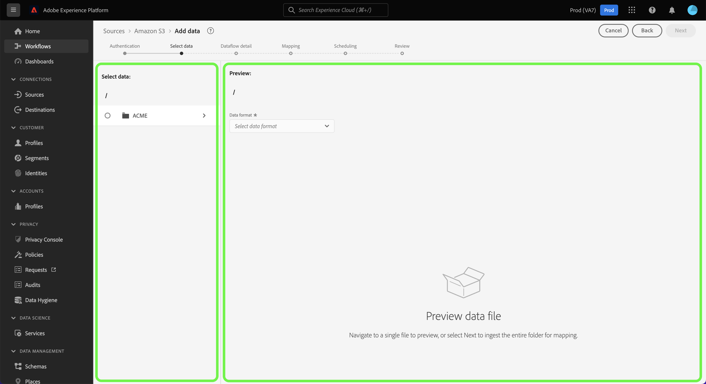
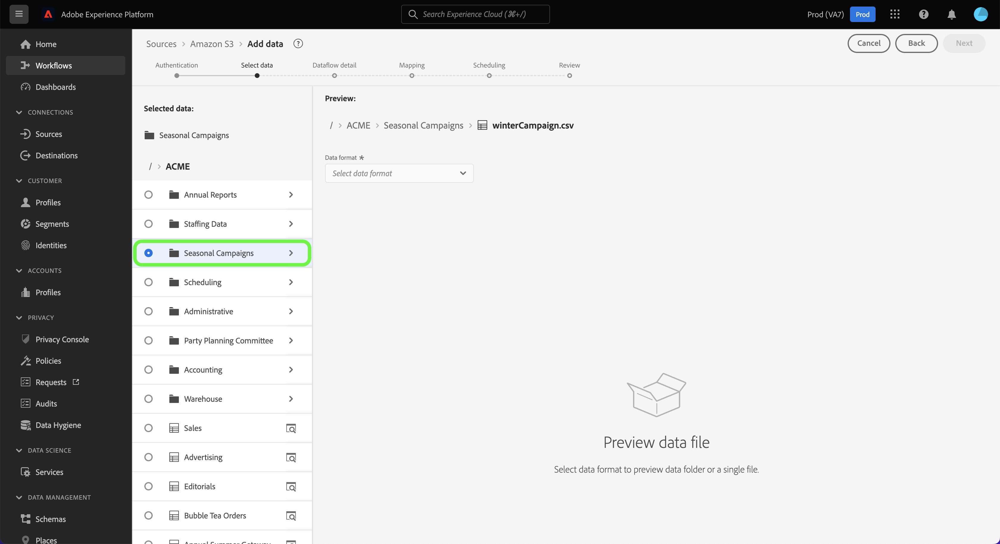
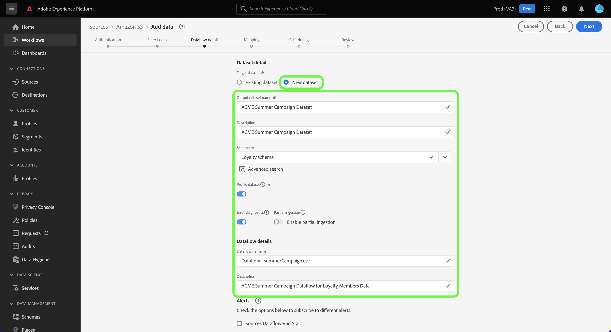

# UI의 클라우드 스토리지 소스에서 배치 데이터를 수집하도록 데이터 흐름을 구성합니다

이 자습서에서는 클라우드 스토리지 소스에서 Adobe Experience Platform으로 일괄 데이터를 가져오기 위해 데이터 흐름을 구성하는 방법에 대한 단계를 제공합니다.

## 시작하기

>[!NOTE]
>
>클라우드 저장소에서 배치 데이터를 가져오기 위한 데이터 흐름을 만들려면 인증된 클라우드 스토리지 소스에 대한 액세스 권한이 이미 있어야 합니다. 액세스 권한이 없는 경우 [소스 개요](../../../../home.md#cloud-storage)로 이동하여 계정을 만들 수 있는 클라우드 저장소 소스 목록을 확인하십시오.

이 자습서에서는 다음 Experience Platform 구성 요소를 이해하고 있어야 합니다.

* [[!DNL Experience Data Model (XDM)] 시스템](../../../../../xdm/home.md): Experience Platform이 고객 경험 데이터를 구성하는 표준화된 프레임워크입니다.
   * [스키마 컴포지션의 기본 사항](../../../../../xdm/schema/composition.md): 스키마 컴포지션의 주요 원칙 및 모범 사례를 포함하여 XDM 스키마의 기본 구성 요소에 대해 알아봅니다.
   * [스키마 편집기 튜토리얼](../../../../../xdm/tutorials/create-schema-ui.md): 스키마 편집기 UI를 사용하여 사용자 지정 스키마를 만드는 방법을 알아봅니다.
* [[!DNL Real-Time Customer Profile]](../../../../../profile/home.md): 여러 원본의 집계된 데이터를 기반으로 통합된 실시간 소비자 프로필을 제공합니다.

### 지원되는 파일 형식

배치 데이터용 클라우드 스토리지 소스는 수집을 위해 다음과 같은 파일 형식을 지원합니다.

* 구분 기호로 구분된 값 (DSV): 모든 단일 문자 값을 DSV 형식 데이터 파일의 구분 기호로 사용할 수 있습니다.
* [!DNL JavaScript Object Notation](JSON): JSON 형식의 데이터 파일은 XDM 규격이어야 합니다.
* [!DNL Apache Parquet]: Parquet 형식의 데이터 파일은 XDM 규격이어야 합니다.
* 압축된 파일: JSON 및 구분된 파일은 `bzip2`, `gzip`, `deflate`, `zipDeflate`, `tarGzip` 및 `tar`(으)로 압축할 수 있습니다.

## 데이터 추가

클라우드 저장소 계정을 만든 후 **[!UICONTROL 데이터 추가]** 단계가 나타나며, 클라우드 저장소 파일 계층 구조를 살펴보고 플랫폼으로 가져올 폴더 또는 특정 파일을 선택할 수 있는 인터페이스를 제공합니다.

* 인터페이스의 왼쪽 부분은 디렉토리 브라우저이며 클라우드 스토리지 파일 계층 구조를 표시합니다.
* 인터페이스의 오른쪽 부분에서 호환 가능한 폴더 또는 파일에서 최대 100개의 데이터 행을 미리 볼 수 있습니다.

폴더 계층 구조에 액세스하려면 루트 폴더를 선택하십시오. 여기에서 단일 폴더를 선택하여 폴더의 모든 파일을 재귀적으로 수집할 수 있습니다. 전체 폴더를 수집할 때 해당 폴더의 모든 파일이 동일한 데이터 형식과 스키마를 공유하는지 확인해야 합니다.

폴더를 선택하면 오른쪽 인터페이스가 선택한 폴더의 첫 번째 파일 내용 및 구조에 대한 미리보기로 업데이트됩니다.

이 단계에서 계속하기 전에 데이터에 몇 가지 구성을 만들 수 있습니다. 먼저 **[!UICONTROL 데이터 형식]**&#x200B;을 선택한 다음 표시되는 드롭다운 패널에서 파일에 적합한 데이터 형식을 선택합니다.

다음 표에는 지원되는 파일 유형에 적합한 데이터 형식이 나와 있습니다.

| 파일 유형 | 데이터 형식 |
| --- | --- |
| CSV | [!UICONTROL 구분] |
| JSON | [!UICONTROL JSON] |
| 쪽모이 세공 | [!UICONTROL XDM Parquet] |

### 열 구분 기호 선택

데이터 형식을 구성한 후 구분된 파일을 수집할 때 열 구분 기호를 설정할 수 있습니다. **[!UICONTROL 구분 기호]** 옵션을 선택한 다음 드롭다운 메뉴에서 구분 기호를 선택합니다. 메뉴에는 쉼표(`,`), 탭(`\t`), 파이프(`|`)를 포함하여 가장 자주 사용되는 구분 기호 옵션이 표시됩니다.

사용자 지정 구분 기호를 사용하려면 **[!UICONTROL 사용자 지정]**&#x200B;을 선택하고 팝업 입력줄에 원하는 단일 문자 구분 기호를 입력합니다.

### 압축된 파일 수집

압축 유형을 지정하여 압축된 JSON 또는 구분된 파일을 수집할 수도 있습니다.

[!UICONTROL 데이터 선택] 단계에서 수집할 압축 파일을 선택한 다음 해당 파일 형식과 XDM 호환 여부를 선택합니다. 그런 다음 **[!UICONTROL 압축 형식]**&#x200B;을 선택한 다음 원본 데이터에 적합한 압축 파일 형식을 선택합니다.

특정 파일을 플랫폼으로 가져오려면 폴더를 선택한 다음 수집할 파일을 선택합니다. 이 단계에서는 파일 이름 옆에 있는 미리 보기 아이콘을 사용하여 주어진 폴더 내에 있는 다른 파일의 파일 내용을 미리 볼 수도 있습니다.

완료되면 **[!UICONTROL 다음]**&#x200B;을 선택합니다.

## 데이터 흐름 세부 정보 제공

[!UICONTROL 데이터 흐름 세부 정보] 페이지에서 기존 데이터 집합을 사용할지 새 데이터 집합을 사용할지 여부를 선택할 수 있습니다. 이 프로세스 동안 프로필에 수집될 데이터를 구성하고 [!UICONTROL 오류 진단], [!UICONTROL 부분 수집] 및 [!UICONTROL 경고]와 같은 설정을 활성화할 수도 있습니다.

### 기존 데이터 세트 사용

기존 데이터 집합에 데이터를 수집하려면 **[!UICONTROL 기존 데이터 집합]**&#x200B;을(를) 선택하십시오. [!UICONTROL 고급 검색] 옵션을 사용하거나 드롭다운 메뉴에서 기존 데이터 세트 목록을 스크롤하여 기존 데이터 세트를 검색할 수 있습니다. 데이터 세트를 선택한 후에는 데이터 흐름의 이름과 설명을 입력합니다.

### 새 데이터 세트 사용

새 데이터 집합으로 수집하려면 **[!UICONTROL 새 데이터 집합]**&#x200B;을 선택한 다음 출력 데이터 집합 이름과 선택적 설명을 입력하십시오. 그런 다음 [!UICONTROL 고급 검색] 옵션을 사용하거나 드롭다운 메뉴에서 기존 스키마 목록을 스크롤하여 매핑할 스키마를 선택합니다. 스키마를 선택하면 데이터 흐름의 이름과 설명을 입력합니다.

### 프로필 및 오류 진단 활성화

**[!UICONTROL 프로필 데이터 세트]** 전환을 선택하여 프로필에 데이터 세트를 사용하도록 설정합니다. 이를 통해 엔티티의 속성 및 동작을 전체적으로 볼 수 있습니다. 모든 프로필 활성화 데이터 세트의 데이터는 프로필에 포함되며 데이터 흐름을 저장할 때 변경 사항이 적용됩니다.

[!UICONTROL 오류 진단]을 사용하면 데이터 흐름에서 발생하는 모든 잘못된 레코드에 대해 자세한 오류 메시지를 생성할 수 있고, [!UICONTROL 부분 수집]을(를) 사용하면 수동으로 정의하는 특정 임계값까지 오류가 포함된 데이터를 수집할 수 있습니다. 자세한 내용은 [부분 일괄 처리 수집 개요](../../../../../ingestion/batch-ingestion/partial.md)를 참조하십시오.

### 경고 활성화

경고를 활성화하여 데이터 흐름 상태에 대한 알림을 받을 수 있습니다. 목록에서 경고를 선택하여 데이터 흐름 상태에 대한 알림을 수신합니다. 경고에 대한 자세한 내용은 [UI를 사용하여 소스 경고 구독](../../alerts.md)에 대한 안내서를 참조하십시오.

데이터 흐름에 세부 정보를 제공했으면 **[!UICONTROL 다음]**&#x200B;을 선택합니다.

## 데이터 필드를 XDM 스키마에 매핑

소스 스키마의 소스 필드를 대상 스키마의 해당 대상 XDM 필드에 매핑할 수 있는 인터페이스를 제공하는 [!UICONTROL 매핑] 단계가 나타납니다.

Platform은 선택한 대상 스키마 또는 데이터 세트를 기반으로 자동 매핑된 필드에 대한 지능형 권장 사항을 제공합니다. 사용 사례에 맞게 매핑 규칙을 수동으로 조정할 수 있습니다. 필요에 따라 필드를 직접 매핑하도록 선택하거나 데이터 준비 함수를 사용하여 소스 데이터를 변환하여 계산된 값 또는 계산된 값을 파생할 수 있습니다. 매퍼 인터페이스 및 계산된 필드 사용에 대한 포괄적인 단계는 [데이터 준비 UI 안내서](../../../../../data-prep/ui/mapping.md)를 참조하십시오.

원본 데이터가 성공적으로 매핑되면 **[!UICONTROL 다음]**&#x200B;을(를) 선택하십시오.

## 수집 실행 예약

>[!IMPORTANT]
>
>[FTP 소스](../../../../connectors/cloud-storage/ftp.md)를 사용할 때 데이터 흐름을 일회성 수집으로 예약하는 것이 좋습니다.

구성된 매핑을 사용하여 선택한 원본 데이터를 자동으로 수집하도록 수집 일정을 구성할 수 있는 [!UICONTROL 예약] 단계가 나타납니다. 기본적으로 예약은 `Once`(으)로 설정됩니다. 수집 빈도를 조정하려면 **[!UICONTROL 빈도]**&#x200B;를 선택한 다음 드롭다운 메뉴에서 옵션을 선택합니다.

>[!TIP]
>
>일회성 수집 중에는 간격과 채우기가 표시되지 않습니다.

수집 빈도를 `Minute`, `Hour`, `Day` 또는 `Week`(으)로 설정한 경우 모든 수집 사이에 일정 간격을 설정해야 합니다. 예를 들어 수집 빈도를 `Day`(으)로 설정하고 간격을 `15`(으)로 설정하면 데이터 흐름이 15일마다 데이터를 수집하도록 예약됩니다.

이 단계에서는 **다시 채우기**&#x200B;를 사용하도록 설정하고 데이터의 증분 수집을 위한 열을 정의할 수도 있습니다. 채우기 기능은 내역 데이터를 수집하는 데 사용되며 증분 수집을 위해 정의하는 열은 새 데이터를 기존 데이터와 구별할 수 있도록 합니다.

예약 구성에 대한 자세한 내용은 아래 표를 참조하십시오.

| 구성 예약 중 | 설명 |
| --- | --- |
| 빈도 | 데이터 흐름이 실행되는 빈도를 구성하십시오. 빈도를 다음과 같이 설정할 수 있습니다. <ul><li>**한 번**: 빈도를 `once`(으)로 설정하여 일회성 수집을 만듭니다. 일회성 수집 데이터 흐름을 만들 때는 간격 및 채우기 구성을 사용할 수 없습니다. 기본적으로 예약 빈도는 한 번으로 설정됩니다.</li><li>**분**: 분 단위로 데이터를 수집하도록 데이터 흐름을 예약하려면 빈도를 `minute`(으)로 설정하십시오.</li><li>**시간**: 빈도를 `hour`(으)로 설정하여 시간당 기준으로 데이터를 수집하도록 데이터 흐름을 예약합니다.</li><li>**일**: 빈도를 `day`(으)로 설정하여 하루 단위로 데이터를 수집하도록 데이터 흐름을 예약합니다.</li><li>**주**: 주별로 데이터를 수집하도록 데이터 흐름을 예약하려면 빈도를 `week`(으)로 설정하십시오.</li></ul> |
| 간격 | 빈도를 선택하면 간격 설정을 구성하여 모든 수집 사이에 시간대를 설정할 수 있습니다. 예를 들어 빈도를 일로 설정하고 간격을 15로 구성한 경우 데이터 흐름이 15일마다 실행됩니다. 간격을 0으로 설정할 수 없습니다. 각 주파수에 대해 허용되는 최소 간격 값은 다음과 같습니다.<ul><li>**한 번**: 해당 없음</li><li>**분**: 15</li><li>**시간**: 1</li><li>**일**: 1</li><li>**주**: 1</li></ul> |
| 시작 시간 | UTC 시간대로 표시되는 예상 실행의 타임스탬프입니다. |
| 채우기 | 채우기 는 처음 수집되는 데이터를 결정합니다. 다시 채우기를 활성화하면 처음 예약된 수집 중에 지정된 경로의 모든 현재 파일이 수집됩니다. 다시 채우기를 비활성화하면 첫 번째 수집 실행과 시작 시간 사이에 로드된 파일만 수집됩니다. 시작 시간 이전에 로드된 파일은 수집되지 않습니다. |

>[!NOTE]
>
>일괄 처리 수집을 위해 다음의 모든 데이터 흐름은 **마지막으로 수정한 날짜** 타임스탬프를 기반으로 소스에서 수집할 파일을 선택합니다. 즉, 일괄 처리 데이터 흐름은 마지막 흐름 실행 이후 새로 추가되었거나 수정된 파일을 소스에서 선택합니다. 또한 예약된 플로우 실행 시간이 수집되기 전에 클라우드 스토리지 계정에 완전히 업로드되지 않은 파일은 수집하기 위해 선택할 수 없으므로 파일 업로드와 예약된 플로우 실행 간에 충분한 시간이 있는지 확인해야 합니다.

수집 일정 구성을 마치면 **[!UICONTROL 다음]**&#x200B;을(를) 선택합니다.

## 데이터 흐름 검토

새 데이터 흐름을 만들기 전에 검토할 수 있는 **[!UICONTROL 검토]** 단계가 나타납니다. 세부 사항은 다음 범주 내에서 그룹화됩니다.

* **[!UICONTROL 연결]**: 원본 형식, 선택한 원본 파일의 관련 경로 및 해당 원본 파일에 있는 열의 양을 표시합니다.
* **[!UICONTROL 데이터 집합 및 맵 필드 할당]**: 데이터 집합이 준수하는 스키마를 포함하여 소스 데이터가 수집되는 데이터 집합을 표시합니다.
* **[!UICONTROL 예약]**: 수집 일정의 활성 기간, 빈도 및 간격을 표시합니다.

데이터 흐름을 검토한 후 **[!UICONTROL 완료]**&#x200B;를 클릭하고 데이터 흐름이 만들어지도록 잠시 기다립니다.

## 다음 단계

이 자습서를 따라 외부 클라우드 저장소에서 데이터를 가져오는 데이터 흐름을 만들고 데이터 세트 모니터링에 대한 통찰력을 얻었습니다. 데이터 흐름 만들기에 대해 자세히 알아보려면 아래 비디오를 시청하여 학습 내용을 보완할 수 있습니다. 또한 이제 [!DNL Real-Time Customer Profile] 및 [!DNL Data Science Workspace]과(와) 같은 다운스트림 [!DNL Platform] 서비스에서 수신 데이터를 사용할 수 있습니다. 자세한 내용은 다음 문서를 참조하십시오.

* [[!DNL Real-Time Customer Profile] 개요](../../../../../profile/home.md)
* [[!DNL Data Science Workspace] 개요](../../../../../data-science-workspace/home.md)

>[!WARNING]
>
> 다음 비디오에 표시된 [!DNL Platform] UI가 최신 상태가 아닙니다. 최신 UI 스크린샷 및 기능은 위의 설명서를 참조하십시오.

>[!VIDEO](https://video.tv.adobe.com/v/29695?quality=12&learn=on)

## 부록

다음 섹션에서는 소스 커넥터 작업에 대한 추가 정보를 제공합니다.

## 데이터 흐름 모니터링

데이터 흐름이 만들어지면 데이터 흐름을 통해 수집되는 데이터를 모니터링하여 수집 비율, 성공 및 오류에 대한 정보를 볼 수 있습니다. 데이터 흐름을 모니터링하는 방법에 대한 자세한 내용은 [UI에서 계정 및 데이터 흐름 모니터링](../../monitor.md)에 대한 자습서를 참조하십시오.

## 데이터 흐름 업데이트

데이터 흐름 예약, 매핑 및 일반 정보에 대한 구성을 업데이트하려면 [UI에서 소스 데이터 흐름 업데이트](../../update-dataflows.md)에 대한 자습서를 참조하십시오.

## 데이터 흐름 삭제

**[!UICONTROL 데이터 흐름]** 작업 영역에서 사용할 수 있는 **[!UICONTROL Delete]** 함수를 사용하여 더 이상 필요하지 않거나 잘못 만들어진 데이터 흐름을 삭제할 수 있습니다. 데이터 흐름을 삭제하는 방법에 대한 자세한 내용은 [UI에서 데이터 흐름 삭제](../../delete.md)에 대한 자습서를 참조하십시오.