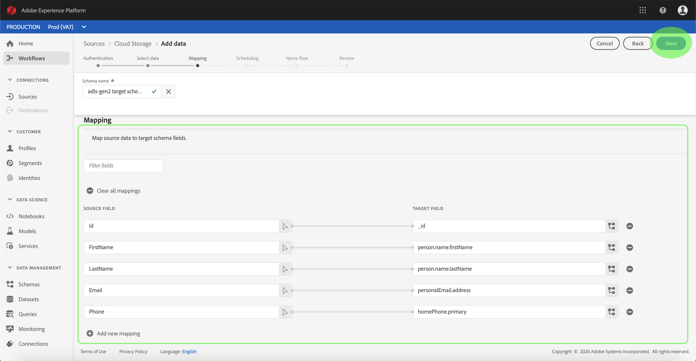
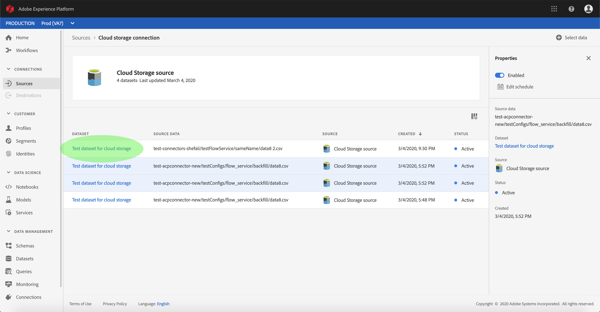

# UI에서 클라우드 스토리지 커넥터에 대한 데이터 흐름 구성

데이터 흐름(Dataflow)은 소스에서 플랫폼 데이터 집합으로 데이터를 검색하고 인제스트하는 예약된 작업입니다. 이 자습서에서는 클라우드 저장소 기반 커넥터를 사용하여 새 데이터 흐름을 구성하는 절차를 제공합니다.

## 시작하기

이 자습서에서는 Adobe Experience Platform의 다음 구성 요소에 대해 작업해야 합니다.

* [XDM(Experience Data Model) 시스템](../../../../xdm/home.md):Adobe Experience Platform을 통해 고객 경험 데이터를 구성하는 표준화된 프레임워크입니다.
   * [스키마 컴포지션의](../../../../xdm/schema/composition.md)기본 사항:스키마 컴포지션의 주요 원칙 및 모범 사례 등 XDM 스키마의 기본 구성 요소에 대해 알아봅니다.
   * [스키마 편집기 자습서](../../../../xdm/tutorials/create-schema-ui.md):스키마 편집기 UI를 사용하여 사용자 정의 스키마를 만드는 방법을 알아봅니다.
* [실시간 고객 프로필](../../../../profile/home.md):다양한 소스의 데이터를 집계하여 통합된 실시간 고객 프로파일을 제공합니다.

또한 이 튜토리얼에서는 이미 클라우드 스토리지 커넥터를 제작해야 합니다. UI에서 다른 클라우드 스토리지 커넥터를 만들기 위한 자습서 목록은 [소스 커넥터 개요에서](../../../home.md)찾을 수 있습니다.

### 지원되는 파일 형식

Experience Platform은 외부 스토리지에서 인제스트할 다음 파일 형식을 지원합니다.

* 구분 기호 구분 값(DSV):DSV 형식 데이터 파일에 대한 지원은 현재 쉼표로 구분된 값으로 제한됩니다. DSV 형식 파일 내의 필드 헤더 값은 영숫자 문자와 밑줄로만 구성되어야 합니다. 일반 DSV 파일에 대한 지원이 나중에 제공될 예정입니다.
* JavaScript 개체 표기법(JSON):JSON 형식 데이터 파일은 XDM과 호환되어야 합니다.
* Apache Partiquet:Partiquet-formatted data files must be XDM-compliant.

## 데이터 선택

클라우드 스토리지 커넥터를 만든 후 *데이터* 선택 단계가 나타나 클라우드 스토리지 계층 구조를 탐색하는 데 필요한 대화형 인터페이스를 제공합니다.

* 인터페이스의 왼쪽 절반은 서버의 파일과 디렉토리를 표시하는 디렉토리 브라우저입니다.
* 인터페이스 오른쪽의 절반은 호환 파일에서 최대 100개의 데이터 행을 미리 볼 수 있도록 해줍니다.

나열된 폴더를 클릭하면 폴더 계층 구조를 더 깊은 폴더로 이동할 수 있습니다. 호환되는 파일 또는 폴더를 선택하면 데이터 형식 **선택** 드롭다운이 표시되어 미리 보기 창에 데이터를 표시할 형식을 선택할 수 있습니다.

미리 보기 창이 열리면 다음을 클릭하여 **선택한** 폴더 내의 모든 파일을 업로드할 수 있습니다. 특정 파일에 업로드하려면 다음을 클릭하기 전에 목록에서 해당 파일을 **선택합니다**.

>[!NOTE] 지원되는 파일 형식에는 CSV, JSON 및 Partiquet이 포함됩니다. JSON 및 Parentical 파일은 XDM과 호환되어야 합니다.

## XDM 스키마에 데이터 필드 매핑

매핑 *단계가* 나타나 소스 데이터를 플랫폼 데이터 세트에 매핑하는 대화형 인터페이스를 제공합니다. JSON 또는 Partiquet에서 포맷된 소스 파일은 XDM과 호환되어야 하며 수동으로 매핑을 구성할 필요가 없습니다. 반대로 CSV 파일은 매핑을 명시적으로 구성해야 하지만 매핑할 소스 데이터 필드를 선택할 수 있도록 합니다.

인제스트할 인바운드 데이터의 데이터 세트를 선택합니다. 기존 데이터 집합을 사용하거나 새 데이터 집합을 만들 수 있습니다.

**기존 데이터 세트 사용**

데이터를 기존 데이터 세트에 인제스트하려면 기존 데이터 **세트**&#x200B;사용을 선택한 다음 데이터 세트 아이콘을 클릭합니다.

데이터 _세트_ 선택 대화 상자가 나타납니다. 사용할 데이터 세트를 찾아 선택한 다음 계속을 **클릭합니다**.

**새 데이터 집합 사용**

데이터를 새 데이터 세트에 인제스트하려면 **새 데이터** 집합 만들기를 선택하고 제공된 필드에 데이터 집합의 이름과 설명을 입력합니다. 그런 다음 스키마 아이콘을 클릭합니다.

스키마 _선택_ 대화 상자가 나타납니다. 새 데이터 세트에 적용할 스키마를 선택한 다음 완료를 **클릭합니다**.

필요에 따라 필드를 직접 매핑하거나 매퍼 함수를 사용하여 소스 데이터를 변환하여 계산 값 또는 계산된 값을 추출할 수 있습니다. 데이터 매핑 및 매퍼 함수에 대한 자세한 내용은 CSV 데이터를 XDM 스키마 필드에 매핑하는 방법에 대한 자습서를 참조하십시오.

소스 데이터가 매핑되면 [다음]을 **클릭합니다**.

## 통합 실행 예약

예약 *단계가* 표시되어 구성된 매핑을 사용하여 선택한 소스 데이터를 자동으로 인제스트하도록 통합 일정을 구성할 수 있습니다. 다음 표에서는 예약을 위해 구성 가능한 여러 필드에 대해 대략적으로 설명합니다.

| 필드 | 설명 |
| --- | --- |
| 빈도 | 선택 가능한 주파수는 분, 시간, 일 및 주를 포함합니다. |
| 간격 | 선택한 주파수의 간격을 설정하는 정수입니다. |
| 시작 시간 | 첫 번째 인제스트가 발생하는 UTC 타임스탬프. |
| 채우기 | 처음에 인제스트할 데이터를 결정하는 부울 값입니다. 채우기가 *활성화된* 경우, 지정된 경로에 있는 모든 현재 파일은 첫 번째 예약된 인제스트 동안 인제스트됩니다. 채우기가 *비활성화되어* 있는 경우 첫 번째 통합 실행과 시작 시간 *사이에 로드된 파일만* 인제스트됩니다. 시작 시간 이전에 로드된 *파일은* 인제스트되지 않습니다. |

데이터 프레이는 예약된 기반으로 데이터를 자동으로 인제스트하도록 디자인되었습니다. 이 워크플로우를 통해 한 번만 인제스트하려는 경우 빈도를 &quot;일&quot; **에** 구성하고 100000 **과**&#x200B;같은 간격에 매우 큰 숫자를 적용하여인제스트할 수 있습니다.

예약에 대한 값을 제공하고 다음을 **클릭합니다**.

## 데이터 흐름 이름 지정

이름 *흐름* 단계가 표시되어 새 데이터 흐름 이름에 대한 간단한 설명을 제공합니다.

데이터 흐름 값을 제공하고 [다음]을 **클릭합니다**.

### 데이터 흐름 검토

검토 *단계가* 표시되어 새 데이터 흐름을 만들기 전에 검토할 수 있습니다. 세부 사항은 다음 카테고리 내에서 그룹화됩니다.

* *소스 세부 정보*:소스 유형, 선택한 소스 파일의 관련 경로 및 해당 소스 파일 내의 열 양을 표시합니다.
* *타겟 세부 사항*:데이터 집합이 준수하는 스키마를 포함하여 소스 데이터가 수집되는 데이터 집합을 표시합니다.
* *예약 세부 정보*:통합 일정의 활성 기간, 빈도 및 간격을 표시합니다.

데이터 흐름을 검토한 후 [마침] **을** 클릭하고 데이터 흐름 만들기를 잠시 기다립니다.

## 데이터 흐름 모니터링

클라우드 스토리지 데이터 플로우가 생성되면 이를 통해 인제스트되는 데이터를 모니터링할 수 있습니다. 아래 절차에 따라 데이터 프롤의 데이터 세트 모니터에 액세스합니다.

소스 *작업* 영역에서 찾아보기 **탭을 클릭하여** 기본 연결을 나열합니다. 표시된 목록에서 해당 이름을 클릭하여 모니터링할 데이터 흐름 연결이 포함된 연결을 찾습니다.

소스 *활동* 화면이 나타납니다. 여기에서 활동을 모니터링할 데이터 세트 이름을 클릭합니다.

데이터 *집합 활동* 화면이 나타납니다. 이 페이지에는 그래프 형식으로 사용되는 메시지 비율이 표시됩니다.

그래프 아래에는 데이터 세트에 인제스트된 배치 목록과 해당 상태(성공 또는 실패)와 인제스트된 레코드 수가 표시됩니다. 일괄 처리가 프로필 사용 데이터 세트에 수집되면 인제스트된 프로필 및 ID 수가 표시됩니다.

나열된 배치에 대한 자세한 내용은 해당 ID를 클릭하여 볼 수 있습니다.

데이터 집합 모니터링 및 섭취에 대한 자세한 내용은 데이터 흐름 [모니터링에 대한 자습서를 참조하십시오](../../../../ingestion/quality/monitor-data-flows.md).

## 다음 단계

이 튜토리얼을 따라 데이터 흐름을 만들어 외부 클라우드 스토리지에서 데이터를 가져오고 데이터 세트 모니터링에 대한 통찰력을 얻을 수 있습니다. 이제 실시간 고객 프로필 및 데이터 과학 작업 공간과 같은 다운스트림 플랫폼 서비스에서 들어오는 데이터를 사용할 수 있습니다. 자세한 내용은 다음 문서를 참조하십시오.

* [실시간 고객 프로필 개요](../../../../profile/home.md)
* [데이터 과학 작업 공간 개요](../../../../data-science-workspace/home.md)

## 부록

다음 섹션에서는 소스 커넥터 작업에 대한 추가 정보를 제공합니다.

### 데이터 흐름 비활성화

데이터 흐름(Dataflow)이 만들어지면 즉시 활성화되고 지정된 일정에 따라 데이터를 인제스트합니다. 아래 지침에 따라 언제든지 활성 데이터 흐름을 비활성화할 수 있습니다.

소스 *작업 영역에서* 찾아보기 **탭을 클릭합니다** . 그런 다음 비활성화할 활성 데이터 프롤과 연결된 기본 연결의 이름을 클릭합니다.

소스 *활동* 페이지가 나타납니다. 목록에서 활성 데이터 흐름을 선택하여 화면 *오른쪽의* 속성 열을 엽니다. 이 열은 활성화 **전환 단추가** 포함되어있습니다. 토글을 클릭하여 데이터 흐름을 비활성화합니다. 데이터 흐름을 비활성화한 후 동일한 전환을 사용하여 다시 활성화할 수 있습니다.

### 프로필 모집단의 인바운드 데이터 활성화

소스 커넥터의 인바운드 데이터를 사용하여 실시간 고객 프로필 데이터를 향상시키고 채울 수 있습니다. 실제 고객 프로필 데이터를 채우는 방법에 대한 자세한 내용은 프로필 모집단 자습서를 참조하십시오.
