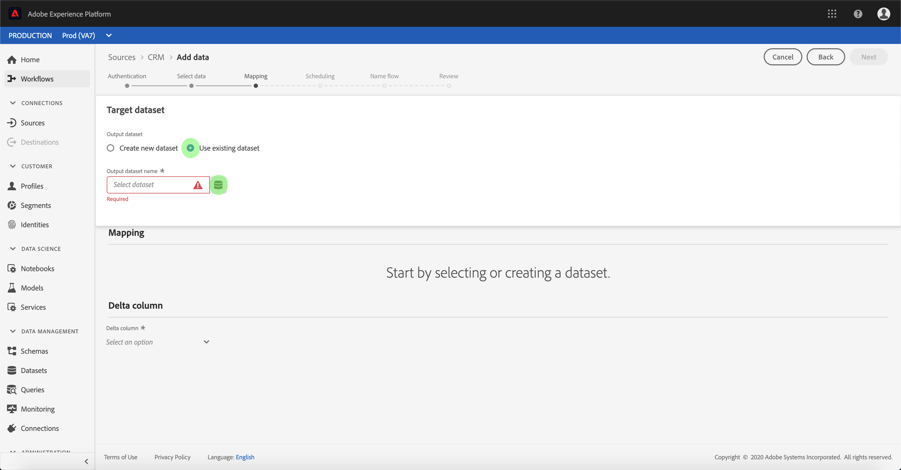

# UI에서 CRM 연결에 대한 데이터 흐름 구성

데이터 흐름은 소스에서 [!DNL Platform] 데이터 집합으로 데이터를 검색하고 수집하는 예약된 작업입니다. 이 자습서에서는 CRM 계정을 사용하여 새 데이터 흐름을 구성하는 단계를 제공합니다.

## 시작하기

이 자습서에서는 Adobe Experience Platform의 다음 구성 요소를 이해하고 있어야 합니다.

* [[!DNL Experience Data Model (XDM)] 시스템](../../../../xdm/home.md): 고객 경험 데이터를  [!DNL Experience Platform] 구성하는 표준화된 프레임워크입니다.
   * [스키마 작성 기본 사항](../../../../xdm/schema/composition.md): 스키마 컴포지션의 주요 원칙 및 모범 사례를 포함하여 XDM 스키마의 기본 빌딩 블록에 대해 알아봅니다.
   * [스키마 편집기 자습서](../../../../xdm/tutorials/create-schema-ui.md): 스키마 편집기 UI를 사용하여 사용자 지정 스키마를 만드는 방법을 알아보십시오.
* [[!DNL Real-time Customer Profile]](../../../../profile/home.md): 여러 소스에서 집계된 데이터를 기반으로 통합된 실시간 소비자 프로필을 제공합니다.

또한 이 자습서에서는 이미 CRM 계정을 만들어야 합니다. UI에서 다른 CRM 커넥터를 만드는 자습서 목록은 [소스 커넥터 개요](../../../home.md)에 있습니다.

## 데이터 선택

CRM 계정을 만든 후 *데이터 선택* 단계가 나타나고 파일 계층 구조를 탐색할 수 있는 대화형 인터페이스를 제공합니다.

* 인터페이스 왼쪽 절반 부분은 서버의 파일과 디렉토리를 표시하는 디렉토리 브라우저입니다.
* 인터페이스의 오른쪽 절반을 사용하면 호환되는 파일에서 최대 100개의 데이터 행을 미리 볼 수 있습니다.

페이지 상단에 있는 **[!UICONTROL 검색]** 옵션을 사용하여 사용할 소스 데이터를 신속하게 식별할 수 있습니다.

>[!NOTE]
>
>검색 소스 데이터 옵션은 Analytics, 분류, 이벤트 허브 및 Kinesis 커넥터를 제외한 모든 표 형식의 소스 커넥터에서 사용할 수 있습니다.

소스 데이터를 찾으면 디렉토리를 선택한 다음 **[!UICONTROL 다음]**&#x200B;을 클릭합니다.

## XDM 스키마에 데이터 필드 매핑

**[!UICONTROL 매핑]** 단계가 나타나고 소스 데이터를 [!DNL Platform] 데이터 세트에 매핑하기 위한 대화형 인터페이스를 제공합니다.

수집할 인바운드 데이터에 대한 데이터 세트를 선택합니다. 기존 데이터 세트를 사용하거나 새 데이터 세트를 만들 수 있습니다.

### 기존 데이터 세트 사용

기존 데이터 세트에 데이터를 수집하려면 **[!UICONTROL 기존 데이터 세트 사용]**&#x200B;을 선택한 다음 데이터 세트 아이콘을 클릭합니다.

**[!UICONTROL 데이터 세트 선택]** 대화 상자가 나타납니다. 사용할 데이터 집합을 찾은 다음 선택한 다음 **[!UICONTROL 계속]**&#x200B;을 클릭합니다.

### 새 데이터 세트 사용

데이터를 새 데이터 세트에 수집하려면 **[!UICONTROL 새 데이터 세트 만들기]**&#x200B;를 선택하고 제공된 필드에 데이터 세트에 대한 이름과 설명을 입력합니다.

**[!UICONTROL 스키마 선택]** 검색 막대에 스키마 이름을 입력하여 스키마 필드를 첨부할 수 있습니다. 드롭다운 아이콘을 선택하여 기존 스키마 목록을 볼 수도 있습니다. 또는 **[!UICONTROL 고급 검색]**&#x200B;을 선택하여 각각의 세부 정보를 포함하는 기존 스키마의 화면에 액세스할 수도 있습니다.

이 단계 동안 데이터 세트에 [!DNL Real-time Customer Profile]을(를) 활성화하고 엔티티의 속성 및 동작을 전체적으로 볼 수 있습니다. 활성화된 모든 데이터 세트의 데이터는 [!DNL Profile]에 포함되며 변경 사항은 데이터 흐름을 저장할 때 적용됩니다.

**[!UICONTROL 프로필 데이터 세트]** 단추를 전환하여 [!DNL Profile]에 대한 대상 데이터 세트를 사용하도록 설정합니다.

**[!UICONTROL 스키마 선택]** 대화 상자가 나타납니다. 새 데이터 세트에 적용할 스키마를 선택한 다음 **[!UICONTROL 완료]**&#x200B;를 클릭합니다.

필요에 따라 필드를 직접 매핑하거나 데이터 준비 함수를 사용하여 소스 데이터를 변환하여 계산 또는 계산된 값을 도출할 수 있습니다. 매퍼 함수 및 계산된 필드에 대한 자세한 내용은 [데이터 준비 함수 안내서](../../../../data-prep/functions.md) 또는 [계산된 필드 안내서](../../../../data-prep/calculated-fields.md)를 참조하십시오.

>[!TIP]
>
>[!DNL Platform] 선택한 대상 스키마나 데이터 세트를 기반으로 자동 매핑 필드에 대한 지능형 권장 사항을 제공합니다. 사용 사례에 맞게 매핑 규칙을 수동으로 조정할 수 있습니다.

선택한 데이터 집합에서 최대 100개의 샘플 데이터 행의 매핑 결과를 보려면 **[!UICONTROL 데이터 미리 보기]**&#x200B;를 선택하십시오.

미리 보기 중에 ID 열은 매핑 결과를 확인할 때 필요한 주요 정보이므로 첫 번째 필드로 우선 순위가 지정됩니다.

소스 데이터가 매핑되면 **[!UICONTROL 닫기]**&#x200B;를 선택합니다.

## 수집 실행 예약

**[!UICONTROL 예약]** 단계가 나타나므로 구성된 매핑을 사용하여 선택한 소스 데이터를 자동으로 수집하도록 수집 일정을 구성할 수 있습니다. 다음 표에서는 스케줄링에 대해 다양한 구성 가능한 필드에 대해 설명합니다.

| 필드 | 설명 |
| --- | --- |
| 빈도 | 선택 가능한 주파수는 `Once`, `Minute`, `Hour`, `Day` 및 `Week`를 포함합니다. |
| 간격 | 선택한 주파수의 간격을 설정하는 정수입니다. |
| 시작 시간 | 첫 번째 수집이 발생하도록 설정된 시기를 나타내는 UTC 타임스탬프입니다. |
| 채우기 | 처음에 수집되는 데이터를 결정하는 부울 값입니다. **[!UICONTROL 채우기]**&#x200B;가 활성화되어 있으면 지정된 경로에 있는 모든 현재 파일이 첫 번째 예약된 수집 중에 수집됩니다. **[!UICONTROL 채우기]**&#x200B;가 비활성화되면 첫 번째 수집 실행과 **[!UICONTROL 시작 시간]** 사이에 로드되는 파일만 수집됩니다. **[!UICONTROL 시작 시간]** 이전에 로드된 파일은 수집되지 않습니다. |
| 델타 열 | 유형, 날짜 또는 시간의 소스 스키마 필드 필터링된 옵션이 있습니다. 이 필드는 새 데이터와 기존 데이터를 구분하는 데 사용됩니다. 증분 데이터는 선택한 열의 타임스탬프를 기반으로 수집됩니다. |

데이터 흐름은 예약된 기준에 따라 데이터를 자동으로 수집하도록 설계되었습니다. 먼저 수집 빈도를 선택합니다. 그런 다음 간격을 설정하여 두 흐름 실행 사이의 기간을 지정합니다. 간격 값은 0이 아닌 정수여야 하며 15보다 크거나 같도록 설정해야 합니다.

수집 시작 시간을 설정하려면 시작 시간 상자에 표시되는 날짜 및 시간을 조정하십시오. 또는 달력 아이콘을 선택하여 시작 시간 값을 편집할 수 있습니다. 시작 시간은 현재 UTC 시간보다 크거나 같아야 합니다.

**[!UICONTROL 증분 데이터를]**&#x200B;에 의해 로드하여 델타 열을 할당합니다. 이 필드는 새 데이터와 기존 데이터를 구별합니다.

### 1회 수집 데이터 흐름 설정

1회 수집을 설정하려면 빈도 드롭다운 화살표를 선택하고 **[!UICONTROL Once]**&#x200B;를 선택합니다.

>[!TIP]
>
>**** 일회성 수집  **** 중에는 대화형 및 백필이 표시되지 않습니다.

예약에 적절한 값을 제공한 후 **[!UICONTROL 다음]**&#x200B;을 선택합니다.

## 데이터 흐름 세부 정보 제공

**[!UICONTROL 데이터 흐름 세부 정보]** 단계가 나타나므로 새 데이터 흐름의 이름을 지정하고 간단한 설명을 제공할 수 있습니다.

이 프로세스 중에 **[!UICONTROL 부분 수집]** 및 **[!UICONTROL 오류 진단]**&#x200B;을 활성화할 수도 있습니다. **[!UICONTROL 부분 수집]**&#x200B;을 활성화하면 특정 임계값까지 오류가 포함된 데이터를 수집할 수 있습니다. **[!UICONTROL 부분 수집]**&#x200B;이 활성화되면 **[!UICONTROL 오류 임계값 %]** 다이얼을 드래그하여 일괄 처리의 오류 임계값을 조정합니다. 또는 입력 상자를 선택하여 임계값을 수동으로 조정할 수 있습니다. 자세한 내용은 [부분 배치 수집 개요](../../../../ingestion/batch-ingestion/partial.md)를 참조하십시오.

데이터 흐름의 값을 제공하고 **[!UICONTROL 다음]**&#x200B;을 선택합니다.

## 데이터 흐름 검토

새 데이터 흐름을 작성하기 전에 검토할 수 있는 *검토* 단계가 나타납니다. 세부 사항은 다음 범주 내에 그룹화됩니다.

* **[!UICONTROL 연결 세부 정보]**: 소스 유형, 선택한 소스 파일의 관련 경로 및 해당 소스 파일 내의 열 양을 표시합니다.
* **[!UICONTROL 매핑 세부 정보]**: 데이터 세트가 준수하는 스키마를 포함하여 소스 데이터가 수집되는 데이터 세트를 표시합니다.
* **[!UICONTROL 예약 세부 정보]**: 수집 예약의 활성 기간, 빈도 및 간격을 표시합니다.

데이터 흐름을 검토한 후 **[!UICONTROL 완료]**&#x200B;를 클릭하고 데이터 흐름을 만들 시간을 잠시 허용합니다.

## 데이터 흐름 모니터링

데이터 흐름이 만들어지면 이를 통해 수집되는 데이터를 모니터링하여 수집률, 성공 및 오류에 대한 정보를 볼 수 있습니다. 데이터 흐름을 모니터링하는 방법에 대한 자세한 내용은 UI](../monitor.md)의 [계정 및 데이터 흐름 모니터링에서 자습서를 참조하십시오.

## 데이터 흐름 삭제

더 이상 필요하지 않거나 잘못 생성된 데이터 흐름은 **[!UICONTROL 데이터 흐름]** 작업 영역에서 사용할 수 있는 **[!UICONTROL Delete]** 함수를 사용하여 삭제할 수 있습니다. 데이터 흐름 삭제 방법에 대한 자세한 내용은 UI](../delete.md)에서 데이터 흐름 삭제에 대한 자습서를 참조하십시오.[

## 다음 단계

이 자습서를 따라 CRM에서 데이터를 가져올 데이터 흐름을 성공적으로 만들어 데이터 세트 모니터링에 대한 통찰력을 얻을 수 있습니다. 데이터 흐름 만들기에 대한 자세한 내용을 보려면 아래 비디오를 시청하여 학습 내용을 보완할 수 있습니다. 또한 이제 들어오는 데이터를 [!DNL Real-time Customer Profile] 및 [!DNL Data Science Workspace] 등의 다운스트림 [!DNL Platform] 서비스에서 사용할 수 있습니다. 자세한 내용은 다음 문서를 참조하십시오.

* [실시간 고객 프로필 개요](../../../../profile/home.md)
* [Data Science Workspace 개요](../../../../data-science-workspace/home.md)

>[!WARNING]
>
> 다음 비디오에 표시된 [!DNL Platform] UI가 오래되었습니다. 최신 UI 스크린샷 및 기능은 위의 설명서를 참조하십시오.

>[!VIDEO](https://video.tv.adobe.com/v/29711?quality=12&learn=on)

## 부록

다음 섹션에서는 소스 커넥터 작업에 대한 추가 정보를 제공합니다.

### 데이터 흐름 비활성화

데이터 흐름을 만들면 즉시 활성 상태가 되고 제공된 일정에 따라 데이터를 수집합니다. 아래 지침에 따라 언제든지 활성 데이터 흐름을 비활성화할 수 있습니다.

**[!UICONTROL 인증]** 화면에서 비활성화하려는 데이터 흐름과 연결된 연결 이름을 선택합니다.

**소스 활동** 페이지가 나타납니다. 목록에서 활성 데이터 흐름을 선택하여 화면 오른쪽의 **[!UICONTROL 속성]** 열을 엽니다. 이 열에는 **[!UICONTROL 활성화]** 전환 단추가 있습니다. 데이터 흐름을 비활성화하려면 전환을 클릭하십시오. 동일한 전환을 사용하여 데이터 흐름을 비활성화한 후 다시 활성화할 수 있습니다.

### [!DNL Profile] 모집단에 대한 인바운드 데이터 활성화

소스 커넥터의 인바운드 데이터를 [!DNL Real-time Customer Profile] 데이터를 강화 및 채우는 데 사용할 수 있습니다. [!DNL Real-time Customer Profile] 데이터 채우기에 대한 자세한 내용은 [프로필 채우기](../profile.md)의 자습서를 참조하십시오.
