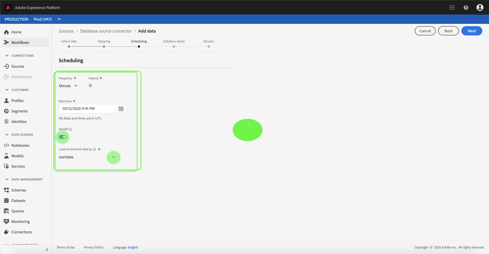

# UI에서 데이터베이스 커넥터에 대한 데이터 흐름 구성

데이터 흐름(Dataflow)은 소스에서 Platform 데이터 집합으로 데이터를 검색하고 인제스트하는 예약된 작업입니다. 이 자습서에서는 데이터베이스 기본 커넥터를 사용하여 새 데이터 흐름을 구성하는 단계를 제공합니다.

## 시작하기

이 자습서에서는 다음과 같은 Adobe Experience Platform 구성 요소에 대해 작업해야 합니다.

- [XDM(Experience Data Model) 시스템](../../../../xdm/home.md): Experience Platform이 고객 경험 데이터를 구성하는 표준화된 프레임워크입니다.
   - [스키마 컴포지션의 기본 사항](../../../../xdm/schema/composition.md): 스키마 컴포지션의 주요 원칙 및 모범 사례 등 XDM 스키마의 기본 구성 요소에 대해 알아봅니다.
   - [스키마 편집기 자습서](../../../../xdm/tutorials/create-schema-ui.md): 스키마 편집기 UI를 사용하여 사용자 정의 스키마를 생성하는 방법을 알아봅니다.
- [실시간 고객 프로필](../../../../profile/home.md): 여러 소스에서 집계된 데이터를 기반으로 통합된 실시간 소비자 프로필을 제공합니다.

또한 이 자습서에서는 데이터베이스 커넥터를 이미 만들어야 합니다. UI에서 다른 데이터베이스 커넥터를 만들기 위한 자습서 목록은 [소스 커넥터 개요에 있습니다](../../../home.md).

## 데이터 선택

데이터베이스 커넥터를 만든 후 *[!UICONTROL 데이터]* 선택 단계가 나타나며 데이터베이스 계층 구조를 탐색하는 데 필요한 대화형 인터페이스를 제공합니다.

- 인터페이스의 왼쪽 절반은 계정의 데이터베이스 목록을 표시하는 브라우저입니다.
- 인터페이스의 오른쪽 절반을 사용하면 최대 100개의 데이터 행을 미리 볼 수 있습니다.

사용할 데이터베이스를 선택하고 다음을 **[!UICONTROL 클릭합니다]**.

## 데이터 필드를 XDM 스키마에 매핑

소스 데이터를 Platform 데이터 세트에 매핑하기 위한 대화형 인터페이스를 제공하는 *매핑* 단계가 나타납니다.

수집할 인바운드 데이터의 데이터 세트를 선택합니다. 기존 데이터 세트를 사용하거나 새 데이터 세트를 만들 수 있습니다.

### 기존 데이터 세트 사용

데이터를 기존 데이터 세트에 인제스트하려면 **[!UICONTROL 기존 데이터]**&#x200B;세트를 선택한 다음 데이터 세트 아이콘을 클릭합니다.

데이터 *[!UICONTROL 세트]* 선택 대화 상자가 나타납니다. 사용할 데이터 세트를 찾아 선택한 다음 **[!UICONTROL 계속을 클릭합니다]**.

### 새 데이터 집합 사용

데이터를 새 데이터 세트에 인제스트하려면 **[!UICONTROL 새 데이터]** 세트를 선택하고 제공된 필드에 데이터 세트에 대한 이름과 설명을 입력합니다.

스키마 선택 검색 막대에 스키마 이름을 입력하여 스키마 필드를 **[!UICONTROL 첨부할]** 수 있습니다. 드롭다운 아이콘을 선택하여 기존 스키마 목록을 볼 수도 있습니다. 또는 해당 세부 정보를 포함하여 기존 스키마 **[!UICONTROL 의 화면에]** 대한 고급 검색을 선택할 수 있습니다.

*스키마[!UICONTROL 선택] 대화 상자가 나타납니다. 새 데이터 세트에 적용할 스키마를 선택한 다음 완료를 **[!UICONTROL 클릭합니다]**.

필요에 따라 필드를 직접 매핑하거나 매퍼 함수를 사용하여 소스 데이터를 변환하여 계산된 값 또는 계산된 값을 추출할 수 있습니다. 데이터 매핑 및 매퍼 함수에 대한 자세한 내용은 CSV 데이터를 XDM 스키마 필드에 [매핑하는 방법에 대한 자습서를 참조하십시오](../../../../ingestion/tutorials/map-a-csv-file.md).

소스 데이터가 매핑되면 [다음]을 **[!UICONTROL 클릭합니다]**.

## 처리 실행 예약

예약 ** 단계가 나타나면서 구성된 매핑을 사용하여 선택한 소스 데이터를 자동으로 인제스트하도록 통합 예약을 구성할 수 있습니다. 다음 표에서는 예약을 위해 구성 가능한 여러 필드에 대해 설명합니다.

| 필드 | 설명 |
| --- | --- |
| 주파수 | 선택 가능한 주파수는 분, 시간, 일 및 주입니다. |
| 간격 | 선택한 주파수의 간격을 설정하는 정수입니다. |
| 시작 시간 | 첫 번째 수집이 발생할 UTC 타임스탬프. |
| 채우기 | 처음에 수집되는 데이터를 결정하는 부울 값입니다. 채우기 *가* 활성화되어 있으면, 지정된 경로에 있는 모든 현재 파일이 첫 번째 예약된 수집 중에 수집됩니다. 채우기 *를* 비활성화하면 인제스트 첫 번째 실행과 *시작 시간* 사이에 로드되는 파일만 인제스트됩니다. 시작 *시간* 전에 로드된 파일은 인제스트되지 않습니다. |
| 델타 열 | 유형, 날짜 또는 시간의 소스 스키마 필드 필터링된 세트가 있는 옵션. 이 필드는 새 데이터와 기존 데이터를 구분하는 데 사용됩니다. 선택한 열의 타임스탬프를 기반으로 증분 데이터를 인제스트합니다. |

데이터 프롤링은 일정에 따라 데이터를 자동으로 인제스트하도록 디자인되었습니다. 이 워크플로우를 통해 한 번만 인제스트하려는 경우 **[!UICONTROL 빈도를]** &quot;일&quot;에 구성하고 10000 **[!UICONTROL 이상]**&#x200B;등과 같은 간격에 대해 매우 큰 수를 적용하여 인제스트할 수 있습니다.

일정에 대한 값을 제공하고 **[!UICONTROL 다음을 선택합니다]**.

## 데이터 흐름 이름 지정

데이터 *[!UICONTROL 흐름 세부]* 정보 단계가 나타나며, 여기에서 데이터 흐름에 대한 이름과 선택적 설명을 제공해야 합니다. 완료되면 **[!UICONTROL 다음]** 을 선택합니다.

## 데이터 흐름 검토

[ *[!UICONTROL 검토]* ] 단계가 표시되어 새 데이터 흐름을 만들기 전에 검토할 수 있습니다. 세부 사항은 다음 카테고리 내에서 그룹화됩니다.

- *연결*: 소스 유형, 선택한 소스 파일의 관련 경로 및 해당 소스 파일 내의 열 양을 표시합니다.
- *데이터 세트 및 매핑 필드 할당*: 데이터 세트가 준수하는 스키마를 포함하여 소스 데이터가 수집되고 있는 데이터 세트를 표시합니다.
- *예약*: 섭취 일정의 활성 기간, 빈도 및 간격을 표시합니다.

데이터 흐름을 검토한 후에는 [ **[!UICONTROL 마침]** ]을 클릭하고 데이터 흐름 만들기를 잠시 기다립니다.

## 데이터 흐름 모니터링

데이터 흐름을 만든 후에는 데이터 흐름을 통해 데이터 수집 중인 데이터를 모니터링할 수 있습니다. 데이터 흐름을 모니터링하는 방법에 대한 자세한 내용은 [계정 및 데이터 흐름 관련 자습서를 참조하십시오](../monitor.md).

## 다음 단계

이 튜토리얼을 따라 데이터 흐름을 만들어 외부 데이터베이스에서 데이터를 가져오고 데이터 집합 모니터링에 대한 통찰력을 얻습니다. 이제 실시간 고객 프로필 및 데이터 과학 작업 공간과 같은 다운스트림 Platform 서비스에서 들어오는 데이터를 사용할 수 있습니다. 자세한 내용은 다음 문서를 참조하십시오.

- [실시간 고객 프로필 개요](../../../../profile/home.md)
- [데이터 과학 작업 공간 개요](../../../../data-science-workspace/home.md)

## 부록

다음 섹션에서는 소스 커넥터 작업에 대한 추가 정보를 제공합니다.

### 데이터 흐름 비활성화

데이터 흐름 생성은 즉시 활성화되고 주어진 일정에 따라 데이터를 인제스트합니다. 아래 지침에 따라 언제든지 활성 데이터 흐름을 비활성화할 수 있습니다.

소스 작업 *[!UICONTROL 영역]* 내에서 **[!UICONTROL 데이터 흐름]** 탭을선택합니다. 그런 다음 비활성화할 데이터 흐름을 선택합니다.

[ *[!UICONTROL 속성]* ] 열은 화면 오른쪽에 [사용] **[!UICONTROL 전환 단추를 포함하여]** 나타납니다. 토글을 선택하여 데이터 흐름을 비활성화합니다. 데이터 흐름을 비활성화한 후 동일한 전환을 사용하여 다시 활성화할 수 있습니다.

### 모집단 [!DNL Profile] 에 대한 인바운드 데이터 활성화

소스 커넥터의 인바운드 데이터를 [!DNL Real-time Customer Profile] 데이터 누락을 위해 사용할 수 있습니다. 데이터 채우기에 대한 자세한 내용은 [!DNL Real-time Customer Profile] 프로필 모집단 [에 대한 자습서를 참조하십시오](../profile.md).