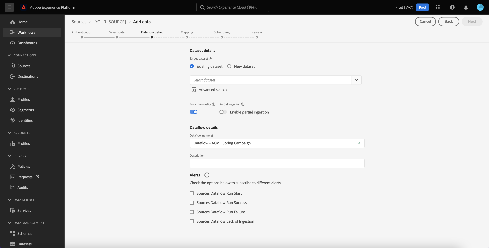
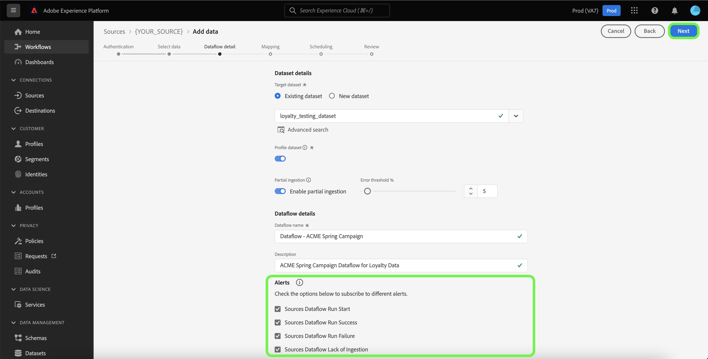

# UI에서 마케팅 자동화 소스를 사용하여 데이터 흐름 만들기

데이터 흐름은 소스에서 Adobe Experience Platform의 데이터 세트로 데이터를 검색하고 수집하는 예약된 작업입니다. 이 자습서에서는 Experience Platform UI를 사용하여 마케팅 자동화 소스에 대한 데이터 흐름을 만드는 방법에 대한 단계를 제공합니다.

>[!NOTE]
>
>* 데이터 흐름을 만들려면 마케팅 자동화 소스가 있는 인증된 계정이 이미 있어야 합니다. UI에서 다양한 마케팅 자동화 소스 계정을 만드는 데 필요한 튜토리얼 목록은 [소스 개요](../../../home.md#marketing-automation)에서 찾을 수 있습니다.
>* Experience Platform이 데이터를 수집하려면 모든 테이블 기반 배치 소스의 시간대를 UTC로 구성해야 합니다.

## 시작하기

이 자습서에서는 Experience Platform의 다음 구성 요소를 이해하고 있어야 합니다.

* [소스](../../../home.md): Experience Platform을 사용하면 [!DNL Experience Platform] 서비스를 사용하여 들어오는 데이터를 구조화하고 레이블을 지정하고 개선하는 기능을 제공하는 동시에 다양한 소스에서 데이터를 수집할 수 있습니다.
* [[!DNL Experience Data Model (XDM)] 시스템](../../../../xdm/home.md): Experience Platform에서 고객 경험 데이터를 구성하는 표준화된 프레임워크입니다.
   * [스키마 컴포지션의 기본 사항](../../../../xdm/schema/composition.md): 스키마 컴포지션의 주요 원칙 및 모범 사례를 포함하여 XDM 스키마의 기본 구성 요소에 대해 알아봅니다.
   * [스키마 편집기 튜토리얼](../../../../xdm/tutorials/create-schema-ui.md): 스키마 편집기 UI를 사용하여 사용자 지정 스키마를 만드는 방법을 알아봅니다.
* [[!DNL Real-Time Customer Profile]](../../../../profile/home.md): 여러 원본의 집계된 데이터를 기반으로 통합된 실시간 소비자 프로필을 제공합니다.
* [[!DNL Data Prep]](../../../../data-prep/home.md): 데이터 엔지니어는 XDM(Experience Data Model)에서 데이터를 매핑, 변환 및 확인할 수 있습니다.

## 데이터 추가

Marketing Automation 소스 계정을 만든 후 **[!UICONTROL 데이터 추가]** 단계가 표시되어 Marketing Automation 소스 계정의 테이블 계층 구조를 살펴볼 수 있는 인터페이스를 제공합니다.

* 인터페이스의 왼쪽 반은 브라우저이며, 계정에 포함된 데이터 테이블 목록을 표시합니다. 인터페이스에는 사용하려는 소스 데이터를 빠르게 식별할 수 있는 검색 옵션도 포함되어 있습니다.
* 인터페이스의 오른쪽 절반은 최대 100개의 데이터 행을 미리 볼 수 있는 미리 보기 패널입니다.

>[!NOTE]
>
>소스 데이터 검색 옵션은 Adobe Analytics, [!DNL Amazon Kinesis] 및 [!DNL Azure Event Hubs]을(를) 제외한 모든 테이블 기반 소스에서 사용할 수 있습니다.

원본 데이터를 찾으면 테이블을 선택한 다음 **[!UICONTROL 다음]**&#x200B;을 선택합니다.

## 데이터 흐름 세부 정보 제공

[!UICONTROL 데이터 흐름 세부 정보] 페이지에서 기존 데이터 집합을 사용할지 새 데이터 집합을 사용할지 여부를 선택할 수 있습니다. 이 프로세스 중에 [!UICONTROL 프로필 데이터 세트], [!UICONTROL 오류 진단], [!UICONTROL 부분 수집] 및 [!UICONTROL 경고]에 대한 설정을 구성할 수도 있습니다.

### 기존 데이터 세트 사용

기존 데이터 집합에 데이터를 수집하려면 **[!UICONTROL 기존 데이터 집합]**&#x200B;을(를) 선택하십시오. [!UICONTROL 고급 검색] 옵션을 사용하거나 드롭다운 메뉴에서 기존 데이터 세트 목록을 스크롤하여 기존 데이터 세트를 검색할 수 있습니다. 데이터 세트를 선택한 후에는 데이터 흐름의 이름과 설명을 입력합니다.

### 새 데이터 세트 사용

새 데이터 집합으로 수집하려면 **[!UICONTROL 새 데이터 집합]**&#x200B;을 선택한 다음 출력 데이터 집합 이름과 선택적 설명을 입력하십시오. 그런 다음 [!UICONTROL 고급 검색] 옵션을 사용하거나 드롭다운 메뉴에서 기존 스키마 목록을 스크롤하여 매핑할 스키마를 선택합니다. 스키마를 선택하면 데이터 흐름의 이름과 설명을 입력합니다.

### [!DNL Profile] 및 오류 진단 사용

**[!UICONTROL 프로필 데이터 세트]** 전환을 선택하여 [!DNL Profile]에 대한 데이터 세트를 사용하도록 설정합니다. 이를 통해 엔티티의 속성 및 동작을 전체적으로 볼 수 있습니다. [!DNL Profile]이(가) 활성화된 모든 데이터 세트의 데이터가 [!DNL Profile]에 포함되며 데이터 흐름을 저장할 때 변경 사항이 적용됩니다.

[!UICONTROL 오류 진단]을 사용하면 데이터 흐름에서 발생하는 모든 잘못된 레코드에 대해 자세한 오류 메시지를 생성할 수 있고, [!UICONTROL 부분 수집]을(를) 사용하면 수동으로 정의하는 특정 임계값까지 오류가 포함된 데이터를 수집할 수 있습니다. 자세한 내용은 [부분 일괄 처리 수집 개요](../../../../ingestion/batch-ingestion/partial.md)를 참조하십시오.

### 경고 활성화

경고를 활성화하여 데이터 흐름 상태에 대한 알림을 받을 수 있습니다. 목록에서 경고를 선택하여 데이터 흐름 상태에 대한 알림을 수신합니다. 경고에 대한 자세한 내용은 [UI를 사용하여 소스 경고 구독](../alerts.md)에 대한 안내서를 참조하십시오.

데이터 흐름에 세부 정보를 제공했으면 **[!UICONTROL 다음]**&#x200B;을 선택합니다.

## 데이터 필드를 XDM 스키마에 매핑

소스 스키마의 소스 필드를 대상 스키마의 해당 대상 XDM 필드에 매핑할 수 있는 인터페이스를 제공하는 [!UICONTROL 매핑] 단계가 나타납니다.

Experience Platform은 선택한 대상 스키마 또는 데이터 세트를 기반으로 자동 매핑된 필드에 대한 지능형 권장 사항을 제공합니다. 사용 사례에 맞게 매핑 규칙을 수동으로 조정할 수 있습니다. 필요에 따라 필드를 직접 매핑하도록 선택하거나 데이터 준비 함수를 사용하여 소스 데이터를 변환하여 계산된 값 또는 계산된 값을 파생할 수 있습니다. 매퍼 인터페이스 및 계산된 필드 사용에 대한 포괄적인 단계는 [데이터 준비 UI 안내서](../../../../data-prep/ui/mapping.md)를 참조하십시오.

원본 데이터가 성공적으로 매핑되면 **[!UICONTROL 다음]**&#x200B;을(를) 선택하십시오.

## 수집 실행 예약

구성된 매핑을 사용하여 선택한 원본 데이터를 자동으로 수집하도록 수집 일정을 구성할 수 있는 [!UICONTROL 예약] 단계가 나타납니다. 기본적으로 예약은 `Once`(으)로 설정됩니다. 수집 빈도를 조정하려면 **[!UICONTROL 빈도]**&#x200B;를 선택한 다음 드롭다운 메뉴에서 옵션을 선택합니다.

>[!TIP]
>
>일회성 수집 중에는 간격과 채우기가 표시되지 않습니다.

수집 빈도를 `Minute`, `Hour`, `Day` 또는 `Week`(으)로 설정한 경우 모든 수집 사이에 일정 간격을 설정해야 합니다. 예를 들어 수집 빈도를 `Day`(으)로 설정하고 간격을 `15`(으)로 설정하면 데이터 흐름이 15일마다 데이터를 수집하도록 예약됩니다.

이 단계에서는 **다시 채우기**&#x200B;를 사용하도록 설정하고 데이터의 증분 수집을 위한 열을 정의할 수도 있습니다. 채우기 기능은 내역 데이터를 수집하는 데 사용되며 증분 수집을 위해 정의하는 열은 새 데이터를 기존 데이터와 구별할 수 있도록 합니다.

예약 구성에 대한 자세한 내용은 아래 표를 참조하십시오.

| 구성 예약 중 | 설명 |
| --- | --- |
| 빈도 | 데이터 흐름이 실행되는 빈도를 구성하십시오. 빈도를 다음과 같이 설정할 수 있습니다. <ul><li>**한 번**: 빈도를 `once`(으)로 설정하여 일회성 수집을 만듭니다. 일회성 수집 데이터 흐름을 만들 때는 간격 및 채우기 구성을 사용할 수 없습니다. 기본적으로 예약 빈도는 한 번으로 설정됩니다.</li><li>**분**: 분 단위로 데이터를 수집하도록 데이터 흐름을 예약하려면 빈도를 `minute`(으)로 설정하십시오.</li><li>**시간**: 빈도를 `hour`(으)로 설정하여 시간당 기준으로 데이터를 수집하도록 데이터 흐름을 예약합니다.</li><li>**일**: 빈도를 `day`(으)로 설정하여 하루 단위로 데이터를 수집하도록 데이터 흐름을 예약합니다.</li><li>**주**: 주별로 데이터를 수집하도록 데이터 흐름을 예약하려면 빈도를 `week`(으)로 설정하십시오.</li></ul> |
| 간격 | 빈도를 선택하면 간격 설정을 구성하여 모든 수집 사이에 시간대를 설정할 수 있습니다. 예를 들어 빈도를 일로 설정하고 간격을 15로 구성한 경우 데이터 흐름이 15일마다 실행됩니다. 간격을 0으로 설정할 수 없습니다. 각 주파수에 대해 허용되는 최소 간격 값은 다음과 같습니다.<ul><li>**한 번**: 해당 없음</li><li>**분**: 15</li><li>**시간**: 1</li><li>**일**: 1</li><li>**주**: 1</li></ul> |
| 시작 시간 | UTC 시간대로 표시되는 예상 실행의 타임스탬프입니다. |
| 채우기 | 채우기 는 처음 수집되는 데이터를 결정합니다. 다시 채우기를 활성화하면 처음 예약된 수집 중에 지정된 경로의 모든 현재 파일이 수집됩니다. 다시 채우기를 비활성화하면 첫 번째 수집 실행과 시작 시간 사이에 로드된 파일만 수집됩니다. 시작 시간 이전에 로드된 파일은 수집되지 않습니다. |
| 증분 데이터 로드 기준 | 유형, 날짜 또는 시간의 소스 스키마 필드 세트가 필터링되어 있는 옵션. **[!UICONTROL 증분 데이터를]**&#x200B;까지 로드하기 위해 선택한 필드에 증분 데이터를 올바르게 로드하려면 UTC 시간대의 날짜-시간 값이 있어야 합니다. 모든 테이블 기반 일괄 처리 소스는 델타 열 타임스탬프 값을 해당 흐름 실행 창 UTC 시간과 비교하여 증분 데이터를 선택한 다음 UTC 시간 창 내에 새 데이터가 있는 경우 소스에서 데이터를 복사합니다. |

## 데이터 흐름 검토

새 데이터 흐름을 만들기 전에 검토할 수 있는 **[!UICONTROL 검토]** 단계가 나타납니다. 세부 사항은 다음 범주 내에서 그룹화됩니다.

* **[!UICONTROL 연결]**: 원본 형식, 선택한 원본 파일의 관련 경로 및 해당 원본 파일에 있는 열의 양을 표시합니다.
* **[!UICONTROL 데이터 집합 및 맵 필드 할당]**: 데이터 집합이 준수하는 스키마를 포함하여 소스 데이터가 수집되는 데이터 집합을 표시합니다.
* **[!UICONTROL 예약]**: 수집 일정의 활성 기간, 빈도 및 간격을 표시합니다.

데이터 흐름을 검토한 후 **[!UICONTROL 완료]**&#x200B;를 선택하고 데이터 흐름이 만들어지도록 잠시 기다립니다.

## 데이터 흐름 모니터링

데이터 흐름이 만들어지면 데이터 흐름을 통해 수집되는 데이터를 모니터링하여 수집 비율, 성공 및 오류에 대한 정보를 볼 수 있습니다. 데이터 흐름을 모니터링하는 방법에 대한 자세한 내용은 [UI에서 계정 및 데이터 흐름 모니터링](../monitor.md)에 대한 자습서를 참조하십시오.

## 데이터 흐름 삭제

**[!UICONTROL 데이터 흐름]** 작업 영역에서 사용할 수 있는 **[!UICONTROL Delete]** 함수를 사용하여 더 이상 필요하지 않거나 잘못 만들어진 데이터 흐름을 삭제할 수 있습니다. 데이터 흐름을 삭제하는 방법에 대한 자세한 내용은 [UI에서 데이터 흐름 삭제](../delete.md)에 대한 자습서를 참조하십시오.

## 다음 단계

이 자습서를 따라 마케팅 자동화 소스에서 Experience Platform으로 데이터를 가져오는 데이터 흐름을 만들었습니다. 이제 [!DNL Real-Time Customer Profile] 및 [!DNL Data Science Workspace] 등의 다운스트림 [!DNL Experience Platform] 서비스에서 수신 데이터를 사용할 수 있습니다. 자세한 내용은 다음 문서를 참조하십시오.

* [[!DNL Real-Time Customer Profile] 개요](../../../../profile/home.md)
* [[!DNL Data Science Workspace] 개요](../../../../data-science-workspace/home.md)

>[!WARNING]
>
> 다음 비디오에 표시된 Experience Platform UI가 최신 상태가 아닙니다. 최신 UI 스크린샷 및 기능은 위의 설명서를 참조하십시오.
>
>[!VIDEO](https://video.tv.adobe.com/v/29711?quality=12&learn=on)