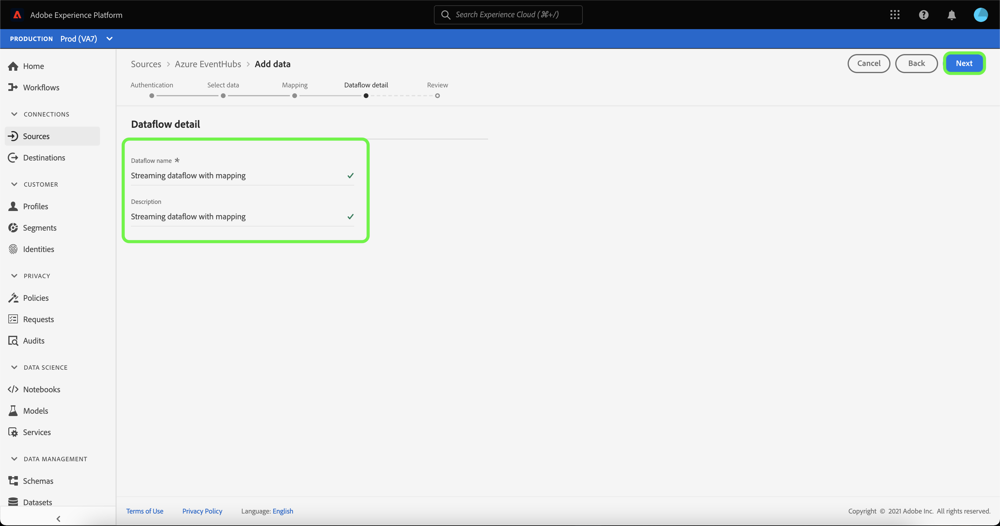

# UI에서 클라우드 스토리지 소스에 대한 스트리밍 데이터 흐름 만들기

데이터 흐름은 소스에서 Adobe Experience Platform 데이터 세트로 데이터를 검색하고 수집하는 예약된 작업입니다. 이 자습서에서는 UI에서 클라우드 스토리지 소스에 대한 스트리밍 데이터 흐름을 만드는 단계를 제공합니다.

이 자습서를 시도하기 전에 먼저 클라우드 스토리지 계정과 플랫폼 간에 유효하고 인증된 연결을 설정해야 합니다. 인증된 연결이 없는 경우 스트리밍 클라우드 스토리지 계정 인증에 대한 자세한 내용은 다음 튜토리얼 중 하나를 참조하십시오.

- [[!DNL Amazon Kinesis]](../../../ui/create/cloud-storage/kinesis.md)
- [[!DNL Azure Event Hubs]](../../../ui/create/cloud-storage/eventhub.md)
- [[!DNL Google PubSub]](../../../ui/create/cloud-storage/google-pubsub.md)

## 시작하기

이 자습서에서는 Adobe Experience Platform의 다음 구성 요소를 이해하고 있어야 합니다.

- [데이터 흐름](../../../../../dataflows/home.md): 데이터 흐름은 플랫폼 간에 데이터를 이동하는 데이터 작업을 나타냅니다. 데이터 흐름은 소스 간에 서로 다른 서비스에 걸쳐 구성됩니다. [!DNL Identity Service], 대상 [!DNL Profile], 및 까지 [!DNL Destinations].
- [데이터 준비](../../../../../data-prep/home.md): 데이터 준비를 통해 데이터 엔지니어는 XDM(Experience Data Model)과 데이터를 매핑, 변환 및 확인할 수 있습니다. 데이터 준비는 CSV 수집 워크플로를 포함하여 데이터 수집 프로세스에서 &quot;맵&quot; 단계로 표시됩니다.
- [[!DNL Experience Data Model (XDM)] 시스템](../../../../../xdm/home.md): 표준화된 프레임워크 [!DNL Experience Platform] 고객 경험 데이터를 구성합니다.
   - [스키마 컴포지션 기본 사항](../../../../../xdm/schema/composition.md): 스키마 컴포지션의 주요 원칙 및 모범 사례를 포함하여 XDM 스키마의 기본 구성 요소에 대해 알아봅니다.
   - [스키마 편집기 튜토리얼](../../../../../xdm/tutorials/create-schema-ui.md): 스키마 편집기 UI를 사용하여 사용자 정의 스키마를 만드는 방법을 알아봅니다.
- [[!DNL Real-Time Customer Profile]](../../../../../profile/home.md): 여러 소스의 집계 데이터를 기반으로 통합 실시간 소비자 프로필을 제공합니다.

## 데이터 추가

스트리밍 클라우드 스토리지 계정을 인증한 후 **[!UICONTROL 데이터 선택]** 플랫폼으로 가져올 데이터 스트림을 선택할 수 있는 인터페이스를 제공하는 단계가 나타납니다.

- 인터페이스의 왼쪽 부분은 계정 내에서 사용 가능한 데이터 스트림을 볼 수 있는 브라우저입니다.
- 인터페이스의 오른쪽 부분에서 JSON 파일에서 최대 100개의 데이터 행을 미리 볼 수 있습니다.

사용할 데이터 스트림을 선택한 다음 을 선택합니다 **[!UICONTROL 파일 선택]** 샘플 스키마를 업로드합니다.

>[!TIP]
>
>데이터가 XDM을 준수하는 경우 샘플 스키마 업로드를 건너뛰고 을 선택할 수 있습니다. **[!UICONTROL 다음]** 계속합니다.

스키마가 업로드되면 미리보기 인터페이스가 업데이트되어 업로드한 스키마의 미리보기가 표시됩니다. 미리보기 인터페이스를 사용하여 파일의 내용과 구조를 검사할 수 있습니다. 다음을 사용할 수도 있습니다 [!UICONTROL 검색 필드] 스키마 내의 특정 항목에 액세스하는 유틸리티입니다.

완료되면 다음을 선택합니다. **[!UICONTROL 다음]**.

## 매핑

다음 **[!UICONTROL 매핑]** 소스 데이터를 Platform 데이터 세트에 매핑하는 인터페이스를 제공하는 단계가 나타납니다.

수집할 인바운드 데이터에 대한 데이터 세트를 선택합니다. 기존 데이터 세트를 사용하거나 새 데이터 세트를 만들 수 있습니다.

### 새 데이터 세트

데이터를 새 데이터 세트로 수집하려면 **[!UICONTROL 새 데이터 세트]** 제공된 필드에 데이터 세트의 이름과 설명을 입력합니다. 스키마를 추가하려면 기존 스키마 이름을 **[!UICONTROL 스키마 선택]** 대화 상자. 또는 다음을 선택할 수 있습니다 **[!UICONTROL 스키마 고급 검색]** 를 클릭하여 적절한 스키마를 검색합니다.

다음 [!UICONTROL 스키마 선택] 선택 가능한 스키마 목록을 제공하는 창이 나타납니다. 목록에서 스키마를 선택하여 오른쪽 레일을 업데이트하면 선택한 스키마에 대한 세부 정보(스키마 활성화 여부 정보 포함)가 표시됩니다 [!DNL Profile].

사용할 스키마를 식별하고 선택했으면 를 선택합니다 **[!UICONTROL 완료]**.

다음 [!UICONTROL Target 데이터 세트] 선택한 스키마가 데이터 세트의 일부로 표시되는 페이지가 업데이트됩니다. 이 단계에서는 데이터 세트를 [!DNL Profile] 엔티티의 속성 및 행동에 대한 전체적인 보기를 만들 수 있습니다. 활성화된 모든 데이터 세트의 데이터가에 포함됩니다. [!DNL Profile] 및 변경 사항은 데이터 흐름을 저장할 때 적용됩니다.

전환 **[!UICONTROL 프로필 데이터 세트]** 다음에 대한 타겟 데이터 세트를 활성화하는 버튼 [!DNL Profile].

### 기존 데이터 세트

기존 데이터 세트에 데이터를 수집하려면 다음을 선택합니다. **[!UICONTROL 기존 데이터 세트]**&#x200B;을 클릭한 다음 데이터 세트 아이콘을 선택합니다.

다음 **[!UICONTROL 데이터 세트 선택]** 선택 가능한 데이터 세트 목록을 제공하는 대화 상자가 나타납니다. 목록에서 데이터 세트를 선택하여 오른쪽 레일을 업데이트하면 데이터 세트를 활성화할 수 있는지 여부에 대한 정보를 포함하여 선택한 데이터 세트와 관련된 세부 정보가 표시됩니다 [!DNL Profile].

사용할 데이터 세트를 식별하고 선택하면 **[!UICONTROL 완료]**.

데이터 세트를 선택하면 [!DNL Profile] 에 대한 데이터 세트를 활성화하려면 전환 [!DNL Profile].

### 표준 필드 매핑

데이터 세트 및 스키마를 설정한 상태에서 **[!UICONTROL 표준 필드 매핑]** 데이터에 대한 매핑 필드를 수동으로 구성할 수 있는 인터페이스가 나타납니다.

>[!TIP]
>
>Platform은 선택한 대상 스키마 또는 데이터 세트를 기반으로 자동 매핑된 필드에 대한 지능형 권장 사항을 제공합니다. 사용 사례에 맞게 매핑 규칙을 수동으로 조정할 수 있습니다.

필요에 따라 필드를 직접 매핑하도록 선택하거나 데이터 준비 함수를 사용하여 소스 데이터를 변환하여 계산된 값 또는 계산된 값을 파생할 수 있습니다. 매퍼 인터페이스 및 계산된 필드 사용에 대한 포괄적인 단계는 [데이터 준비 UI 안내서](../../../../../data-prep/ui/mapping.md).

소스 데이터가 매핑되면 다음을 선택합니다. **[!UICONTROL 다음]**.

## 데이터 흐름 세부 정보

다음 **[!UICONTROL 데이터 흐름 세부 정보]** 단계가 표시되어 새 데이터 흐름에 대한 이름을 지정하고 간단한 설명을 제공할 수 있습니다.

데이터 흐름에 대한 값을 입력하고 다음을 선택합니다. **[!UICONTROL 다음]**.

### 검토

다음 **[!UICONTROL 리뷰]** 새 데이터 흐름을 만들기 전에 검토할 수 있는 단계가 나타납니다. 세부 사항은 다음 범주 내에서 그룹화됩니다.

- **[!UICONTROL 연결]**: 계정 이름, 소스 유형 및 사용 중인 스트리밍 클라우드 스토리지 소스와 관련된 기타 정보를 표시합니다.
- **[!UICONTROL 데이터 세트 할당 및 필드 매핑]**: 데이터 흐름에 사용 중인 대상 데이터 세트 및 스키마를 표시합니다.

데이터 흐름을 검토한 후 다음을 선택합니다 **[!UICONTROL 완료]** 데이터 흐름이 만들어지는 데 시간이 걸릴 수 있습니다.

## 데이터 흐름 모니터링 및 삭제

스트리밍 클라우드 스토리지 데이터 흐름이 생성되면 이를 통해 수집되는 데이터를 모니터링할 수 있습니다. 스트리밍 데이터 흐름 모니터링 및 삭제에 대한 자세한 내용은 다음 자습서를 참조하십시오 [스트리밍 데이터 흐름 모니터링](../../monitor-streaming.md).

## 다음 단계

이 자습서에 따라 클라우드 스토리지 소스에서 데이터를 스트리밍하기 위한 데이터 흐름을 만들었습니다. 이제 다음과 같은 다운스트림 플랫폼 서비스에서 수신 데이터를 사용할 수 있습니다. [!DNL Real-Time Customer Profile] 및 [!DNL Data Science Workspace]. 자세한 내용은 다음 문서를 참조하십시오.

- [[!DNL Real-Time Customer Profile] 개요](../../../../../profile/home.md)
- [[!DNL Data Science Workspace] 개요](../../../../../data-science-workspace/home.md)