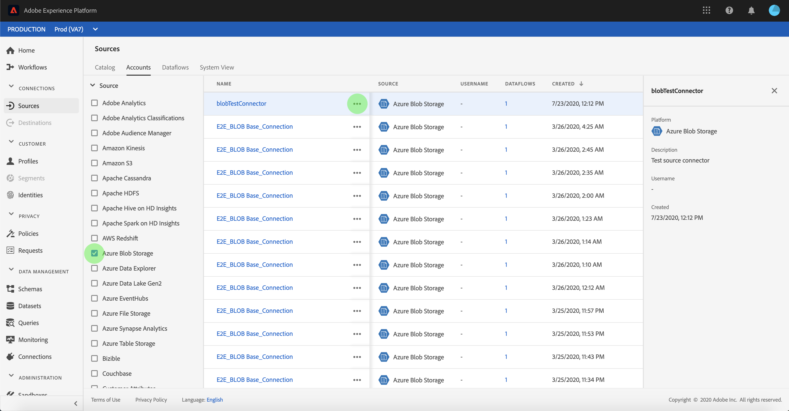

# 원본 연결 계정 삭제

Adobe Experience Platform의 소스 커넥터는 예약된 방식으로 외부 소스 데이터를 수집할 수 있습니다. 이 자습서에서는 **[!UICONTROL 소스]** 작업 공간.

## 시작하기

이 자습서에서는 Adobe Experience Platform의 다음 구성 요소를 이해하고 있어야 합니다.

- [[!DNL Experience Data Model (XDM)] 시스템](../../../xdm/home.md): 표준화된 프레임워크 [!DNL Experience Platform] 고객 경험 데이터를 구성합니다.
   - [스키마 작성 기본 사항](../../../xdm/schema/composition.md): 스키마 컴포지션의 주요 원칙 및 모범 사례를 포함하여 XDM 스키마의 기본 빌딩 블록에 대해 알아봅니다.
   - [스키마 편집기 자습서](../../../xdm/tutorials/create-schema-ui.md): 스키마 편집기 UI를 사용하여 사용자 지정 스키마를 만드는 방법을 알아보십시오.
- [[!DNL Real-Time Customer Profile]](../../../profile/home.md): 여러 소스에서 집계된 데이터를 기반으로 통합된 실시간 소비자 프로필을 제공합니다.

## UI를 사용하여 계정 삭제

>[!TIP]
>
>소스 계정을 삭제하기 전에 먼저 소스 계정과 연결된 기존 데이터 흐름을 삭제해야 합니다. 기존 데이터 흐름을 삭제하려면 [UI에서 소스 데이터 흐름 삭제](./delete.md).

에 로그인합니다. [Adobe Experience Platform](https://platform.adobe.com) 그런 다음 **[!UICONTROL 소스]** 왼쪽 탐색 모음에서 를 클릭하여 **[!UICONTROL 소스]** 작업 공간. 다음 **[!UICONTROL 카탈로그]** 화면에 계정 및 데이터 흐름을 만들 수 있는 다양한 소스가 표시됩니다. 각 소스에는 연결된 기존 계정 및 데이터 흐름의 수가 표시됩니다.

선택 **[!UICONTROL 계정]** 에 액세스하려면 **[!UICONTROL 계정]** 페이지.

기존 계정 목록이 나타납니다. 이 페이지에는 소스, 사용자 이름, 관련 데이터 흐름 및 만든 날짜와 같은 기존 계정에 대한 정렬 가능한 정보 목록이 있습니다. 을(를) 선택합니다 **단계 아이콘** 왼쪽 위에 정렬해

사용 가능한 소스 목록이 포함된 정렬 패널이 화면 왼쪽에 나타납니다. 정렬 함수를 사용하여 두 개 이상의 소스를 선택할 수 있습니다.

액세스할 소스를 선택하고 기본 인터페이스의 계정 목록에서 삭제할 계정을 찾습니다. 이 예제에서 선택한 소스는 **[!DNL Azure Blob Storage]** 계정 이름은 **[!UICONTROL blobTestConnector]**. 정렬 패널에서 여러 소스를 선택할 때 목록이 만든 날짜별로 정렬되므로 가장 최근에 만든 계정이 먼저 나타납니다.

삭제할 계정을 선택합니다.

다음 **[!UICONTROL 속성]** 선택한 계정에 대한 정보가 포함된 패널이 화면 오른쪽에 나타납니다.

줄임표(`...`)을 삭제할 계정 이름 옆에 추가합니다. 옵션을 제공하는 팝업 패널이 나타납니다. **[!UICONTROL 데이터 추가]**, **[!UICONTROL 세부 사항 편집]**, 및 **[!UICONTROL 삭제]**. 선택 **[!UICONTROL 삭제]** 계정을 삭제하려면

최종 확인 대화 상자가 나타나면 **[!UICONTROL 삭제]** 프로세스를 완료합니다.

## 다음 단계

이 자습서를 따라 다음을 성공적으로 사용했습니다. **[!UICONTROL 소스]** 작업 영역에서 기존 계정을 삭제할 수 있습니다.

를 사용하여 프로그래밍 방식으로 이러한 작업을 수행하는 방법에 대한 절차 [!DNL Flow Service] API입니다. 다음 페이지에서 자습서를 참조하십시오. [흐름 서비스 API를 사용하여 연결 삭제](../../tutorials/api/delete.md)
