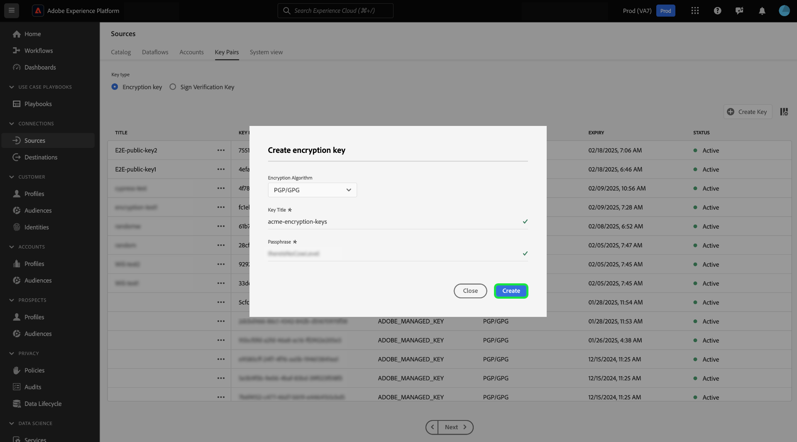

# 소스 UI에서 암호화된 데이터 수집

>[!AVAILABILITY]
>
>소스 UI에서 암호화된 데이터 수집에 대한 지원은 베타 버전이며 조직에서 사용하지 못할 수 있습니다. 기능 및 설명서는 변경될 수 있습니다.

클라우드 스토리지 배치 소스를 사용하여 암호화된 데이터 파일 및 폴더를 Adobe Experience Platform으로 수집할 수 있습니다. 암호화된 데이터 수집을 통해 비대칭 암호화 메커니즘을 활용하여 배치 데이터를 안전하게 Experience Platform으로 전송할 수 있습니다. 지원되는 비대칭 암호화 메커니즘은 PGP 및 GPG입니다.

UI를 사용하여 클라우드 스토리지 일괄 처리 소스로 암호화된 데이터를 수집하는 방법에 대해 알아보려면 이 안내서를 참조하십시오.

## 시작하기

이 자습서를 계속하기 전에 다음 문서를 읽고 다음 Experience Platform 기능 및 개념을 이해하십시오.

* [소스](../../home.md): Experience Platform의 소스를 사용하여 Adobe 응용 프로그램 또는 타사 데이터 원본에서 데이터를 수집합니다.
* [데이터 흐름](../../../dataflows/home.md): 데이터 흐름은 Experience Platform 간에 데이터를 이동하는 데이터 작업을 나타냅니다. 소스 작업 영역을 사용하여 주어진 소스에서 Experience Platform으로 데이터를 수집하는 데이터 흐름을 만들 수 있습니다.
* [샌드박스](../../../sandboxes/home.md): Experience Platform에서 샌드박스를 사용하여 Experience Platform 인스턴스 간에 가상 파티션을 만들고 개발 또는 프로덕션 전용 환경을 만듭니다.

### 높은 수준 개요

* Experience Platform UI의 소스 작업 영역을 사용하여 암호화 키 쌍을 만듭니다.
   * 원할 경우 자체 서명 확인 키 쌍을 만들어 암호화된 데이터에 추가 보안 계층을 제공할 수도 있습니다.
* 암호화 키 쌍의 공개 키를 사용하여 데이터를 암호화합니다.
* 클라우드 스토리지 공급자에 암호화된 데이터를 배치합니다. 이 단계에서는 소스 데이터를 XDM(Experience Data Model) 스키마에 매핑하는 참조로 사용할 수 있는 샘플 파일도 있는지 확인해야 합니다.
* 클라우드 스토리지 일괄 처리 소스를 사용하고 Experience Platform UI의 소스 작업 영역에서 데이터 수집 프로세스를 시작합니다.
* 소스 연결 생성 프로세스 중에 데이터 암호화에 사용한 공개 키에 해당하는 키 ID를 제공합니다.
   * 서명 확인 키 쌍 메커니즘도 사용한 경우 암호화된 데이터에 해당하는 서명 확인 키 ID도 제공해야 합니다.
* 데이터 흐름 생성 단계로 진행합니다.

## 암호화 키 쌍 만들기 {#create-an-encryption-key-pair}

>[!CONTEXTUALHELP]
>id="platform_sources_encrypted_encryptionKeyId"
>title="암호화 키 ID"
>abstract="소스 데이터를 암호화하는 데 사용된 암호화 키와 일치하는 암호화 키 ID를 제공합니다."

>[!BEGINSHADEBOX]

**암호화 키 쌍이란 무엇입니까?**

암호화 키 쌍은 공개 키와 개인 키로 구성된 비대칭 암호화 메커니즘입니다. 공개 키는 데이터를 암호화하는 데 사용되며 개인 키는 그 데이터를 해독하는 데 사용됩니다.

Experience Platform UI를 통해 암호화 키 쌍을 만들 수 있습니다. 생성되면 공개 키와 해당 키 ID를 받게 됩니다. 암호화된 데이터를 수집하는 과정에 있을 때 공개 키를 사용하여 데이터를 암호화한 다음 키 ID를 사용하여 ID를 확인합니다. 개인 키는 자동으로 Experience Platform으로 이동하며, 여기서 보안 저장소에 저장되고 데이터의 암호 해독이 준비된 후에만 사용됩니다.

>[!ENDSHADEBOX]

Platform UI에서 소스 작업 영역으로 이동한 다음 상단 헤더에서 [!UICONTROL 키 쌍]을 선택합니다.

조직의 기존 암호화 키 쌍 목록을 표시하는 페이지로 이동합니다. 이 페이지에서는 해당 키의 제목, ID, 유형, 암호화 알고리즘, 만료 및 상태에 대한 정보를 제공합니다. 새 키 쌍을 만들려면 **[!UICONTROL 키 만들기]**&#x200B;를 선택합니다.

그런 다음 만들려는 키 유형을 선택합니다. 암호화 키를 만들려면 **[!UICONTROL 암호화 키]**&#x200B;를 선택한 다음 **[!UICONTROL 계속]**&#x200B;을 선택하십시오.

암호화 키의 제목과 암호를 입력합니다. 암호는 암호화 키에 대한 추가 보호 계층입니다. 생성 시 Experience Platform은 암호를 공개 키와 다른 보안 저장소에 저장합니다. 비어 있지 않은 문자열을 암호로 제공해야 합니다. 완료되면 **[!UICONTROL 만들기]**&#x200B;를 선택합니다.

성공하면 제목, 공개 키 및 키 ID를 포함한 새 암호화 키가 표시되는 새 창이 나타납니다. 공개 키 값을 사용하여 데이터를 암호화합니다. 데이터 흐름 생성 프로세스 중에 암호화된 데이터를 수집할 때 이후 단계에서 키 ID를 사용하여 ID를 증명합니다.

기존 암호화 키에 대한 정보를 보려면 키 제목 옆에 있는 줄임표(`...`)를 선택하십시오. 공개 키와 키 ID를 보려면 **[!UICONTROL 키 세부 정보]**&#x200B;를 선택하십시오. 또는 암호화 키를 삭제하려면 **[!UICONTROL 삭제]**&#x200B;를 선택하십시오.

### 서명 인증 키 만들기 {#create-a-sign-verification-key}

>[!CONTEXTUALHELP]
>id="platform_sources_encrypted_signVerificationKeyId"
>title="서명 인증 키 ID"
>abstract="귀하의 서명이 들어간 암호화 소스 데이터에 해당하는 서명 인증 키 ID를 제공합니다."

>[!BEGINSHADEBOX]

**서명 확인 키란 무엇입니까?**

서명 확인 키는 개인 키와 공개 키를 포함하는 또 다른 암호화 메커니즘입니다. 이 경우 서명 확인 키 쌍을 만들고 개인 키를 사용하여 서명하고 데이터에 추가 암호화 계층을 제공할 수 있습니다. 그런 다음 해당 공개 키를 공유하여 Experience Platform 합니다. 수집 중에 Experience Platform은 공개 키를 사용하여 개인 키와 연결된 서명을 확인합니다.

>[!ENDSHADEBOX]

서명 확인 키를 만들려면 키 유형 선택 창에서 **[!UICONTROL 서명 확인 키]**&#x200B;를 선택한 다음 **[!UICONTROL 계속]**&#x200B;을 선택합니다.

그런 다음 제목과 [!DNL Base64]로 인코딩된 PGP 키를 공개 키로 제공한 다음 **[!UICONTROL 만들기]**&#x200B;를 선택하십시오.

성공하면 제목 및 키 ID를 포함한 새 서명 확인 키가 표시되는 새 창이 나타납니다.

## 암호화된 데이터 수집 {#ingest-encrypted-data}

>[!CONTEXTUALHELP]
>id="platform_sources_encrypted_isFileEncrypted"
>title="파일이 암호화되어 있습니까?"
>abstract="이미 암호화된 파일을 수집하는 경우 이 토글을 선택하십시오."

>[!CONTEXTUALHELP]
>id="platform_sources_encrypted_sampleFile"
>title="샘플 파일 선택"
>abstract="매핑을 생성하려면 암호화된 데이터를 수집할 때 샘플 파일을 수집해야 합니다."

다음 클라우드 스토리지 배치 소스를 사용하여 암호화된 데이터를 수집할 수 있습니다.

* [[!DNL Amazon S3]](../ui/create/cloud-storage/s3.md)
* [[!DNL Azure Blob]](../ui/create/cloud-storage/blob.md)
* [[!DNL Azure Data Lake Storage Gen2]](../ui/create/cloud-storage/adls-gen2.md)
* [[!DNL Azure File Storage]](../ui/create/cloud-storage/azure-file-storage.md)
* [[!DNL Data Landing Zone]](../ui/create/cloud-storage/data-landing-zone.md)
* [[!DNL FTP]](../ui/create/cloud-storage/ftp.md)
* [[!DNL Google Cloud Storage]](../ui/create/cloud-storage/google-cloud-storage.md)
* [[!DNL HDFS]](../ui/create/cloud-storage/hdfs.md)
* [[!DNL Oracle Object Storage]](../ui/create/cloud-storage/oracle-object-storage.md)
* [[!DNL SFTP]](../ui/create/cloud-storage/sftp.md)

선택한 클라우드 스토리지 소스로 인증합니다. 워크플로우의 데이터 선택 단계에서 수집할 암호화된 파일 또는 폴더를 선택한 다음 **[!UICONTROL 파일이 암호화되었습니까]** 전환을 활성화합니다.

그런 다음 소스 데이터에서 샘플 파일을 선택합니다. 데이터가 암호화되므로 소스 데이터에 매핑할 수 있는 XDM 스키마를 만들려면 Experience Platform에 샘플 파일이 필요합니다.

샘플 파일을 선택한 후에는 해당 데이터 형식, 구분 기호 및 압축 유형과 같은 데이터 설정을 구성합니다. 미리 보기 인터페이스가 완전히 렌더링될 때까지 잠시 기다렸다가 **[!UICONTROL 저장]**&#x200B;을 선택하세요.

여기에서 드롭다운 메뉴를 사용하여 데이터 암호화에 사용한 공개 키에 해당하는 공개 키 ID의 공개 키 제목을 선택합니다.

서명 확인 키 쌍도 사용하여 암호화 계층을 제공하고 추가한 다음 서명 확인 키 토글을 활성화한 다음 마찬가지로 드롭다운을 사용하여 데이터 암호화에 사용한 키와 일치하는 서명 확인 키 ID를 선택합니다.

완료되면 **[!UICONTROL 다음]**&#x200B;을(를) 선택하십시오.

소스 워크플로우의 나머지 단계를 완료하여 데이터 흐름 만들기를 완료합니다.

* [데이터 흐름 및 데이터 세트 세부 정보 제공](../ui/dataflow/batch/cloud-storage.md#provide-dataflow-details)
* [소스 데이터를 XDM 스키마에 매핑](../ui/dataflow/batch/cloud-storage.md#map-data-fields-to-an-xdm-schema)
* [데이터 흐름에 대한 수집 일정 구성](../ui/dataflow/batch/cloud-storage.md#schedule-ingestion-runs)
* [데이터 흐름 검토](../ui/dataflow/batch/cloud-storage.md#review-your-dataflow)

데이터 흐름이 만들어지면 [계속 업데이트](../ui/update-dataflows.md)할 수 있습니다.

## 다음 단계

이제 이 문서를 읽고 클라우드 스토리지 일괄 처리 소스에서 Experience Platform으로 암호화된 데이터를 수집할 수 있습니다. API를 사용하여 암호화된 데이터를 수집하는 방법에 대한 자세한 내용은 [API를 사용하여 암호화된 데이터 수집](../api/encrypt-data.md)에 대한 안내서를 참조하십시오.  [!DNL Flow Service]  Experience Platform 소스에 대한 일반적인 정보는 [소스 개요](../../home.md)를 참조하십시오.
