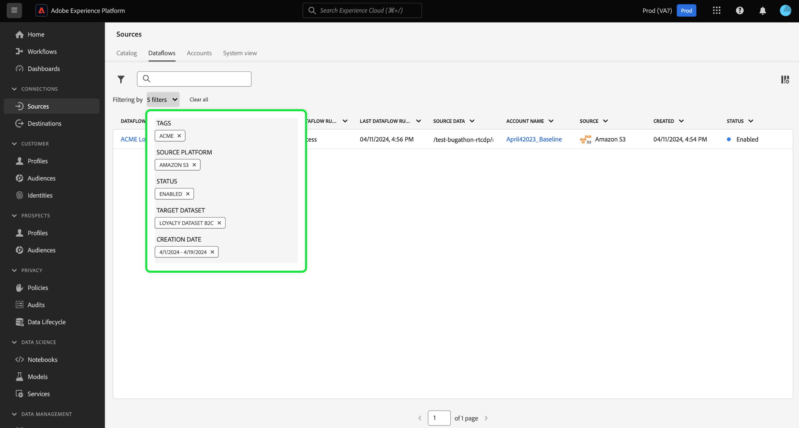
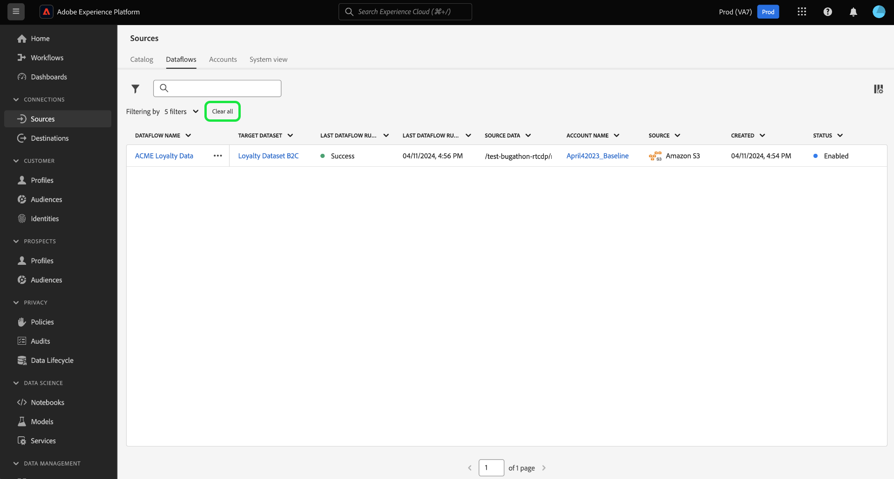
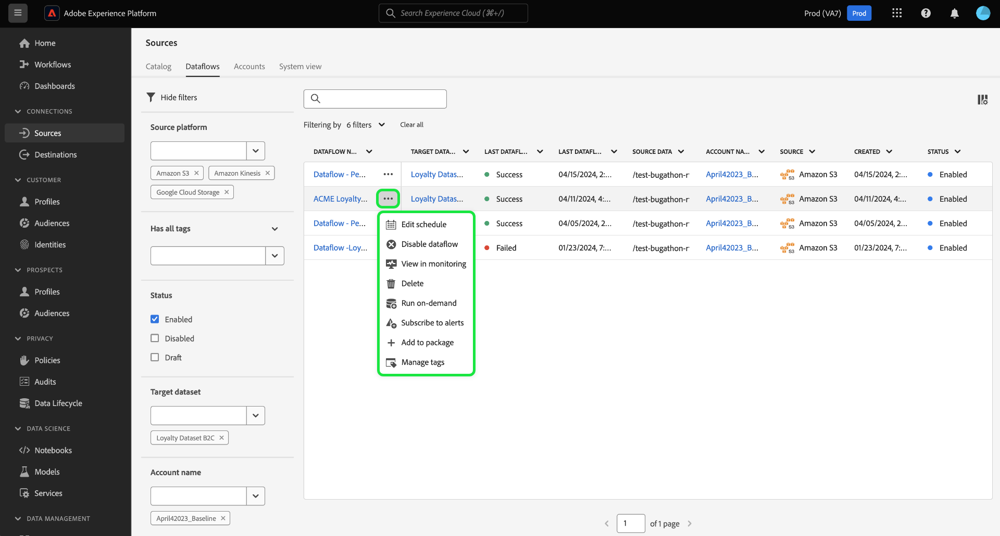

# UI에서 소스 오브젝트 필터링

Adobe Experience Platform 사용자 인터페이스의 필터링, 검색 및 인라인 작업 도구를 사용하여 [!UICONTROL Sources] 작업 영역에서 워크플로를 간소화합니다

* 필터링 및 검색 기능을 사용하여 조직의 소스 계정 및 데이터 흐름을 탐색합니다.
* 인라인 작업을 사용하여 데이터 흐름에 적용되는 구성 설정을 수정하고 조직 워크플로를 개선합니다. 인라인 작업을 사용하여 태그를 적용하거나, 경고를 설정하거나, 요청 시 수집 작업을 만들 수 있습니다.

## 시작하기

소스 작업 영역에서 개체 탐색 도구를 사용하여 작업하기 전에 다음 Experience Platform 기능 및 개념을 이해하는 것이 좋습니다.

* [소스](../../home.md): Experience Platform의 소스를 사용하여 Adobe 응용 프로그램 또는 타사 데이터 소스에서 데이터를 수집합니다.
* [관리 태그](../../../administrative-tags/overview.md): 관리 태그를 사용하여 개체에 메타데이터 키워드를 적용하고 검색을 통해 Experience Platform 에코시스템 내에서 해당 개체를 찾을 수 있습니다.
* [경고](../../../observability/home.md): 알림을 사용하여 원본 데이터 흐름과 같은 개체의 상태에 대한 업데이트를 제공하는 알림을 받을 수 있습니다.
* [데이터 흐름](../../../dataflows/home.md): 데이터 흐름은 Experience Platform에서 데이터를 이동하는 데이터 작업을 나타냅니다. 소스 작업 영역을 사용하여 주어진 소스에서 Experience Platform으로 데이터를 수집하는 데이터 흐름을 만들 수 있습니다.
* [데이터 집합](../../../catalog/datasets/user-guide.md): 데이터 집합은 스키마(열)와 필드(행)를 포함하는 데이터 컬렉션(일반적으로 테이블)에 대한 저장소 및 관리 구성입니다.
* [샌드박스](../../../sandboxes/home.md): Experience Platform의 샌드박스를 사용하여 Experience Platform 인스턴스 간에 가상 파티션을 만들고 개발 또는 프로덕션 전용 환경을 만듭니다.

## 소스 데이터 흐름 필터링 {#filter-sources-dataflows}

Experience Platform UI의 왼쪽 탐색에서 **[!UICONTROL Sources]**&#x200B;을(를) 선택한 다음 상단 헤더에서 **[!UICONTROL Dataflows]**&#x200B;을(를) 선택합니다.

기본적으로 필터 메뉴는 인터페이스 왼쪽에 표시됩니다. 메뉴를 숨기려면 **[!UICONTROL Hide filters]**&#x200B;을(를) 선택합니다.

다음 매개 변수를 사용하여 소스 데이터 흐름을 필터링할 수 있습니다.

| 필터 | 설명 |
| --- | --- |
| [Source 플랫폼](#filter-dataflows-by-source-platform) | 데이터 흐름이 만들어진 소스를 기반으로 데이터 흐름을 필터링합니다. |
| [태그](#filter-dataflows-by-tags) | 데이터 흐름에 적용된 태그를 기반으로 데이터 흐름을 필터링합니다. |
| [상태](#filter-dataflows-by-status) | 현재 상태에 따라 데이터 흐름을 필터링합니다. |
| [대상 데이터 세트](#filter-dataflows-by-target-dataset) | 데이터 흐름이 만들어진 대상 데이터 세트를 기준으로 데이터 흐름을 필터링합니다. |
| [계정 이름](#filter-dataflows-by-account-name) | 일치하는 계정의 이름을 기반으로 데이터 흐름을 필터링합니다. |
| [만든 사람](#filter-dataflows-by-user) | 데이터 흐름을 만든 사람을 기준으로 데이터 흐름을 필터링합니다. |
| [만든 날짜](#filter-dataflows-by-creation-date) | 데이터 흐름이 생성된 날짜를 기준으로 데이터 흐름을 필터링합니다. |
| [수정한 날짜](#filter-dataflows-by-modification-date) | 데이터 흐름이 마지막으로 업데이트된 날짜를 기준으로 데이터 흐름을 필터링합니다. |

### 소스 플랫폼별 데이터 흐름 필터링 {#filter-dataflows-by-source-platform}

[!UICONTROL Source platform] 패널을 사용하여 데이터 흐름을 소스 유형별로 필터링합니다. 특정 소스를 입력하거나 드롭다운 메뉴를 사용하여 카탈로그에서 소스 목록을 볼 수 있습니다. 주어진 쿼리에 대해 여러 개의 서로 다른 소스를 필터링할 수도 있습니다. 예를 들어 [!DNL Amazon S3], [!DNL Azure Data Lake Storage Gen2] 및 [!DNL Google Cloud Storage]을(를) 선택하여 카탈로그를 업데이트하고 선택한 소스로 만든 데이터 흐름만 표시할 수 있습니다.

### 태그로 데이터 흐름 필터링 {#filter-dataflows-by-tags}

태그 패널을 사용하여 각 태그로 데이터 흐름을 필터링합니다.

**[!UICONTROL Has any tag]**&#x200B;을(를) 선택한 다음 드롭다운 메뉴를 사용하여 필터링할 태그를 선택합니다. 이 설정을 사용하여 선택한 태그가 있는 데이터 흐름을 필터링합니다.

**[!UICONTROL Has all tags]**&#x200B;을(를) 선택한 다음 드롭다운 메뉴를 사용하여 필터링할 태그를 선택합니다. 선택한 모든 태그가 있는 데이터 흐름을 필터링하려면 이 설정을 사용하십시오.

### 상태별 데이터 흐름 필터링 {#filter-dataflows-by-status}

[!UICONTROL Status] 패널을 사용하여 상태별로 필터링할 수 있습니다.

| 상태 | 설명 |
| --- | --- |
| 활성화됨 | 보기를 필터링하고 활성 데이터 흐름만 표시하려면 **[!UICONTROL Enabled]**&#x200B;을(를) 선택하십시오. |
| 비활성화됨 | 보기를 필터링하고 비활성화된 데이터 흐름만 표시하려면 **[!UICONTROL Disabled]**&#x200B;을(를) 선택하십시오. |
| 초안 | 보기를 필터링하고 초안 모드에 있는 데이터 흐름만 표시하려면 **[!UICONTROL Draft]**&#x200B;을(를) 선택하십시오. |

### 대상 데이터 세트별로 데이터 흐름 필터링 {#filter-dataflows-by-target-dataset}

**[!UICONTROL Target dataset]**&#x200B;을(를) 선택하여 모든 대상 데이터 세트의 드롭다운 메뉴에 액세스합니다. 그런 다음 보기를 필터링할 대상 데이터 세트를 선택하고 지정된 대상 데이터 세트를 사용하여 생성된 데이터 흐름만 표시합니다.

### 계정 이름별로 데이터 흐름 필터링 {#filter-dataflows-by-account-name}

**[!UICONTROL Account name]**&#x200B;을(를) 선택하여 모든 계정의 드롭다운 메뉴에 액세스합니다. 그런 다음, 보기를 필터링할 계정을 선택하고 선택한 계정에서 만든 데이터 흐름을 표시합니다.

### 사용자별 데이터 흐름 필터링 {#filter-dataflows-by-user}

[!UICONTROL Created by] 패널을 사용하여 데이터 흐름을 만들거나 마지막으로 업데이트한 사용자별로 데이터 흐름을 필터링합니다. 드롭다운을 선택한 다음 데이터 흐름을 필터링할 사용자 이름을 선택합니다.

### 생성 날짜별로 데이터 흐름 필터링 {#filter-dataflows-by-creation-date}

만든 날짜별로 데이터 흐름을 필터링할 수 있습니다. [!UICONTROL Created date] 패널에서 시작 날짜 및 종료 날짜를 구성하여 시간대 창을 만들고 해당 창 내에서 만든 데이터 흐름만 표시하도록 보기를 필터링합니다.

시작 날짜와 종료 날짜를 입력하여 시간대를 구성할 수 있습니다. 또는 달력 아이콘을 선택하고 달력을 사용하여 날짜를 구성합니다.

동일한 단계를 따를 수도 있지만, 데이터 흐름을 생성 날짜가 아닌 마지막 수정 날짜로 필터링할 수도 있습니다.

### 수정 날짜별로 데이터 흐름 필터링 {#filter-dataflows-by-modification-date}

마찬가지로 동일한 원칙을 적용하고 데이터 흐름을 수정 날짜별로 필터링할 수 있습니다. **[!UICONTROL Modified date]**&#x200B;을(를) 사용하여 특정 시간대를 구성하고 해당 기간 동안 수정된 데이터 흐름만 표시하도록 보기를 필터링합니다.

### 필터 결합 {#combine-filters}

서로 다른 필터를 결합하여 검색 범위를 넓히거나 좁힐 수 있습니다. 아래 예에서는 필터가 다음에 대한 검색에 적용됩니다.

* [!DNL Amazon S3] 원본을 사용하여 만든 데이터 흐름입니다.
* **[!DNL ACME]** 태그가 포함된 데이터 흐름입니다.
* 현재 활성화된 데이터 흐름.
* [!DNL Loyalty Dataset B2C] 데이터 집합을 사용하여 만들어진 데이터 흐름입니다.
* 2024년 4월 1일부터 2024년 4월 19일 사이에 생성된 데이터 흐름.

모든 필터를 제거하려면 **[!UICONTROL Clear all]**&#x200B;을(를) 선택하십시오.

## 소스 계정 필터링 {#filter-sources-accounts}

Experience Platform UI의 왼쪽 탐색에서 [!UICONTROL Sources]을(를) 선택한 다음 상단 헤더에서 **[!UICONTROL Accounts]**&#x200B;을(를) 선택합니다. 소스 계정을 만든 소스 또는 소스 계정을 만든 사용자를 기준으로 소스 계정을 필터링할 수 있습니다.

## 계정 및 데이터 흐름 검색 {#search-for-accounts-and-dataflows}

검색 창을 사용하여 특정 계정 또는 데이터 흐름으로 즉시 이동하여 효율성을 가속화할 수 있습니다.

>[!BEGINTABS]

>[!TAB 데이터 흐름 검색]

[!UICONTROL Dataflows] 페이지의 검색 창을 사용하여 특정 데이터 흐름을 찾으십시오. 이름이나 설명을 사용하여 데이터 흐름을 검색할 수 있습니다.

>[!TAB 계정 검색]

[!UICONTROL Accounts] 페이지의 검색 창을 사용하여 특정 계정을 찾습니다. 이름 또는 설명을 사용하여 계정을 검색할 수 있습니다.

>[!ENDTABS]

## 소스 데이터 흐름에 대한 인라인 작업 {#inline-actions-for-sources-dataflows}

데이터 흐름을 수정하는 데 사용할 수 있는 인라인 작업 목록을 보려면 데이터 흐름 이름 옆의 생략 부호(`...`)를 선택하십시오.

| 인라인 작업 | 설명 |
| --- | --- |
| [!UICONTROL Edit schedule] | 데이터 흐름의 수집 일정을 업데이트하려면 **[!UICONTROL Edit schedule]**&#x200B;을(를) 선택하십시오. 일회성 수집으로 설정된 데이터 흐름은 편집할 수 없습니다. |
| [!UICONTROL Disable dataflow] | 데이터 흐름 실행을 비활성화하려면 **[!UICONTROL Disable dataflow]**&#x200B;을(를) 선택하십시오. 이 옵션은 데이터 흐름을 삭제하지 않습니다. |
| [!UICONTROL View in monitoring] | 모니터링 대시보드에서 데이터 흐름의 지표와 상태를 보려면 **[!UICONTROL View in monitoring]**&#x200B;을(를) 선택하십시오. 자세한 내용은 [원본 데이터 흐름 모니터링](../../../dataflows/ui/monitor-sources.md)에 대한 안내서를 참조하십시오. |
| [!UICONTROL Delete] | 데이터 흐름을 삭제하려면 **[!UICONTROL Delete]**&#x200B;을(를) 선택하십시오. |
| [!UICONTROL Run on-demand] | 데이터 흐름 실행의 단일 반복을 트리거하려면 **[!UICONTROL Run on-demand]**&#x200B;을(를) 선택하십시오. 자세한 내용은 [온디맨드 데이터 흐름 실행 만들기](../ui/on-demand-ingestion.md)에 대한 안내서를 참조하십시오. |
| [!UICONTROL Subscribe to alerts] | 가입할 수 있는 경고의 팝업 창을 보려면 **[!UICONTROL Subscribe to alerts]**&#x200B;을(를) 선택하십시오. <ul><li>소스 데이터 흐름 실행 시작: 온디맨드 데이터 흐름 실행이 시작될 때 알림을 받으려면 이 경고를 선택합니다.</li><li>소스 데이터 흐름 실행 성공: 온디맨드 데이터 흐름 실행이 성공적으로 완료되면 알림을 받으려면 이 경고를 선택합니다.</li><li>소스 데이터 흐름 실행 실패: 오류로 인해 온디맨드 데이터 흐름 실행이 실패하는 경우 이 경고를 선택합니다.</li></ul> 자세한 내용은 [원본 데이터 흐름에 대한 경고 구독](../ui/alerts.md)에 대한 안내서를 참조하세요. |
| [!UICONTROL Add to package] | 데이터 흐름을 패키지에 추가하고 다른 샌드박스에서 사용하도록 내보내려면 **[!UICONTROL Add to package]**&#x200B;을(를) 선택하십시오. 이 단계에서는 새 패키지를 만들거나 기존 패키지에 데이터 흐름을 추가할 수 있습니다. 자세한 내용은 [샌드박스 도구](../../../sandboxes/ui/sandbox-tooling.md)에 대한 안내서를 참조하십시오. |
| [!UICONTROL Manage tags] | 데이터 흐름에서 태그를 추가하거나 제거하려면 **[!UICONTROL Manage tags]**&#x200B;을(를) 선택하십시오. 태그를 사용하여 메타데이터 분류를 관리하고 비즈니스 오브젝트를 분류하여 보다 손쉽게 검색하고 분류할 수 있습니다. 자세한 내용은 [태그 관리](../../../administrative-tags/ui/managing-tags.md)에 대한 안내서를 참조하십시오. |

## 다음 단계

이 문서를 읽고 소스 계정 및 데이터 흐름 페이지를 탐색하는 방법에 대해 알아보았습니다. 소스에 대한 자세한 내용은 [소스 개요](../../home.md)를 참조하십시오.
