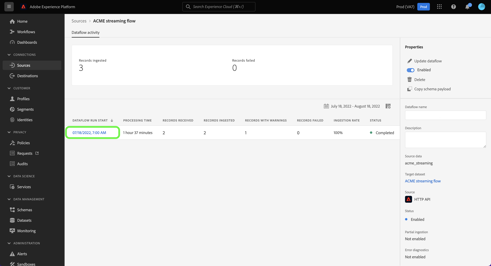

# UI에서 스트리밍 소스에 대한 데이터 흐름 모니터링

이 자습서에서는 다음을 사용하여 스트리밍 소스의 데이터 흐름을 모니터링하는 단계를 다룹니다. [!UICONTROL 소스] 작업 영역.

## 시작하기

이 자습서에서는 Adobe Experience Platform의 다음 구성 요소를 이해하고 있어야 합니다.

* [데이터 흐름](../../../dataflows/home.md): 데이터 흐름은 플랫폼 간에 데이터를 이동하는 데이터 작업을 나타냅니다. 데이터 흐름은 서로 다른 서비스에 걸쳐 구성되어 데이터를 소스 커넥터에서 대상 데이터 세트로 이동하는 데 도움이 됩니다. [!DNL Identity] 및 [!DNL Profile], 및 까지 [!DNL Destinations].
   * [데이터 흐름 실행](../../notifications.md): 데이터 흐름 실행은 선택한 데이터 흐름의 빈도 구성을 기반으로 하는 반복되는 예약된 작업입니다.
* [소스](../../home.md): Experience Platform을 사용하면 플랫폼 서비스를 사용하여 들어오는 데이터를 구조화하고, 레이블을 지정하고, 개선할 수 있는 기능을 제공하면서 다양한 소스에서 데이터를 수집할 수 있습니다.
* [샌드박스](../../../sandboxes/home.md): Experience Platform은 디지털 경험 애플리케이션을 개발하고 발전시키는 데 도움이 되는 단일 플랫폼 인스턴스를 별도의 가상 환경으로 분할하는 가상 샌드박스를 제공합니다.

## 스트리밍 소스에 대한 데이터 흐름 모니터링

Platform UI에서 를 선택합니다. **[!UICONTROL 소스]** 왼쪽 탐색 모음에서 다음 위치에 액세스: [!UICONTROL 소스] 작업 영역. 다음 [!UICONTROL 카탈로그] 화면에는 계정을 만들 수 있는 다양한 소스가 표시됩니다.

스트리밍 소스에 대한 기존 데이터 흐름을 보려면 을 선택합니다. **[!UICONTROL 데이터 흐름]** 맨 위 머리글에서

다음 [!UICONTROL 데이터 흐름] 페이지에는 소스 데이터, 계정 이름 및 데이터 흐름 실행 상태에 대한 정보를 포함하여 조직의 모든 기존 데이터 흐름 목록이 포함되어 있습니다.

보려는 데이터 흐름의 이름을 선택합니다.

다음 표에는 데이터 흐름 실행 상태에 대한 자세한 정보가 나와 있습니다.

| 상태 | 설명 |
| ------ | ----------- |
| 완료됨 | 다음 `Completed` 상태는 해당 데이터 흐름 실행에 대한 모든 레코드가 1시간 기간 내에 처리되었음을 나타냅니다. A `Completed` 상태에는 데이터 흐름 실행의 오류가 계속 포함될 수 있습니다. |
| 성공 | 다음 `Success` 상태는 해당 데이터 흐름 실행에 대한 모든 레코드가 1시간 기간 내에 처리되었고 데이터 흐름 실행 과정 중에 오류가 발생하지 않았음을 나타냅니다. |
| 처리 중 | 다음 `Processing` 상태는 데이터 흐름이 아직 활성화되지 않았음을 나타냅니다. 이 상태는 종종 새 데이터 흐름이 생성된 직후에 발생합니다. |
| 오류 | 다음 `Error` 상태는 데이터 흐름의 활성화 프로세스가 중단되었음을 나타냅니다. |
| 실행 없음 | 다음 `No runs` 상태는 데이터 흐름이 생성되었지만 시작된 데이터 흐름이 없음을 나타냅니다. |

다음 [!UICONTROL 데이터 흐름 활동] 페이지에는 스트리밍 데이터 흐름의 특정 정보가 표시됩니다. 상단 배너에는 수집된 누적 레코드 수가 포함되며 선택한 날짜 범위에서 모든 스트리밍 데이터 흐름 실행에 대해 실패한 레코드가 포함됩니다.

기본적으로 표시된 데이터에는 지난 7일의 수집 비율이 포함됩니다. 선택 **[!UICONTROL 지난 7일]** 표시되는 레코드의 시간대를 조정합니다.

대체 수집 기간에 대한 옵션을 제공하는 달력 팝업 창이 나타납니다. 이전 7일 또는 최근 30일의 흐름 실행을 표시하도록 데이터 흐름 실행 시간대를 구성할 수 있습니다. 또는 원하는 사용자 지정 시간대를 설정하도록 대화형 달력을 구성합니다. 완료되면 다음을 선택합니다. **[!UICONTROL 적용]**.

페이지 하단에는 플로우 실행당 수신, 수집 및 실패한 레코드 수에 대한 정보가 표시됩니다. 각 플로우 실행은 시간별 기간 내에 기록됩니다.

### 데이터 흐름 실행 지표 {#dataflow-run-metrics}

>[!CONTEXTUALHELP]
>id="platform_sources_dataflow_records_received"
>title="레코드 수신됨"
>abstract="기록 수신됨 지표는 데이터 흐름에서 수신된 레코드의 총 개수를 나타냅니다."
>text="Learn more in documentation"

>[!CONTEXTUALHELP]
>id="platform_sources_dataflow_records_ingested"
>title="레코드 수집됨"
>abstract="기록 수집됨 지표는 데이터 레이크에서 수집된 레코드의 총 개수를 나타냅니다."
>text="Learn more in documentation"

>[!CONTEXTUALHELP]
>id="platform_sources_dataflow_records_failed"
>title="레코드 실패"
>abstract="레코드 실패 지표는 데이터 오류로 인해 데이터 레이크에 수집되지 않은 레코드의 총 개수를 나타냅니다."
>text="Learn more in documentation"

>[!CONTEXTUALHELP]
>id="platform_sources_dataflow_records_warnings"
>title="경고가 포함된 레코드"
>abstract="경고가 포함된 레코드 지표는 매퍼 변환 경고와 함께 수집된 레코드의 총 개수를 나타냅니다. 모든 매퍼 변환 오류는 경고로 보고되고, 부분적으로 수집된 행은 경고로 완료된 것으로 간주됩니다."
>text="Learn more in documentation"

각 개별 데이터 흐름 실행에는 다음 세부 사항이 표시됩니다.

* **[!UICONTROL 데이터 흐름 실행 시작]**: 데이터 흐름 실행이 시작된 시간입니다.
* **[!UICONTROL 처리 시간]**: 데이터 흐름을 처리하는 데 걸린 시간입니다.
* **[!UICONTROL 기록 수신됨]**: 소스 커넥터에서 데이터 흐름에 받은 총 레코드 수입니다.
* **[!UICONTROL 수집된 레코드]**:에 수집된 총 레코드 수 [!DNL Data Lake].
* **[!UICONTROL 경고가 있는 레코드]**: 수집된 경고가 있는 총 레코드 수입니다. 모든 매퍼 변환 오류는 경고로 보고되고, 부분적으로 수집된 행은 레이블로 지정됩니다. `success` 경고. **참고**: 경고가 있는 레코드 수집에 대한 지원은 스트리밍 소스에서만 사용할 수 있습니다.
* **[!UICONTROL 기록 실패]**: 수집되지 않은 레코드 수 [!DNL Data Lake] 데이터의 오류로 인해
* **[!UICONTROL 수집 비율]**:에 수집된 레코드의 성공률 [!DNL Data Lake]. 이 지표는 다음과 같은 경우에 적용할 수 있습니다. [!UICONTROL 부분 수집] 이(가) 활성화되었습니다.
* **[!UICONTROL 상태]**: 데이터 흐름이 있는 상태를 나타냅니다. 다음 중 하나를 수행합니다. [!UICONTROL 완료됨] 또는 [!UICONTROL 처리 중]. [!UICONTROL 완료됨] 는 해당 데이터 흐름 실행에 대한 모든 레코드가 1시간 기간 내에 처리되었음을 의미합니다. [!UICONTROL 처리 중] 는 데이터 흐름 실행이 아직 완료되지 않았음을 의미합니다.

다음 [!UICONTROL 데이터 흐름 실행 개요] 페이지에는 해당 데이터 흐름 실행 ID, 대상 데이터 세트 및 조직 ID와 같은 데이터 흐름에 대한 추가 정보가 포함되어 있습니다.

오류가 있는 흐름 실행에는 [!UICONTROL 데이터 흐름 실행 오류] 패널 - 실행 실패를 초래한 특정 오류와 실패한 총 레코드 수를 표시합니다.

### 경고가 있는 레코드 보기 {#warnings}

[!UICONTROL 경고가 있는 레코드] 플로우를 실행하는 동안 발생한 매퍼 변형 경고 목록을 표시합니다. 부분적으로 수집된 행은 성공한 것으로 간주되며 매퍼 변환 오류가 발견되면 경고가 추가됩니다.

기본적으로 모든 매퍼 변환 오류는 경고로 간주됩니다. 단, 이러한 오류는 다음과 같은 경우입니다.

* 구문 오류
* 존재하지 않는 속성에 대한 참조
* XDM 데이터 유형 불일치

오류 진단을 보려면 **[!UICONTROL 오류 진단 미리 보기]**.

다음 [!UICONTROL 오류 진단 미리 보기] 창을 사용하면 데이터 흐름 실행과 관련하여 최대 100개의 오류 및/또는 경고를 미리 볼 수 있습니다. 또한 여기에서 자세한 내용을 보려면 수집 실패 매니페스트를 다운로드하십시오. [!DNL Data Access] API.

## 다음 단계

이 자습서에 따라 [!UICONTROL 소스] 스트리밍 데이터 흐름을 모니터링하고 데이터 흐름 실패로 이어진 오류를 식별하는 작업 영역입니다. 자세한 내용은 다음 문서를 참조하십시오.

* [소스 개요](../../home.md)
* [데이터 흐름 개요](../../../dataflows/home.md)
