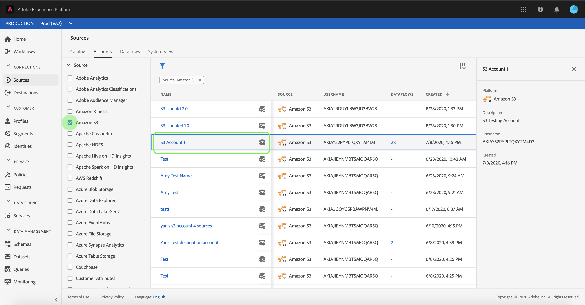

# 계정 및 데이터 세트 흐름 모니터링

Adobe Experience Platform의 소스 커넥터는 외부 소스 데이터를 일정 단위로 인제스트할 수 있는 기능을 제공합니다. 이 자습서에서는 소스 작업 영역에서 기존 계정 및 데이터 세트 흐름을 보는 단계를 *제공합니다* .

## 시작하기

이 자습서에서는 Adobe Experience Platform의 다음 구성 요소에 대해 작업해야 합니다.

- [XDM(Experience Data Model) 시스템](../../../xdm/home.md):Adobe Experience Platform을 통해 고객 경험 데이터를 구성하는 표준화된 프레임워크입니다.
   - [스키마 컴포지션의](../../../xdm/schema/composition.md)기본 사항:스키마 컴포지션의 주요 원칙 및 모범 사례 등 XDM 스키마의 기본 구성 요소에 대해 알아봅니다.
   - [스키마 편집기 자습서](../../../xdm/tutorials/create-schema-ui.md):스키마 편집기 UI를 사용하여 사용자 정의 스키마를 만드는 방법을 알아봅니다.
- [실시간 고객 프로필](../../../profile/home.md):다양한 소스의 데이터를 집계하여 통합된 실시간 고객 프로파일을 제공합니다.

## 계정 모니터링

Adobe Experience <a href="https://platform.adobe.com" target="_blank">Platform에</a> 로그인한 다음 **왼쪽 탐색** 표시줄에서 Sources를 선택하여 *Sources* 작업 영역에 액세스할 수있습니다. [ *카탈로그* ] 화면에는 계정 데이터 집합 흐름을 만들 수 있는 다양한 소스가 표시됩니다. 각 소스는 연결된 기존 계정 및 데이터 집합 흐름 수를 보여줍니다.

상단 *헤더에서* 계정을 선택하여 기존 계정을 봅니다.

계정 *페이지가* 나타납니다. 이 페이지에는 소스, 사용자 이름, 데이터 세트 흐름 수 및 작성 날짜에 대한 정보를 비롯하여 볼 수 있는 계정 목록이 있습니다.

왼쪽 상단에 있는 아이콘을 선택하여 정렬 창을 실행합니다.

정렬 패널을 사용하면 특정 소스의 계정에 액세스할 수 있습니다. 작업할 소스를 선택하고 오른쪽 목록에서 계정을 선택합니다.

계정 *페이지에서* 액세스한 계정과 연결된 기존 데이터 세트 흐름 목록을 볼 수 있습니다. 보려는 데이터 집합 흐름을 선택합니다.

데이터 *집합 흐름 활동* 화면이 나타납니다. 이 페이지에는 그래프 형식으로 사용되는 메시지 비율이 표시됩니다.

## 데이터 세트 흐름 모니터링

데이터 세트 흐름은 계정을 보지 않고도 카탈로그 *페이지에서* 직접 액세스할 수 *있습니다*. 데이터 *집합 흐름을* 선택하여 기존 데이터 집합 흐름 목록을 봅니다.

계정과 유사하게, 왼쪽 상단에 있는 정렬 아이콘을 사용하여 데이터 세트 흐름 목록을 정렬할 수 있습니다. 보려는 소스를 선택하고 오른쪽 목록에서 데이터 집합 흐름을 선택합니다.

데이터 *집합 흐름 활동* 화면이 나타납니다. 이 페이지에는 그래프 형식으로 사용되는 메시지 비율이 표시됩니다.

데이터 집합 모니터링 및 섭취에 대한 자세한 내용은 데이터 흐름 [모니터링에 대한 자습서를 참조하십시오](../../../ingestion/quality/monitor-data-flows.md).

## 다음 단계

이 튜토리얼을 따라 소스 작업 영역에서 기존 계정 및 데이터 세트 흐름에 성공적으로 *액세스했습니다* . 이제 실시간 고객 프로필 및 데이터 과학 작업 공간과 같은 다운스트림 플랫폼 서비스에서 들어오는 데이터를 사용할 수 있습니다. 자세한 내용은 다음 문서를 참조하십시오.

- [실시간 고객 프로필 개요](../../../profile/home.md)
- [데이터 과학 작업 공간 개요](../../../data-science-workspace/home.md)