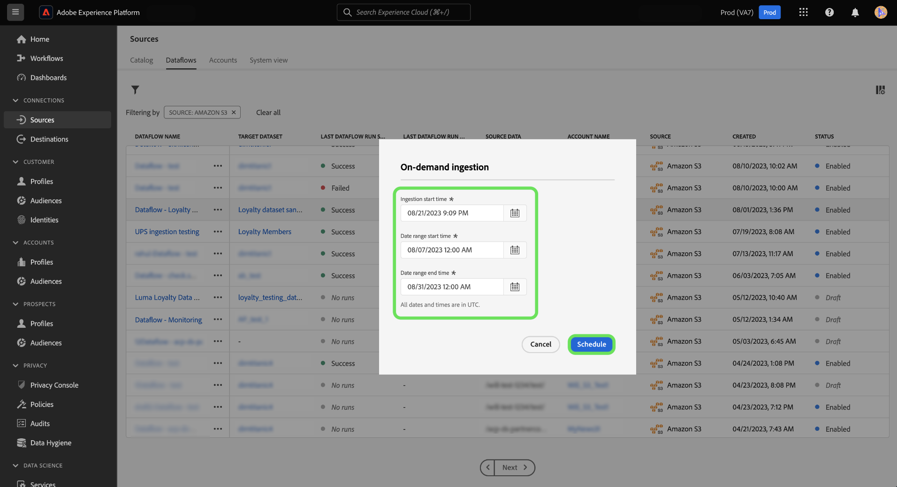

# UI의 소스 데이터 흐름에 대한 온디맨드 수집

온디맨드 수집을 사용하여 Adobe Experience Platform 사용자 인터페이스의 소스 작업 영역을 사용하여 기존 데이터 흐름의 플로우 실행 반복을 트리거할 수 있습니다.

이 문서에서는 소스의 요청에 따라 데이터 흐름을 만드는 방법과 처리되었거나 실패한 흐름 실행을 다시 시도하는 방법에 대한 단계를 제공합니다.

>[!BEGINSHADEBOX]

**흐름 실행이란 무엇입니까?**

흐름 실행은 데이터 흐름 실행의 인스턴스를 나타냅니다. 예를 들어 데이터 흐름이 시간별로 오전 9:00, 오전 10:00 및 오전 11:00에 실행되도록 예약되어 있는 경우 흐름 실행의 인스턴스가 3개 있습니다. 플로우 실행은 특정 조직에만 해당됩니다.

>[!ENDSHADEBOX]

## 시작하기

>[!NOTE]
>
>플로우 실행을 만들려면 먼저 1회 수집으로 예약된 데이터 흐름의 플로우 ID가 있어야 합니다.

이 문서를 사용하려면 Experience Platform의 다음 구성 요소에 대해 잘 알고 있어야 합니다.

* [소스](../../home.md): Experience Platform을 사용하면 Platform 서비스를 사용하여 들어오는 데이터를 구조화하고 레이블을 지정하고 개선하는 기능을 제공하는 동시에 다양한 소스에서 데이터를 수집할 수 있습니다.
* [데이터 흐름](../../../dataflows/home.md): 데이터 흐름은 플랫폼 간에 데이터를 이동하는 데이터 작업을 나타냅니다. 데이터 흐름은 여러 다른 서비스에 걸쳐 구성되어 데이터를 소스 커넥터에서 타겟 데이터 세트, ID 서비스 및 실시간 고객 프로필, 대상으로 이동하는 데 도움이 됩니다.
* [샌드박스](../../../sandboxes/home.md): Experience Platform은 단일 플랫폼 인스턴스를 별도의 가상 환경으로 분할하여 디지털 경험 애플리케이션을 개발하고 발전시키는 데 도움이 되는 가상 샌드박스를 제공합니다.

## 온디맨드 데이터 흐름 만들기 {#create-a-dataflow-on-demand}

소스 작업 영역의 *[!UICONTROL 데이터 흐름]* 탭으로 이동합니다. 여기에서 요청 시 실행할 데이터 흐름을 찾은 다음 데이터 흐름 이름 옆에 있는 줄임표(**`...`**)를 선택합니다.

그런 다음 표시되는 드롭다운 메뉴에서 **[!UICONTROL 요청 시 실행]**&#x200B;을 선택합니다.

온디맨드 수집 일정을 구성합니다. **[!UICONTROL 수집 시작 시간]**, **[!UICONTROL 날짜 범위 시작 시간]**, **[!UICONTROL 날짜 범위 종료 시간]**&#x200B;을 선택하세요.

| 구성 예약 중 | 설명 |
| --- | --- |
| [!UICONTROL 수집 시작 시간] | 온디맨드 플로우 실행이 시작될 예약된 시간입니다. |
| [!UICONTROL 날짜 범위 시작 시간] | 데이터를 검색할 가장 빠른 날짜 및 시간입니다. |
| [!UICONTROL 날짜 범위 종료 시간] | 데이터를 검색할 날짜 및 시간입니다. |

**[!UICONTROL 일정]**&#x200B;을(를) 선택하고 온디맨드 데이터 흐름이 트리거될 수 있도록 잠시 기다려 주십시오.

데이터 흐름 활동을 보려면 데이터 흐름 이름을 선택합니다. 여기에서 처리된 데이터 흐름 실행 목록을 볼 수 있습니다. 실패 또는 성공 여부에 관계없이 데이터 흐름 실행의 개별 반복을 다시 실행할 수 있습니다. 실패한 실행 반복의 경우 **[!UICONTROL 다시 시도]**&#x200B;를 사용하여 생성 프로세스 중에 발생한 오류를 진단하고 해결한 후 실행을 다시 시작할 수 있습니다.

향후 수집에 대해 예약된 데이터 흐름 실행 목록을 보려면 **[!UICONTROL 예약됨]**&#x200B;을(를) 선택하십시오.

## 다음 단계

이 문서를 읽고 기존 소스 데이터 흐름에 대한 주문형 흐름 실행을 만드는 방법을 배웠습니다. 소스에 대한 자세한 내용은 [소스 개요](../../home.md)를 참조하십시오.
