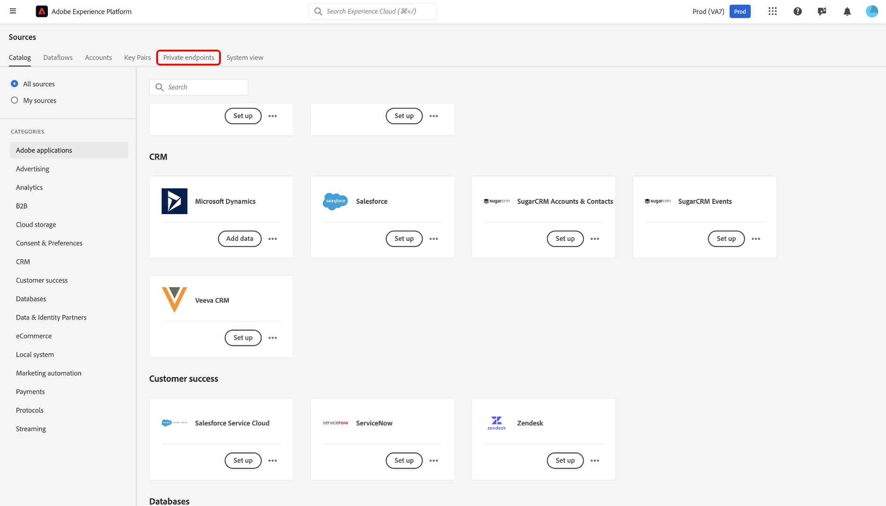

# UI의 소스에 대한 비공개 링크 지원

>[!AVAILABILITY]
>
>이 기능은 다음 소스에서 지원됩니다.
>
>* [[!DNL Azure Blob Storage]](../../connectors/cloud-storage/blob.md)
>* [[!DNL ADLS Gen2]](../../connectors/cloud-storage/adls-gen2.md)
>* [[!DNL Azure File Storage]](../../connectors/cloud-storage/azure-file-storage.md)
>
>비공개 링크 지원은 현재 Adobe Healthcare Shield 또는 Adobe Privacy &amp; Security Shield를 구입한 조직에서만 사용할 수 있습니다.

비공개 링크 기능을 사용하여 연결할 Adobe Experience Platform 소스에 대한 비공개 끝점을 만들 수 있습니다. 비공개 IP 주소를 사용하여 소스를 가상 네트워크에 안전하게 연결하여 공용 IP가 필요하지 않도록 하고 공격 표면을 줄일 수 있습니다. 데이터 트래픽이 승인된 서비스에만 도달하도록 하면서도 복잡한 방화벽 또는 네트워크 주소 변환 구성이 필요하지 않으므로 네트워크 설정을 단순화합니다.

Experience Platform UI에서 소스 작업 영역을 사용하여 개인 끝점을 만들고 사용하는 방법을 알아보려면 이 안내서를 참조하십시오.

>[!BEGINSHADEBOX]

## 개인 링크 지원에 대한 라이선스 사용 권한

소스의 비공개 링크 지원에 대한 라이선스 사용 권한 지표는 다음과 같습니다.

* 고객은 모든 샌드박스 및 조직에서 지원되는 소스([!DNL Azure Blob Storage], [!DNL ADLS Gen2] 및 [!DNL Azure File Storage])를 통해 연간 최대 2TB의 데이터를 전송할 수 있습니다.
* 각 조직은 모든 프로덕션 샌드박스에 대해 최대 10개의 끝점을 가질 수 있습니다.
* 각 조직은 모든 개발 샌드박스에 대해 최대 1개의 끝점을 가질 수 있습니다.

>[!ENDSHADEBOX]

## 비공개 엔드포인트 만들기

비공개 링크를 시작하려면 Experience Platform UI의 *[!UICONTROL 소스]* 카탈로그로 이동하고 소스 작업 영역의 탭 메뉴에서 **[!UICONTROL 비공개 끝점]**&#x200B;을 선택합니다.

인터페이스를 사용하여 ID, 관련 소스 및 현재 상태와 같은 기존 개인 엔드포인트에 대한 정보를 볼 수 있습니다. 새 개인 끝점을 만들려면 **[!UICONTROL 개인 끝점 만들기]**&#x200B;를 선택합니다.

그런 다음 원하는 소스를 선택하고 다음 속성 값을 입력합니다.

| 속성 | 설명 |
| --- | --- |
| `name` | 비공개 엔드포인트의 이름. |
| `subscriptionId` | [!DNL Azure] 구독과 연계된 ID. 자세한 내용은 [!DNL Azure]구독 및 테넌트 ID 검색[ [!DNL Azure Portal]에 대한 ](https://learn.microsoft.com/en-us/azure/azure-portal/get-subscription-tenant-id) 가이드를 참조하십시오. |
| `resourceGroupName` | [!DNL Azure]에 있는 리소스 그룹의 이름입니다. 리소스 그룹에 [!DNL Azure] 솔루션에 대한 관련 리소스가 포함되어 있습니다. 자세한 내용은 [!DNL Azure]리소스 그룹 관리[에 대한 ](https://learn.microsoft.com/en-us/azure/azure-resource-manager/management/manage-resource-groups-portal) 안내서를 참조하십시오. |
| `resourceGroup` | 리소스의 이름입니다. [!DNL Azure]에서 리소스는 가상 컴퓨터, 웹 앱 및 데이터베이스와 같은 인스턴스를 참조합니다. 자세한 내용은 [!DNL Azure]리소스 관리자 이해[에 대한  [!DNL Azure]  안내서를 참조하십시오.](https://learn.microsoft.com/en-us/azure/azure-resource-manager/management/overview) |

{style="table-layout:auto"}

완료되면 **[!UICONTROL 제출]**&#x200B;을 선택하세요.

### 비공개 엔드포인트 승인

새로 만든 끝점은 관리자가 승인할 때까지 보류 중인 상태로 유지됩니다.

[!DNL Azure Blob] 및 [!DNL Azure Data Lake Gen2] 소스에 대한 비공개 끝점 요청을 승인하려면 [!DNL Azure Portal]에 로그인합니다. 왼쪽 탐색에서 **[!DNL Data storage]**&#x200B;을(를) 선택한 다음 **[!DNL Security + networking]** 탭으로 이동하여 **[!DNL Networking]**&#x200B;을(를) 선택합니다. **[!DNL Private endpoints]**&#x200B;을(를) 선택하여 계정과 연결된 개인 끝점 목록과 현재 연결 상태를 확인합니다. 보류 중인 요청을 승인하려면 원하는 끝점을 선택하고 **[!DNL Approve]**&#x200B;을(를) 클릭합니다.

## 비공개 끝점으로 계정 만들기

소스 카탈로그로 이동하고 개인 끝점을 지원하는 소스를 선택합니다. 그런 다음 소스로 새 계정을 만들고 계정 인증 중에 **[!UICONTROL 개인 끝점]** 전환을 선택합니다. 원본의 인증 자격 증명을 제공한 다음 **[!UICONTROL 원본에 연결]**&#x200B;을 선택합니다. 연결을 설정하는 데 몇 분 정도 걸릴 수 있습니다.

>[!NOTE]
>
>[!UICONTROL 개인 끝점] 옵션을 사용하도록 설정하면 Experience Platform에서 선택한 소스에 대해 승인된 개인 끝점이 있는지 확인합니다. 승인된 끝점이 없으면 연결을 설정할 수 없습니다.

그런 다음 소스의 [!UICONTROL 기존 계정] 인터페이스로 이동합니다. 이 인터페이스를 사용하여 기존 계정 목록과 해당 상태를 볼 수 있습니다. 필터 아이콘 을 선택하여 개인 끝점에 연결할 수 있도록 설정된 계정만 표시할 수 있습니다.

사용할 계정을 선택한 다음 **[!UICONTROL 대화형 작성]**&#x200B;을 사용하도록 설정합니다. 이 토글을 사용하면 연결을 테스트하고, 폴더 목록을 찾아보고, 데이터를 미리 볼 수 있는 [!UICONTROL  기능인 ]대화형 작성[!DNL Azure]이 활성화됩니다. 개인 끝점 연결에는 [!UICONTROL 대화형 작성]을 사용하도록 설정해야 합니다. 이 토글을 수동으로 끌 수 없습니다. 60분 후에는 자동으로 비활성화됩니다.

[!UICONTROL 대화형 작성]을 사용하도록 설정하는 데 몇 분이 걸립니다. 설정이 활성화되면 **[!UICONTROL 다음]**&#x200B;을(를) 선택하여 다음 단계로 진행하고 수집할 데이터를 선택합니다.

## 다음 단계

이제 비공개 끝점을 성공적으로 만들었으므로 소스 연결 및 데이터 흐름을 만들고 비공개 끝점을 사용하여 데이터를 수집할 수 있습니다. UI에서 데이터 흐름을 만드는 방법에 대한 자세한 내용은 다음 안내서를 참조하십시오.

* [클라우드 스토리지 소스에 대한 데이터 흐름 만들기](../ui/dataflow/batch/cloud-storage.md)
* [데이터베이스 원본에 대한 데이터 흐름 만들기](../ui/dataflow/databases.md)
