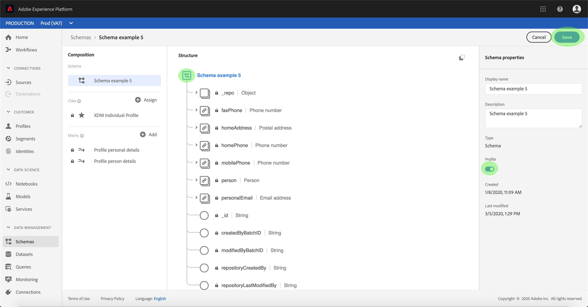

# 인바운드 소스 데이터를 활성화하여 고객 프로필 채우기

원본 커넥터의 인바운드 데이터는 [!DNL Real-Time Customer Profile] 데이터를 보강하고 채우는 데 사용할 수 있습니다.

## 시작하기

이 자습서에서는 Adobe Experience Platform의 다음 구성 요소를 이해하고 있어야 합니다.

- [[!DNL Experience Data Model (XDM)] 시스템](../../../xdm/home.md): [!DNL Experience Platform]에서 고객 경험 데이터를 구성하는 표준화된 프레임워크입니다.
   - [스키마 컴포지션의 기본 사항](../../../xdm/schema/composition.md): 스키마 컴포지션의 주요 원칙 및 모범 사례를 포함하여 XDM 스키마의 기본 구성 요소에 대해 알아봅니다.
   - [스키마 편집기 튜토리얼](../../../xdm/tutorials/create-schema-ui.md): 스키마 편집기 UI를 사용하여 사용자 지정 스키마를 만드는 방법을 알아봅니다.
- [[!DNL Real-Time Customer Profile]](../../../profile/home.md): 여러 원본의 집계된 데이터를 기반으로 통합된 실시간 소비자 프로필을 제공합니다.

또한 이 자습서에서는 이미 소스 커넥터를 만들고 구성했어야 합니다.  UI에서 다른 커넥터를 만드는 데 사용할 수 있는 튜토리얼 목록은 [소스 커넥터 개요](../../home.md)에서 찾을 수 있습니다.

## [!DNL Real-Time Customer Profile] 데이터 채우기

고객 프로필을 보강하려면 대상 데이터 세트의 소스 스키마가 [!DNL Real-Time Customer Profile]에서 사용할 수 있도록 호환되어야 합니다. 호환되는 스키마는 다음 요구 사항을 충족합니다.

- 스키마에 ID 속성으로 지정된 특성이 하나 이상 있습니다.
- 스키마에는 기본 ID로 정의된 ID 속성이 있습니다.
- 기본 ID가 대상 속성인 데이터 흐름 내의 매핑이 존재합니다.

소스 작업 영역에서 **[!UICONTROL 찾아보기]** 탭을 클릭하여 기본 연결을 나열합니다. 표시된 목록에서 프로필을 채울 데이터 흐름이 포함된 연결을 찾습니다. 연결 이름을 클릭하여 세부 정보에 액세스합니다.

연결의 **[!UICONTROL Source 활동]** 화면이 나타나고 연결에 소스 데이터를 수집하는 데이터 세트가 표시됩니다. [!DNL Profile]에 사용할 데이터 집합의 이름을 클릭합니다.

**[!UICONTROL 데이터 집합 활동]** 화면이 나타납니다. 화면 오른쪽의 **[!UICONTROL 속성]** 열에는 데이터 집합의 세부 정보가 표시되며 **[!UICONTROL 프로필]** 스위치와 데이터 집합이 준수하는 스키마에 대한 링크가 포함됩니다. 스키마 이름을 클릭하여 해당 컴포지션을 확인합니다.

**[!UICONTROL 스키마 편집기]**&#x200B;가 나타나며 중앙 캔버스에 스키마 구조를 표시합니다. 캔버스 내에서 기본 ID로 설정할 필드를 선택합니다. 표시되는 **[!UICONTROL 필드 속성]** 탭에서 **[!UICONTROL ID]** 확인란을 선택한 다음 **[!UICONTROL 기본 ID]**&#x200B;을(를) 선택합니다. 마지막으로 적절한 **[!UICONTROL ID 네임스페이스]**&#x200B;를 선택한 다음 **[!UICONTROL 적용]**&#x200B;을 클릭합니다.

스키마 구조의 최상위 개체를 클릭하면 **[!UICONTROL 스키마 속성]** 열이 나타납니다. **[!UICONTROL 프로필]** 스위치를 전환하여 [!DNL Profile]에 대한 스키마를 사용하도록 설정하십시오. **[!UICONTROL 저장]**&#x200B;을 클릭하여 변경 내용을 완료합니다.

[!DNL Profile]에 대해 스키마가 활성화되었으므로 **[!UICONTROL 데이터 집합 활동]** 화면으로 돌아가서 **[!UICONTROL 속성]** 열 내에서 **[!UICONTROL 프로필]** 토글을 클릭하여 [!DNL Profile]에 대한 데이터 집합을 활성화하십시오.

[!DNL Profile]에 대해 스키마와 데이터 세트를 모두 사용할 수 있게 되면 해당 데이터 세트에 수집된 데이터도 고객 프로필을 채웁니다.

>[!NOTE]
>
>최근에 활성화된 데이터 집합 내의 기존 데이터를 [!DNL Profile]에서 사용하지 않습니다.

## 다음 단계

이 자습서에 따라 [!DNL Profile] 모집단에 대한 인바운드 데이터를 활성화했습니다. 자세한 내용은 [[!DNL Real-Time Customer Profile] 개요](../../../profile/home.md)를 참조하세요.
