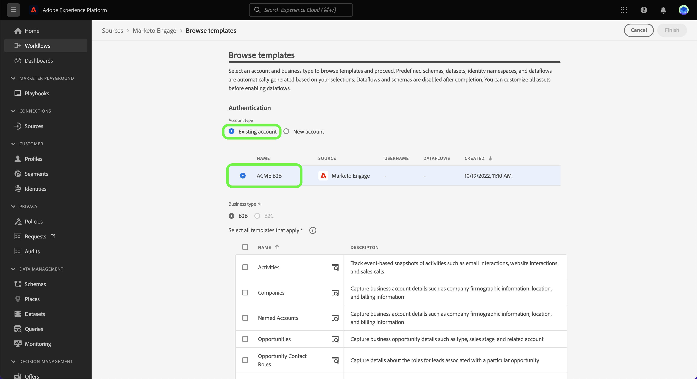

# UI에서 템플릿을 사용하여 소스 데이터 흐름 만들기 {#create-a-sources-dataflow-using-templates-in-the-ui}

>[!CONTEXTUALHELP]
>id="platform_sources_marketo_mapping"
>title="Experience Platform UI의 소스용 템플릿"
>abstract="템플릿에는 소스에서 Experience Platform으로 데이터를 가져올 때 사용할 수 있는 스키마, 데이터 세트, ID, 매핑 규칙, ID 네임스페이스 및 데이터 흐름과 같은 자동으로 생성된 자산이 포함됩니다. 사용 사례에 적합한 맞춤화를 위해 자동 생성된 자산을 업데이트할 수 있습니다."

>[!IMPORTANT]
>
>템플릿은 베타 버전이며 다음 소스에서 지원합니다.
>
>* [[!DNL Marketo Engage]](../../connectors/adobe-applications/marketo/marketo.md)
>* [[!DNL Microsoft Dynamics]](../../connectors/crm/ms-dynamics.md)
>* [[!DNL Salesforce]](../../connectors/crm/salesforce.md)
>
>설명서 및 기능은 변경될 수 있습니다.

Adobe Experience Platform은 데이터 수집 프로세스를 가속화하는 데 사용할 수 있는 사전 구성된 템플릿을 제공합니다. 템플릿에는 소스에서 Experience Platform으로 데이터를 가져올 때 사용할 수 있는 스키마, 데이터 세트, ID, 매핑 규칙, ID 네임스페이스 및 데이터 흐름과 같이 자동으로 생성된 에셋이 포함됩니다.

템플릿을 사용하여 다음과 같은 작업을 수행할 수 있습니다.

* 템플릿 기반 에셋 생성 가속화를 통해 수집 시간을 단축합니다.
* 수동 데이터 수집 프로세스 중에 발생할 수 있는 오류를 최소화합니다.
* 사용 사례에 맞게 언제든지 자동 생성된 에셋을 업데이트합니다.

다음 튜토리얼에서는 Experience Platform UI에서 템플릿을 사용하는 방법에 대한 단계를 제공합니다.

## 시작하기

이 자습서에서는 Experience Platform의 다음 구성 요소를 이해하고 있어야 합니다.

* [소스](../../home.md): Experience Platform을 사용하면 Experience Platform 서비스를 사용하여 들어오는 데이터를 구조화하고 레이블을 지정하고 향상시키는 기능을 제공하는 동시에 다양한 소스에서 데이터를 수집할 수 있습니다.
* [[!DNL Experience Data Model (XDM)] 시스템](../../../xdm/home.md): Experience Platform에서 고객 경험 데이터를 구성하는 표준화된 프레임워크입니다.
* [샌드박스](../../../sandboxes/home.md): Experience Platform은 단일 Experience Platform 인스턴스를 별도의 가상 환경으로 분할하여 디지털 경험 애플리케이션을 개발하고 발전시키는 데 도움이 되는 가상 샌드박스를 제공합니다.

## Experience Platform UI에서 템플릿 사용 {#use-templates-in-the-platform-ui}

>[!CONTEXTUALHELP]
>id="platform_sources_templates_accounttype"
>title="비즈니스 유형 선택"
>abstract="사용 사례에 적합한 비즈니스 유형을 선택합니다. 액세스 권한은 Real-Time Customer Data Platform 구독 계정에 따라 달라질 수 있습니다."
>additional-url="https://experienceleague.adobe.com/docs/experience-platform/rtcdp/intro/rtcdp-intro/overview.html#?lang=ko" text="Real-Time CDP 개요"

Experience Platform UI의 왼쪽 탐색에서 **[!UICONTROL 소스]**&#x200B;를 선택하여 [!UICONTROL 소스] 작업 영역에 액세스하고 Experience Platform에서 사용할 수 있는 소스 카탈로그를 확인합니다.

*[!UICONTROL 범주]* 메뉴를 사용하여 범주별로 원본을 필터링하세요. 또는 검색 막대에 소스 이름을 입력하여 카탈로그에서 특정 소스를 찾습니다.

[!UICONTROL Adobe 응용 프로그램] 범주로 이동하여 [!DNL Marketo Engage] 원본 카드를 확인한 다음 [!UICONTROL 데이터 추가]를 선택하여 시작합니다.

템플릿을 찾아보거나 기존 스키마 및 데이터 세트를 사용할 수 있는 옵션이 표시되는 팝업 창이 나타납니다.

* **템플릿 찾아보기**: 소스 템플릿은 매핑 규칙을 사용하여 스키마, ID, 데이터 세트 및 데이터 흐름을 자동으로 만듭니다. 필요에 따라 이러한 에셋을 사용자 정의할 수 있습니다.
* **기존 에셋 사용**: 생성한 기존 데이터 세트와 스키마를 사용하여 데이터를 수집합니다. 필요한 경우 새 데이터 세트와 스키마를 만들 수도 있습니다.

자동 생성된 에셋을 사용하려면 **[!UICONTROL 템플릿 찾아보기]**&#x200B;를 선택한 다음 **[!UICONTROL 선택]**&#x200B;을 선택하십시오.

### 인증

새 계정을 만들거나 기존 계정을 사용할 것인지 묻는 인증 단계가 나타납니다.

>[!BEGINTABS]

>[!TAB 기존 계정 사용]

기존 계정을 사용하려면 [!UICONTROL 기존 계정]을 선택한 다음 표시되는 목록에서 사용할 계정을 선택하십시오.

>[!TAB 새 계정 만들기]

새 계정을 만들려면 **[!UICONTROL 새 계정]**&#x200B;을 선택한 다음 원본 연결 세부 정보와 계정 인증 자격 증명을 제공하세요. 완료되면 **[!UICONTROL 소스에 연결]**&#x200B;을 선택하고 새 연결을 설정할 시간을 허용합니다.

>[!ENDTABS]

### 템플릿 선택

이제 계정이 인증되면 데이터 흐름에 사용할 템플릿을 선택할 수 있습니다.

+++템플릿 [!DNL Marketo Engage]개
다음 표에서는 [!DNL Marketo Engage] 소스에서 사용할 수 있는 템플릿에 대해 설명합니다.

| 템플릿 [!DNL Marketo Engage]개 | 설명 |
| --- | --- |
| 활동 | 활동 템플릿은 이메일 상호 작용, 웹 사이트 상호 작용 및 판매 호출과 같은 활동에 대한 이벤트 기반 스냅샷을 캡처합니다. |
| 회사 | 회사 템플릿은 회사 그래픽 정보, 위치 및 청구 정보 등 비즈니스 계정 세부 정보를 캡처합니다. |
| 명명된 계정 | 명명 계정 템플릿은 추적할 대상 계정으로 결정된 계정의 세부 정보를 캡처합니다. |
| 기회 | 영업 기회 템플릿은 유형, 영업 단계 및 관련 계정 등 비즈니스 영업 기회 세부 정보를 캡처합니다. |
| 영업 기회 연락처 역할 | Opportunity Contact Roles 템플릿은 특정 Opportunity 와 연관된 Lead 의 역할에 대한 세부 정보를 캡처합니다. |
| 개인 | 개인 템플릿은 인구 통계학적 세부 정보, 연락처 정보 및 동의 환경 설정 등 개별 사용자에 대한 속성을 캡처합니다. |
| 프로그램 멤버십 | 프로그램 멤버십 템플릿은 교육 케이던스 및 연락처 응답 등 비즈니스 캠페인과 연관된 연락처에 대한 세부 정보를 캡처합니다. |
| 프로그램 | 프로그램 템플릿은 상태, 채널, 타임라인 및 비용과 같은 비즈니스 캠페인 세부 사항을 캡처합니다. |
| 정적 목록 멤버십 | 정적 목록 멤버십 템플릿은 정적 목록의 사용자와 해당 멤버십 간의 관계를 캡처합니다. |
| 정적 목록 | 정적 목록 템플릿은 특정 사용 사례에 대해 인스턴스화된 사람 목록을 캡처합니다. |

{style="table-layout:auto"}

+++

+++[!DNL Salesforce]개의 B2B 템플릿
다음 표에서는 [!DNL Salesforce] 소스에서 사용할 수 있는 B2B 템플릿에 대해 간략하게 설명합니다.

| [!DNL Salesforce]개의 B2B 템플릿 | 설명 |
| --- | --- |
| 계정 연락처 관계 | 계정 연락처 관계 템플릿은 연락처와 하나 이상의 계정 간의 관계를 캡처합니다. |
| 계정 | 계정 템플릿은 회사 그래픽 정보, 위치 및 청구 정보 등 비즈니스 계정 세부 정보를 캡처합니다. |
| 캠페인 멤버 | 캠페인 구성원 템플릿은 개별 잠재 고객 또는 연락처와 특정 [!DNL Salesforce] 캠페인 간의 관계를 캡처합니다. |
| 캠페인 | 캠페인 템플릿은 회사 사진 정보, 위치 및 청구 정보 등 비즈니스 계정 세부 정보를 캡처합니다. |
| 연락처 | 연락처 템플릿은 인구 통계 세부 정보, 연락처 정보 및 관련 비즈니스 엔티티와 같은 연락처의 속성을 캡처합니다. |
| 잠재 고객 | 리드 템플릿은 인구 통계 세부 정보, 연락처 정보 및 관련 비즈니스 엔티티와 같은 리드의 속성을 캡처합니다. |
| 기회 | 영업 기회 템플릿은 유형, 영업 단계 및 관련 계정 등 비즈니스 영업 기회 세부 정보를 캡처합니다. |
| 영업 기회 연락처 역할 | Opportunity Contact Roles 템플릿은 특정 Opportunity 와 연관된 Lead 의 역할에 대한 세부 정보를 캡처합니다. |

{style="table-layout:auto"}

+++

+++[!DNL Salesforce]개의 B2C 템플릿
다음 표에서는 [!DNL Salesforce] 소스에서 사용할 수 있는 B2C 템플릿에 대해 간략하게 설명합니다.

| [!DNL Salesforce]개의 B2C 템플릿 | 설명 |
| --- | --- |
| 연락처 | 연락처 템플릿은 인구 통계 세부 정보, 연락처 정보 및 관련 비즈니스 엔티티와 같은 연락처의 속성을 캡처합니다. |
| 리드 | 잠재 고객 템플릿은 인구 통계 세부 정보, 연락처 정보 및 관련 비즈니스 엔티티와 같은 잠재 고객의 속성을 캡처합니다. |

{style="table-layout:auto"}

+++

+++[!DNL Microsoft Dynamics]개의 B2B 템플릿
다음 표에서는 [!DNL Microsoft Dynamics] 소스에서 사용할 수 있는 B2B 템플릿에 대해 간략하게 설명합니다.

| [!DNL Microsoft Dynamics]개의 B2B 템플릿 | 설명 |
| --- | --- |
| 계정 | 계정 템플릿은 회사 그래픽 정보, 위치 및 청구 정보 등 비즈니스 계정 세부 정보를 캡처합니다. |
| 캠페인 | 캠페인 템플릿은 회사 사진 정보, 위치 및 청구 정보 등 비즈니스 계정 세부 정보를 캡처합니다. |
| 연락처 | 연락처 템플릿은 인구 통계 세부 정보, 연락처 정보 및 관련 비즈니스 엔티티와 같은 연락처의 속성을 캡처합니다. |
| 잠재 고객 | 리드 템플릿은 인구 통계 세부 정보, 연락처 정보 및 관련 비즈니스 엔티티와 같은 리드의 속성을 캡처합니다. |
| 마케팅 목록 | 마케팅 목록 템플릿은 마케팅 캠페인 또는 기타 판매 목적으로 생성된 기존 또는 잠재 고객 그룹을 캡처합니다. |
| 마케팅 목록 구성원 | 마케팅 목록 멤버는 마케팅 목록에 있는 잠재 고객, 계정 또는 연락처와 같은 한 가지 유형의 고객 레코드 세부 정보를 캡처합니다. |
| 기회 | 영업 기회 템플릿은 유형, 영업 단계 및 관련 계정 등 비즈니스 영업 기회 세부 정보를 캡처합니다. |
| 영업 기회 연락처 역할 | Opportunity Contact Roles 템플릿은 특정 Opportunity 와 연관된 Lead 의 역할에 대한 세부 정보를 캡처합니다. |

{style="table-layout:auto"}

+++

+++[!DNL Microsoft Dynamics]개의 B2C 템플릿
다음 표에서는 [!DNL Microsoft Dynamics] 소스에서 사용할 수 있는 B2C 템플릿에 대해 간략하게 설명합니다.

| [!DNL Microsoft Dynamics]개의 B2C 템플릿 | 설명 |
| --- | --- |
| 연락처 | 연락처 템플릿은 인구 통계 세부 정보, 연락처 정보 및 관련 비즈니스 엔티티와 같은 연락처의 속성을 캡처합니다. |
| 리드 | 잠재 고객 템플릿은 인구 통계 세부 정보, 연락처 정보 및 관련 비즈니스 엔티티와 같은 잠재 고객의 속성을 캡처합니다. |

{style="table-layout:auto"}

+++

선택한 비즈니스 유형에 따라 템플릿 목록이 나타납니다. 템플릿의 샘플 데이터를 미리 보려면 템플릿 이름 옆에 있는 미리 보기 아이콘 을 선택하십시오.

템플릿에서 샘플 데이터를 탐색하고 검사할 수 있는 미리보기 창이 나타납니다. 완료되면 **[!UICONTROL 가져오기]**&#x200B;를 선택합니다.

그런 다음 목록에서 사용할 템플릿을 선택합니다. 여러 템플릿을 선택하고 한 번에 여러 데이터 흐름을 만들 수 있습니다. 그러나 템플릿은 계정당 한 번만 사용할 수 있습니다. 템플릿을 선택했으면 **[!UICONTROL 완료]**&#x200B;를 선택하고 자산을 생성할 수 있도록 잠시 기다립니다.

사용 가능한 템플릿 목록에서 하나 또는 일부 항목을 선택하는 경우 모든 B2B 스키마 및 ID 네임스페이스가 계속 생성되어 스키마의 B2B 관계가 올바르게 구성됩니다.

>[!NOTE]
>
>이미 사용된 템플릿은 선택 항목에서 비활성화됩니다.

### 예약 설정

[!DNL Microsoft Dynamics] 및 [!DNL Salesforce] 원본 모두 데이터 흐름 예약을 지원합니다.

예약 인터페이스를 사용하여 데이터 흐름에 대한 수집 일정을 구성합니다. 일회성 수집을 만들려면 수집 빈도를 **한 번**(으)로 설정하십시오.

또는 수집 빈도를 **분**, **시간**, **일** 또는 **주**(으)로 설정할 수 있습니다. 여러 수집에 대한 데이터 흐름을 예약하는 경우 모든 수집 사이에 시간대를 설정하려면 간격을 설정해야 합니다. 예를 들어 수집 빈도를 **시간**&#x200B;으로 설정하고 간격을 **15**(으)로 설정하면 데이터 흐름이 **15시간**&#x200B;마다 데이터를 수집하도록 예약됩니다.

이 단계에서는 **다시 채우기**&#x200B;를 사용하도록 설정하고 데이터의 증분 수집을 위한 열을 정의할 수도 있습니다. 채우기 기능은 내역 데이터를 수집하는 데 사용되며 증분 수집을 위해 정의하는 열은 새 데이터를 기존 데이터와 구별할 수 있도록 합니다.

수집 일정 구성을 완료했으면 **[!UICONTROL 완료]**&#x200B;를 선택합니다.

### 자산 검토 {#review-assets}

>[!CONTEXTUALHELP]
>id="platform_sources_templates_review"
>title="자동 생성된 자산 검토"
>abstract="모든 자산을 생성하는 데 최대 5분이 걸릴 수 있습니다. 페이지 종료를 선택하는 경우 자산이 완료되면 반환하라는 알림을 받게 됩니다. 자산이 생성되면 검토하고 언제든지 데이터 흐름에 추가 구성을 만들 수 있습니다."

[!UICONTROL 템플릿 자산 검토] 페이지에 템플릿의 일부로 자동 생성된 자산이 표시됩니다. 이 페이지에서는 소스 연결과 연관된 자동 생성된 스키마, 데이터 세트, ID 네임스페이스 및 데이터 흐름을 볼 수 있습니다. 모든 자산을 생성하는 데 최대 5분이 걸릴 수 있습니다. 페이지 종료를 선택하는 경우 자산이 완료되면 반환하라는 알림을 받게 됩니다. 자산이 생성되면 검토하고 언제든지 데이터 흐름에 추가 구성을 만들 수 있습니다.

기본적으로 자동 생성된 데이터 흐름은 매핑 규칙 또는 예약된 주파수와 같은 구성에 대한 추가 사용자 지정을 허용하도록 초안 상태로 설정됩니다. 데이터 흐름 이름 옆의 생략 부호(`...`)를 선택한 다음 **[!UICONTROL 매핑 미리 보기]**&#x200B;를 선택하여 초안 데이터 흐름에 대해 만들어진 매핑 세트를 확인합니다.

소스 데이터 필드와 대상 스키마 필드 간의 매핑 관계를 검사할 수 있는 미리보기 페이지가 나타납니다. 데이터 흐름의 매핑을 본 후 **[!UICONTROL 가져왔습니다.]** 선택

실행 후 언제든지 데이터 흐름을 업데이트할 수 있습니다. 데이터 흐름 이름 옆의 생략 부호(`...`)를 선택한 다음 **[!UICONTROL 데이터 흐름 업데이트]**&#x200B;를 선택합니다. 부분 수집, 오류 진단 및 경고 알림에 대한 설정과 데이터 흐름의 매핑을 포함하여 데이터 흐름 세부 정보를 업데이트할 수 있는 소스 워크플로우 페이지로 이동합니다.

스키마 편집기 보기를 사용하여 자동 생성된 스키마를 업데이트할 수 있습니다. 자세한 내용은 [스키마 편집기 사용](../../../xdm/tutorials/create-schema-ui.md)에 대한 안내서를 참조하십시오.

>[!TIP]
>
>소스 작업 영역의 [!UICONTROL 데이터 흐름] 카탈로그 페이지를 통해 초안 데이터 흐름에 액세스할 수 있습니다. 상단 헤더에서 **[!UICONTROL 데이터 흐름]**&#x200B;을 선택한 다음 목록에서 업데이트할 데이터 흐름을 선택하십시오.
>
>

### 데이터 흐름 게시

소스 워크플로우를 통해 게시 프로세스를 시작합니다. [!UICONTROL 데이터 흐름 업데이트]를 선택하면 워크플로의 *[!UICONTROL 데이터 추가]* 단계로 이동합니다. 계속하려면 **[!UICONTROL 다음]**&#x200B;을(를) 선택하십시오.

그런 다음 데이터 흐름 세부 정보를 확인하고 오류 진단, 부분 수집 및 경고 알림에 대한 설정을 구성합니다. 완료되면 **[!UICONTROL 다음]**&#x200B;을 선택합니다.

>[!NOTE]
>
>언제든지 **[!UICONTROL 초안으로 저장]**&#x200B;을 선택하여 데이터 흐름의 변경 사항을 중지하고 저장할 수 있습니다.

매핑 단계가 나타납니다. 이 단계에서는 데이터 흐름의 매핑 구성을 재구성할 수 있습니다. 매핑에 사용되는 데이터 준비 기능에 대한 포괄적인 안내서는 [데이터 준비 UI 안내서](../../../data-prep/ui/mapping.md)를 참조하십시오.

마지막으로 데이터 흐름의 세부 정보를 검토한 다음 **[!UICONTROL 저장 및 수집]**&#x200B;을 선택하여 초안을 게시합니다.

## 다음 단계

이제 이 자습서에 따라 템플릿을 사용하여 스키마, 데이터 세트 및 ID 네임스페이스와 같은 자산뿐만 아니라 데이터 흐름을 만들었습니다. 소스에 대한 일반적인 정보는 [소스 개요](../../home.md)를 참조하세요.

## 경고 및 알림 {#alerts-and-notifications}

템플릿은 Adobe Experience Platform 경고에서 지원되며, 알림 패널을 사용하여 에셋 상태에 대한 업데이트를 받고 검토 페이지로 다시 이동할 수 있습니다.

Experience Platform UI의 상단 헤더에 있는 알림 아이콘을 선택한 다음 상태 경고를 선택하여 검토하려는 에셋을 확인합니다.

템플릿의 경고 설정을 업데이트하여 데이터 흐름 상태에서 이메일과 Experience Platform 내 알림을 모두 수신할 수 있습니다. 경고 구성에 대한 자세한 내용은 [소스 데이터 흐름에 대한 경고를 구독하는 방법](../ui/alerts.md)에 대한 안내서를 참조하십시오.