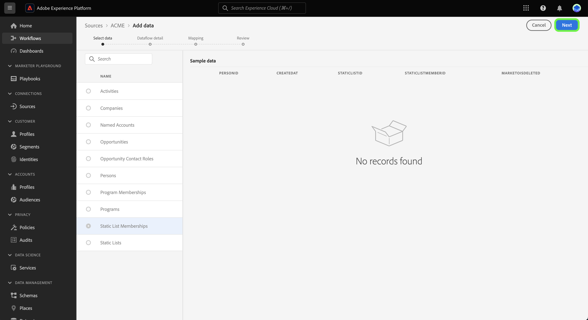

# UI에서 템플릿을 사용하여 소스 데이터 흐름 만들기 {#create-a-sources-dataflow-using-templates-in-the-ui}

>[!CONTEXTUALHELP]
>id="platform_sources_marketo_mapping"
>title="Platform UI의 소스용 템플릿"
>abstract="템플릿에는 소스에서 Experience Platform으로 데이터를 가져올 때 사용할 수 있는 스키마, 데이터 세트, ID, 매핑 규칙, ID 네임스페이스 및 데이터 흐름과 같은 자동으로 생성된 자산이 포함됩니다. 사용 사례에 적합한 맞춤화를 위해 자동 생성된 자산을 업데이트할 수 있습니다."

>[!IMPORTANT]
>
>템플릿은 베타 버전이며 다음 소스에서 지원합니다.
>
>* [[!DNL Marketo Engage]](../../connectors/adobe-applications/marketo/marketo.md)
>* [[!DNL Microsoft Dynamics]](../../connectors/crm/ms-dynamics.md)
>* [[!DNL Salesforce]](../../connectors/crm/salesforce.md)
>
>설명서 및 기능은 변경될 수 있습니다.

Adobe Experience Platform은 데이터 수집 프로세스를 가속화하는 데 사용할 수 있는 사전 구성된 템플릿을 제공합니다. 템플릿에는 소스에서 Experience Platform으로 데이터를 가져올 때 사용할 수 있는 스키마, 데이터 세트, ID, 매핑 규칙, ID 네임스페이스 및 데이터 흐름과 같은 자동으로 생성된 자산이 포함됩니다.

템플릿을 사용하여 다음과 같은 작업을 수행할 수 있습니다.

* 템플릿 기반 에셋 생성 가속화를 통해 수집 시간을 단축합니다.
* 수동 데이터 수집 프로세스 중에 발생할 수 있는 오류를 최소화합니다.
* 사용 사례에 맞게 언제든지 자동 생성된 에셋을 업데이트합니다.

다음 튜토리얼에서는 Platform UI에서 템플릿을 사용하는 방법에 대한 단계를 제공합니다.

## 시작하기

이 자습서에서는 다음 Experience Platform 구성 요소를 이해하고 있어야 합니다.

* [소스](../../home.md): Experience Platform을 사용하면 플랫폼 서비스를 사용하여 들어오는 데이터를 구조화하고, 레이블을 지정하고, 개선할 수 있는 기능을 제공하면서 다양한 소스에서 데이터를 수집할 수 있습니다.
* [[!DNL Experience Data Model (XDM)] 시스템](../../../xdm/home.md): Experience Platform이 고객 경험 데이터를 구성하는 표준화된 프레임워크입니다.
* [샌드박스](../../../sandboxes/home.md): Experience Platform은 디지털 경험 애플리케이션을 개발하고 발전시키는 데 도움이 되는 단일 플랫폼 인스턴스를 별도의 가상 환경으로 분할하는 가상 샌드박스를 제공합니다.

## 플랫폼 UI에서 템플릿 사용 {#use-templates-in-the-platform-ui}

>[!CONTEXTUALHELP]
>id="platform_sources_templates_accounttype"
>title="비즈니스 유형 선택"
>abstract="사용 사례에 적합한 비즈니스 유형을 선택합니다. 액세스 권한은 Real-Time Customer Data Platform 구독 계정에 따라 달라질 수 있습니다."
>additional-url="https://experienceleague.adobe.com/docs/experience-platform/rtcdp/overview.html" text="Real-Time CDP 개요"

Platform UI에서 를 선택합니다. **[!UICONTROL 소스]** 을(를) 왼쪽 탐색에서 [!UICONTROL 소스] workspace 를 참조하고 Experience Platform에서 사용할 수 있는 소스 카탈로그를 확인하십시오.

사용 *[!UICONTROL 카테고리]* 메뉴를 사용하여 범주를 기준으로 소스를 필터링합니다. 또는 검색 막대에 소스 이름을 입력하여 카탈로그에서 특정 소스를 찾습니다.

로 이동 [!UICONTROL Adobe 애플리케이션] 범주 보기 [!DNL Marketo Engage] 소스 카드 를 선택한 다음 를 선택합니다. [!UICONTROL 데이터 추가] 시작합니다.

템플릿을 찾아보거나 기존 스키마 및 데이터 세트를 사용할 수 있는 옵션이 표시되는 팝업 창이 나타납니다.

* **템플릿 찾아보기**: 소스 템플릿은 매핑 규칙을 사용하여 스키마, ID, 데이터 세트 및 데이터 흐름을 자동으로 생성합니다. 필요에 따라 이러한 에셋을 사용자 정의할 수 있습니다.
* **기존 에셋 사용**: 생성한 기존 데이터 세트 및 스키마를 사용하여 데이터를 수집합니다. 필요한 경우 새 데이터 세트와 스키마를 만들 수도 있습니다.

자동 생성된 에셋을 사용하려면 을 선택합니다. **[!UICONTROL 템플릿 찾아보기]** 다음을 선택합니다. **[!UICONTROL 선택]**.

### 인증

새 계정을 만들거나 기존 계정을 사용할 것인지 묻는 인증 단계가 나타납니다.

>[!BEGINTABS]

>[!TAB 기존 계정 사용]

기존 계정을 사용하려면 [!UICONTROL 기존 계정] 그런 다음 나타나는 목록에서 사용할 계정을 선택합니다.

>[!TAB 새 계정 만들기]

새 계정을 만들려면 다음을 선택합니다. **[!UICONTROL 새 계정]**&#x200B;소스 연결 세부 정보 및 계정 인증 자격 증명을 제공합니다. 완료되면 다음을 선택합니다. **[!UICONTROL 소스에 연결]** 새 연결을 설정하는 데 시간이 걸릴 수 있습니다.

>[!ENDTABS]

### 템플릿 선택

이제 계정이 인증되면 데이터 흐름에 사용할 템플릿을 선택할 수 있습니다.

+++[!DNL Marketo Engage] 템플릿 다음 표에서 사용할 수 있는 템플릿을 간략하게 설명합니다. [!DNL Marketo Engage] 소스.

| [!DNL Marketo Engage] 템플릿 | 설명 |
| --- | --- |
| 활동 | 활동 템플릿은 이메일 상호 작용, 웹 사이트 상호 작용 및 판매 호출과 같은 활동에 대한 이벤트 기반 스냅샷을 캡처합니다. |
| 회사 | 회사 템플릿은 회사 그래픽 정보, 위치 및 청구 정보 등 비즈니스 계정 세부 정보를 캡처합니다. |
| 명명된 계정 | 명명 계정 템플릿은 추적할 대상 계정으로 결정된 계정의 세부 정보를 캡처합니다. |
| 영업 기회 | 영업 기회 템플릿은 유형, 영업 단계 및 관련 계정 등 비즈니스 영업 기회 세부 정보를 캡처합니다. |
| 영업 기회 연락처 역할 | Opportunity Contact Roles 템플릿은 특정 Opportunity 와 연관된 Lead 의 역할에 대한 세부 정보를 캡처합니다. |
| 개인 | 개인 템플릿은 인구 통계학적 세부 정보, 연락처 정보 및 동의 환경 설정 등 개별 사용자에 대한 속성을 캡처합니다. |
| 프로그램 멤버십 | 프로그램 멤버십 템플릿은 교육 케이던스 및 연락처 응답 등 비즈니스 캠페인과 연관된 연락처에 대한 세부 정보를 캡처합니다. |
| 프로그램 | 프로그램 템플릿은 상태, 채널, 타임라인 및 비용과 같은 비즈니스 캠페인 세부 사항을 캡처합니다. |
| 정적 목록 멤버십 | 정적 목록 멤버십 템플릿은 정적 목록의 사용자와 해당 멤버십 간의 관계를 캡처합니다. |
| 정적 목록 | 정적 목록 템플릿은 특정 사용 사례에 대해 인스턴스화된 사람 목록을 캡처합니다. |

{style="table-layout:auto"}

+++

+++[!DNL Salesforce] B2B 템플릿 다음 표에서 사용할 수 있는 B2B 템플릿을 간략하게 설명합니다. [!DNL Salesforce] 소스.

| [!DNL Salesforce] B2B 템플릿 | 설명 |
| --- | --- |
| 계정 연락처 관계 | 계정 연락처 관계 템플릿은 연락처와 하나 이상의 계정 간의 관계를 캡처합니다. |
| 계정 | 계정 템플릿은 회사 그래픽 정보, 위치 및 청구 정보 등 비즈니스 계정 세부 정보를 캡처합니다. |
| 캠페인 멤버 | 캠페인 멤버 템플릿은 개별 리드 또는 연락처와 특정 간의 관계를 캡처합니다 [!DNL Salesforce] 캠페인. |
| 캠페인 | 캠페인 템플릿은 회사 사진 정보, 위치 및 청구 정보 등 비즈니스 계정 세부 정보를 캡처합니다. |
| 연락처 | 연락처 템플릿은 인구 통계 세부 정보, 연락처 정보 및 관련 비즈니스 엔티티와 같은 연락처의 속성을 캡처합니다. |
| 잠재 고객 | 리드 템플릿은 인구 통계 세부 정보, 연락처 정보 및 관련 비즈니스 엔티티와 같은 리드의 속성을 캡처합니다. |
| 영업 기회 | 영업 기회 템플릿은 유형, 영업 단계 및 관련 계정 등 비즈니스 영업 기회 세부 정보를 캡처합니다. |
| 영업 기회 연락처 역할 | Opportunity Contact Roles 템플릿은 특정 Opportunity 와 연관된 Lead 의 역할에 대한 세부 정보를 캡처합니다. |

{style="table-layout:auto"}

+++

+++[!DNL Salesforce] 다음 표에서 사용할 수 있는 B2C 템플릿을 간략하게 설명합니다. [!DNL Salesforce] 소스.

| [!DNL Salesforce] B2C 틀 | 설명 |
| --- | --- |
| 연락처 | 연락처 템플릿은 인구 통계 세부 정보, 연락처 정보 및 관련 비즈니스 엔티티와 같은 연락처의 속성을 캡처합니다. |
| 리드 | 잠재 고객 템플릿은 인구 통계 세부 정보, 연락처 정보 및 관련 비즈니스 엔티티와 같은 잠재 고객의 속성을 캡처합니다. |

{style="table-layout:auto"}

+++

+++[!DNL Microsoft Dynamics] B2B 템플릿 다음 표에서 사용할 수 있는 B2B 템플릿을 간략하게 설명합니다. [!DNL Microsoft Dynamics] 소스.

| [!DNL Microsoft Dynamics] B2B 템플릿 | 설명 |
| --- | --- |
| 계정 | 계정 템플릿은 회사 그래픽 정보, 위치 및 청구 정보 등 비즈니스 계정 세부 정보를 캡처합니다. |
| 캠페인 | 캠페인 템플릿은 회사 사진 정보, 위치 및 청구 정보 등 비즈니스 계정 세부 정보를 캡처합니다. |
| 연락처 | 연락처 템플릿은 인구 통계 세부 정보, 연락처 정보 및 관련 비즈니스 엔티티와 같은 연락처의 속성을 캡처합니다. |
| 잠재 고객 | 리드 템플릿은 인구 통계 세부 정보, 연락처 정보 및 관련 비즈니스 엔티티와 같은 리드의 속성을 캡처합니다. |
| 마케팅 목록 | 마케팅 목록 템플릿은 마케팅 캠페인 또는 기타 판매 목적으로 생성된 기존 또는 잠재 고객 그룹을 캡처합니다. |
| 마케팅 목록 구성원 | 마케팅 목록 멤버는 마케팅 목록에 있는 잠재 고객, 계정 또는 연락처와 같은 한 가지 유형의 고객 레코드 세부 정보를 캡처합니다. |
| 영업 기회 | 영업 기회 템플릿은 유형, 영업 단계 및 관련 계정 등 비즈니스 영업 기회 세부 정보를 캡처합니다. |
| 영업 기회 연락처 역할 | Opportunity Contact Roles 템플릿은 특정 Opportunity 와 연관된 Lead 의 역할에 대한 세부 정보를 캡처합니다. |

{style="table-layout:auto"}

+++

+++[!DNL Microsoft Dynamics] 다음 표에서 사용할 수 있는 B2C 템플릿을 간략하게 설명합니다. [!DNL Microsoft Dynamics] 소스.

| [!DNL Microsoft Dynamics] B2C 틀 | 설명 |
| --- | --- |
| 연락처 | 연락처 템플릿은 인구 통계 세부 정보, 연락처 정보 및 관련 비즈니스 엔티티와 같은 연락처의 속성을 캡처합니다. |
| 리드 | 잠재 고객 템플릿은 인구 통계 세부 정보, 연락처 정보 및 관련 비즈니스 엔티티와 같은 잠재 고객의 속성을 캡처합니다. |

{style="table-layout:auto"}

+++

선택한 비즈니스 유형에 따라 템플릿 목록이 나타납니다. 미리보기 아이콘 선택  템플릿에서 샘플 데이터를 미리 보기 위해 템플릿 이름 옆에 있어야 합니다.

템플릿에서 샘플 데이터를 탐색하고 검사할 수 있는 미리보기 창이 나타납니다. 완료되면 다음을 선택합니다. **[!UICONTROL 확인]**.

그런 다음 목록에서 사용할 템플릿을 선택합니다. 여러 템플릿을 선택하고 한 번에 여러 데이터 흐름을 만들 수 있습니다. 그러나 템플릿은 계정당 한 번만 사용할 수 있습니다. 템플릿을 선택한 다음 을(를) 선택합니다 **[!UICONTROL 완료]** 에셋이 생성될 수 있도록 잠시 기다려 주십시오.

사용 가능한 템플릿 목록에서 하나 또는 일부 항목을 선택하는 경우 모든 B2B 스키마 및 ID 네임스페이스가 계속 생성되어 스키마의 B2B 관계가 올바르게 구성됩니다.

>[!NOTE]
>
>이미 사용된 템플릿은 선택 항목에서 비활성화됩니다.

### 일정 설정

다음 [!DNL Microsoft Dynamics] 및 [!DNL Salesforce] 소스는 모두 데이터 흐름 예약을 지원합니다.

예약 인터페이스를 사용하여 데이터 흐름에 대한 수집 일정을 구성합니다. 수집 빈도 설정 **한 번** 일회성 수집을 만듭니다.

또는 수집 빈도를 다음으로 설정할 수 있습니다. **분**, **시간**, **일**, 또는 **주**. 여러 수집에 대한 데이터 흐름을 예약하는 경우 모든 수집 사이에 시간대를 설정하려면 간격을 설정해야 합니다. 예를 들어 수집 빈도를 로 설정합니다. **시간** 및 간격이 다음으로 설정됨 **15** 는 데이터 흐름이 다음 간격마다 데이터를 수집하도록 예약되어 있음을 의미합니다 **15시간**.

이 단계에서 을 활성화할 수도 있습니다 **채우기** 증분 데이터 수집을 위한 열을 정의합니다. 채우기 기능은 내역 데이터를 수집하는 데 사용되며 증분 수집을 위해 정의하는 열은 새 데이터를 기존 데이터와 구별할 수 있도록 합니다.

수집 일정 구성을 완료했으면 을 선택합니다. **[!UICONTROL 완료]**.

### 자산 검토 {#review-assets}

>[!CONTEXTUALHELP]
>id="platform_sources_templates_review"
>title="자동 생성된 자산 검토"
>abstract="모든 자산을 생성하는 데 최대 5분이 걸릴 수 있습니다. 페이지 종료를 선택하는 경우 자산이 완료되면 반환하라는 알림을 받게 됩니다. 자산이 생성되면 검토하고 언제든지 데이터 흐름에 추가 구성을 만들 수 있습니다."

다음 [!UICONTROL 템플릿 에셋 검토] 템플릿의 일부로 자동 생성된 에셋이 페이지에 표시됩니다. 이 페이지에서는 소스 연결과 연관된 자동 생성된 스키마, 데이터 세트, ID 네임스페이스 및 데이터 흐름을 볼 수 있습니다. 모든 자산을 생성하는 데 최대 5분이 걸릴 수 있습니다. 페이지 종료를 선택하는 경우 자산이 완료되면 반환하라는 알림을 받게 됩니다. 자산이 생성되면 검토하고 언제든지 데이터 흐름에 추가 구성을 만들 수 있습니다.

기본적으로 자동 생성된 데이터 흐름은 매핑 규칙 또는 예약된 주파수와 같은 구성에 대한 추가 사용자 지정을 허용하도록 초안 상태로 설정됩니다. 줄임표(`...`) 데이터 흐름 이름 옆의 를 선택한 다음 를 선택합니다. **[!UICONTROL 매핑 미리보기]** 초안 데이터 흐름에 대해 생성된 매핑 세트를 확인합니다.

소스 데이터 필드와 대상 스키마 필드 간의 매핑 관계를 검사할 수 있는 미리보기 페이지가 나타납니다. 데이터 흐름의 매핑을 본 후 선택 **[!UICONTROL 알겠습니다.]**

실행 후 언제든지 데이터 흐름을 업데이트할 수 있습니다. 줄임표(`...`) 데이터 흐름 이름 옆의 를 선택한 다음 를 선택합니다. **[!UICONTROL 데이터 흐름 업데이트]**. 부분 수집, 오류 진단 및 경고 알림에 대한 설정과 데이터 흐름의 매핑을 포함하여 데이터 흐름 세부 정보를 업데이트할 수 있는 소스 워크플로우 페이지로 이동합니다.

스키마 편집기 보기를 사용하여 자동 생성된 스키마를 업데이트할 수 있습니다. 다음 안내서를 참조하십시오. [스키마 편집기 사용](../../../xdm/tutorials/create-schema-ui.md) 추가 정보.

>[!TIP]
>
>다음을 통해 초안 데이터 흐름에 액세스할 수 있습니다. [!UICONTROL 데이터 흐름] 소스 작업 영역의 카탈로그 페이지입니다. 선택 **[!UICONTROL 데이터 흐름]** 위쪽 헤더에서 를 선택하고 목록에서 업데이트할 데이터 흐름을 선택합니다.
>
>

### 데이터 흐름 게시

소스 워크플로우를 통해 게시 프로세스를 시작합니다. 다음을 선택한 후 [!UICONTROL 데이터 흐름 업데이트], (으)로 이동합니다. *[!UICONTROL 데이터 추가]* 워크플로의 단계입니다. **[!UICONTROL 다음]**&#x200B;을 선택하여 계속하십시오.

그런 다음 데이터 흐름 세부 정보를 확인하고 오류 진단, 부분 수집 및 경고 알림에 대한 설정을 구성합니다. 완료되면 다음을 선택합니다. **[!UICONTROL 다음]**.

>[!NOTE]
>
>다음을 선택할 수 있습니다. **[!UICONTROL 초안으로 저장]** 언제든지 을 중지하고 데이터 흐름의 변경 사항을 저장할 수 있습니다.

매핑 단계가 나타납니다. 이 단계에서는 데이터 흐름의 매핑 구성을 재구성할 수 있습니다. 매핑에 사용되는 데이터 준비 기능에 대한 포괄적인 안내서는 [데이터 준비 UI 안내서](../../../data-prep/ui/mapping.md).

마지막으로 데이터 흐름의 세부 사항을 검토한 다음 을 선택합니다 **[!UICONTROL 저장 및 수집]** 초안을 게시합니다.

## 다음 단계

이제 이 자습서에 따라 템플릿을 사용하여 스키마, 데이터 세트 및 ID 네임스페이스와 같은 자산뿐만 아니라 데이터 흐름을 만들었습니다. 소스에 대한 일반적인 정보를 보려면 [소스 개요](../../home.md).

## 경고 및 알림 {#alerts-and-notifications}

템플릿은 Adobe Experience Platform 경고에서 지원되며, 알림 패널을 사용하여 에셋 상태에 대한 업데이트를 받고 검토 페이지로 다시 이동할 수 있습니다.

Platform UI의 상단 헤더에 있는 알림 아이콘을 선택한 다음 상태 경고를 선택하여 검토하려는 에셋을 확인합니다.

템플릿의 경고 설정을 업데이트하여 데이터 흐름 상태에서 이메일과 플랫폼 내 알림을 모두 수신할 수 있습니다. 경고 구성에 대한 자세한 내용은 의 안내서를 참조하십시오 [소스 데이터 흐름에 대한 경고를 구독하는 방법](../ui/alerts.md).