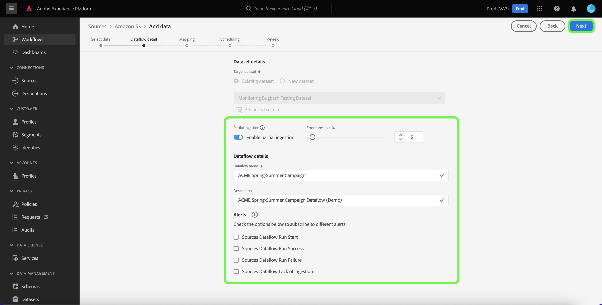
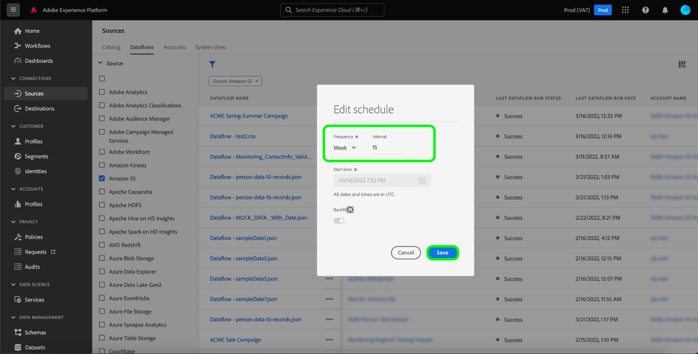

# UI에서 데이터 흐름 업데이트

이 자습서에서는 소스 작업 공간을 사용하여 해당 일정 및 매핑을 포함하여 기존 데이터 흐름을 업데이트하는 방법에 대한 단계를 제공합니다.

## 시작하기

이 자습서에서는 Adobe Experience Platform의 다음 구성 요소를 이해하고 있어야 합니다.

* [소스](../../home.md): Experience Platform을 사용하면 Platform 서비스를 사용하여 들어오는 데이터를 구조화, 레이블 지정 및 향상시키는 기능을 제공하면서 다양한 소스에서 데이터를 수집할 수 있습니다.
* [샌드박스](../../../sandboxes/home.md): Experience Platform은 디지털 경험 애플리케이션을 개발하고 발전시키는 데 도움이 되는 단일 플랫폼 인스턴스를 별도의 가상 환경으로 분할하는 가상 샌드박스를 제공합니다.

## 데이터 흐름 업데이트

플랫폼 UI에서 **[!UICONTROL 소스]** 왼쪽 탐색에서 로 이동하여 [!UICONTROL 소스] 작업 공간. 선택 **[!UICONTROL 데이터 흐름]** 기존 데이터 흐름 목록을 보려면 상단 헤더에서 클릭하십시오.

다음 [!UICONTROL 데이터 흐름] 페이지에는 해당 대상 데이터 세트, 소스 및 계정 이름에 대한 정보를 포함하여 기존 모든 데이터 흐름 목록이 포함되어 있습니다.

목록을 정렬하려면 필터 아이콘을 선택합니다  왼쪽 상단에서 정렬 패널을 사용합니다.

정렬 패널에서는 사용 가능한 모든 소스 목록을 제공합니다. 목록에서 두 개 이상의 소스를 선택하여 다른 소스에 속하는 필터링된 데이터 흐름 선택에 액세스할 수 있습니다.

작업할 소스를 선택하여 기존 데이터 흐름 목록을 확인합니다. 업데이트할 데이터 흐름을 식별했으면 줄임표( )를 선택합니다`...`)을 데이터 흐름 이름 옆에 추가합니다.

선택한 데이터 흐름을 업데이트하는 옵션을 제공하는 드롭다운 메뉴가 나타납니다. 여기에서 데이터 흐름의 매핑 세트와 수집 일정을 업데이트하도록 선택할 수 있습니다. 모니터링 대시보드에서 데이터 흐름을 검사하고, 경고에 가입하고, 데이터 흐름을 비활성화하거나 삭제할 수 있는 옵션을 선택할 수도 있습니다.

데이터 흐름 정보를 업데이트하려면 **[!UICONTROL 데이터 흐름 업데이트]**.

### 데이터 추가

다음 [!UICONTROL 데이터 추가] 단계가 나타납니다. 해당 데이터 형식을 선택하여 선택한 데이터의 내용을 검토한 다음 선택합니다 **[!UICONTROL 다음]** 계속 진행합니다.

### 데이터 흐름 세부 정보

에서 [!UICONTROL 데이터 흐름 세부 정보] 페이지에서 데이터 흐름의 업데이트된 이름 및 설명을 제공하고 데이터 흐름의 오류 임계값을 다시 구성할 수 있습니다. 이 단계 동안 경고 구독에 대한 설정을 구성하거나 수정할 수도 있습니다.

업데이트된 값을 제공한 후 **[!UICONTROL 다음]**.

### 매핑

>[!NOTE]
>
>매핑 편집 기능은 현재 다음 소스에서 지원되지 않습니다. Adobe Analytics, Adobe Audience Manager, HTTP API 및 [!DNL Marketo Engage].

다음 [!UICONTROL 매핑] 이 페이지에서는 데이터 흐름과 연결된 매핑 세트를 추가 및 제거할 수 있는 인터페이스를 제공합니다.

매핑 인터페이스에는 새 권장 매핑 세트가 아니라 데이터 흐름의 기존 매핑 세트가 표시됩니다. 매핑 업데이트는 나중에 예약된 데이터 흐름 실행에만 적용됩니다. 1회 수집하도록 예약된 데이터 흐름의 매핑 세트가 업데이트될 수 없습니다.

여기에서 매핑 인터페이스를 사용하여 데이터 플로우에 적용되는 매핑 세트를 수정할 수 있습니다. 매핑 인터페이스를 사용하는 방법에 대한 포괄적인 단계는 다음을 참조하십시오. [데이터 준비 UI 안내서](../../../data-prep/ui/mapping.md) 추가 정보.

### 예약

다음 [!UICONTROL 예약] 데이터 흐름의 수집 일정을 업데이트하고 업데이트된 매핑으로 선택한 소스 데이터를 자동으로 수집할 수 있는 단계가 나타납니다.

>[!NOTE]
>
>1회 수집하도록 예약된 데이터 흐름은 다시 예약할 수 없습니다.

데이터 흐름 페이지에 제공된 인라인 업데이트 옵션을 사용하여 데이터 흐름의 수집 일정을 업데이트할 수도 있습니다.

데이터 흐름 페이지에서 줄임표(`...`)을 데이터 흐름 이름 옆에 둔 다음 을 선택합니다 **[!UICONTROL 예약 편집]** 표시되는 드롭다운 메뉴에서 을 클릭합니다.

다음 **[!UICONTROL 예약 편집]** 대화 상자에는 데이터 흐름의 수집 빈도 및 간격 속도를 업데이트하는 옵션이 제공됩니다. 업데이트된 빈도 및 간격 값을 설정하면 **[!UICONTROL 저장]**.

### 검토

다음 **[!UICONTROL 검토]** 데이터 흐름을 업데이트하기 전에 검토할 수 있는 단계가 나타납니다.

데이터 흐름을 검토한 후 **[!UICONTROL 완료]** 새 매핑 세트를 사용하여 데이터 흐름을 만들 시간을 허용합니다.

## 다음 단계

이 자습서를 따라 다음을 성공적으로 사용했습니다. [!UICONTROL 소스] 작업 공간으로 데이터 흐름의 수집 일정 및 매핑 세트를 업데이트합니다.

를 사용하여 프로그래밍 방식으로 이러한 작업을 수행하는 방법에 대한 절차 [!DNL Flow Service] API입니다. 다음 페이지에서 자습서를 참조하십시오. [흐름 서비스 API를 사용하여 데이터 흐름 업데이트](../../tutorials/api/update-dataflows.md).
