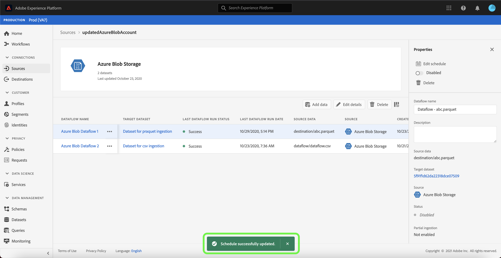

# UI에서 계정 세부 사항 업데이트

경우에 따라 기존 소스 계정의 세부 정보를 업데이트해야 할 수 있습니다. [!UICONTROL 소스] 작업 공간에서는 이름, 설명 및 자격 증명을 포함하여 기존 일괄 처리 또는 스트리밍 연결의 세부 사항을 추가, 편집 및 삭제할 수 있습니다.

또한 [!UICONTROL 소스] 작업 영역에서는 일괄 데이터 흐름 예약을 편집할 수 있으므로 통합 빈도 및 간격 속도를 업데이트할 수 있습니다.

이 자습서에서는 [!UICONTROL 소스] 작업 영역에서 기존 계정의 세부 사항 및 자격 증명을 업데이트하는 단계와 데이터 흐름 통합 일정을 업데이트하는 절차를 제공합니다.

## 시작하기

이 자습서에서는 Adobe Experience Platform의 다음 구성 요소에 대해 작업해야 합니다.

- [소스](../../home.md):DNL Experience Platform을 사용하면 플랫폼 서비스를 사용하여 들어오는 데이터를 구조화, 레이블 지정 및 향상시키는 기능을 제공하면서 다양한 소스에서 데이터를 수집할 수 있습니다.
- [샌드박스](../../../sandboxes/home.md):DNL Experience Platform은 디지털 경험 애플리케이션을 개발하고 발전시키는 데 도움이 되도록 단일 플랫폼 인스턴스를 개별 가상 환경으로 분할하는 가상 샌드박스를 제공합니다.

## 계정 업데이트

[Experience Platform UI](https://platform.adobe.com)에 로그인한 다음 왼쪽 탐색에서 **[!UICONTROL 소스]**&#x200B;를 선택하여 [!UICONTROL 소스] 작업 영역에 액세스합니다. 기존 계정을 보려면 상단 헤더에서 **[!UICONTROL 계정]**&#x200B;을 선택합니다.

**[!UICONTROL 계정]** 페이지가 나타납니다. 이 페이지에는 소스, 사용자 이름, 데이터 흐름 수 및 작성 날짜에 대한 정보를 비롯하여 볼 수 있는 계정 목록이 있습니다.

정렬 패널을 시작하려면 왼쪽 상단에 있는 필터 아이콘 를 선택합니다.

정렬 패널은 모든 소스 목록을 제공합니다. 목록에서 둘 이상의 소스를 선택하여 다른 소스와 연결된 계정의 필터링된 선택 항목을 액세스할 수 있습니다.

작업할 소스를 선택하여 기존 계정 목록을 확인합니다. 업데이트할 계정을 식별했으면 계정 이름 옆에 있는 줄임표(`...`)를 선택합니다.

**[!UICONTROL 데이터 추가]**, **[!UICONTROL 세부 사항 편집]** 및 **[!UICONTROL 삭제]**&#x200B;에 대한 옵션을 제공하는 드롭다운 메뉴가 나타납니다. 메뉴에서 **[!UICONTROL 세부 사항 편집]**&#x200B;을 선택하여 계정을 업데이트합니다.

**[!UICONTROL 계정 세부 사항 편집]** 대화 상자를 사용하면 계정의 이름, 설명 및 인증 자격 증명을 업데이트할 수 있습니다. 원하는 정보를 업데이트했으면 **[!UICONTROL 저장]**&#x200B;을 선택합니다.

잠시 후 화면 하단에 확인 상자가 표시되어 성공적인 업데이트를 확인합니다.

## 예약 편집

**[!UICONTROL 계정]** 페이지에서 데이터 흐름 통합 일정을 편집할 수 있습니다. 계정 목록에서 다시 예약하려는 데이터 흐름을 포함하는 계정을 선택합니다.

데이터 흐름 페이지가 나타납니다. 이 페이지에는 선택한 계정과 연결된 기존 데이터 흐름 목록이 포함되어 있습니다. 다시 예약할 데이터 흐름 옆에 있는 줄임표(`...`)를 선택합니다.

**[!UICONTROL 일정 편집]**, **[!UICONTROL 데이터 흐름 활성화]**, **[!UICONTROL 모니터링에서 보기]** 및 **[!UICONTROL 삭제]**&#x200B;에 대한 옵션을 제공하는 드롭다운 메뉴가 나타납니다. 메뉴에서 **[!UICONTROL 일정 편집]**&#x200B;을 선택합니다.

**[!UICONTROL 일정 편집]** 대화 상자는 데이터 흐름 통합 빈도 및 간격 속도를 업데이트하는 옵션을 제공합니다. 업데이트된 빈도 및 간격 값을 설정했으면 **[!UICONTROL 저장]**&#x200B;을 선택합니다.

| 예약 | 설명 |
| ---------- | ----------- |
| 빈도 | 데이터 흐름 데이터가 수집되는 빈도. 이미 기존 데이터 플로우에 대한 주파수 예약을 편집할 수 있는 값은 다음과 같습니다.`minute`, `hour`, `day` 또는 `week`. |
| 간격 | 간격은 두 개의 연속 흐름 실행 사이의 기간을 지정합니다. 간격의 값은 0이 아닌 정수여야 하며 `15`보다 크거나 같아야 합니다. |

잠시 후 화면 하단에 확인 상자가 표시되어 성공적인 업데이트를 확인합니다.

## 다음 단계

이 자습서를 따라 [!UICONTROL 소스] 작업 영역을 사용하여 계정 정보를 업데이트하고 데이터 흐름 일정을 편집했습니다.

[!DNL Flow Service] API를 사용하여 프로그래밍 방식으로 이러한 작업을 수행하는 방법에 대한 자세한 내용은 Flow Service API](../../tutorials/api/update.md)를 사용하여 연결 정보 업데이트 관련 자습서를 참조하십시오.[