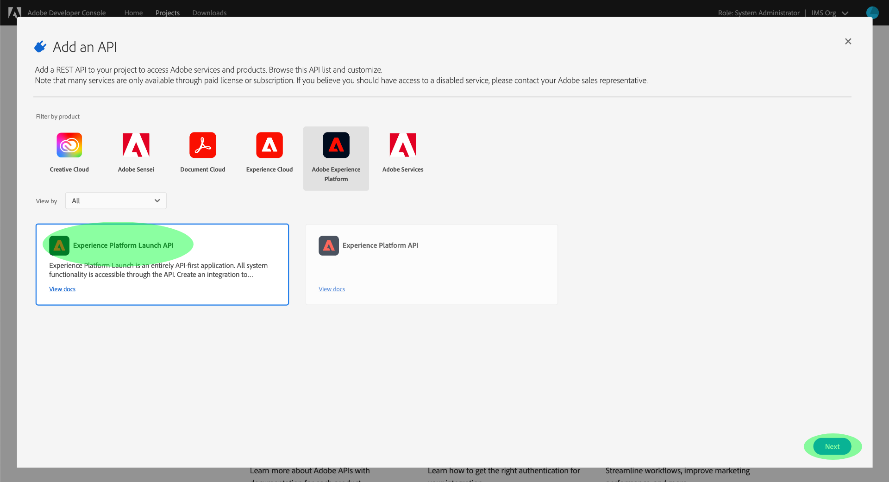

# Reactor API 시작하기

[Reactor API](https://www.adobe.io/experience-platform-apis/references/reactor/)를 사용하려면 각 요청에 다음 인증 헤더가 포함되어야 합니다.

* `Authorization: Bearer {ACCESS_TOKEN}`
* `x-api-key: {API_KEY}`
* `x-gw-ims-org-id: {IMS_ORG}`

이 안내서에서는 Reactor API를 호출할 수 있도록 Adobe 개발자 콘솔을 사용하여 이러한 각 헤더에 대한 값을 수집하는 방법을 설명합니다.

## 개발자 액세스 권한 얻기 Adobe Experience Platform

Reactor API에 대한 인증 값을 생성하려면 먼저 개발자가 Experience Platform에 액세스할 수 있어야 합니다. 개발자 액세스 권한을 얻으려면 [Experience Platform 인증 자습서](http://www.adobe.com/go/platform-api-authentication-en)의 시작 단계를 따르십시오. &quot;Adobe 개발자 콘솔에서 액세스 자격 증명 생성&quot; 단계에 도달하면 이 자습서로 돌아가 Reactor API에 대한 자격 증명을 생성합니다.

## 액세스 자격 증명 생성

Adobe 개발자 콘솔을 사용하여 다음 세 가지 액세스 자격 증명을 생성해야 합니다.

* `{IMS_ORG}`
* `{API_KEY}`
* `{ACCESS_TOKEN}`

IMS 조직의 ID(`{IMS_ORG}`) 및 API 키(`{API_KEY}`)는 처음 생성된 후에 향후 API 호출에서 다시 사용할 수 있습니다. 그러나 액세스 토큰(`{ACCESS_TOKEN}`)은 일시적이며 24시간마다 다시 생성해야 합니다.

이러한 값을 생성하는 단계는 아래에 자세히 설명되어 있습니다.

### 1회 설정

[Adobe 개발자 콘솔](https://www.adobe.com/go/devs_console_ui)로 이동하여 Adobe ID으로 로그인합니다. 다음으로, 개발자 콘솔 설명서에서 [빈 프로젝트 만들기](https://www.adobe.io/apis/experienceplatform/console/docs.html#!AdobeDocs/adobeio-console/master/projects-empty.md)에 대한 자습서에 설명된 단계를 수행합니다.

프로젝트를 만들었으면 **프로젝트 개요** 화면에서 **API** 추가 를 선택합니다.


**API 추가** 화면이 나타납니다. **다음**&#x200B;을 선택하기 전에 사용 가능한 API 목록에서 **Experience Platform 반응기 API**&#x200B;를 선택합니다.



다음 화면에서 새 키쌍을 생성하거나 자신의 공개 키를 업로드하도록 JSON 웹 토큰(JWT) 자격 증명을 만들라는 메시지가 표시됩니다. 이 자습서에서 **키 쌍 생성** 옵션을 선택한 다음 오른쪽 하단에 있는 **키 쌍 생성**&#x200B;을 선택합니다.


다음 화면에서는 키패어가 성공적으로 생성되었음을 확인하고 공개 인증서 및 개인 키가 포함된 압축 폴더를 자동으로 컴퓨터에 다운로드합니다. 이 개인 키는 액세스 토큰을 생성하려면 이후 단계에서 필요합니다.

계속하려면 **다음**&#x200B;을 선택하십시오.


다음 화면에서는 API 통합과 연결할 제품 프로필을 한 개 이상 선택하라는 메시지를 표시합니다.

>[!NOTE]
>
>제품 프로필은 Adobe Admin Console을 통해 조직에서 관리하며 세분화된 기능에 대한 특정 권한 세트를 포함합니다. 제품 프로필 및 권한은 조직 내에서 관리자 권한을 가진 사용자만 관리할 수 있습니다. API용으로 선택할 제품 프로필을 잘 모르는 경우 관리자에게 문의하십시오.

목록에서 원하는 제품 프로필을 선택한 다음 **구성된 API 저장**&#x200B;을 선택하여 API 등록을 완료합니다.


프로젝트에 API가 추가되면 프로젝트 페이지가 반응기 API Experience Platform 페이지에 다시 나타납니다. 여기서 아래로 스크롤하여 **서비스 계정(JWT)** 섹션으로 스크롤합니다. 이 섹션에서는 Reactor API를 호출하는 데 필요한 다음 액세스 자격 증명을 제공합니다.

* **클라이언트 ID**: 클라이언트 ID 는 헤더 `{API_KEY}` 에 제공해야 하는 필수  `x-api-key` 필드입니다.
* **조직 ID**: 조직 ID 는  `{IMS_ORG}` 헤더에서 사용해야 하는  `x-gw-ims-org-id` 값입니다.


### 각 세션에 대한 인증

이제 `{API_KEY}` 및 `{IMS_ORG}` 값이 있으므로 마지막 단계는 `{ACCESS_TOKEN}` 값을 생성하는 것입니다.

>[!NOTE]
>
>이러한 토큰은 24시간 후에 만료됩니다. 애플리케이션에 이 통합을 사용하는 경우 애플리케이션 내에서 프로그래밍 방식으로 베어러 토큰을 가져오는 것이 좋습니다.

사용 사례에 따라 액세스 토큰을 생성하는 두 가지 옵션이 있습니다.

* [수동으로 토큰 생성](#manual)
* [프로그래밍 방식으로 토큰 생성](#program)

#### 수동으로 액세스 토큰 생성 {#manual}

텍스트 편집기나 브라우저에서 이전에 다운로드한 개인 키를 열고 해당 콘텐츠를 복사합니다. 그런 다음 개발자 콘솔로 돌아가서 **토큰 생성**&#x200B;을 선택하기 전에 프로젝트에 대한 Reactor API 페이지의 **액세스 토큰 생성** 섹션에 개인 키를 붙여 넣습니다.


새 액세스 토큰이 생성되고 토큰을 클립보드에 복사하는 단추가 제공됩니다. 이 값은 필요한 `Authorization` 헤더에 사용되며 `Bearer {ACCESS_TOKEN}` 형식으로 제공해야 합니다.


#### 프로그래밍 방식으로 액세스 토큰 생성 {#program}

애플리케이션에 통합을 사용하는 경우 API 요청을 통해 프로그래밍 방식으로 액세스 토큰을 생성할 수 있습니다. 이를 수행하려면 다음 값을 가져와야 합니다.

* 클라이언트 ID(`{API_KEY}`)
* 클라이언트 암호(`{SECRET}`)
* JSON 웹 토큰(`{JWT}`)

클라이언트 ID와 암호는 프로젝트의 기본 페이지에서 가져올 수 있습니다(예: [이전 단계](#one-time-setup)에서 설명).


JWT 자격 증명을 가져오려면 왼쪽 탐색에서 **서비스 계정(JWT)**&#x200B;으로 이동한 다음 **JWT** 생성 탭을 선택합니다. 이 페이지의 **사용자 지정 JWT 생성**&#x200B;에서 개인 키의 내용을 제공된 텍스트 상자에 붙여 넣은 다음 **토큰 생성**&#x200B;을 선택합니다.


생성된 JWT는 처리가 끝나면, 원할 경우 토큰을 테스트하는 데 사용할 수 있는 샘플 cURL 명령과 함께 아래에 나타납니다. **복사** 단추를 사용하여 토큰을 클립보드에 복사합니다.


자격 증명을 수집하면 아래 API 호출을 애플리케이션에 통합하여 액세스 토큰을 프로그래밍 방식으로 생성할 수 있습니다.

**요청**

요청은 아래와 같이 인증 자격 증명을 제공하여 `multipart/form-data` 페이로드를 전송해야 합니다.

```shell
curl -X POST \
  https://ims-na1.adobelogin.com/ims/exchange/jwt/ \
  -H 'Content-Type: multipart/form-data' \
  -F 'client_id={API_KEY}' \
  -F 'client_secret={SECRET}' \
  -F 'jwt_token={JWT}'
```

**응답**

성공적인 응답은 새 액세스 토큰과 만료되기 전까지 남은 시간(초)을 반환합니다.

```json
{
  "token_type": "bearer",
  "access_token": "{ACCESS_TOKEN}",
  "expires_in": 86399999
}
```

| 속성 | 설명 |
| :-- | :-- |
| `access_token` | 새로 생성된 액세스 토큰 값입니다. 이 값은 필요한 `Authorization` 헤더에 사용되며 `Bearer {ACCESS_TOKEN}` 형식으로 제공해야 합니다. |
| `expires_in` | 토큰이 만료될 때까지 남은 시간(밀리초 단위)입니다. 토큰이 만료되면 새 토큰이 생성되어야 합니다. |

{style=&quot;table-layout:auto&quot;}

## 다음 단계

이 자습서의 단계에 따라 `{IMS_ORG}`, `{API_KEY}` 및 `{ACCESS_TOKEN}`에 유효한 값이 있어야 합니다. 이제 Reactor API에 대한 간단한 cURL 요청에서 이러한 값을 사용하여 테스트할 수 있습니다.

먼저 [에 API를 호출하여 모든 회사 나열](./endpoints/companies.md#list)에 참여합니다.

>[!NOTE]
>
>조직에 회사가 없을 수 있습니다. 이 경우 응답이 HTTP 상태 404(찾을 수 없음)입니다. 403(금지됨) 오류가 발생하지 않는 한 액세스 자격 증명이 유효하고 작동합니다.

액세스 자격 증명이 작동하는지 확인했으면 다른 API 참조 설명서를 계속 탐색하여 API의 다양한 기능을 학습합니다.

## 기타 리소스

JWT 라이브러리 및 SDK: [https://jwt.io/](https://jwt.io/)

Postman API 개발: [https://www.postman.com/](https://www.postman.com/)
