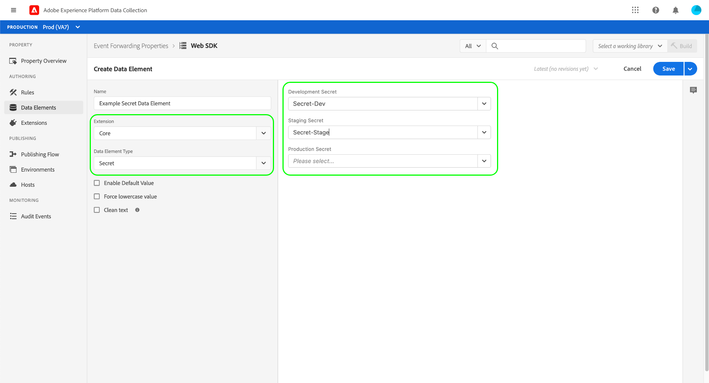

# Reactor API의 비밀

Reactor API에서 암호는 인증 자격 증명을 나타내는 리소스입니다. 보안은 안전한 데이터 교환을 위해 다른 시스템에 인증하기 위해 이벤트 전달에 사용됩니다. 따라서 암호는 이벤트 전달 속성(`platform` 특성이 `edge`(으)로 설정된 속성) 내에서만 만들 수 있습니다.

현재 `type_of` 특성에 세 가지 지원되는 암호 유형이 표시되어 있습니다.

| 암호 유형 | 설명 |
| --- | --- |
| `token` | 두 시스템에서 알려지고 이해하는 인증 토큰 값을 나타내는 단일 문자 문자열입니다. |
| `simple-http` | 사용자 이름과 암호에 대해 각각 두 개의 문자열 속성을 포함합니다. |
| `oauth2-client_credentials` | [OAuth](https://datatracker.ietf.org/doc/html/rfc6749) 인증 사양을 지원하는 몇 가지 특성이 포함되어 있습니다. 이벤트 전달에서 필요한 정보를 요청한 다음 지정된 간격에 따라 이러한 토큰의 갱신을 처리합니다. |

{style="table-layout:auto"}

이 안내서에서는 이벤트 전달에 사용할 비밀을 구성하는 방법에 대한 높은 수준의 개요를 제공합니다. 비밀 구조의 JSON 예를 포함하여 Reactor API의 비밀을 관리하는 방법에 대한 자세한 지침은 [비밀 끝점 안내서](../endpoints/secrets.md)를 참조하세요.

## 자격 증명

각 암호에는 해당 자격 증명 값을 포함하는 `credentials` 특성이 포함되어 있습니다. [API에서 암호를 만드는 중](../endpoints/secrets.md#create), 각 암호 유형에는 아래 섹션과 같이 서로 다른 필수 특성이 있습니다.

* [&#39;토큰&#39;](#token)
* [&#39;simple-http&#39;](#simple-http)
* [`oauth2-client_credentials`](#oauth2-client_credentials)
* [`oauth2-google`](#oauth2-google)

### `token` {#token}

`type_of` 값이 `token`인 암호는 `credentials` 아래에 단일 특성만 필요합니다.

| 자격 증명 속성 | 데이터 유형 | 설명 |
| --- | --- | --- |
| `token` | 문자열 | 대상 시스템에서 인식하는 비밀 토큰입니다. |

{style="table-layout:auto"}

토큰은 정적 값으로 저장되므로 암호를 만들 때 암호의 `expires_at` 및 `refresh_at` 속성이 `null`(으)로 설정됩니다.

### `simple-http` {#simple-http}

`type_of` 값이 `simple-http`인 암호에는 `credentials` 아래에 다음 특성이 필요합니다.

| 자격 증명 속성 | 데이터 유형 | 설명 |
| --- | --- | --- |
| `username` | 문자열 | 사용자 이름. |
| `password` | 문자열 | 암호. 이 값은 API 응답에 포함되지 않습니다. |

{style="table-layout:auto"}

암호가 만들어지면 두 특성이 `username:password`의 BASE64 인코딩으로 바뀝니다. 교환 후 암호의 `expires_at` 및 `refresh_at` 속성이 `null`(으)로 설정됩니다.

### `oauth2-client_credentials` {#oauth2-client_credentials}

`type_of` 값이 `oauth2-client_credentials`인 암호에는 `credentials` 아래에 다음 특성이 필요합니다.

| 자격 증명 속성 | 데이터 유형 | 설명 |
| --- | --- | --- |
| `client_id` | 문자열 | OAuth 통합을 위한 클라이언트 ID입니다. |
| `client_secret` | 문자열 | OAuth 통합을 위한 클라이언트 암호입니다. 이 값은 API 응답에 포함되지 않습니다. |
| `token_url` | 문자열 | OAuth 통합을 위한 인증 URL입니다. |
| `refresh_offset` | 정수 | *(선택 사항)* 새로 고침 작업을 오프셋할 값(초)입니다. 암호를 만들 때 이 특성을 생략하면 기본적으로 값이 `14400`(4시간)로 설정됩니다. |
| `options` | 오브젝트 | *(선택 사항)* OAuth 통합을 위한 추가 옵션을 지정합니다.<ul><li>`scope`: 자격 증명의 [OAuth 2.0 범위](https://oauth.net/2/scope/)를 나타내는 문자열입니다.</li><li>`audience`: [Auth0 액세스 토큰](https://auth0.com/docs/protocols/protocol-oauth2)을 나타내는 문자열입니다.</li></ul> |

`oauth2-client_credentials` 암호를 만들거나 업데이트할 때 OAuth 프로토콜의 클라이언트 자격 증명 흐름에 따라 `token_url`에 대한 POST 요청에서 `client_id` 및 `client_secret`(및 `options`)이 교환됩니다.

>[!NOTE]
>
>인증 서비스 응답 본문은 OAuth 프로토콜과 호환됩니다.

인증 서비스가 `200 OK` 및 JSON 응답 본문으로 응답하면 본문이 구문 분석되고 `access_token`이(가) Edge 환경으로 푸시되며 `expires_in`을(를) 사용하여 암호에 대한 `expires_at` 및 `refresh_at` 특성을 계산합니다. 암호에 환경 연결이 없으면 `access_token`이(가) 무시됩니다.

자격 증명 교환은 다음 조건에 따라 성공한 것으로 간주됩니다.

* `expires_in`이(가) `28800`보다 큽니다(8시간).
* `refresh_offset`은(는) `expires_in`에서 `14400`을(를) 뺀 값보다 작습니다(4시간). 예를 들어 `expires_in`이(가) `36000`(10시간)이고 `refresh_offset`이(가) `28800`(8시간)인 경우 `28800`이(가) `36000` - `14400`(`21600`)보다 크므로 교환이 실패한 것으로 간주됩니다.

교환이 성공하면 암호의 상태 특성이 `succeeded`(으)로 설정되고 `expires_at` 및 `refresh_at`의 값이 설정됩니다.

* `expires_at`은(는) 현재 UTC 시간과 `expires_in` 값을 더한 값입니다.
* `refresh_at`은(는) 현재 UTC 시간과 `expires_in` 값을 더한 후 `refresh_offset` 값을 뺀 값입니다. 예를 들어 `expires_in`이(가) `43200`(12시간)이고 `refresh_offset`이(가) `14400`(4시간)인 경우 `refresh_at` 속성은 현재 UTC 시간 후 `28800`(8시간)로 설정됩니다.

어떤 이유로든 교환이 실패하면 `meta` 개체의 `status_details` 특성이 관련 정보로 업데이트됩니다.

#### `oauth2-client_credentials` 암호를 새로 고치는 중

`oauth2-client_credentials` 암호가 환경에 할당되었으며 해당 상태가 `succeeded`인 경우(자격 증명이 교환됨) 새 교환이 `refresh_at`에 자동으로 수행됩니다.

교환이 성공하면 `meta` 개체의 `refresh_status` 특성이 `succeeded`(으)로 설정되지만 `expires_at`, `refresh_at` 및 `activated_at`은(는) 그에 따라 업데이트됩니다.

교환이 실패하면 액세스 토큰이 만료되기 2시간 전에 마지막 시도와 함께 작업을 세 번 더 시도합니다. 모든 시도가 실패하면 `meta` 개체의 `refresh_status_details` 특성이 관련 세부 정보로 업데이트됩니다.

### `oauth2-google` {#oauth2-google}

`type_of` 값이 `oauth2-google`인 암호에는 `credentials` 아래에 다음 특성이 필요합니다.

| 자격 증명 속성 | 데이터 유형 | 설명 |
| --- | --- | --- |
| `scopes` | 배열 | 인증을 위한 Google 제품 범위를 나열합니다. 지원되는 범위는 다음과 같습니다.<ul><li>[Google 광고](https://developers.google.com/google-ads/api/docs/oauth/overview): `https://www.googleapis.com/auth/adwords`</li><li>[Google Pub/Sub](https://cloud.google.com/pubsub/docs/reference/service_apis_overview): `https://www.googleapis.com/auth/pubsub`</li></ul> |

`oauth2-google` 암호를 만들면 응답에 `meta.authorization_url` 속성이 포함됩니다. Google 인증 플로우를 완료하려면 이 URL을 복사하여 브라우저에 붙여넣어야 합니다.

#### `oauth2-google` 암호 재인증

`oauth2-google` 암호에 대한 인증 URL은 암호를 만든 후 1시간 후에 만료됩니다(`meta.authorization_url_expires_at`(으)로 표시). 이 시간이 지나면 인증 프로세스를 갱신하려면 암호를 다시 승인해야 합니다.

Reactor API에 PATCH 요청을 하여 `oauth2-google` 암호를 재승인하는 방법에 대한 자세한 내용은 [암호 끝점 안내서](../endpoints/secrets.md#reauthorize)를 참조하십시오.

## 환경 관계

암호를 만들 때는 암호를 만들 [환경](../endpoints/environments.md)을 지정해야 합니다. 비밀은 작성된 환경에 즉시 배포됩니다.

암호는 하나의 환경에만 연결할 수 있습니다. 일단 비밀과 환경의 관계가 성립되면 환경에서 비밀을 지울 수 없고 비밀은 다른 환경과 연관될 수 없다.

>[!NOTE]
>
>이 규칙에 대한 유일한 예외는 해당 환경이 삭제되는 경우입니다. 이 경우 관계가 지워지고 비밀이 다른 환경에 할당될 수 있습니다.

암호의 자격 증명이 성공적으로 교환되면 환경에 연결할 암호에 대한 교환 아티팩트(`token`의 토큰 문자열, `simple-http`의 Base64 인코딩 문자열 또는 `oauth2-client_credentials`의 액세스 토큰)가 환경에 안전하게 저장됩니다.

Exchange 아티팩트가 환경에 성공적으로 저장되면 암호의 `activated_at` 특성이 현재 UTC 시간으로 설정되며, 이제 데이터 요소를 사용하여 참조할 수 있습니다. 암호 참조에 대한 자세한 내용은 [다음 섹션](#referencing-secrets)을 참조하세요.

## 참조 암호 {#referencing-secrets}

암호를 참조하려면 이벤트 전달 속성에 &quot;[!UICONTROL 암호]&quot; 유형([[!UICONTROL Core] 확장](../../extensions/client/core/overview.md)에서 제공)의 데이터 요소를 만들어야 합니다. 이 데이터 요소를 구성할 때 각 환경에 사용할 암호를 묻는 메시지가 표시됩니다. 그런 다음 HTTP 호출의 헤더 내와 같이 비밀 데이터 요소를 참조하는 규칙을 만들 수 있습니다.

>[!NOTE]
>
>라이브러리에 비밀 데이터 요소를 추가하려면 라이브러리를 빌드하는 환경과 연결된 `succeeded` 암호가 하나 이상 있어야 합니다. 예를 들어 라이브러리에 [!UICONTROL 스테이징 암호] 섹션에 대해 구성된 `succeeded` 암호가 없는 암호 데이터 요소가 있는 경우 스테이징 환경에서 해당 라이브러리를 빌드하려고 하면 오류가 발생합니다.

런타임 시 비밀 데이터 요소는 환경에 저장된 해당 비밀 교환 아티팩트로 대체됩니다.

## 다음 단계

이 안내서에서는 Reactor API의 비밀을 사용하여 작업하는 기본 사항에 대해 다룹니다. API 호출을 사용하여 암호를 관리하는 방법에 대한 자세한 내용은 [암호 끝점 안내서](../endpoints/secrets.md)를 참조하십시오.
