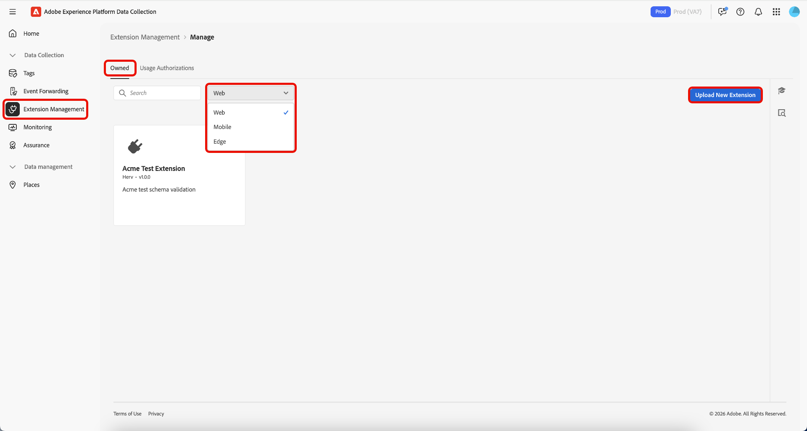

# 태그 확장 관리

Adobe Experience Platform을 사용하면 **[!UICONTROL Owned]** 확장을 관리할 수 있습니다. 새 확장을 업로드하고, 새 버전을 배포하고, 비공개 또는 공개 가용성으로 릴리스할 수 있습니다.

## 확장 관리  {#manage-extension}

로컬에서 확장 패키지를 준비한 후에는 데이터 수집 UI에서 **[!UICONTROL Extension Management]**&#x200B;을(를) 사용하여 업로드하고, 패키지의 유효성을 검사하고, **개발**, **개인** 및 **공개** 가용성을 통해 버전을 릴리스하십시오. 그런 다음 속성에 확장을 설치하고 테스트에 사용할 수 있습니다.

### 확장 업로드 {#upload-extension}

확장을 업로드하려면 데이터 수집 UI로 이동한 다음 왼쪽 탐색에서 **[!UICONTROL Extension Management]**&#x200B;을(를) 선택합니다. 여기에서 **[!UICONTROL Owned]** 탭을 선택합니다. 이 탭에는 사용자 또는 조직이 소유한 모든 확장이 표시됩니다. 플랫폼별로 구분되어 있으며 드롭다운을 사용하여 각 플랫폼(웹, 모바일 및 Edge)에서 보유하고 있는 확장을 확인할 수 있습니다. **[!UICONTROL Upload New Extension]**&#x200B;를 선택합니다.

**새 확장 업로드** 페이지에서 **[!UICONTROL Select Extension Folder]**&#x200B;을(를) 선택하고 확장이 포함된 폴더로 이동한 다음 폴더를 선택한 다음 **[!UICONTROL Upload]**&#x200B;을(를) 선택합니다.

**[!UICONTROL Upload]**&#x200B;을(를) 선택하여 업로드할 파일 수를 확인합니다.

확장명 및 버전을 포함하여 업로드할 파일 수가 표시됩니다. 검사를 위해 로컬 컴퓨터에 zip 파일을 다운로드하는 **[!UICONTROL Dry Run]**&#x200B;을(를) 수행할 수 있는 옵션이 있습니다. **[!UICONTROL Validate & Upload]**&#x200B;를 선택합니다.

![업로드할 파일 수를 표시하는 새 확장 패키지 페이지를 업로드하고 [유효성 검사 및 업로드]를 강조 표시합니다.](../images/shared-extensions/validate-upload.png)

확장이 성공적으로 업로드되고 처리되었는지 확인하는 메시지가 **확장 패키지 ID**&#x200B;와 함께 표시됩니다. 확장이 표시되는 **[!UICONTROL Close]** 탭으로 돌아가려면 **[!UICONTROL Owned]**&#x200B;을(를) 선택하십시오.

업데이트된 확장이 표시되는 [!UICONTROL Owned] 탭으로 돌아갑니다.

>[!IMPORTANT]
>
>확장이 **개발** 사용 가능 상태로 업로드됩니다. **Development** 가용성의 확장은 **Private** 가용성으로 릴리스될 때까지 공유할 수 없습니다.

### 확장 릴리스 {#release-extension}

확장을 개별적으로 사용할 수 있도록 릴리스하려면 확장을 선택하여 오른쪽에 정보 패널을 표시합니다. 여기에서 확장에 대한 다음 세부 사항을 볼 수 있습니다.

* **버전** - 최신 버전과 현재 상태를 표시합니다. 드롭다운 메뉴를 사용하여 확장의 버전 내역을 볼 수 있습니다.
* **작업** - 확장을 **[!UICONTROL Upload New Version]**&#x200B;하고 **[!UICONTROL Release To Private]**&#x200B;할 수 있습니다.
* **확장 패키지 ID** - 맨 아래에 표시됨. 선택한 버전에 따라 달라집니다.

**[!UICONTROL Release To Private]**&#x200B;을(를) 선택한 다음 **[!UICONTROL Release To Private]**&#x200B;을(를) 다시 선택하여 릴리스를 확인합니다.

확장이 **Private** 사용 가능 상태로 릴리스되면 확인이 수신됩니다. 업데이트된 가용성은 오른쪽 패널에서 볼 수 있습니다.

>[!NOTE]
>
>확장이 **개인**(으)로 릴리스되면 다른 조직과 공유할 수 있습니다.

**공개** 사용 가능 상태로 확장을 릴리스하려면 오른쪽 패널에서 **[!UICONTROL Request Public Release]**&#x200B;을(를) 선택합니다.

**[!UICONTROL Release Extension Package]** 화면에서는 세부 정보를 복사하는 옵션과 함께 요청 양식에 필요한 세부 정보를 제공합니다. **[!UICONTROL Go To Request Form]**&#x200B;를 선택합니다.

요청 양식이 포함된 새 브라우저 탭이 열립니다. **[!UICONTROL Release Extension Package]** 화면의 정보를 복사하여 관련 필드에 붙여넣습니다. 검토를 위해 완성된 양식을 제출하십시오. 확장이 공개되면 알림을 받게 됩니다.

## 다른 조직과 확장 패키지 공유 {#share-extension}

>[!NOTE]
>
>[!UICONTROL Usage Authorizations]을(를) 통해 공유하려면 확장 패키지에 비공개 또는 공개 버전이 있어야 합니다. 개발 가용성으로 표시된 버전은 공유할 수 없어 권한 부여 드롭다운에 표시되지 않습니다. 이전 버전(예: 1.0.0)이 이미 공유된 경우에도 적용됩니다. 최신 버전(예: 1.0.1)은 수신 조직에서 승인하거나 설치하기 전에 적어도 비공개로 만들어야 합니다.
>
>비공개 확장 패키지 공유에 대한 모든 지침은 나중에 이러한 패키지를 공개로 설정하도록 선택하는 경우에도 적용됩니다. 가시성, 버전 관리, 보안, 호환성, 지원 및 설명서에 대한 동일한 고려 사항은 패키지의 가용성 상태에 관계없이 계속 적용됩니다.

**[!UICONTROL Usage Authorizations]**&#x200B;은(는) 신뢰할 수 있는 파트너와 비공개 확장 패키지를 확장 카탈로그에서 공개적으로 사용하지 않고 안전하게 공유하는 데 사용할 수 있는 강력한 기능입니다. 이 기능을 사용하여 조직 간에 안전한 브리지를 만들어 서로의 사용자 지정 확장 코드를 활용하는 동시에 독점 솔루션에 대한 개인정보 보호와 제어를 유지할 수 있습니다.

조직에서는 고유한 비즈니스 요구 사항에 맞게 특화된 확장을 개발하는 경우가 많습니다. 이러한 확장에는 독점 논리, 사용자 지정 통합 또는 공개적으로 사용할 수 없는 중요한 구성이 포함될 수 있습니다. 사용 권한은 다음을 활성화하여 이 문제를 해결합니다.

* **선택적 공유**: 신뢰할 수 있는 파트너 조직과만 비공개 확장을 공유합니다.
* **개인 정보 유지**: 민감한 확장 코드를 공개 카탈로그에서 보관하지 않습니다.
* **공동 개발**: 신뢰할 수 있는 파트너가 사용자 지정 솔루션을 활용할 수 있도록 합니다.
* **액세스 제어**: 비공개 확장에 액세스하고 사용할 수 있는 사용자를 완벽하게 제어합니다.

공유 프로세스에는 다음 두 가지 주요 참여자가 포함됩니다.

1. **조직 공유**: 비공개 확장 패키지를 소유하고 공유하는 조직입니다.
2. **받는 조직**: 공유 확장에 액세스할 수 있는 신뢰할 수 있는 조직입니다.

비공개 버전이 공유되면 수신 조직은 해당 특정 버전에 액세스할 수 있으므로 두 조직 간에 직접 연결이 만들어집니다. 나중에 최신 버전을 비공개로 만들면 수신 조직에서도 해당 부분에 대한 추가 단계 없이 사용할 수 있습니다.

### 확장 패키지 사용 인증 만들기 {#package-usage-authorization}

확장을 공유하려면 데이터 수집 UI로 이동하고 왼쪽 탐색에서 **[!UICONTROL Extension Management]**&#x200B;을(를) 선택합니다. 여기에서 **[!UICONTROL Usage Authorizations]** 탭을 선택합니다.

여기에서 두 가지 범주로 구성된 기존 공유 권한 목록을 볼 수 있습니다.

* **이 조직과 공유**: 다른 조직이 사용자와 공유한 확장입니다.
* **다른 조직과 공유**: 다른 조직과 공유한 확장입니다.

**[!UICONTROL Add Authorization]**&#x200B;를 선택합니다.

![이 조직과 공유된 확장 목록을 표시하는 [!UICONTROL Usage Authorizations] 탭이며 [!UICONTROL Add Authorization]](../images/shared-extensions/add-authorization.png)을(를) 강조 표시합니다.

>[!IMPORTANT]
>
>대상 조직의 **`Organization ID`**&#x200B;을(를) 조직의 소유자로 가져와야 합니다. 이름은 조직을 검색할 수 없습니다.

드롭다운에서 확장을 승인할 **[!UICONTROL Platform]**&#x200B;을(를) 선택합니다. **[!UICONTROL Web]**, **[!UICONTROL Mobile]** 및 **[!UICONTROL Edge]** 확장을 공유할 수 있습니다.

그런 다음 드롭다운에서 사용 가능한 확장에서 공유할 **[!UICONTROL Extension]**&#x200B;을(를) 선택합니다. 목록에는 조직이 소유한 확장이 가용성 상태와 함께 표시됩니다. 최신 버전이 **개발** 가용성에 있는 확장은 이 목록에 표시되지 않습니다.

다음으로 받는 조직의 ID를 입력한 다음 **[!UICONTROL Save]**&#x200B;을(를) 선택합니다.

![선택한 확장과 Adobe 조직 ID를 표시하는 [!UICONTROL Create extension package usage authorization] 페이지가 입력되어 [!UICONTROL Save]](../images/shared-extensions/save-authorization.png)이(가) 강조 표시되었습니다.

[!UICONTROL Usage Authorizations] 목록에서 확장을 볼 수 있는 **[!UICONTROL Shared with other orgs]** 탭으로 돌아갑니다. 수신 조직에서 인증을 승인할 때까지 상태는 **승인 대기 중**&#x200B;으로 표시되며, 이 때 **승인됨**(으)로 업데이트됩니다.

![다른 조직과 공유된 확장 목록을 표시하는 [!UICONTROL Usage Authorizations] 탭에서 새 권한 부여를 강조 표시](../images/shared-extensions/new-authorization.png)

>[!TIP]
>
>확장 카드에서 메뉴(⋯)를 선택한 다음 메뉴에서 공유 옵션을 선택하여 **[!UICONTROL Extension Catalog]**&#x200B;에서 직접 확장을 공유할 수도 있습니다.

권한 부여가 활성화되면 공유 확장은 카탈로그에 다른 조직과 공유 중임을 나타내는 ***공유*** 배지를 표시합니다.

![배지가 있는 공유 확장을 표시하는 [!UICONTROL Catalog] 탭](../images/shared-extensions/sharing-badge.png)

### 공유 확장 승인 및 관리 {#manage-shared-extension}

>[!NOTE]
>
>수신 조직에서는 공유 확장만 승인하거나 거부할 수 있습니다. 인증 세부 사항은 공유 조직에서 제어하므로 관리하거나 수정할 수 없습니다.

조직의 공유 확장을 승인하려면 데이터 수집 UI로 이동하여 왼쪽 탐색에서 **[!UICONTROL Extension Management]**&#x200B;을(를) 선택한 다음 **[!UICONTROL Usage Authorizations]** 탭을 선택합니다.

**섹션에서**&#x200B;승인 대기 중&#x200B;**[!UICONTROL Shared with this org]**&#x200B;을(를) 포함한 공유 확장 목록을 볼 수 있습니다. 승인할 확장을 선택한 다음 **[!UICONTROL Approve]**&#x200B;을(를) 선택합니다.

![승인 대기 중인 확장이 선택된 상태로 이 조직과 공유된 확장 목록을 표시하는 [!UICONTROL Usage Authorizations] 탭에서 [!UICONTROL Approve]](../images/shared-extensions/approve-authorization.png)을(를) 강조 표시합니다

>[!NOTE]
>
>조직에서 공유 확장을 더 이상 필요로 하지 않는 경우 **[!UICONTROL Usage Authorizations]** 탭에서 요청을 거부할 수도 있습니다.

**[!UICONTROL OK]** 대화 상자에서 **[!UICONTROL Authorization Usages]** 선택.

![을(를) 강조 표시하는 [!UICONTROL Authorization Usages] 대화 상자 [!UICONTROL OK]](../images/shared-extensions/confirmation.png)

이제 확장을 볼 수 있는 [!UICONTROL Usage Authorizations] 탭으로 돌아가서 **승인됨** 상태를 표시합니다.

![이 조직과 공유된 확장 목록을 표시하는 [!UICONTROL Usage Authorizations] 탭에서는 확장이 승인됨 상태로 강조 표시됨](../images/shared-extensions/approved-authorization.png)

승인이 승인되면 카탈로그에서 확장을 사용할 수 있으며 다른 확장과 같이 설치하고 사용할 수 있습니다. 공유 확장에는 다른 조직에서 사용자와 공유하는 확장임을 나타내는 ***수신*** 배지가 표시됩니다.

![공유 확장을 &quot;받는 중&quot; 배지로 표시하는 [!UICONTROL Catalog] 탭](../images/shared-extensions/receiving-badge.png)

### 권한 취소 {#revoke-authorization}

소유 조직으로서 현재 상태(승인 대기 중, 거부됨 또는 승인됨)에 관계없이 언제든지 승인을 삭제할 수 있습니다.

**확장을 공개하지 않은 경우:**

* 수신 조직이 이미 설치한 비공개 버전은 설치된 확장 목록에 계속 표시됩니다.
* 수신 조직에서 확장을 설치하지 않은 경우 해당 인터페이스의 아무 위치에도 더 이상 표시되지 않습니다.

**확장을 공개하는 경우:**

* 수신 조직이 설치한 비공개 버전은 설치된 확장 목록에 계속 표시됩니다.
* 비공개 버전을 설치하지 않은 경우에도 카탈로그에 최신 공개 버전이 표시되고 설치할 수 있습니다.
* 원하는 경우 개인 버전에서 사용 가능한 최신 공개 버전으로 다운그레이드할 수도 있습니다.

인증을 취소하면 수신 조직은 기존 구현을 보호할 수 있는 특정 권한을 보유합니다.

* **계속 사용**: 액세스 권한을 취소한 후에도 받는 조직은 이미 설치된 개인 버전을 계속 사용할 수 있습니다.
* **빌드 보호**: 수신 조직에서 개인 v1.0.0을 설치하고 나중에 개인 v1.0.1을 릴리스하면 최신 버전이 표시되지 않지만 v1.0.0을 사용하여 중단 없이 빌드를 계속할 수 있습니다.
* **향후 업그레이드**: 나중에 확장을 공개하는 경우(예: v2.0.0을 공개하는 경우) 수신 조직은 개인 v1.0.0에서 새 공개 v2.0.0으로 바로 업그레이드할 수 있습니다.

>[!IMPORTANT]
>
>권한 부여를 취소해도 기존 빌드 또는 구현이 중단되지 않습니다. 수신 조직은 비즈니스 연속성을 보장하기 위해 이미 설치한 모든 비공개 버전에 대한 액세스를 유지합니다.

## 다음 단계 {#next-steps}

이 문서에서는 Experience Platform 내에서 공유 확장 기능을 사용하는 방법을 보여 줍니다. 확장 개발에 대한 자세한 내용은 [확장 개발 사용 안내서](./getting-started.md)를 참조하십시오.

Experience Platform의 확장 개발에 대한 높은 수준의 개요는 [개요 설명서](./overview.md)를 참조하십시오.
