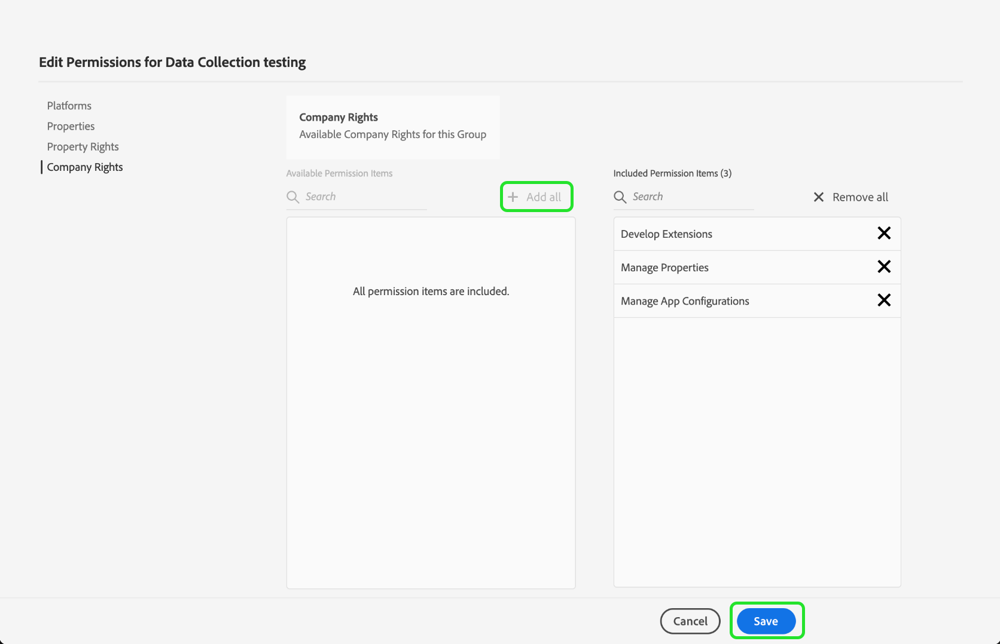

# 사용자 액세스 권한 부여

>[!NOTE]
>
>Adobe Experience Platform Launch은 Experience Platform에서 데이터 수집 기술 세트로 브랜드 재지정되었습니다. 그 결과 제품 설명서에서 몇 가지 용어 변경 사항이 롤아웃되었습니다. 용어 변경 내용을 통합 참조하려면 다음 [document](../../term-updates.md)을 참조하십시오.

extension_package를 시작하기 전에 사용자 계정 및 권한을 사용하여 팀 구성원을 설정해야 합니다.  이 작업은 [Adobe Admin Console](https://adminconsole.adobe.com/)에서 수행됩니다.

이 문서에서는 Admin Console을 통해 Adobe Experience Platform의 태그에 대한 액세스 권한을 부여하는 단계를 제공합니다.

## 전제 조건

이 안내서에서는 사용자가 Admin Console에서 지정한 조직 관리자라고 가정합니다. Admin Console 및 역할 지정에 대한 추가 정보가 필요한 경우 다음 리소스를 참조하십시오.

* [관리 사용 안내서](https://helpx.adobe.com/kr/enterprise/administering/user-guide.html?topic=/enterprise/administering/morehelp/introduction.ug.js): Admin Console의 모든 항목에 대한 정보
* [엔터프라이즈 관리 역할](https://helpx.adobe.com/kr/enterprise/using/admin-roles.html): 다양한 유형의 관리 역할에 대해 자세히 알아보십시오. 아래 가이드에서는 사용자를 조직 관리자로 가정합니다.

## 조직 선택

Adobe Experience Cloud 조직 관리자는 [Admin Console](https://adminconsole.adobe.com/)에 로그인해야 합니다. 첫 번째 화면은 개요입니다.

일부 사용자는 두 개 이상의 조직(조직)에 액세스할 수 있습니다. 올바른 조직에 태그 기능을 추가하려면 화면 오른쪽 상단에 있는 조직 이름을 선택합니다. 그런 다음 드롭다운 목록에서 태그를 사용할 조직을 선택합니다.

## 제품 프로필 만들기

제품 프로필은 그룹입니다. 개별 권한은 제품 프로필에 할당되고 프로필에 있는 모든 사용자는 이러한 권한을 상속받게 됩니다.

맨 위에 있는 **[!UICONTROL 제품]** 링크를 선택하고 왼쪽에 있는 **[!UICONTROL Experience Cloud]**&#x200B;을 선택합니다. Adobe Experience Platform Launch이 목록에 없는 경우, 고객은 계정 팀에 연락하여 <ExchangeTechEC@adobe.com>으로 이메일을 보내야 합니다.

위의 스크린샷은 예제 프로필을 보여주며 아직 프로필이 없습니다. 새 프로필을 만들려면 **[!UICONTROL 새 프로필]**&#x200B;을 선택합니다. **새 프로필 만들기** 화면에서 **프로필 이름**(데이터 수집 테스트 등)과 옵션 **설명**&#x200B;을 추가한 다음 **[!UICONTROL 저장]**&#x200B;을 선택합니다.

이제 제품 프로필이 조직에 추가되었습니다. 그런 다음 사용자를 제품 프로필에 추가합니다.

## 제품 프로필에 사용자 할당

제품 프로필에는 **권한이 있는 사용자** 및 **ADMINS**&#x200B;에 대해 0이 표시됩니다. 만든 제품 프로필의 이름을 선택합니다(이 예제에서는 데이터 수집 테스트).

**[!UICONTROL 사용자]** 탭을 선택합니다. 여기에서 이메일로 기존 Adobe ID 사용자를 검색하거나 이 제품 프로필에 새 사용자를 추가할 수 있습니다. **[!UICONTROL 사용자 추가 링크]**&#x200B;를 선택합니다.

해당 텍스트 필드에 이름, 사용자 그룹 또는 이메일 주소를 입력합니다. 가능하면 이름과 성을 포함하는 것이 좋습니다. 사용자를 추가하려면 **[!UICONTROL 저장]**&#x200B;을 선택합니다.

이 제품 프로필에 필요한 모든 사용자가 추가되면 해당 사용자에 대한 권한을 추가합니다. **[!UICONTROL 권한]** 탭을 선택합니다. 권한 화면에 **[!UICONTROL 속성]**, **[!UICONTROL 회사 권한]** 및 **[!UICONTROL 속성 권한]**&#x200B;이 표시됩니다. **[!UICONTROL 편집]**&#x200B;을 선택합니다.

확장을 개발하려면 팀에 다음 권한 중 최소 하나가 있어야 합니다.

* 회사 그룹의 &quot;속성 관리&quot;를 참조하십시오.
* 속성 그룹의 &quot;확장 관리&quot;, &quot;환경 관리&quot; 및 &quot;개발&quot;.

원할 경우 나중에 보다 제한적인 권한이 설정된 추가 제품 프로필을 만들 수 있지만, 지금은 **회사 권한** 및 **속성 권한**&#x200B;에 대해 모두&#x200B;]**추가를 선택하면 됩니다.**[!UICONTROL  각각에 대해 **[!UICONTROL 저장]**&#x200B;을 선택해야 합니다.

지금까지 적절한 조직을 선택하고 제품 프로필을 생성한 후 제품 프로필에 사용자를 추가하고 권한을 할당했습니다.

Admin Console에서 필요한 설정을 완료합니다. 사용자로 설정된 사용자 및 팀원은 이제 [데이터 수집 UI](https://launch.adobe.com/)에 로그인할 수 있습니다.

## 프로비저닝 확인

회사에서 태그에 대한 액세스 권한을 제공받고 사용자가 위에서 설명한 대로 설정되면 [데이터 수집 UI](https://launch.adobe.com/)에서 프로덕션 환경에 액세스할 수 있어야 합니다. 태그에 대한 프로비저닝이 제공되고 위의 Admin Console 단계를 완료했지만 데이터 수집 UI에 로그인할 수 없는 경우에는 Adobe 지원 담당자에게 문의하십시오.
