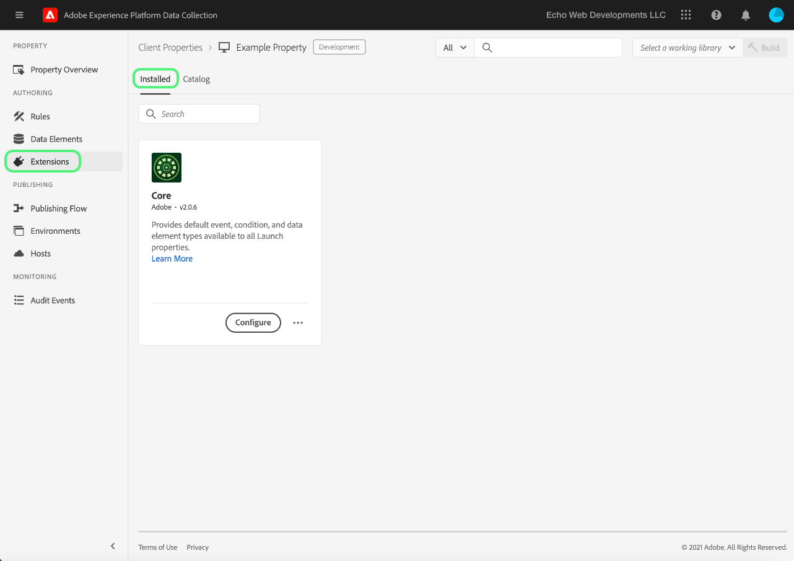
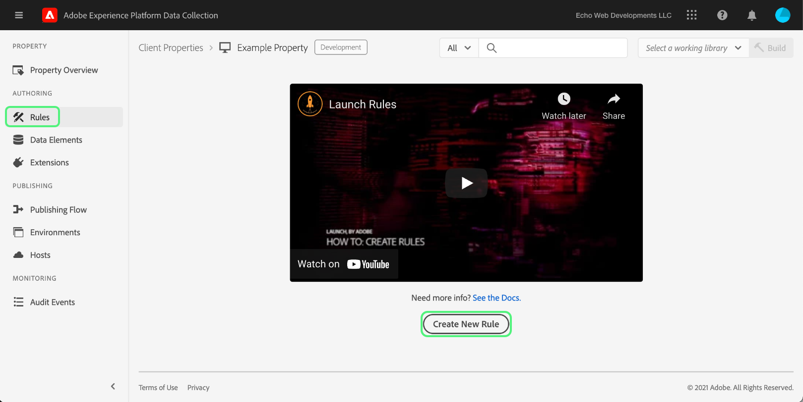
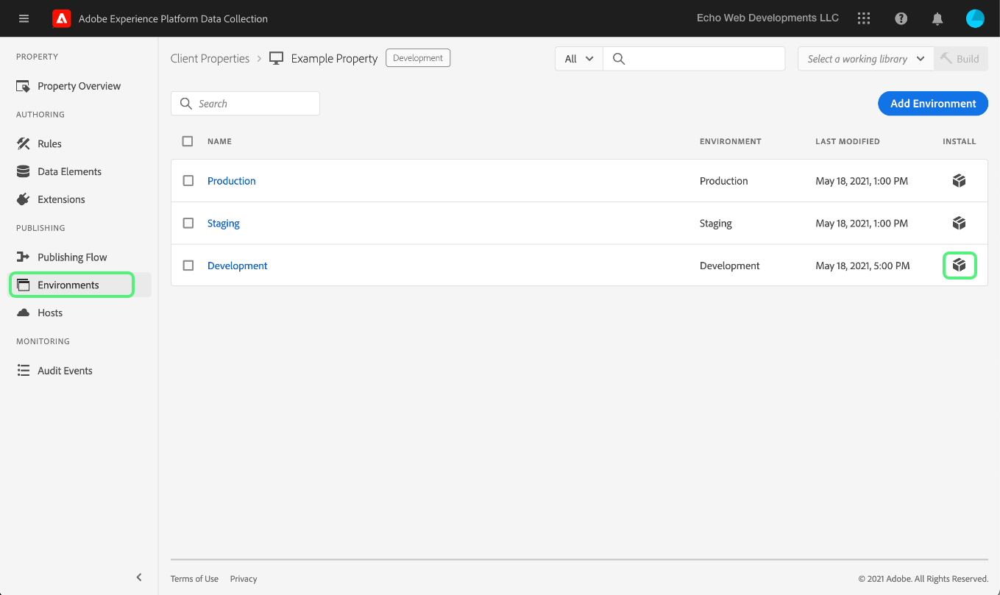

# 엔드 투 엔드 테스트 업로드 및 구현

>[!NOTE]
>
>Adobe Experience Platform Launch은 Adobe Experience Platform에서 데이터 수집 기술 세트로 브랜딩되었습니다. 그 결과로 제품 설명서 전반에서 몇 가지 용어 변경이 있었습니다. 용어 변경에 대한 통합 참고 자료는 다음 [문서](../../term-updates.md)를 참조하십시오.

Adobe Experience Platform에서 태그 확장을 테스트하려면 태그 API 및/또는 명령줄 도구를 사용하여 확장 패키지를 업로드합니다. 다음으로, 데이터 수집 UI를 사용하여 확장 패키지를 속성에 설치하고 태그 라이브러리 및 빌드에서 해당 기능을 수행합니다.

이 문서에서는 확장에 대한 엔드 투 엔드 테스트를 구현하는 방법을 설명합니다.

>[!NOTE]
>
>이 안내서에서는 사용자가 Node.js 및 npm이 설치 및 사용 가능한 MacOS을 사용하고 있다고 가정합니다.

## 확장 유효성 검사 {#validate}

확장의 성능 및 [샌드박스](https://www.npmjs.com/package/@adobe/reactor-sandbox#running-the-sandbox) 도구를 사용하여 확장 패키지를 태그에 업로드할 수 있습니다.

업로드하기 전에 필수 필드 또는 설정이 있는지 확인하십시오. 예를 들어 [확장 매니페스트](../manifest.md), [확장 구성](../configuration.md), [보기](../web/views.md), 및 [라이브러리 모듈](../web/format.md) (최소한) 좋은 방법입니다.

구체적인 예는 로고 파일로, `extension.json` 파일에 `"iconPath": "example.svg",` 줄을 추가하고 해당 로고 이미지 파일을 프로젝트에 포함합니다. 확장 프로그램에 표시될 아이콘의 상대 경로입니다. 슬래시로 시작하지 않아야 합니다. 확장자가 `.svg`인 SVG 파일을 참조해야 합니다. SVG은 정사각형을 렌더링할 때 정상적으로 표시되며 사용자 인터페이스에 따라 크기가 조정될 수 있습니다. 자세한 내용은 [SVG 문서 크기 조절 방법](https://css-tricks.com/scale-svg/) 자세한 내용

>[!NOTE]
>
>공개 확장의 경우 Exchange 목록 링크와 함께 `extension.json`에 항목을 포함하십시오. [확장 매니페스트](../manifest.md)에는 다음과 같은 항목이 포함되어야 하며, `"exchangeUrl":"https://www.adobeexchange.com/experiencecloud.details.12345.html"`은(는) Exchange 목록의 URL을 가리킵니다.

## Adobe I/O 통합 생성 {#integration}

API 또는 명령줄 도구를 사용하려면 Adobe I/O에 기술 계정이 있어야 합니다. I/O 콘솔에서 기술 계정을 생성한 다음 Uploader 툴을 사용하여 확장 패키지를 업로드해야 합니다.

Adobe Experience Platform에서 태그와 함께 사용할 기술 계정을 만드는 방법에 대한 자세한 내용은 [액세스 토큰](https://developer.adobelaunch.com/api/guides/access_tokens/) 안내서.

>[!IMPORTANT]
>
>Adobe I/O에서 통합을 생성하려면 Experience Cloud 조직 관리자 또는 Experience Cloud 조직 개발자여야 합니다.

통합을 생성할 수 없는 경우 올바른 권한이 없을 수 있습니다. 이를 위해서는 조직 관리자가 귀하를 위해 단계를 완료하거나 귀하를 개발자로 할당해야 합니다.

## 확장 패키지 업로드 {#upload}

자격 증명이 있으므로 확장 패키지를 처음부터 끝까지 테스트할 준비가 되었습니다.

처음 확장 패키지를 업로드하면 `development` 상태가 됩니다.  즉, 자체 조직에서만 볼 수 있고 확장 개발에 대해 표시된 속성만 사용할 수 있습니다.

.zip 패키지가 들어 있는 디렉토리 내에서 다음 명령을 실행하려면 명령줄을 사용합니다.

```bash
npx @adobe/reactor-uploader
```

`npx`를 사용하면 npm 패키지를 컴퓨터에 실제로 설치하지 않고도 다운로드하여 실행할 수 있습니다.  이는 Uploader를 실행하는 가장 간단한 방법입니다.

Uploader를 사용하려면 몇 가지 정보를 입력해야 합니다. 기술 계정 ID, API 키 및 기타 정보 비트는 Adobe I/O 콘솔에서 검색할 수 있습니다. I/O 콘솔의 [통합 페이지](https://console.adobe.io/integrations)로 이동합니다. 드롭다운에서 올바른 조직을 선택하고 올바른 통합을 찾은 다음 을(를) 선택합니다 **[!UICONTROL 보기]**.

- 개인 키의 경로가 무엇입니까? /path/to/private.key입니다. 이는 위 2단계에서 개인 키를 저장한 위치입니다.
- 조직 ID란 무엇입니까? 이전에 열어 둔 I/O 콘솔 개요 페이지에서 이 내용을 복사하여 붙여넣습니다.
- 기술 계정 ID란 무엇입니까? I/O 콘솔에서 복사하여 붙여넣습니다.
- API 키란 무엇입니까? I/O 콘솔에서 복사하여 붙여넣습니다.
- 클라이언트 암호란 무엇입니까? I/O 콘솔에서 복사하여 붙여넣습니다.
- 업로드할 extension_package의 경로는 무엇입니까? /path/to/extension_package.zip입니다. .zip 패키지가 들어 있는 디렉토리 내에서 업로더를 호출하는 경우 경로를 입력하는 대신 목록에서 선택하기만 하면 됩니다.

그러면 확장 패키지가 업로드되고 업로더에서 extension_package의 ID를 제공합니다.

>[!NOTE]
>
>업로드 또는 패치할 때 확장 패키지는 보류 중인 상태로 전환되고 시스템은 비동기적으로 패키지를 추출하여 배포합니다. 이 프로세스가 진행되는 동안 을(를) 폴링할 수 있습니다 `extension_package` API를 사용하고 데이터 수집 UI 내에서 해당 상태의 ID입니다. 보류 중으로 표시된 카탈로그에서 확장 카드가 표시됩니다.

>[!NOTE]
>
>업로더를 자주 실행하는 경우에는 이러한 모든 정보를 매번 입력하는 것이 번거로울 수 있습니다. 이러한 매개 변수를 명령줄에서 인수로 전달할 수도 있습니다. 자세한 내용은 NPM 문서의 [명령줄 인수 섹션](https://www.npmjs.com/package/@adobe/reactor-uploader#command-line-arguments)을 참조하십시오.

## 개발 속성 생성 {#property}

데이터 수집 UI에 로그인하면 속성 화면이 표시됩니다. 속성은 배포하려는 태그의 컨테이너이며 하나 이상의 사이트에서 사용할 수 있습니다.


처음 로그인하면 화면에 속성이 표시되지 않습니다. **새 속성**&#x200B;을 선택하여 속성 하나를 만듭니다. 이름 및 URL을 입력합니다. 테스트 사이트의 URL 또는 확장을 테스트할 페이지를 사용합니다. 이 도메인 필드는 일부 확장이나 코어 확장을 사용하는 조건으로 사용할 수 있습니다.

>[!NOTE]
>
>`localhost` 은 URL 값으로 작동하지 않습니다. 대신, `localhost` URL. 예: example.com.

확장 개발 테스트에 이 속성을 사용하려면 **고급 OPTIONS** 그리고 다음에 대한 상자를 선택해야 합니다. **확장 개발에 대한 구성**.


맨 아래에 있는 **저장**&#x200B;을 선택하여 새 속성을 저장합니다.

속성 화면이 나타납니다. 방금 생성한 속성의 이름을 선택합니다. 속성 개요 화면이 나타납니다. 시스템의 각 영역에 대한 링크를 제공하며 왼쪽 열에 전역 탐색 링크가 있습니다.

## 확장 설치 {#install-extension}

이 속성에 확장을 설치하려면 **확장** 링크를 클릭합니다. 다음 **코어** 확장이 **설치됨** 화면. 코어 확장에는 데이터 수집 내의 모든 태그 관리 기능이 포함되어 있습니다.



확장을 추가하려면 **카탈로그** 탭.


카탈로그에는 사용 가능한 각 확장에 대한 카드 아이콘이 표시됩니다. 확장이 카탈로그에 표시되지 않으면 Adobe 관리 콘솔 설정 및 확장 패키지 생성 섹션에 있는 위 단계를 완료했는지 확인하십시오. 플랫폼이 초기 처리를 완료하지 않은 경우 확장 패키지가 보류 중으로 표시될 수도 있습니다.

이전 단계를 따랐는데 카탈로그에 보류 중 또는 실패한 확장 패키지가 표시되지 않는 경우 API를 사용하여 직접 확장 패키지의 상태를 확인해야 합니다. 적절한 API 호출을 수행하는 방법에 대한 자세한 내용은 [ExtensionPackage 가져오기](https://developer.adobelaunch.com/api/reference/1.0/extension_packages/fetch/) 를 클릭합니다.

확장 패키지 처리가 끝나면 을(를) 선택합니다 **설치** 카드 하단에 있습니다.


구성 화면이 열립니다(확장자에 하나가 있음). 확장을 구성하는 데 필요한 정보를 추가하고 맨 아래의 **저장**&#x200B;을 선택합니다. 여기에 표시된 구성 화면 예제는 픽셀 ID가 필요한 Facebook 확장을 사용합니다.


이제 Core 확장의 **설치됨** 확장 화면이 표시됩니다.


## 확장을 테스트할 리소스 생성 {#resources}

확장은 Adobe Experience Platform 사용자에게 새로운 기능을 제공합니다. 이러한 매개 변수는 일반적으로 데이터 요소 또는 규칙 빌더에 표시됩니다.

### 데이터 요소

태그 데이터 요소의 목적은 사용자가 값을 유지할 수 있도록 돕는 것입니다. 각 데이터 요소는 소스 데이터에 대한 매핑 또는 포인터입니다. 단일 데이터 요소는 쿼리 문자열, URL, 쿠키 값, JavaScript 변수 등으로 매핑될 수 있는 변수입니다. 선택 **데이터 요소** 왼쪽 탐색 막대에서 **새 데이터 요소 만들기**.


확장에서는 확장을 운영하기 위해 필요한 경우 또는 간단히 사용자에게 편리한 방식으로 데이터 요소 유형을 정의할 수 있습니다. 확장에서 데이터 요소 유형을 제공하면 다음과 같은 위치의 사용자를 위한 드롭다운 목록에 표시됩니다. **데이터 요소 만들기** 화면:


사용자가 **확장** 드롭다운, **데이터 요소 유형** 드롭다운에 확장에서 제공하는 데이터 요소 유형이 채워집니다. 그런 다음 사용자는 각 데이터 요소를 소스 값에 매핑할 수 있습니다. 그런 다음 데이터 요소 변경 이벤트 또는 사용자 지정 코드 이벤트에서 규칙을 작성하여 실행할 규칙을 트리거할 때 데이터 요소를 사용할 수 있습니다. 데이터 요소는 데이터 요소 조건이나 규칙의 다른 조건, 예외 또는 작업에서 사용할 수도 있습니다.

데이터 요소가 생성되면(매핑 설정됨) 사용자는 데이터 요소를 참조하여 소스 데이터를 참조할 수 있습니다. 값의 소스가 변경된 경우(사이트 재설계 등) 사용자는 데이터 수집 UI에서 매핑을 한 번만 업데이트하면 모든 데이터 요소가 자동으로 새 소스 값을 받게 됩니다.

### 규칙

을(를) 선택합니다 **규칙** 왼쪽 탐색에 연결한 다음 **새 규칙 만들기**.



먼저 규칙을 설명하는 이름을 입력합니다. 다음 **규칙 만들기** 화면이 설정된 경우 `if-then` 문.


이벤트가 발생하고 조건이 전달되며 예외가 발생하지 않으면 작업이 트리거됩니다. 이벤트, 조건, 예외, 데이터 요소 또는 작업을 만들거나 활용할 수 있는 확장에서도 워크플로가 동일합니다.

facebook 확장 예제를 사용하여 테스트 사이트에서 페이지가 로드될 때마다 이벤트를 추가합니다.


다음 `Window Loaded` **이벤트 유형** 는 페이지가 테스트 사이트에 로드될 때마다 이 규칙이 트리거되도록 합니다. 선택 **변경 내용 유지**. 이 예제에서는 를 무시합니다 **조건** 테스트 사이트의 모든 페이지에 대해 규칙을 트리거해야 합니다.

아래 **작업** 선택 **추가**. 다음 **작업 구성** 화면이 나타납니다.다음으로 규칙이 적용될 확장을 선택해야 하며 규칙이 트리거될 때 작업이 수행됩니다. 선택 **Facebook 픽셀** 에서 **확장** 드롭다운 목록 및 **페이지 보기 보내기** 에서 **작업 유형** 드롭다운 목록. 선택 **변경 내용 유지**, 그런 다음 **저장** 다음을 참조하십시오 **규칙 편집** 화면.


확장을 테스트할 때 관련 이벤트, 조건 등을 선택합니다. 선택할 수 있습니다.

## 변경 사항 게시 {#publish}

기본 탐색에서 **게시**&#x200B;를 선택한 다음 **새 라이브러리 추가** 링크를 선택합니다.


라이브러리는 확장, 데이터 요소 및 규칙이 서로 및 웹 사이트와 상호 작용하는 방법에 대한 지침 집합입니다. 라이브러리는 빌드에 컴파일됩니다. 라이브러리에는 사용자가 편리하게 한 번에 생성 및 테스트할 수 있도록 여러 변경 사항이 포함될 수 있습니다.

설정 **라이브러리 만들기** 화면에서 이름을 **이름** 텍스트 필드. 태그는 다음과 같은 기본 개발 환경을 제공합니다. **개발**. 선택 **개발** 에서 **환경** 드롭다운 목록. 간단히 하기 위해 사용 가능한 모든 리소스를 추가합니다. 선택 **변경된 모든 리소스 추가**&#x200B;를 선택하고 을 선택합니다. **저장**.

>[!NOTE]
>
>라이브러리에 리소스를 추가하면 그 순간에 해당 리소스의 스냅샷을 가져와 라이브러리에 추가합니다. 나중에 리소스를 변경할 때(예: 필요한 수정 사항의 결과) 리소스에 대한 최신 변경 사항을 포함하도록 라이브러리를 업데이트해야 합니다. **변경된 모든 리소스** 추가 버튼은 이러한 경우에도 유용합니다.


이제 모든 변경 사항이 새로 만든 라이브러리(이름이 지정됨)에 포함되었습니다 **개발** 제공된 예에서 **저장 및 개발에 빌드**.


빌드 프로세스가 완료되면 녹색이 표시됩니다 **성공** 라이브러리 이름 옆에 표시기가 표시됩니다.


이제 태그 라이브러리가 게시되어 사용할 수 있습니다. 브라우저에서 최종 사용자에 대한 페이지 동작을 테스트하려면 테스트 페이지에서 새로 만든 라이브러리를 사용해야 합니다.

## 테스트 사이트에 태그 설치 {#install-data-collection-tags}

설치 지침은 환경 탭에서 확인할 수 있습니다. 이 페이지에는 사용 가능한 모든 환경이 표시되며, 더 많은 환경을 만들 수도 있습니다. 라이브러리가 개발 환경에 게시되면 **설치** 열 **개발** 행을 클릭합니다.



다음 **웹 설치 지침** 개발 환경에 대한 대화 상자가 나타납니다. 복사 아이콘을 선택하여 전체 `<script>` 태그에 가깝게 포함했습니다.


이 단일 `<script>` 태그 내에 있어야 합니다 `<head>` 문서 또는 사이트 템플릿의 섹션을 참조하십시오. 그런 다음 테스트 사이트를 방문하여 게시된 태그 라이브러리의 동작을 검사합니다.

## 테스트 {#test}

다음은 테스트 페이지 또는 사이트에서 확장을 확인하는 데 유용한 콘솔 명령 목록입니다.

- `_satellite.setDebug(true);` 디버그 모드를 활성화하고 유용한 로깅 문을 콘솔에 출력합니다.
- 다음 `_satellite._container` 객체에는 포함된 빌드, 데이터 요소, 규칙 및 확장에 대한 세부 사항을 비롯하여 배포된 라이브러리에 대한 유용한 정보가 포함되어 있습니다.

이 테스트의 목적은 배포된 라이브러리의 기능을 확인하고 확장 패키지가 라이브러리에 컴파일된 후 예상대로 작동하는지 확인하는 것입니다.

확장 패키지를 변경해야 하는 경우 반복되는 프로세스는 개발 프로세스와 유사합니다.

1. 프로젝트 코드 변경.
1. Sandbox 툴을 사용한 변경 사항 유효성 검사.
1. Packager 툴을 사용한 새 .zip 패키지 만들기
1. Uploader 툴을 사용하여 새 .zip 패키지를 업로드합니다. 이 프로세스는 초기 업로드에 대한 이전과 동일한 지침을 따릅니다. 그러나 개발 모드에 이미 해당 이름의 확장 패키지가 있으므로 이 새 패키지는 새 버전을 만드는 대신 이전 버전을 덮어씁니다.

   >[!NOTE]
   >
   >명령줄에 인수를 전달하여 자격 증명을 반복해서 입력하지 않고 시간을 절약할 수 있습니다. 자세한 내용은 [리액터 업로더 설명서](https://www.npmjs.com/package/@adobe/reactor-uploader).
1. 기존 패키지를 업데이트할 때 설치 단계를 건너뛸 수 있습니다.
1. 리소스 수정 - 확장 구성 요소에 대한 구성이 변경된 경우 데이터 수집 UI에서 해당 리소스를 업데이트해야 합니다.
1. 라이브러리에 최신 변경 사항을 추가하고 다시 빌드합니다.
1. 다른 테스트 라운드를 완료합니다.
