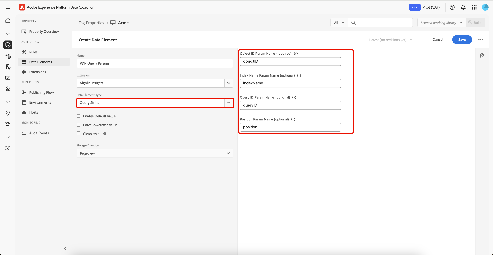

# [!DNL Algolia] 태그 확장 개요

[!DNL Algolia] 태그 확장을 사용하면 마케터가 사용자 상호 작용 데이터를 [!DNL Algolia]에 보내는 규칙을 쉽게 설정할 수 있으므로 보다 개인화된 AI 검색 및 검색 경험을 제공할 수 있습니다.

이 확장은 다음과 같은 주요 기능을 통해 제공됩니다.

* **[!DNL Algolia]인사이트**: 사용자 상호 작용 이벤트를 자동으로 캡처하여 [!DNL Algolia]에 보내어 강력한 분석, 개인화된 경험 및 향상된 검색 관련성을 가능하게 합니다.

## 전제 조건 {#prerequisites}

이 확장을 사용하려면 올바른 [!DNL Algolia] 계정이 있어야 합니다. 계정이 아직 없는 경우 [[!DNL Algolia] 등록 페이지](https://dashboard.algolia.com/users/sign_up)&#x200B;(으)로 이동하여 계정을 만드십시오.

### 필요한 구성 세부 정보 수집 {#configuration-details}

[!DNL Algolia]을(를) Adobe Experience Platform에 연결하려면 다음 정보가 필요합니다.

| 자격 증명 | 설명 | 예 |
| --- | --- | --- |
| 애플리케이션 ID | 응용 프로그램 ID는 [!DNL Algolia] 대시보드의 [API 키](https://www.algolia.com/account/api-keys/all) 섹션에서 찾을 수 있습니다. | 0ABCDEPG12 |
| API 키 검색 | 검색 API 키는 [!DNL Algolia] 대시보드의 [API 키](https://www.algolia.com/account/api-keys/all) 섹션에서 찾을 수 있습니다. | 1234a12345678901b1234567890c1ab1 |

## [!DNL Algolia] Insights 확장 설치 및 구성 {#install-configure}

[!DNL Algolia] Insights 확장을 설치하려면 [!UICONTROL 데이터 수집 UI]&#x200B;(으)로 이동하고 왼쪽 탐색에서 **[!UICONTROL 태그]**&#x200B;를 선택합니다. 여기에서 확장을 추가할 속성을 선택하거나 새 속성을 대신 만듭니다.

원하는 속성을 선택하거나 만든 후에는 왼쪽 탐색에서 **[!UICONTROL 확장]**&#x200B;을 선택한 다음 **[!UICONTROL 카탈로그]** 탭을 선택합니다. [!DNL Algolia] 인사이트 카드를 검색한 다음 **[!UICONTROL 설치]**&#x200B;를 선택합니다.


표시되는 구성 보기에서 다음 세부 정보를 제공해야 합니다.

| 속성 | 설명 |
| --- | --- |
| 애플리케이션 ID | 이전에 [구성 세부 정보](#configuration-details) 섹션에서 수집한 [!UICONTROL 응용 프로그램 ID]을(를) 입력하십시오. |
| API 키 검색 | 이전에 [구성 세부 정보](#configuration-details) 섹션에서 수집한 [!UICONTROL 검색 API 키]를 입력하십시오. |
| 색인 이름 | [!UICONTROL 인덱스 이름]에 제품 또는 콘텐츠가 포함되어 있습니다.  이 색인은 기본값으로 사용됩니다. |
| 사용자 토큰 데이터 요소 | 사용자 토큰을 반환하는 데이터 요소입니다. |
| 인증된 사용자 토큰 데이터 요소 | 인증된 사용자 토큰을 반환하는 데이터 요소를 설정합니다. |
| 통화 | 통화 유형을 선택합니다.  기본값은 `USD`(으)로 설정되어 있습니다. |


## [!DNL Algolia] Insights 확장 작업 유형 {#action-types}

[!DNL Algolia]은(는) 특정 컨텍스트 및 속성을 포함하는 미리 정의된 표준 이벤트 집합을 지원합니다. [!DNL Algolia] 확장에서 사용할 수 있는 작업은 이러한 이벤트 유형에 맞게 조정되므로 해당 유형에 따라 [!DNL Algolia]에 보내는 이벤트를 쉽게 분류하고 구성할 수 있습니다.

### 인사이트 로드 {#load-insights}

>[!NOTE]
>
>대부분의 경우 사이트의 모든 페이지에서 [!DNL Algolia] 인사이트를 로드하는 것이 좋습니다.

**[!UICONTROL 인사이트 로드]** 작업을 태그 규칙에 추가하면 규칙 컨텍스트를 기반으로 [!DNL Algolia] 인사이트를 로드할 수 있습니다. 이 작업은 `search-insights.js` 라이브러리를 페이지에 로드합니다.

새 태그 규칙을 만들거나 기존 태그 규칙을 엽니다. 요구 사항에 따라 조건을 정의한 다음 [!UICONTROL 확장]으로 **[!UICONTROL Algolia]**&#x200B;을(를) 선택하고 [!UICONTROL 작업 유형]으로 **[!UICONTROL 인사이트 로드]**&#x200B;를 선택합니다.

| 속성 | 설명 |
| --- | --- |
| [!UICONTROL Insight 라이브러리 버전] | [!DNL Algolia] Insights 버전입니다. 기본값은 `2.13.0`입니다. |
| [!UICONTROL 사용자 옵트아웃 데이터 요소] | 사용자의 추적 환경 설정을 캡처하는 데이터 요소입니다. |
| [!UICONTROL 사용자 토큰 쿠키 사용] | [!DNL Algolia]이(가) 사용자 토큰 쿠키를 생성할 수 있도록 하려면 이 확인란을 선택하십시오. 기본적으로 이 옵션은 `false`(으)로 설정됩니다. |


### 클릭됨 {#clicked}

클릭한 이벤트를 [!DNL Algolia]에 보내려면 태그 규칙에 **[!UICONTROL 클릭]** 작업을 추가하십시오. 새 태그 규칙을 만들거나 기존 태그 규칙을 엽니다. 요구 사항에 따라 조건을 정의한 다음 [!UICONTROL 확장]으로 **[!UICONTROL Algolia]**&#x200B;을(를) 선택하고 [!UICONTROL 작업 유형]으로 **[!UICONTROL 클릭함]**&#x200B;을(를) 선택합니다.

| 속성 | 설명 |
| --- | --- |
| [!UICONTROL 이벤트 이름] | 이 클릭 이벤트를 세분화하는 데 사용할 수 있는 이벤트 이름입니다. |
| 이벤트 세부 정보 데이터 요소 | `indexName`, `objectIDs` 및 선택적으로 `queryID`, `position`을(를) 포함하여 이벤트 세부 정보를 검색하는 데이터 요소입니다. `queryID`과(와) `position`이(가) 모두 포함된 경우 이벤트는 *검색 후 클릭한 개체 ID*(으)로 분류됩니다. 그렇지 않으면 이벤트는 *클릭한 개체 ID* 이벤트로 처리됩니다. 데이터 요소가 색인 이름 을 제공하지 않는 경우 이벤트를 전송할 때 기본 색인 이름 이 사용됩니다. |


### 전환됨 {#converted}

**[!UICONTROL 전환됨]** 작업을 태그 규칙에 추가하여 전환된 이벤트를 [!DNL Algolia]&#x200B;(으)로 보냅니다. 새 태그 규칙을 만들거나 기존 태그 규칙을 엽니다. 요구 사항에 따라 조건을 정의한 다음 **[!UICONTROL Algolia]**&#x200B;을(를) [!UICONTROL Extension]&#x200B;(으)로 선택하고 **[!UICONTROL Converted]**&#x200B;을(를) [!UICONTROL 작업 유형]&#x200B;(으)로 선택합니다.

| 속성 | 설명 |
| --- | --- |
| 이벤트 이름 | 이 **convert** 이벤트를 세분화하는 데 사용할 이벤트 이름입니다. |
| 이벤트 세부 정보 데이터 요소 | `indexName`, `objectId` 및 선택적으로 `queryId`을(를) 포함한 이벤트 세부 정보를 검색하는 데이터 요소입니다. 데이터 요소에 `queryId`이(가) 포함된 경우 이벤트는 *검색 후 전환됨*(으)로 분류되며, 그렇지 않으면 *전환됨* 이벤트 클래스로 간주됩니다. 데이터 요소가 색인 이름 을 제공하지 않는 경우 이벤트를 전송할 때 기본 색인 이름 이 사용됩니다. |


### 장바구니에 추가됨 {#added-to-cart}

**[!UICONTROL 장바구니에 추가됨]** 작업을 태그 규칙에 추가하여 장바구니에 추가된 이벤트를 [!DNL Algolia]&#x200B;(으)로 보냅니다. 새 태그 규칙을 만들거나 기존 태그 규칙을 엽니다. 요구 사항에 따라 조건을 정의한 다음 [!UICONTROL 확장]으로 **[!UICONTROL Algolia]**&#x200B;을(를) 선택하고 [!UICONTROL 작업 유형]으로 **[!UICONTROL 장바구니에 추가됨]**&#x200B;을(를) 선택합니다.

| 속성 | 설명 |
| --- | --- |
| 이벤트 이름 | 이 **convert** 이벤트를 세분화하는 데 사용할 이벤트 이름입니다. |
| 이벤트 세부 정보 데이터 요소 | `indexName`, `objectId` 및 선택적으로 `queryId`, `objectData`을(를) 포함하여 이벤트 세부 정보를 검색하는 데이터 요소입니다. 데이터 요소에 `queryId`이(가) 포함된 경우 이벤트는 *검색 후 장바구니 개체 ID에 추가됨*(으)로 분류되며, 그렇지 않으면 *장바구니 개체 ID에 추가됨* 이벤트 클래스로 간주됩니다. 데이터 요소가 색인 이름 을 제공하지 않는 경우 이벤트를 전송할 때 기본 색인 이름 이 사용됩니다. |
| 통화 | 통화 유형을 지정합니다(예: `USD`). |


### 구매됨 {#purchased}

**[!UICONTROL 장바구니에 추가]** 작업을 태그 규칙에 추가하여 구매한 이벤트를 [!DNL Algolia]&#x200B;(으)로 보냅니다. 새 태그 규칙을 만들거나 기존 태그 규칙을 엽니다. 요구 사항에 따라 조건을 정의한 다음 [!UICONTROL 확장]으로 **[!UICONTROL Algolia]**&#x200B;을(를) 선택하고 [!UICONTROL 작업 유형]으로 **[!UICONTROL 구매]**&#x200B;을(를) 선택합니다.

| 속성 | 설명 |
| --- | --- |
| 이벤트 이름 | 이 **구매** 이벤트를 세분화하는 데 사용할 이벤트 이름. |
| 이벤트 세부 정보 데이터 요소 | `indexName`, `objectId` 및 선택적으로 `queryId`을(를) 포함한 이벤트 세부 정보를 검색하는 데이터 요소입니다. 데이터 요소에 `queryId`이(가) 포함된 경우 이벤트는 *검색 후 구매한 개체 ID로 분류*&#x200B;됩니다. 그렇지 않으면 *구매한 개체 ID* 이벤트 클래스로 간주됩니다. 데이터 요소가 색인 이름 을 제공하지 않는 경우 이벤트를 전송할 때 기본 색인 이름 이 사용됩니다. |


### 조회함 {#viewed}

**[!UICONTROL 장바구니에 추가]** 작업을 태그 규칙에 추가하여 구매한 이벤트를 [!DNL Algolia]&#x200B;(으)로 보냅니다. 새 태그 규칙을 만들거나 기존 태그 규칙을 엽니다. 요구 사항에 따라 조건을 정의한 다음 **[!UICONTROL Algolia]**&#x200B;을(를) [!UICONTROL Extension]&#x200B;(으)로 선택하고 **[!UICONTROL 조회함]**&#x200B;을(를) [!UICONTROL 작업 유형]&#x200B;(으)로 선택합니다.


| 속성 | 설명 |
| --- | --- |
| 이벤트 이름 | 이 **보기** 이벤트를 세분화하는 데 사용할 이벤트 이름입니다. |
| 이벤트 세부 정보 데이터 요소 | `indexName` 및 `objectId`을(를) 포함한 이벤트 세부 정보를 검색할 데이터 요소입니다. `indexName`을(를) 사용할 수 없는 경우 이벤트를 보낼 때 기본 색인 이름이 사용됩니다. |

## [!DNL Algolia] Insights 확장 데이터 요소 {#data-elements}

[!DNL Algolia]은(는) 특정 컨텍스트 및 속성을 포함하는 미리 정의된 데이터 요소 집합을 지원합니다. 다음 섹션에서는 [!DNL Algolia] Insights 확장에서 사용할 수 있는 데이터 요소에 대해 설명합니다.

### 데이터 집합 {#dataset}

DataSet Data Element는 HTML 요소와 관련된 데이터를 검색하여 [!DNL Algolia] 작업에 사용합니다.

| 속성 | 설명 |
| --- | --- |
| 히트 요소 Div/클래스 이름 | HTML 요소 이름 및/또는 HTML 요소의 `data-insights-object-id` 및 `data-insights-query-id` 및 `data-insights-position`을(를) 포함하는 데이터 세트 특성을 포함하는 CSS 클래스 이름입니다. |
| 인덱스 이름 요소 Div/클래스 이름 | HTML 요소에 데이터 집합 특성(`data-indexname`)이 있는 HTML 요소 이름 및/또는 CSS 클래스 이름입니다. |


이 데이터 요소는 다음을 반환합니다.

```javascript
{
  timestamp,
    queryID,
    indexName,
    objectIDs,
    positions
}
```

데이터 세트가 포함된 HTML의 예:

```html
<div data-indexname="acme_master_default_products" class="instant-search-comp__hits">
  <div class="hit-card"
    data-insights-object-id="${hit.objectID}"
    data-insights-position="${hit.__position}"
    data-insights-query-id="${hit.__queryID}">
    <h4 class="hit-name">...</h4>   
  </div>
</div>
```

### 쿼리 문자열 {#query-string}

쿼리 문자열 데이터 요소는 [!DNL Algolia] 작업에 사용할 URL 쿼리 문자열에서 데이터를 추출합니다.

| 속성 | 설명 |
| --- | --- |
| 개체 ID 매개 변수 이름 | 개체 ID를 포함하는 쿼리 매개 변수 이름입니다. |
| 인덱스 이름 매개 변수 이름(선택 사항) | 인덱스 이름을 포함하는 쿼리 매개 변수 이름입니다. |
| 쿼리 ID 매개 변수 이름(선택 사항) | 쿼리 ID를 포함하는 쿼리 매개 변수 이름입니다. |
| 위치 매개 변수 이름(선택 사항) | Position을 포함하는 쿼리 매개변수 이름. |



이 데이터 요소는 다음을 반환합니다.

```javascript
{
  timestamp,
    queryID,
    indexName,
    objectIDs
}
```

쿼리 매개 변수를 포함하는 HTML의 예입니다.

```
<a href="product.html?objectID=${hit.objectID}&queryID=${hit.__queryID}&indexName=${indexName}&position=${hit.position}">Read More</a>
```

### 스토리지 {#storage}

Storage Data 요소는 [!DNL Algolia] 작업에 사용할 데이터를 세션 저장소에서 검색합니다.

이 데이터 요소는 세션 저장소에서 이벤트 세부 정보를 검색합니다. 구성이 필요하지 않습니다. 데이터는 *click* 이벤트 작업 중에 자동으로 추가되고 *convert* 이벤트 작업 중에 제거됩니다.


이 데이터 요소는 세션 저장소에 저장된 것을 반환합니다.

```javascript
{
  timestamp,
    queryID,
    indexName,
    objectIDs
}
```

## 검색 후 클릭 또는 변환됨 {#clicked-converted-after-search}

*검색 후 클릭* 또는 *검색 후 전환* 이벤트에는 `queryId`이 필요하며 `position`은(는) *검색 후 클릭*&#x200B;에도 필요합니다. 이러한 속성은 InstantSearch 및/또는 Autocomplete 쿼리 매개 변수에서 `insights` 플래그를 사용하도록 설정한 경우 사용할 수 있습니다. 사이트에 대한 Insights를 구성하는 방법에 대해 알아보려면 다음 리소스를 참조하십시오.

* [자동 완성에 대한 인사이트 설정](https://www.algolia.com/doc/ui-libraries/autocomplete/api-reference/autocomplete-js/autocomplete/#param-insights)
* [InstantSearch.js에 대한 인사이트 설정](https://www.algolia.com/doc/guides/building-search-ui/events/js/#set-the-insights-option-to-true)
* [클릭 및 전환 이벤트 시작](https://www.algolia.com/doc/guides/sending-events/implementing/how-to/sending-events-backend/)
* [Insights 이벤트 보내기 [!DNL Algolia] 2&rbrace;](https://www.algolia.com/doc/ui-libraries/autocomplete/guides/sending-algolia-insights-events/)
* [[!DNL Algolia] Launch 확장 GitHub 저장소](https://github.com/algolia/algolia-launch-extension)
* [InstantSearch.js 설명서](https://www.algolia.com/doc/guides/building-search-ui/what-is-instantsearch/js/)
* [[!DNL Algolia] Insights API 설명서](https://www.algolia.com/doc/rest-api/insights/)

## 다음 단계 {#next-steps}

이 안내서에서는 [!DNL Algolia Insights] 태그 확장을 사용하여 데이터를 [!DNL Algolia]에 보내는 방법을 다룹니다. [!DNL Algolia]에도 서버측 이벤트를 보낼 계획이라면 [[!DNL Conversions API] 이벤트 전달 확장](../../server/algolia/overview.md)을 설치하고 구성할 수 있습니다.

Experience Platform의 태그에 대한 자세한 내용은 [태그 개요](../../../home.md)를 참조하세요.
