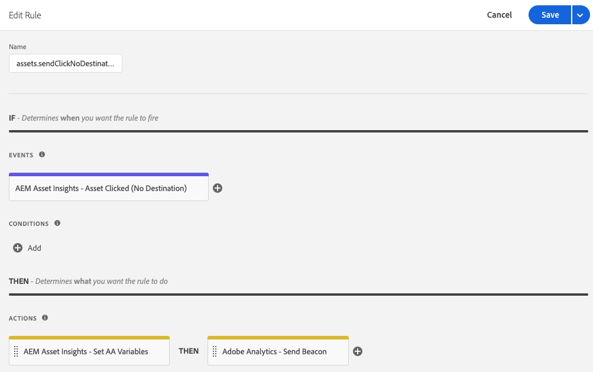

# AEM 자산 통찰력 확장 개요

>[!NOTE]
>
>Adobe Experience Platform Launch는 Adobe Experience Platform의 데이터 수집 기술로 새롭게 브랜딩되었습니다. 그 결과로 제품 설명서 전반에서 몇 가지 용어 변경이 있었습니다. 용어 변경에 대한 통합 참고 자료는 다음 [문서](../../../term-updates.md)를 참조하십시오.

이 확장은 [AEM 자산 통찰력](https://experienceleague.adobe.com/docs/experience-manager-65/assets/managing/touch-ui-configuring-asset-insights.html?lang=ko)과 함께 사용됩니다. 보다 구체적으로 설명하면 &quot;pageTracker&quot; 프로세스 및 포함 코드를 대체합니다. 구성된 경우, 이 확장은 자산 *노출* 및 *클릭* 지표를 Adobe Analytics로 전송하며 해당 지표는 이후 AEM 자산 통찰력 보고서로 가져옵니다. 그런 다음 AEM 자산 통찰력 또는 Adobe Analytics Project Workspaces를 사용하여 자산 지표를 보고할 수 있습니다.

## 확장 사전 요구 사항

### Analytics

Analytics의 AEM 자산 보고서에는 세 개의 AEM 차원이 포함됩니다.

* 자산 ID
* 에셋 Source
* 클릭한 자산

다음 두 가지 지표도 있습니다.
* 자산 노출 횟수
* 자산 클릭 수.

이 확장을 사용하여 이러한 보고서를 채우려면 Analytics 관리자(**[!UICONTROL Analytics] > [!UICONTROL 관리자] > [!UICONTROL 보고서 세트] > `<report suite>` > [!UICONTROL 설정 편집] > [!UICONTROL AEM] > [!UICONTROL AEM Assets 보고]** 선택)를 사용하여 이를 활성화해야 합니다.

Adobe Experience Platform용 &quot;*Adobe Analytics*&quot; 태그 확장은 동일한 웹 속성에 설치해야 합니다.

### AEM(Adobe Experience Manager)

1. [AEM 자산 통찰력](https://experienceleague.adobe.com/docs/experience-manager-65/assets/managing/touch-ui-configuring-asset-insights.html?lang=ko)을 사용합니다. AEM에서 **[!UICONTROL 도구 > Assets]**&#x200B;을 선택한 다음 **[!UICONTROL Insights 구성]** 패널을 엽니다.

1. UUID 추적을 비활성화합니다. 

   >[!IMPORTANT]
   >
   >AEM 자산 구성 설정 **[!UICONTROL UUID 추적 비활성화]**&#x200B;를 선택한 경우 이 확장은 *not* 함수가 됩니다. 기본적으로 선택되어 있지 않습니다.

   

## AEM(Adobe Experience Manager) 구성

이 섹션에서는 Adobe Experience Platform에서 태그를 사용하여 AEM을 구성하는 방법, AEM에서 에셋 Insight을 활성화하는 방법 및 Assets에 대해 UUID 추적을 활성화하는 방법에 대해 설명합니다.

### 태그와 AEM 통합

Adobe Experience Manager과 [Experience Platform](https://experienceleague.adobe.com/docs/experience-manager-learn/sites/integrations/experience-platform-launch/overview.html?lang=ko)의 권장 통합은 Adobe I/O을 통해 수행됩니다.

1. [Adobe I/O을 사용하여 태그와 AEM 연결](https://experienceleague.adobe.com/docs/experience-manager-learn/sites/integrations/experience-platform-launch/connect-aem-launch-adobe-io.html?lang=ko).

2. [Adobe Experience Platform Cloud Service 구성을 만듭니다](https://experienceleague.adobe.com/docs/experience-manager-learn/sites/integrations/experience-platform-launch/create-launch-cloud-service.html?lang=ko).

### AEM에서 자산 통찰력 활성화

자산 통찰력에 대한 지침은 [Experience Manager 6.5 Assets 사용 설명서](https://experienceleague.adobe.com/docs/experience-manager-65/assets/managing/touch-ui-configuring-asset-insights.html?lang=ko)를 참조하십시오.

### 자산에 대한 UUID 추적 활성화

AEM에서 자산의 UUID를 사용하여 Analytics에서 자산을 추적합니다.

자산의 UUID로 추적을 활성화하려면 편집 가능한 템플릿의 구성 요소 정책 콘솔을 열고 &quot;UUID 추적 비활성화&quot; 속성의 선택을 취소합니다. 기본적으로 이 속성은 OOTB 이미지 구성 요소에 대해 선택되어 있습니다.

UUID를 활성화한 후에는 &quot;data-asset-id&quot; 데이터 요소가 자산의 UUID로 채워지는 것을 볼 수 있습니다. Analytics는 이 UUID로 자산 클릭 또는 노출을 추적합니다.

## 확장 사용

이 확장에는 두 개의 이벤트와 하나의 작업이 있습니다.

* **클릭한 자산:** 방문자가 추적이 활성화되고 대상(href 특성)이 있는 AEM 자산을 선택할 때 발생하는 _이벤트_ .

* **클릭한 자산(대상 없음):** 방문자가 추적이 활성화되고 대상이 없는(href 특성 없음) AEM 자산을 선택할 때 발생하는 _이벤트_.

* **AA 변수 설정:** 사용된 이벤트와 이벤트 및 작업이 구성되는 방법에 따라 AEM Assets에 예약된 Analytics 변수(컨텍스트 데이터 변수 `a.assets.source`, `a.assets.idlist`, `a.asset.clickedid`)를 설정하는 _작업_ . 이 확장에서는 Analytics 변수 event, prop, 또는 eVar를 사용하지 않습니다.

### 자산 노출 횟수

모든 페이지에서 실행되며 Analytics 이미지 요청을 보내는 신규 또는 기존 태그 규칙에 &quot;AA 변수 설정&quot; 작업을 추가합니다. &quot;AA 변수 설정&quot; 작업은 &quot;Adobe Analytics - 비콘 보내기&quot; 작업 **앞에** 나타나야 합니다. 필요에 따라 작업을 추가할 수 있습니다.

**[AA 변수 설정]** 구성 페이지에서 **[조회한 자산]**(기본값) 옵션을 선택합니다. 이 옵션은 방문자가 실제로 보는 자산에만 노출 횟수 이벤트를 설정합니다.

>[!NOTE]
>
>권장되지는 않지만, &quot;AA 변수 설정&quot; 작업은 방문자가 보았는지 여부에 관계없이 페이지의 모든 자산의 자산 노출 횟수를 전송하는 &quot;로드된&quot; 옵션도 지원합니다.

### 자산 클릭 수

&quot;클릭한 자산&quot; 이벤트와 &quot;AA 변수 설정&quot; 작업을 사용하여 두 번째 규칙을 구성합니다. &quot;클릭한 자산&quot; 이벤트는 &quot;클릭한 자산 이미지 요청&quot;이 &quot;페이지 로드 시&quot;(기본값)로 설정되도록 구성해야 합니다. 자산 ID가 `sessionStorage`에 저장되고 후속 노출 횟수 규칙에 의해 전송되므로 이 규칙은 아무런 Adobe Analytics 작업(예: 비콘 보내기)이 필요하지 않습니다.

&quot;클릭한 자산&quot; 이벤트는 &quot;클릭 시&quot;의 &quot;클릭한 자산 이미지 요청&quot; 설정도 지원합니다. 이 작업은 클릭 지표를 Analytics로 즉시 전송하므로 Analytics &quot;비콘 보내기&quot; 작업도 필요합니다.

대상이 없는( `href` 특성 없음) 페이지에 자산이 있을 때 실행될 세 번째 규칙을 구성합니다. 최소한, 새 규칙은 &quot;클릭한 자산(대상 없음)&quot; 이벤트와 &quot;AA 변수 설정&quot; 및 &quot;Adobe Analytics - 비콘 보내기&quot; 작업을 사용해야 합니다. 필요에 따라 조건 및 작업을 추가할 수 있습니다.

### 확장 테스트 팁

위에 설명된 대로 세 가지 규칙을 구성합니다.

* 자산 노출 횟수
* 자산 클릭 수
* 대상이 없는 자산 클릭 수

**노출 횟수**

1. AEM assets가 포함된 페이지로 이동합니다. 

1. 브라우저에 표시되는 자산이 없으면 하나 이상의 자산을 볼 수 있을 때까지 스크롤하여 해당 자산을 선택하거나 다른 페이지로 이동합니다.

1. Analytics 이미지 요청을 확인합니다. 

   `a.assets.idlist`에 이전 페이지에서 볼 수 있었던 자산 ID가 포함된 경우 규칙이 올바르게 작동합니다. 

   `a.assets.idlist`이 이미지 요청에 없는 경우, 다음 두 가지 이유 중 하나일 수 있습니다. 

   * 브라우저의 보기 영역에 자산이 없습니다.

   * AEM의 [자산 통찰력](https://experienceleague.adobe.com/docs/experience-manager-65/assets/managing/touch-ui-configuring-asset-insights.html?lang=ko)이 활성화된 구성의 페이지에 자산이 없습니다.

**클릭 수**

1. AEM assets가 포함된 페이지로 이동합니다.

1. 자산 중 하나를 선택합니다.

결과 Analytics 이미지 요청(다음 페이지에서)의 `a.assets.idlist`에 대상 페이지의 자산 ID가 있고 `a.assets.clickedid`에 원래 페이지에서 선택한 자산의 자산 ID가 있는 경우, 규칙이 올바르게 작동합니다.

`a.assets.clickedid`이 이미지 요청에 없는 경우는 대부분 선택된 자산에서 AEM의 [자산 통찰력](https://experienceleague.adobe.com/docs/experience-manager-65/assets/managing/touch-ui-configuring-asset-insights.html?lang=ko)이 활성화되지 않았기 때문에 발생합니다.

**대상이 없는 클릭 수**

1. 대상이 없는 AEM 자산이 하나 이상 포함된 페이지로 이동합니다( `href` 특성 없음).

1. 해당 자산을 선택합니다.

결과 Analytics 이미지 요청에서 `a.assets.clickedid`에 자산 ID가 있는 경우 규칙이 올바르게 작동합니다.

`a.assets.clickedid`이 이미지 요청에 없는 경우는 대부분 선택된 자산에서 AEM의 [자산 통찰력](https://experienceleague.adobe.com/docs/experience-manager-65/assets/managing/touch-ui-configuring-asset-insights.html?lang=ko)이 활성화되지 않았기 때문에 발생합니다.
