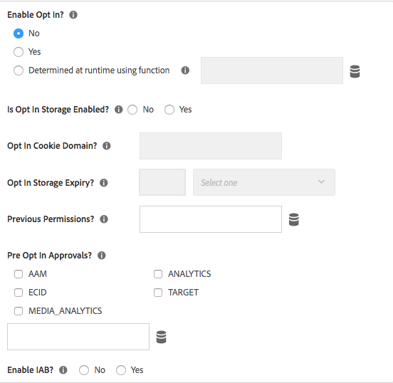

# Adobe Experience Cloud Identity Service 확장 릴리스 노트

>[!NOTE]
>
>Adobe Experience Platform Launch은 Adobe Experience Platform의 데이터 수집 기술군으로 새롭게 브랜딩되었습니다. 그 결과 제품 설명서에 몇 가지 용어 변경 사항이 적용되었습니다. 용어 변경에 대한 통합 참고 자료는 다음 [문서](../../../term-updates.md)를 참조하십시오.

이 문서에서는 Adobe Experience Cloud Identity 서비스 태그 확장에 대한 릴리스 정보를 다룹니다. Experience Cloud ID 서비스 자체에 대한 릴리스 노트는 [ID 서비스 설명서](https://experienceleague.adobe.com/docs/id-service/using/release-notes/release-notes.html?lang=ko)를 참조하십시오.

## 2022년 10월 17일

### Experience Cloud ID 확장 5.5.0

* 이제 확장은 [Visitor JS 클라이언트](https://github.com/Adobe-Marketing-Cloud/id-service)의 버전 5.5.0을 지원합니다. 특정 업데이트는 [방문자 릴리스 정보](https://github.com/Adobe-Marketing-Cloud/id-service/releases/tag/5.5.0)를 참조하세요.

## 2022년 3월 9일

### Experience Cloud ID 확장 5.4.0

* 이 버전에는 다음 업데이트가 있는 최신 Visitor 5.4.0이 포함되어 있습니다.

   * cookieLifetime 구성을 사용하여 `s_ecid` 쿠키의 수명을 구성하는 기능
   * 페이지가 하위 iFrame에 로드될 때 발생하는 Firefox 브라우저 문제에 대한 업데이트

## 2021년 10월 10일

### Experience Cloud ID 확장 5.3.1

* 이 버전에는 다음과 같은 새 업데이트가 있는 최신 Visitor 5.3.0이 포함되어 있습니다.

   * 로컬 ECID를 생성하는 알고리즘이 업데이트되었습니다.
   * 개인 정보 쿠키에 대해 `Secure` 및 `SameSite` 플래그를 사용하는 최신 옵트인
   * 페이지가 하위 iFrame에 로드될 때 Firefox 브라우저 문제가 해결되었습니다.

## 2021년 1월 12일

### Experience Cloud ID 확장 5.2.0

* ECID DataElement에 대한 수정 사항이 있는 VisitorJS 5.2.0 패치로 업데이트하는 경우 동의를 받을 때 업데이트할 수 없습니다.

## 2020년 11월 3일

### Experience Cloud ID 확장 5.2.1

* 이 패치에는 Google Chrome 브라우저의 `SameSite=None` 특성이 있는 iFrame에서 쿠키를 쓰는 수정 사항이 포함되어 있습니다.

## 2020년 10월 27일

### Experience Cloud ID 확장 5.1.0

* `AMCV` 쿠키의 `SameSite` 속성을 지정하기 위해 `sameSiteCookie` 구성을 추가합니다.
이 구성은 `SameSite` 속성에 대해 다음 값을 지원합니다.

   * `Strict`
   * `Lax`
   * `None`

이러한 속성 값에 대한 세부 사항은 [web.dev](https://web.dev/samesite-cookies-explained/) 및 [chromium](https://www.chromium.org/updates/same-site)에 있습니다.

## 2020년 8월 13일

### Experience Cloud ID 확장 5.0.1

* IAB 동의 문자열이 변경될 때 d_cf 플래그를 추가하기 위한 수정 사항이 있는 VisitorJS 5.0.1 패치 업데이트

## 2020년 6월 15일

### Experience Cloud ID 확장 5.0.0

* `IAB TCF`- 투명성 및 동의 프레임워크 - `Version 2.0`에 대한 지원 추가.

## 2020년 4월 13일

### Experience Cloud ID 확장 4.6.0

* 기본적으로 `loadSSL` 플래그가 설정되었습니다. ID 서비스에 대한 모든 호출은 기본적으로 `https`에 있습니다. 고객은 ssl이 아닌 페이지에서 http로 ID 서비스를 호출하려는 경우 false로 설정할 수 있습니다.
* ESLint에서 보고한 문제를 수정하기 위해 Internet-Explorer(IE) 버전을 감지하는 데 사용되는 기능을 업데이트했습니다.

* ECID에 optIn 사전 승인이 제공되고 나중에 업데이트될 때 Internet-Explorer(IE) 11의 성능 문제에 대한 버그가 수정됩니다.

## 2020년 1월 22일

### Experience Cloud ID 확장 4.5.2

* visitor.js가 4.5.2로 업데이트되었습니다.
* Visitor 4.5.1에는 Optin용 IAB 플러그인에 대한 버그 수정이 포함됩니다.
* 전송된 빈 ID를 거부하도록 `setCustomerIDs` 메서드가 업데이트되었습니다.

## 2020년 1월 7일

### Experience Cloud ID 확장 4.4.2

* visitor.js가 4.4.2로 업데이트되었습니다.
* 값을 더 빨리 가져오도록 `getVisitorValues` 메서드가 개선됩니다.

## 2019년 9월 19일

### Experience Cloud ID 확장 4.4.1

* visitor.js가 4.4.1로 업데이트되었습니다.
* 옵트인 사전 승인 입력 가져오기에 대한 버그가 수정되었습니다.
* preOptInApprovals에서 VIDEO_ANALYTICS가 MEDIA_ANALYTICS로 이름이 변경되었습니다.

  

## 2019년 7월 17일

### Experience Cloud ID 확장 4.4.0

* visitor.js가 4.4.0로 업데이트되었습니다.
* setCustomerIDs에 대한 SHA256 해시 지원이 추가되었습니다.

  

## 2019년 5월 13일

### Experience Cloud ID 확장 4.3.1

* visitor.js가 4.3으로 업데이트됨
* 태그 확장의 일부로 ECID에 대한 데이터 요소 유형이 추가되었습니다.

  

## 2019년 4월 9일

### Experience Cloud ID 확장 4.2.0

* Audience Manager IAB TCF 플러그인을 지원하는 visitor.js가 4.2로 업데이트되었습니다.

## 2019년 2월 25일

### Experience Cloud ID 확장 4.1.0

* visitor.js를 4.1로 업데이트하여 새로운 API 변경에 따라 publishDestinations를 업데이트했습니다. 이 업데이트를 통해 페이지의 레퍼러 정보가 ID 동기화 중에 노출될 수 있습니다.

## 2019년 2월 15일

### Experience Cloud ID 확장 4.0.0

* visitor.js가 4.0으로 업데이트되었습니다.
* 새로 내장된 옵트인 개체에 대한 구성 옵션이 추가되었습니다. 옵트인 설정을 사용하여 Adobe 솔루션의 쿠키 및 비콘 호출을 억제함으로써 GDPR와 같은 규정을 보다 효과적으로 지원합니다.

  

## 2018년 3월 20일

### Experience Cloud ID 확장 3.1.0

* visitor.js가 3.1로 업데이트되었습니다.
* `resetBeforeVersion` 및 `serverState` 구성 속성이 추가되었습니다. 
