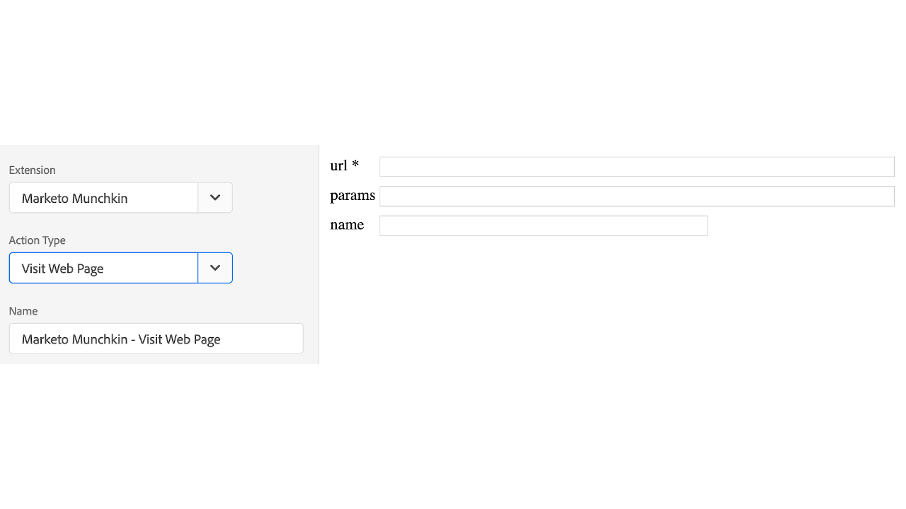

# Marketo Munchkin 확장 개요

이 확장 프로그램을 사용하여 [!DNL Marketo Munchkin] JavaScript 추적 코드와 속성을 통합합니다. [!DNL Marketo Munchkin] JavaScript를 사용하면 Marketo 랜딩 페이지 및 외부 웹 페이지에 대한 최종 사용자 페이지 방문 수 및 탐색 수를 추적할 수 있습니다.

## Marketo Munchkin 확장 프로그램 설치

[!DNL Marketo Munchkin] 확장 프로그램이 아직 설치되지 않은 경우 속성을 열고 **[!UICONTROL Extensions > Catalog]**(을)를 선택한 다음 [!DNL Marketo Munchkin] 확장 프로그램을 마우스로 가리키고 **[!UICONTROL Install]**(을)를 선택합니다.

이 확장 프로그램에는 필요한 구성이 없습니다.

## Marketo Munchkin 확장 프로그램 작업 유형

이 섹션에서는 [!DNL Marketo Munchkin] 확장에서 사용할 수 있는 작업 유형을 설명합니다.

### 초기화

**Munchkin ID:(필수)** Admin > Integration > Munchkin 메뉴에서 찾은 Munchkin 계정 ID.

**Configurations:** 구성 가능한 모든 매개 변수가 [여기](https://developers.marketo.com/javascript-api/lead-tracking/configuration/)에 설명되어 있습니다.

### 웹 페이지 방문

**url:(필수)** 페이지 방문을 기록하는 데 사용되는 URL 파일 경로입니다.

**params:** 기록할 원하는 매개 변수의 쿼리 문자열입니다.

**name:** 웹 페이지 자산의 사용자 지정 이름입니다.

### 링크 클릭

**href: (필수)** 링크 선택을 기록하는 데 사용되는 URL 파일 경로입니다.
