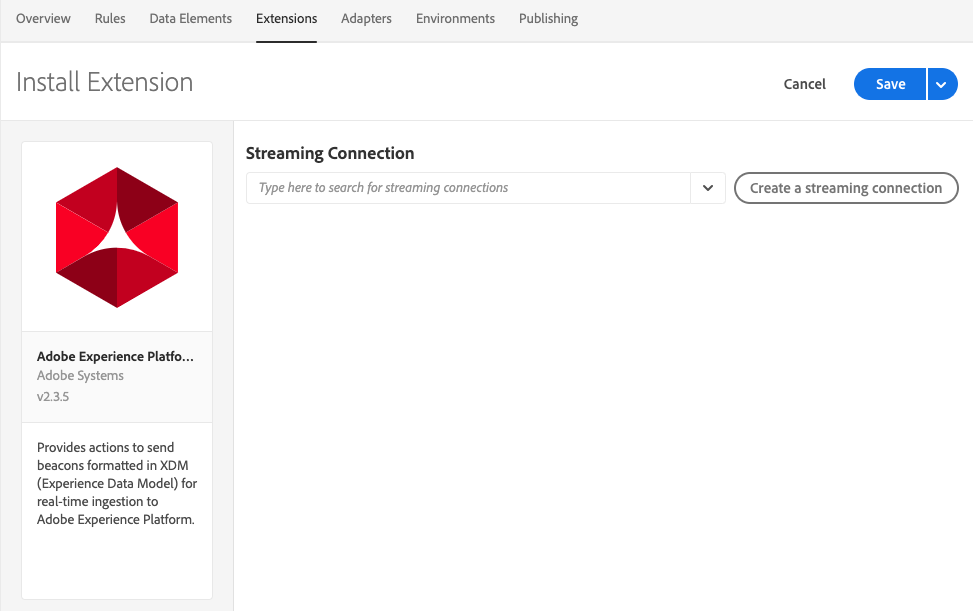

# Adobe Experience Platform 데모 확장

>[!NOTE]
>
>Adobe Experience Platform Launch은 Adobe Experience Platform의 데이터 수집 기술군으로 새롭게 브랜딩되었습니다. 그 결과로 제품 설명서 전반에서 몇 가지 용어 변경이 있었습니다. 용어 변경에 대한 통합 참고 자료는 다음 [문서](../../../term-updates.md)를 참조하십시오.

>[!NOTE]
>
>이 확장은 더 이상 사용되지 않으며 [Adobe Experience Platform 웹 SDK](../web-sdk/overview.md).

이 확장 기능은 새 확장으로 포트되고 있습니다. 다음은 현재 기능을 간단히 비교한 것입니다.

| Platform 데모 확장 | Platform Web SDK |
| ------------------ | ----------- |
| 사용자 지정 고객 ID 지원 | 사용자 지정 고객 ID 지원 |
| XDM용 클라이언트측 매핑 UI | ECID로 빌드(visitor.js가 필요 없음) |
| 스트리밍 연결 생성 기능 | 옵트인 지원 |
| | 데이터 요소로서의 XDM 지원 |
| | 자사 도메인 지원 |
| | 내장된 디버깅 툴 |
| | 브라우저 컨텍스트 자동 수집 |
| | 완전히 오픈된 소스 |

## Adobe Experience Platform 확장 구성

이 섹션에서는 Adobe Experience Platform 확장을 구성할 때 사용할 수 있는 옵션에 대한 참조를 제공합니다.

Adobe Experience Platform 확장이 아직 설치되지 않은 경우 속성을 연 다음 을 선택합니다 **[!UICONTROL 확장 > 카탈로그]**, Adobe Experience Platform 확장을 마우스로 가리킨 다음 **[!UICONTROL 설치]**.

확장을 구성하려면 를 엽니다. [!UICONTROL 확장] 탭을 클릭하고 확장을 마우스로 가리킨 다음 **[!UICONTROL 구성]**.

### 스트리밍 연결

스트리밍 연결을 선택하는 것은 Adobe Experience Platform으로 데이터 스트리밍을 시작하기 위한 첫 단계입니다. 스트리밍 연결 콤보 상자에서 하나를 선택할 수 있습니다. 스트리밍 연결은 필수 필드입니다. 만든 스트리밍 연결이 없는 경우 다음을 선택하여 만들 수 있습니다. **[!UICONTROL 스트리밍 연결 만들기]** 단추를 클릭합니다.

다음을 선택하는 경우 **[!UICONTROL 스트리밍 연결 만들기]** 모달 창이 나타납니다.

모달에는 사용자의 요구 사항에 맞게 변경할 수 있는 미리 채워진 값이 있는 필드가 포함되어 있습니다. 스트리밍 연결을 두 개 이상 만들려는 경우에는 **[!UICONTROL 데이터 소스]** 필드는 고유해야 합니다. 다음을 사용하여 다른 스트리밍 연결을 만들려고 합니다. **[!UICONTROL 데이터 소스]** 다른 연결에 이미 사용한 경우 실패합니다.

스트리밍 끝점을 선택하면 스트리밍 끝점 URL 및 소스가 표시됩니다.

## Adobe Experience Platform 확장 작업 유형

이 섹션에서는 Adobe Experience Platform 확장에서 사용할 수 있는 작업 유형을 설명합니다.

### 비콘 보내기 {#send-beacon}

Adobe Experience Platform으로 데이터를 전송하는 데 사용할 작업 유형입니다.

먼저 데이터가 저장되는 데이터 세트를 선택해야 합니다. 일반적으로 데이터 세트는 스트리밍 연결을 통해 전송된 데이터를 저장할 테이블을 나타냅니다. 이 작업 유형을 사용하려면 먼저 Adobe Experience Platform 내부에 데이터 세트를 만들어야 합니다.

데이터가 저장되는 데이터 세트를 선택하고 나면 선택한 데이터 세트에 연결된 스키마에 대한 세부 정보가 표시됩니다.

### 스키마 매핑

데이터 세트를 선택한 후에 스키마 매핑을 정의할 수 있습니다.

소스 값 필드는 값 또는 데이터 요소를 허용합니다. 소스 값 필드 옆에 있는 데이터 요소 버튼을 선택하여 데이터 요소를 추가할 수 있습니다.

대상 스키마 필드에는 데이터 세트 스키마에 정의된 XDM 필드의 경로가 포함됩니다. 스키마 계층 구조에 정의된 필드의 깊이가 깊은 경우 점을 경로 부분 사이의 구분자로 사용할 수 있습니다(예: timeSeriesEvents.eventType).

### 스키마 필드 선택기

확장은 또한 시각적 선택기를 사용하여 대상 스키마 필드를 선택할 수 있는 가능성을 제공합니다. 대상 스키마 필드 입력 옆에 있는 대상 버튼을 선택하면 데이터 세트의 스키마 트리를 볼 수 있는 모달이 표시됩니다. 필드를 선택한 다음 **선택** 단추를 클릭하면 대상 스키마 필드 입력이 업데이트되어 올바른 XDM 경로가 포함됩니다.

### Adobe Experience Platform 내의 ID 필드

레코드 데이터 스키마 및 시계열 데이터 스키마에는 하나 이상의 ID 필드가 포함될 수 있습니다. ID 필드는 함께 연결되어 주체의 단일 ID 표현을 형성하고, CRM 식별자, ECID(Experience Cloud ID), 브라우저 쿠키, AdvertisingId 또는 다른 도메인의 다른 ID와 같은 정보가 포함되어 있습니다.

ID 필드는 스키마 내에 다음 두 가지 방법으로 정의할 수 있습니다.

1. 레코드와 시계열 스키마에는 ID 맵이 포함될 수 있는 `xdm:identityMap`이라고 하는 특수 필드가 포함되어 있습니다.
1. 키 필드는 스키마 내에 &quot;ID&quot; 필드로 표시될 수 있습니다.

### Adobe Experience Platform 확장 내의 ID 필드

ID 필드로 정의된 각 스키마 필드의 경우 스키마 매핑 섹션에 행이 추가됩니다. 추가된 각 행에는 해당 XDM 스키마 경로가 이미 입력되어 있는 대상 스키마 필드가 포함됩니다. 필드 주위에 프로필 아이콘이 표시되면 스키마 필드가 ID 필드임을 알 수 있습니다.

기본 ID 필드가 항상 필요하므로 스키마 매핑 섹션에서 해당 필드가 포함된 행을 삭제할 수 없습니다.

기본 ID 필드로 정의되지 않은 스키마 필드는 스키마 매핑 섹션에 자동으로 추가되지만, 소스 값 입력은 비어 있을 수 있습니다. 해당 필드를 삭제할 수 있습니다. 해당 소스 값 입력이 비어 있으면 필드가 무시됩니다.

값이 포함되지 않는 기본이 아닌 각 ID 필드 주위에 경고 아이콘이 표시됩니다.

스키마에 `xdm:identityMap` 필드가 포함된 경우 ID 섹션이 표시됩니다. `xdm:identityMap`을 사용하여 ID와 관련된 데이터를 전송하려는 경우 이 섹션을 사용할 수 있습니다.

ID 매핑 섹션에는 여러 행이 포함될 수 있습니다. 각 행에 특정 ID 유형을 정의할 수 있습니다. ID에 대해 유형, 인증된 상태, 기본 및 값 속성을 정의할 수 있습니다.

ID 매핑 섹션 내에 여러 개의 ID가 있는 경우 한 개의 ID만 기본으로 표시할 수 있습니다.

스키마에 다음 항목이 있는 경우 `xdm:identityMap` 필드 및 동시에 다른 필드가 기본 id 필드로 표시되면 id 매핑 섹션 내의 기본 열이 표시되지 않습니다.

### 필수 필드

일부 스키마에는 최상위 수준의 필수 필드가 있습니다. 가장 일반적인 필드는 `timestamp` 및 `_id`입니다. 이러한 필드를 정의하지 않으면 비콘이 실패합니다. 스키마 매핑 섹션 내에서 정의할 수 있습니다.

스키마 매핑 섹션에 `timestamp` 또는 `_id`가 없지만 데이터 세트 스키마에 필요한 경우, Adobe Experience Platform 확장은 비콘이 실패하지 않도록 자동으로 생성된 값이 들어 있는 비콘을 전송합니다. 자동으로 생성된 값은 스키마 매핑 섹션 내에 그러한 필드를 정의하지 않은 경우에만 비콘 데이터에 추가됩니다.
