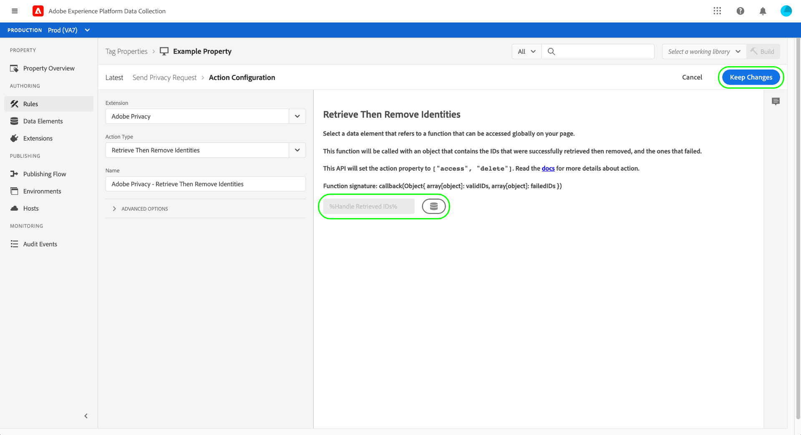

# Adobe 개인 정보 보호 확장 개요

>[!NOTE]
>
>Adobe Experience Platform Launch은 Adobe Experience Platform에서 데이터 수집 기술 세트로 브랜딩되었습니다. 그 결과로 제품 설명서 전반에서 몇 가지 용어 변경이 있었습니다. 용어 변경에 대한 통합 참고 자료는 다음 [문서](../../../term-updates.md)를 참조하십시오.

Adobe 개인 정보 태그 확장을 사용하면 클라이언트측 장치의 Adobe 솔루션별로 최종 사용자에게 할당된 사용자 ID를 수집 및 제거할 수 있습니다. 그런 다음 수집된 ID를에 보낼 수 있습니다 [Adobe Experience Platform Privacy Service](../../../../privacy-service/home.md) 지원되는 Adobe Experience Cloud 애플리케이션에서 관련 개인의 개인 데이터에 액세스하거나 삭제할 수 있습니다.

이 안내서에서는 Experience Platform UI 또는 데이터 수집 UI에서 Adobe 개인 정보 보호 확장을 설치하고 구성하는 방법을 설명합니다.

>[!NOTE]
>
>태그를 사용하지 않고 이러한 기능을 설치하려면 [개인 정보 JavaScript 라이브러리 개요](../../../../privacy-service/js-library.md) 를 참조하십시오.

##  확장 설치 및 구성

선택 **[!UICONTROL 확장]** 왼쪽 탐색에서 를 차례로 클릭하거나 **[!UICONTROL 카탈로그]** 탭. Adobe 개인 정보를 찾을 때까지 사용 가능한 확장 목록 범위를 좁히려면 검색 막대를 사용합니다. 선택 **[!UICONTROL 설치]** 계속하십시오.

다음 화면에서는 확장에서 ID를 수집할 소스 및 솔루션을 구성할 수 있습니다. 다음 솔루션은 확장에 대해 지원됩니다.

* Adobe Analytics (AA)
* Adobe Audience Manager (AAM)
* Adobe Target
* Adobe Experience Cloud Identity 서비스(방문자 또는 ECID)
* Adobe Advertising Cloud (AdCloud)

하나 이상의 솔루션을 선택한 다음 **[!UICONTROL 업데이트]**.

화면이 업데이트되어 선택한 솔루션에 따라 필요한 구성 매개 변수에 대한 입력을 표시합니다.

아래의 드롭다운 메뉴를 사용하여 구성에 솔루션별 매개 변수를 추가할 수도 있습니다.

>[!NOTE]
>
>의 섹션을 참조하십시오. [구성 매개 변수](../../../../privacy-service/js-library.md#config-params) 개인 정보 JavaScript 라이브러리 개요에서 지원되는 각 솔루션에 대해 허용되는 구성 값에 대한 자세한 내용을 확인하십시오.

선택한 솔루션에 대한 매개 변수 추가가 완료되면 을(를) 선택합니다 **[!UICONTROL 저장]** 구성을 저장합니다.

## 확장 사용 {#using}

Adobe 개인 정보 보호 확장은 [규칙](../../../ui/managing-resources/rules.md) 특정 이벤트가 발생하고 조건이 충족되는 경우:

* **[!UICONTROL ID 검색]**: 사용자의 저장된 ID 정보가 검색됩니다.
* **[!UICONTROL ID 제거]**: 사용자의 저장된 ID 정보가 제거됩니다.
* **[!UICONTROL Id 검색 후 제거]**: 사용자의 저장된 ID 정보를 검색한 후 제거됩니다.

위의 각 작업에 대해 검색된 ID 데이터를 개체 매개 변수로 수락 및 처리하는 콜백 JavaScript 함수를 제공해야 합니다. 여기에서 이러한 ID를 저장하거나, 표시하거나, 로 보낼 수 있습니다 [Privacy Service API](../../../../privacy-service/api/overview.md) 필요한 경우

Adobe 개인 정보 태그 확장을 사용할 때는 데이터 요소 형태로 필요한 콜백 함수를 제공해야 합니다. 이 데이터 요소를 구성하는 방법에 대한 단계는 다음 섹션을 참조하십시오.

### ID를 처리할 데이터 요소 정의

을(를) 선택하여 새 데이터 요소를 만드는 프로세스를 시작합니다 **[!UICONTROL 데이터 요소]** 왼쪽 탐색에서 를 차례로 클릭하거나 **[!UICONTROL 데이터 요소 추가]**. 구성 화면에 표시된 경우 **[!UICONTROL 코어]** 확장 및 **[!UICONTROL 사용자 지정 코드]** 를 반환합니다. 여기에서 을 선택합니다. **[!UICONTROL 편집기 열기]** 오른쪽 패널에 표시됩니다.

대화 상자가 표시되면 검색된 ID를 처리할 JavaScript 함수를 정의합니다. 콜백에는 단일 개체 형식 인수(`ids` 아래 예에서 ). 그러면 함수는 원하는 대로 ID를 처리할 수 있으며, 추가 처리를 위해 사이트에서 전체적으로 사용할 수 있는 모든 변수와 함수를 호출할 수도 있습니다.

>[!NOTE]
>
>의 구조에 대한 자세한 내용은 `ids` 콜백 함수가 처리해야 하는 개체는 [코드 샘플](../../../../privacy-service/js-library.md#samples) 개인 정보 JavaScript 라이브러리에 대한 개요에서 제공됩니다.

완료되면 을 선택합니다 **[!UICONTROL 저장]**.

다른 이벤트에 대해 다른 콜백이 필요한 경우 다른 사용자 지정 코드 데이터 요소를 계속 만들 수 있습니다.

### 개인 정보 보호 작업으로 규칙 만들기

검색된 ID를 처리하도록 콜백 데이터 요소를 구성한 후 필요한 다른 조건과 함께 사이트에서 특정 이벤트가 발생할 때마다 Adobe 개인 정보 보호 확장을 호출하는 규칙을 만들 수 있습니다.

규칙에 대한 작업을 구성할 때 을 선택합니다 **[!UICONTROL Adobe 개인 정보]** 확장 프로그램에 대해 설명합니다. 작업 유형에 대해 다음 중 하나를 선택합니다 [세 가지 함수](#using) 확장에서 제공합니다.

오른쪽 패널에 작업의 콜백으로 사용될 데이터 요소를 선택하라는 메시지가 표시됩니다. 데이터베이스 아이콘()을 클릭하여 목록에서 이전에 만든 데이터 요소를 선택합니다. 선택 **[!UICONTROL 변경 내용 유지]** 계속하십시오.

여기에서 필요한 이벤트 및 조건에서 Adobe 개인 정보 보호 작업이 실행되도록 규칙을 계속 구성할 수 있습니다. 만족하면 을 선택합니다 **[!UICONTROL 저장]**.

이제 라이브러리에 규칙을 추가하여 테스트를 위해 웹 사이트에 빌드로 배포할 수 있습니다. 의 개요를 참조하십시오. [태그 게시 흐름](../../../ui/publishing/overview.md) 추가 정보.

## 확장 비활성화 또는 제거

확장을 설치한 후에 확장을 비활성화하거나 삭제할 수 있습니다. 선택 **[!UICONTROL 구성]** 설치된 확장의 Adobe 개인 정보 보호 카드에서 다음 중 하나를 선택합니다 **[!UICONTROL 비활성화]** 또는 **[!UICONTROL 제거]**.

## 다음 단계

이 안내서에서는 UI에서 Adobe 개인 정보 태그 확장 사용을 다룹니다. 원시 코드를 사용하여 사용하는 방법의 예를 포함하여 확장에서 제공하는 기능에 대한 자세한 내용은 [개인 정보 JavaScript 라이브러리 개요](../../../../privacy-service/js-library.md) Privacy Service 설명서에서 을 참조하십시오.
