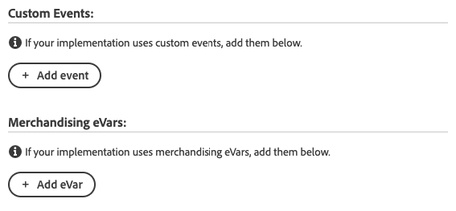

# Adobe Analytics 제품 문자열 확장 개요

>[!NOTE]
>
>Adobe Experience Platform Launch은 Adobe Experience Platform의 데이터 수집 기술군으로 새롭게 브랜딩되었습니다. 그 결과 제품 설명서에 몇 가지 용어 변경 사항이 적용되었습니다. 용어 변경에 대한 통합 참고 자료는 다음 [문서](../../../term-updates.md)를 참조하십시오.

`products` 변수는 사용자가 사이트에서 제품과 어떻게 상호 작용하는지를 추적합니다. 예를 들어 `products` 변수는 몇 번이나 제품을 보았는지, 장바구니에 추가했는지, 체크아웃했는지 및 구입했는지를 추적할 수 있습니다. 또한 사이트에 있는 머천다이징 카테고리의 상대적 효과를 추적할 수도 있습니다.

`products` 변수는 항상 성공 이벤트와 함께 설정해야 합니다.

[!DNL Adobe Analytics Product String Builder] 확장은 데이터 계층을 통해 반복하고 필요한 모든 제품 관련 데이터를 수집한 다음 아래 표시된 적절한 구문으로 형식을 지정하여 `products` 변수를 자동으로 설정합니다. 이러한 복잡한 작업을 수행하기 위해 더 이상 사용자 지정 JavaScript를 작성하고 유지 관리할 필요가 없습니다.

## 제품 변수 구문

```bash
Category;Product;Quantity;Price;eventN=X|eventN2=X2;eVarN=merch_category|eVarN2=merch_category2
```

전체 문서를 보려면 [제품](https://experienceleague.adobe.com/docs/analytics/implementation/vars/page-vars/products.html)을 참조하십시오.

## 확장 지침

### 작업 구성

규칙에 &quot;Adobe Analytics 제품 문자열 - s.products 설정&quot; 작업을 추가합니다.


### 표준 제품 데이터 설정

그런 다음 데이터 계층 변수를 정의합니다. 이전 단계에서 설명한 대로 작업을 구성하면 다음 화면이 나타납니다.


제품 문자열에 포함할 각 데이터 포인트에 대해 해당 데이터 계층 변수의 경로를 입력합니다.

예를 들어 데이터 계층이 다음과 같이 구성된 경우:

```json
digitalData = {
  "transaction": {
    "item": [{
      "productInfo": {
        "productName": "My Product"
      }
    }]
  }
};
```

&quot;제품 ID/이름에 대한 변수&quot; 필드에 다음 경로를 입력하여 `productName` 변수를 캡처합니다.

```json
digitalData.transaction.item.productInfo.productName
```

>[!NOTE]
>
>데이터 요소를 사용하여 필드를 채우는 경우 상수 또는 사용자 지정 코드 데이터 요소 유형을 사용하여 구성해야 하고, 위의 경로를 문자열 리터럴으로 반환해야 합니다.

### 가격 유형

`price` 제품 문자열의 [!DNL Adobe Analytics] 매개 변수는 해당 제품에 대한 단가가 아니라 구입한 단위 수에 대한 총 가격을 반영해야 합니다. 확장 프로그램 작업에서 가격 필드를 활성화할 때 데이터 계층에 총 가격 또는 단가를 표시할지 여부를 지정해야 합니다. 단가 사용 시 [!DNL Adobe Analytics Product String] 확장 프로그램은 단가와 수량을 자동으로 곱하여 총 가격을 얻고 제품 문자열을 적절하게 설정합니다.


### 사용자 지정 이벤트 및 머천다이징 eVar



구현에서 사용자 지정 이벤트 또는 머천다이징 eVar를 사용하는 경우 다음 단계를 수행합니다.

1. 연결된 **[!UICONTROL 추가]** 단추를 선택하십시오.
1. 드롭다운에서 설정해야 하는 이벤트 또는 eVar를 선택합니다.
1. 위에서 설명한 것과 동일한 구문을 사용하여 적절한 데이터 계층 변수의 경로를 입력합니다.

### 작업 시퀀스

이 작업은 해당 성공 이벤트와 &quot;Adobe Analytics - 비콘 보내기&quot; 작업을 설정하는 &quot;Adobe Analytics - 변수 설정&quot; 작업과 함께 수행해야 합니다. 적절한 작업 시퀀스가 아래에 나와 있습니다.


### 요구 사항

* 모든 제품 관련 데이터(예: 제품 ID, 수량, 가격)에 대한 변수와 함께 개체를 기반으로 한 [데이터 계층](https://theblog.adobe.com/data-layers-buzzword-best-practice/)입니다. 이 확장 프로그램은 어레이 기반 데이터 레이어에서 작동하지 않습니다.
* [Adobe Analytics](../analytics/overview.md) 확장 프로그램을 설치해야 합니다.
