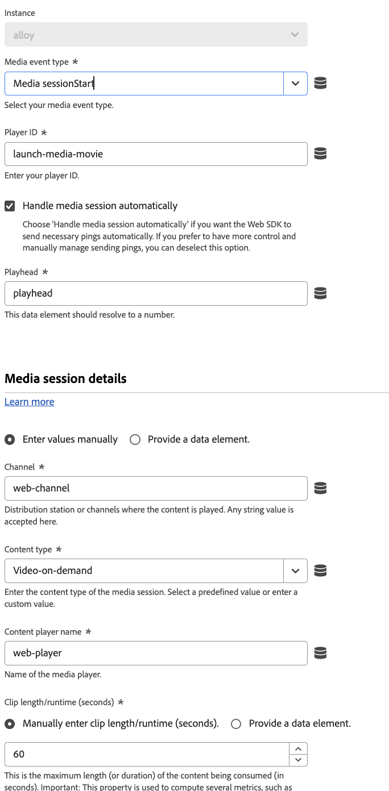

# 작업 유형

[Adobe Experience Platform Web SDK 태그 확장](web-sdk-extension-configuration.md)을 구성한 후에는 작업 유형을 구성해야 합니다.

이 페이지에서는 [Adobe Experience Platform Web SDK 태그 확장](web-sdk-extension-configuration.md)에서 지원하는 작업 유형을 설명합니다.

## 제안 적용 {#apply-propositions}

**[!UICONTROL 제안 적용]** 작업 유형을 사용하면 지표를 증가시키지 않고 단일 페이지 애플리케이션에서 제안을 렌더링할 수 있습니다.

이 작업 유형은 페이지의 일부가 다시 렌더링되는 단일 페이지 애플리케이션으로 작업할 때 유용하며, 페이지에 이미 적용된 개인화를 덮어쓸 수 있습니다.

다음과 같은 다양한 사용 사례에 이 작업 유형을 사용할 수 있습니다.

1. **mbox HTML 오퍼 렌더링**. **[!UICONTROL 이벤트 보내기]** 작업에서 범위 또는 표면을 통해 명시적으로 요청한 제안이 자동으로 렌더링되지 않습니다. 제안 메타데이터를 지정하여 **[!UICONTROL 제안 적용]** 작업 유형을 사용하여 웹 SDK에 이를 렌더링할 위치를 지정할 수 있습니다.
2. **단일 페이지 응용 프로그램의 보기에 대한 오퍼를 렌더링합니다**. 보기 변경 이벤트를 렌더링할 때 분석 데이터가 아직 준비되지 않은 경우 **[!UICONTROL 제안 적용]** 작업을 사용하여 페이지 상단의 보기 제안을 렌더링할 수 있습니다. 자세한 내용은 [페이지 이벤트 상단 및 하단(두 번째 페이지 보기 - 옵션 2)](../../../../web-sdk/use-cases/top-bottom-page-events.md)을 참조하십시오. 이를 사용하려면 양식에 **[!UICONTROL 보기 이름]**&#x200B;을(를) 입력하십시오.
3. **제안을 다시 렌더링합니다**. 사이트에서 React와 같은 프레임워크를 사용하여 콘텐츠를 다시 렌더링하는 경우 개인화를 다시 적용해야 할 수 있습니다. 이러한 경우 **[!UICONTROL 제안 적용]** 작업 유형을 사용하여 이 작업을 수행할 수 있습니다.

이 작업 유형은 렌더링된 제안에 대한 표시 이벤트를 보내지 않습니다. 렌더링된 제안을 추적하여 후속 **[!UICONTROL 이벤트 보내기]** 호출에 포함할 수 있도록 합니다.

이 작업 유형은 다음 필드를 지원합니다.

* **[!UICONTROL 제안]**: 다시 렌더링할 제안 개체의 배열입니다.
* **[!UICONTROL 보기 이름]**: 렌더링할 보기의 이름입니다.
* **[!UICONTROL 제안 메타데이터]**: HTML 오퍼를 적용할 수 있는 방법을 결정하는 개체입니다. 양식 또는 데이터 요소를 통해 이 정보를 제공할 수 있습니다. 여기에는 다음 속성이 포함됩니다.
   * **[!UICONTROL 범위]**
   * **[!UICONTROL 선택기]**
   * **[!UICONTROL 작업 유형]**

## 응답 적용 {#apply-response}

Edge Network의 응답을 기반으로 다양한 작업을 수행하려면 **[!UICONTROL 응답 적용]** 작업 유형을 사용하십시오. 이 작업 유형은 일반적으로 서버가 Edge Network을 처음 호출한 후 해당 호출에서 응답을 가져와 브라우저에서 웹 SDK을 초기화하는 하이브리드 배포에서 사용됩니다.

이 작업 유형을 사용하면 하이브리드 개인화 사용 사례에 대한 클라이언트 로드 시간이 줄어들 수 있습니다.

이 작업 유형은 다음 구성 옵션을 지원합니다.

* **[!UICONTROL 인스턴스]**: 사용 중인 웹 SDK 인스턴스를 선택합니다.
* **[!UICONTROL 응답 헤더]**: Edge Network 서버 호출에서 반환된 헤더 키 및 값이 포함된 개체를 반환하는 데이터 요소를 선택합니다.
* **[!UICONTROL 응답 본문]**: Edge Network 응답에서 제공한 JSON 페이로드가 포함된 개체를 반환하는 데이터 요소를 선택합니다.
* **[!UICONTROL 시각적 개인화 결정 렌더링]**: 이 옵션을 사용하여 Edge Network에서 제공하는 개인화 콘텐츠를 자동으로 렌더링하고 깜박임을 방지하기 위해 콘텐츠를 미리 숨깁니다.

## 규칙 세트 평가 {#evaluate-rulesets}

이 작업 유형은 규칙 세트 평가를 수동으로 트리거합니다. 규칙 세트는 브라우저 내 메시지와 같은 기능을 지원하기 위해 Adobe Journey Optimizer에서 반환됩니다.

이 작업 유형은 다음 옵션을 지원합니다.

* **[!UICONTROL 시각적 개인화 결정 렌더링]**: 일치하는 규칙 집합 항목에 대한 시각적 개인화 결정을 렌더링하려면 이 옵션을 활성화하십시오.
* **[!UICONTROL 의사 결정 컨텍스트]**: 온디바이스 의사 결정에 대한 Adobe Journey Optimizer 규칙 세트를 평가할 때 사용되는 키-값 맵입니다. 결정 컨텍스트를 수동으로 또는 데이터 요소를 통해 제공할 수 있습니다.

## Media Analytics 추적기 가져오기 {#get-media-analytics-tracker}

이 작업은 기존 Media Analytics API를 가져오는 데 사용됩니다. 작업을 구성하고 개체 이름이 제공되면 기존 Media Analytics API가 해당 창 개체로 내보내집니다. 아무 것도 제공되지 않으면 현재 Media JS 라이브러리와 마찬가지로 `window.Media`(으)로 내보내집니다.

## ID로 리디렉션 {#redirect-with-identity}

이 작업 유형을 사용하여 현재 페이지에서 다른 도메인으로 ID를 공유할 수 있습니다. 이 동작은 **[!UICONTROL click]** 이벤트 유형 및 값 비교 조건과 함께 사용하도록 디자인되었습니다. 이 작업 형식을 사용하는 방법에 대한 자세한 내용은 [Web SDK 확장을 사용하여 URL에 ID 추가](../../../../web-sdk/commands/appendidentitytourl.md#extension)를 참조하십시오.

## 이벤트 보내기 {#send-event}

Experience Platform에서 전송하는 데이터를 수집하고 해당 정보에 대해 조치를 취할 수 있도록 이벤트를 Experience Platform에 보냅니다. 전송하려는 모든 데이터는 **[!UICONTROL XDM 데이터]** 필드에서 전송할 수 있습니다. [!DNL XDM] 스키마의 구조를 준수하는 [!DNL JSON] 개체를 사용합니다. 이 개체는 페이지 또는 **[!UICONTROL 사용자 지정 코드]** **[!UICONTROL 데이터 요소]**&#x200B;를 통해 만들 수 있습니다.

**[!UICONTROL 이벤트 보내기]** 작업 형식은 아래에 설명된 필드와 설정을 지원합니다. 이러한 필드는 모두 선택 사항입니다.

### 인스턴스 설정 {#instance}

**[!UICONTROL 인스턴스]** 선택기를 사용하여 구성할 웹 SDK 인스턴스를 선택합니다. 인스턴스가 하나만 있는 경우 미리 선택됩니다.

* **[!UICONTROL 인스턴스]**: 구성할 웹 SDK 인스턴스를 선택합니다. 인스턴스가 하나만 있는 경우 미리 선택됩니다.
* **[!UICONTROL 안내 이벤트 사용]**: 특정 사용 사례를 활성화하기 위해 특정 필드를 자동으로 채우거나 숨기려면 이 옵션을 활성화하십시오. 이 옵션을 활성화하면 다음 설정이 표시됩니다.
   * **[!UICONTROL 개인화 요청]**: 이 이벤트는 페이지 맨 위에서 호출하기 위한 것입니다. 이 이벤트를 선택하면 다음 필드가 설정됩니다.
      * **[!UICONTROL 유형]**: **[!UICONTROL 의사 결정 제안 가져오기]**
      * **[!UICONTROL 자동으로 표시 이벤트 보내기]**: **[!UICONTROL false]**
      * 이 경우 자동으로 개인화를 렌더링하려면 **[!UICONTROL 시각적 개인화 결정 렌더링]** 옵션을 활성화하십시오.
   * **[!UICONTROL 분석 수집]**: 이 이벤트는 페이지 맨 아래에서 호출하기 위한 것입니다. 이 이벤트를 선택하면 다음 필드가 설정됩니다.
      * **[!UICONTROL 렌더링된 제안 포함]**: **[!UICONTROL 참]**
      * **[!UICONTROL Personalization]** 설정이 숨겨져 있습니다.

  >[!NOTE]
  >
  >안내 이벤트는 [페이지 이벤트의 상단 및 하단](../../../../web-sdk/use-cases/top-bottom-page-events.md)과(와) 관련되어 있습니다.

### 데이터 {#data}

* **[!UICONTROL 유형]**: 이 필드에서는 XDM 스키마에 기록될 이벤트 유형을 지정할 수 있습니다. 자세한 내용은 `sendEvent` 명령의 [`type`](/help/web-sdk/commands/sendevent/type.md)을(를) 참조하십시오.
* **[!UICONTROL XDM]**
* **[!UICONTROL 데이터]**: 이 필드를 사용하여 XDM 스키마와 일치하지 않는 데이터를 보냅니다. 이 필드는 Adobe Target 프로필을 업데이트하거나 Target Recommendations 속성을 보내려는 경우에 유용합니다. 자세한 내용은 `sendEvent` 명령의 [`data`](/help/web-sdk/commands/sendevent/data.md)을(를) 참조하십시오.
* **[!UICONTROL 렌더링된 제안 포함]**: 렌더링되었지만 표시 이벤트가 전송되지 않은 모든 제안을 포함하려면 이 옵션을 사용합니다. **[!UICONTROL 자동으로 표시 이벤트 보내기]**&#x200B;를 사용하지 않도록 설정한 상태로 동시에 사용합니다. 이 설정은 `_experience.decisioning` XDM 필드를 렌더링된 제안에 대한 정보로 업데이트합니다.
* **[!UICONTROL 문서가 언로드됩니다]**: 사용자가 페이지에서 멀리 탐색하더라도 이벤트가 서버에 도달하도록 하려면 이 옵션을 활성화하십시오. 이렇게 하면 이벤트가 서버에 도달할 수 있지만 응답은 무시됩니다.
* **[!UICONTROL 병합 ID]**: **이 필드는 사용되지 않습니다**. `eventMergeId` XDM 필드가 채워집니다.

### 개인화 {#personalization}

* **[!UICONTROL 범위]**: 개인화에서 명시적으로 요청할 범위(Adobe Target [!DNL mboxes])를 선택하십시오. 수동으로 또는 데이터 요소를 제공하여 범위를 입력할 수 있습니다.
* **[!UICONTROL 표면]**: 페이지에서 개인화를 사용할 수 있는 웹 표면을 설정합니다. 자세한 내용은 [Adobe Journey Optimizer 설명서](https://experienceleague.adobe.com/docs/journey-optimizer/using/web/create-web.html)를 참조하세요.
* **시각적 개인화 결정 렌더링:** 페이지에서 개인화된 콘텐츠를 렌더링하려면 **[!UICONTROL 시각적 개인화 결정 렌더링]** 확인란을 선택하십시오. 필요한 경우 결정 범위 및/또는 서피스를 지정할 수도 있습니다. 개인화된 콘텐츠를 렌더링하는 방법에 대한 자세한 내용은 [개인화 설명서](/help/web-sdk/personalization/rendering-personalization-content.md#automatically-rendering-content)를 참조하세요.
* **[!UICONTROL 기본 개인화 요청]**: 이 섹션을 사용하여 페이지 범위(글로벌 mbox)와 기본 표면(현재 URL을 기반으로 하는 웹 표면)을 요청할지 여부를 제어합니다. 기본적으로 페이지 로드 중 처음 `sendEvent` 호출 중에 자동으로 요청됩니다. 다음 옵션 중에서 선택할 수 있습니다.
   * **[!UICONTROL 자동]**: 기본 동작입니다. 아직 요청되지 않은 경우에만 기본 개인화를 요청합니다. 웹 SDK 명령에 설정되지 않은 `requestDefaultPersonalization`에 해당합니다.
   * **[!UICONTROL 사용]**: 페이지 범위 및 기본 표면을 명시적으로 요청합니다. SPA 보기 캐시를 업데이트합니다. `true`(으)로 설정된 `requestDefaultPersonalization`에 해당합니다.
   * **[!UICONTROL 사용 안 함]**: 페이지 범위 및 기본 표면에 대한 요청을 명시적으로 표시하지 않습니다. `false`(으)로 설정된 `requestDefaultPersonalization`에 해당합니다.
* **[!UICONTROL 의사 결정 컨텍스트]**: 온디바이스 의사 결정에 대한 Adobe Journey Optimizer 규칙 세트를 평가할 때 사용되는 키-값 맵입니다. 결정 컨텍스트를 수동으로 또는 데이터 요소를 통해 제공할 수 있습니다.

### 데이터 스트림 구성 재정의 {#datastream-overrides}

데이터스트림 재정의를 사용하면 Web SDK를 통해서 Edge Network에 전달되는 데이터스트림에 대한 추가 구성을 정의할 수 있습니다.

이렇게 하면 새 데이터 스트림을 만들거나 기존 설정을 수정하지 않고도 기본 데이터 스트림 비헤이비어와 다른 데이터 스트림 비헤이비어를 트리거할 수 있습니다. 자세한 내용은 [데이터 스트림 재정의 구성](web-sdk-extension-configuration.md#datastream-overrides)에 대한 설명서를 참조하십시오.

## 미디어 이벤트 보내기 {#send-media-event}

Adobe Experience Platform 및/또는 Adobe Analytics에 미디어 이벤트를 보냅니다. 이 작업은 웹 사이트에서 미디어 이벤트를 추적할 때 유용합니다. 인스턴스를 선택합니다(인스턴스가 두 개 이상인 경우). 작업에는 추적된 미디어 세션의 고유 식별자를 나타내는 `playerId`이(가) 필요합니다. 또한 미디어 세션을 시작할 때 **[!UICONTROL 체감 품질]** 및 `playhead` 데이터 요소가 필요합니다.

**[!UICONTROL 미디어 이벤트 보내기]** 작업 유형은 다음 속성을 지원합니다.

* **[!UICONTROL 인스턴스]**: 사용 중인 웹 SDK 인스턴스입니다.
* **[!UICONTROL 미디어 이벤트 유형]**: 추적 중인 미디어 이벤트의 유형입니다.
* **[!UICONTROL 플레이어 ID]**: 미디어 세션 고유 식별자입니다.
* **[!UICONTROL 재생 헤드]**: 미디어 재생의 현재 위치(초)입니다.
* **[!UICONTROL 미디어 세션 세부 정보]**: 미디어 시작 이벤트를 보낼 때 필요한 미디어 세션 세부 정보를 지정해야 합니다.
* **[!UICONTROL 챕터 세부 정보]**: 이 섹션에서 챕터 시작 미디어 이벤트를 보낼 때 챕터 세부 정보를 지정할 수 있습니다.
* **[!UICONTROL Advertising 세부 정보]**: `AdBreakStart` 이벤트를 보낼 때 필요한 광고 세부 정보를 지정해야 합니다.
* **[!UICONTROL Advertising pod 세부 정보]**: `AdStart` 이벤트를 보낼 때 광고 pod에 대한 세부 정보입니다.
* **[!UICONTROL 오류 세부 정보]**: 추적 중인 재생 오류에 대한 세부 정보입니다.
* **[!UICONTROL 상태 업데이트 세부 정보]**: 업데이트 중인 플레이어 상태입니다.
* **[!UICONTROL 사용자 지정 메타데이터]**: 추적 중인 미디어 이벤트에 대한 사용자 지정 메타데이터입니다.
* **[!UICONTROL 체감 품질]**: 추적 중인 체감 데이터의 미디어 품질입니다.

## 동의 설정 {#set-consent}

사용자로부터 동의를 받은 후에는 &quot;동의 설정&quot; 작업 유형을 사용하여 Adobe Experience Platform Web SDK에 이 동의를 전달해야 합니다. 현재 &quot;Adobe&quot; 및 &quot;IAB TCF&quot;, 2가지 유형의 표준이 지원됩니다. [고객 동의 환경 설정 지원](../../../../web-sdk/commands/setconsent.md)을 참조하십시오. Adobe 버전 2.0을 사용하는 경우 데이터 요소 값만 지원됩니다. 동의 오브젝트로 확인되는 데이터 요소를 만들어야 합니다.

이 작업에서는 동의를 받은 후 ID를 동기화할 수 있도록 ID 맵을 포함할 선택적 필드도 제공됩니다. 동기화는 동의 호출이 처음 실행될 수 있으므로 동의가 &quot;보류 중&quot; 또는 &quot;종료&quot;로 구성된 경우에 유용합니다.

## 변수 업데이트 {#update-variable}

이 작업을 사용하여 이벤트의 결과로 XDM 개체를 수정합니다. 이 작업은 나중에 **[!UICONTROL 이벤트 보내기]** 작업에서 참조할 수 있는 개체를 빌드하여 이벤트 XDM 개체를 기록하기 위한 것입니다.

이 작업 형식을 사용하려면 [변수](data-element-types.md#variable) 데이터 요소를 정의해야 합니다. 수정할 변수 데이터 요소를 선택하면 [XDM 개체](data-element-types.md#xdm-object) 데이터 요소의 편집기와 유사한 편집기가 나타납니다.

편집기에 사용되는 XDM 스키마는 [!UICONTROL 변수] 데이터 요소에서 선택한 스키마입니다. 왼쪽의 트리에서 속성 중 하나를 클릭한 다음 오른쪽의 값을 수정하여 개체의 속성을 하나 이상 설정할 수 있습니다.예를 들어 아래 스크린샷에서 producedBy 속성은 &quot;Produced by data element&quot; 데이터 요소로 설정됩니다.

변수 업데이트 작업의 편집기와 XDM 개체 데이터 요소의 편집기 간에는 몇 가지 차이점이 있습니다. 먼저 변수 업데이트 작업에 &quot;xdm&quot; 레이블이 지정된 루트 수준 항목이 있습니다. 이 항목을 클릭하면 전체 개체를 설정하는 데 사용할 데이터 요소를 지정할 수 있습니다. 둘째, 변수 업데이트 작업에는 xdm 개체에서 데이터를 지우는 확인란이 있습니다. 왼쪽의 속성 중 하나를 클릭한 다음 오른쪽의 확인란을 선택하여 값을 지웁니다. 이렇게 하면 변수에 값을 설정하기 전에 현재 값이 지워집니다.

## 다음 단계 {#next-steps}

이 문서를 읽고 나면 작업을 구성하는 방법을 더 잘 이해할 수 있습니다. 다음으로, [데이터 요소 유형을 구성](data-element-types.md)하는 방법에 대해 읽어 보십시오.
