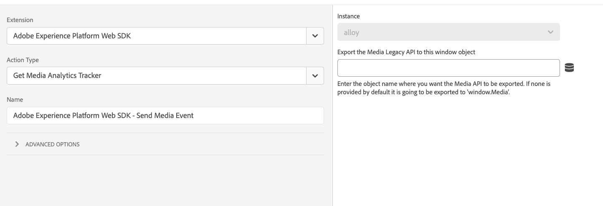

# Media Analytics 추적기 가져오기

**[!UICONTROL Get Media Analytics tracker]** 작업은 레거시 Media Analytics API를 가져오는 데 사용됩니다. 작업을 구성하고 개체 이름이 제공되면 기존 Media Analytics API가 해당 창 개체로 내보내집니다. 이 작업은 기존 Media Analytics에서 스트리밍 Media Analytics로 이동하는 데 유용합니다.

1. Adobe ID 자격 증명을 사용하여 [experience.adobe.com](https://experience.adobe.com)에 로그인합니다.
1. **[!UICONTROL Data Collection]** > **[!UICONTROL Tags]**(으)로 이동합니다.
1. 원하는 태그 속성을 선택합니다.
1. **[!UICONTROL Rules]**(으)로 이동한 다음 원하는 규칙을 선택합니다.
1. [!UICONTROL Actions]에서 기존 작업을 선택하거나 작업을 만듭니다.
1. [!UICONTROL Extension] 드롭다운 필드를 **[!UICONTROL Adobe Experience Platform Web SDK]**(으)로 설정한 다음 [!UICONTROL Action type]을(를) **[!UICONTROL Get Media Analytics tracker]**(으)로 설정합니다.

이 작업에는 구성할 수 있는 단일 필드가 포함되어 있습니다.

* **[!UICONTROL Export the Media Legacy API to this window object]**: Media Legacy API를 내보낼 개체를 선택합니다. 아무 것도 제공되지 않으면 작업이 API를 `window.Media`(으)로 내보냅니다.
