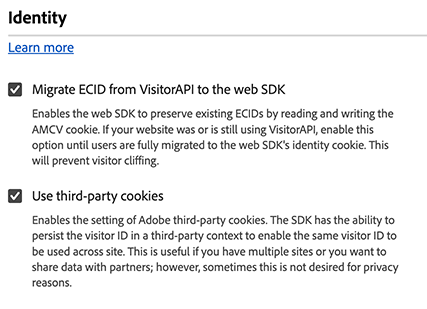

# ID 구성 설정

이 구성 섹션에서는 사용자 ID를 처리할 때 웹 SDK의 동작을 정의할 수 있습니다.

1. Adobe ID 자격 증명을 사용하여 [experience.adobe.com](https://experience.adobe.com)에 로그인합니다.
1. **[!UICONTROL Data Collection]** > **[!UICONTROL Tags]**(으)로 이동합니다.
1. 원하는 태그 속성을 선택합니다.
1. **[!UICONTROL Extensions]**(으)로 이동한 다음 **[!UICONTROL Configure]** 카드에서 [!UICONTROL Adobe Experience Platform Web SDK]을(를) 선택합니다.
1. **[!UICONTROL Identity]** 섹션까지 아래로 스크롤합니다.

다음 옵션을 사용할 수 있습니다.

## [!UICONTROL Migrate ECID from VisitorAPI]

웹 SDK에서 `AMCV` 및 `s_ecid` 쿠키를 읽고 `AMCV`에서 사용하는 `Visitor.js` 쿠키를 설정할 수 있는 확인란입니다. 이 기능은 `VisitorAPI.js`을(를) 사용하는 라이브러리에서 웹 SDK으로 마이그레이션할 때 중요합니다. 일부 페이지에서 여전히 `Visitor.js`을(를) 사용하고 있을 수 있기 때문입니다. 이 옵션을 사용하면 SDK에서 사용자가 두 명의 개별 사용자로 식별되지 않도록 동일한 ECID를 계속 사용할 수 있습니다. 이 확인란에 해당하는 JavaScript 라이브러리는 [`idMigrationEnabled`](/help/collection/js/commands/configure/idmigrationenabled.md)입니다.

## [!UICONTROL Use third-party cookies]

이 옵션이 활성화되면 웹 SDK은 사용자 ID를 서드파티 쿠키에 저장하려고 합니다. 성공하면 사용자는 각 도메인에서 별도의 사용자로 식별되지 않고 여러 도메인을 탐색할 때 단일 사용자로 식별됩니다. 이 옵션이 활성화된 경우, 브라우저가 서드파티 쿠키를 지원하지 않거나 사용자가 서드파티 쿠키를 허용하지 않도록 구성한 경우 SDK은 여전히 사용자 식별자를 서드파티 쿠키에 저장하지 못할 수 있습니다. 이 경우 SDK은 식별자를 자사 도메인에만 저장합니다. 이 확인란에 해당하는 JavaScript 라이브러리는 [`thirdPartyCookiesEnabled`](/help/collection/js/commands/configure/thirdpartycookiesenabled.md)입니다.

>[!IMPORTANT]
>
>타사 쿠키는 Web SDK의 [자사 장치 ID](/help/collection/use-cases/identity/first-party-device-ids.md) 기능과 호환되지 않습니다. 자사 디바이스 ID를 사용하거나 서드파티 쿠키를 사용할 수 있습니다. 두 기능을 동시에 사용할 수는 없습니다.
