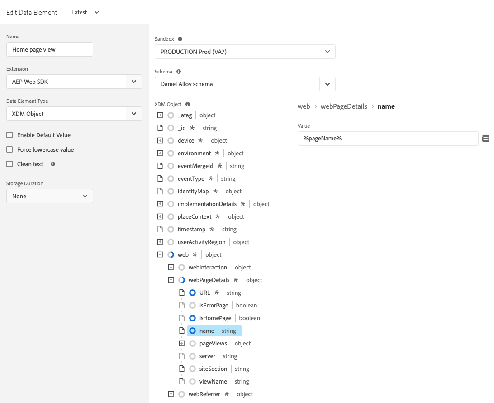

# 데이터 요소 유형

을(를) 설정한 후 [작업 유형](action-types.md) 다음에서 [Adobe Experience Platform 웹 SDK 태그 확장](web-sdk-extension-configuration.md), 데이터 요소 유형을 구성해야 합니다. 이 페이지에서는 사용 가능한 데이터 요소 유형에 대해 설명합니다.

## ID 맵 {#identity-map}

ID 맵을 사용하면 웹 페이지 방문자의 ID를 설정할 수 있습니다. ID 맵은 다음과 같은 네임스페이스로 구성됩니다. `CRMID`, `Phone` 또는 `Email`, 각 네임스페이스에 하나 이상의 식별자가 포함된 경우 예를 들어 웹 사이트의 개인이 두 개의 전화 번호를 제공한 경우 전화 네임스페이스에는 두 개의 식별자가 포함되어야 합니다.

다음에서 [!UICONTROL ID 맵] 데이터 요소에서는 각 식별자에 대해 다음 정보를 제공합니다.

* **[!UICONTROL ID]**: 방문자를 식별하는 값입니다. 예를 들어 식별자가 _전화_ 네임스페이스, [!UICONTROL ID] 다음과 같을 수 있습니다. _555-555-5555_. 이 값은 일반적으로 JavaScript 변수나 페이지의 다른 데이터에서 파생되므로 페이지 데이터를 참조하는 데이터 요소를 만든 다음 의 데이터 요소를 참조하는 것이 가장 좋습니다. [!UICONTROL ID] 필드 내 [!UICONTROL ID 맵] 데이터 요소입니다. 페이지에서 를 실행할 때 ID 값이 채워진 문자열이 아닌 경우 ID 맵에서 식별자가 자동으로 제거됩니다.
* **[!UICONTROL 인증 상태]**: 방문자가 인증되었는지 여부를 나타내는 선택 항목입니다.
* **[!UICONTROL 기본]**: 식별자를 개인의 기본 식별자로 사용할지 여부를 나타내는 선택 사항입니다. 기본 식별자로 표시된 식별자가 없으면 ECID가 기본 식별자로 사용됩니다.

>[!TIP]
>
>Adobe은 다음과 같이 개인을 나타내는 ID를 전송할 것을 권장합니다. `Luma CRM Id` 를 기본 ID로 사용하십시오.
>
>ID 맵에 개인 식별자가 포함된 경우(예: `Luma CRM Id`)를 입력하면 개인 식별자가 기본 식별자가 됩니다. 그렇지 않으면, `ECID` 는 기본 id가 됩니다.

다음을 제공해서는 안 됩니다. [!DNL ECID] id 맵을 작성하는 경우. SDK를 사용할 때 [!DNL ECID] 는 서버에서 자동으로 생성되며 id 맵에 포함됩니다.

ID 맵 데이터 요소는 종종 [[!UICONTROL XDM 개체] 데이터 요소 유형](#xdm-object) 및 [[!UICONTROL 동의 설정] 작업 유형](action-types.md#set-consent).

자세한 내용 [Adobe Experience Platform ID 서비스](../../../../identity-service/home.md).

## XDM 개체 {#xdm-object}

XDM 개체 데이터 요소를 사용하면 데이터를 XDM으로 더 쉽게 포맷할 수 있습니다. 이 데이터 요소를 처음 열면 올바른 Adobe Experience Platform 샌드박스 및 스키마를 선택합니다. 스키마를 선택하면 스키마 구조가 표시되어 쉽게 작성할 수 있습니다.

다음과 같은 스키마의 특정 필드를 열 경우 주의하십시오. `web.webPageDetails.URL`, 일부 항목은 자동으로 수집됩니다. 여러 항목이 자동으로 수집되지만 필요한 경우 덮어쓸 수 있습니다. 모든 값은 수동으로 채우거나 다른 데이터 요소를 사용할 수 있습니다.

>[!NOTE]
>
>수집하려는 정보만 입력하십시오. 작성되지 않은 내용은 데이터를 솔루션으로 보낼 때 생략됩니다.

## 변수 {#variable}

다음을 사용하여 페이로드 개체를 만들 수 있습니다. **[!UICONTROL 변수]** 데이터 요소입니다. 모두 [!UICONTROL XDM] 및 [!UICONTROL 데이터] 개체가 지원됩니다.

* 다음을 선택할 때 [!UICONTROL XDM]를 클릭하고 원하는 을 선택합니다 [!UICONTROL 샌드박스] 및 [!UICONTROL 스키마].
* 다음을 선택할 때 [!UICONTROL 데이터]를 클릭하고 원하는 솔루션을 선택합니다. 사용 가능한 솔루션은 다음과 같습니다 [!UICONTROL Adobe Analytics] 및 [!UICONTROL Adobe Target].

이 데이터 요소를 만든 후 [변수 업데이트](./action-types.md#update-variable) 수정 작업. 준비가 완료된 경우 이 데이터 요소를 [이벤트 보내기](./action-types.md#send-event) 데이터스트림으로 데이터를 전송하는 작업.

## 미디어: 체감 품질 {#quality-experience}

A **[!UICONTROL 체감 품질]** 데이터 요소는 스트리밍 미디어 이벤트를 Adobe Experience Platform에 전송할 때 유용합니다. 미디어 세션을 만들 때 이 요소를 추가할 수 있으며 다음 미디어 이벤트에는 업데이트된 경험 품질 데이터가 포함됩니다.

## 다음 단계 {#next-steps}

다음과 같은 특정 사용 사례에 대해 알아보기 [ECID 액세스](accessing-the-ecid.md).
