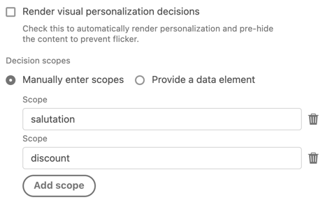

# 이벤트 유형

이 페이지에서는 Adobe Experience Platform Web SDK 태그 확장에서 제공하는 Adobe Experience Platform 이벤트 유형에 대해 설명합니다. [규칙 작성](https://experienceleague.adobe.com/docs/platform-learn/data-collection/tags/build-rules.html?lang=ko-KR)에 사용되며 [`xdm` 개체의 `eventType` 필드와 혼동하면 안 됩니다](/help/web-sdk/commands/sendevent/xdm.md).

## 후크 트리거 모니터링 {#monitoring-hook-triggered}

Adobe Experience Platform Web SDK에는 다양한 시스템 이벤트를 모니터링하는 데 사용할 수 있는 모니터링 후크가 포함되어 있습니다. 이러한 도구는 고유한 디버깅 도구를 개발하고 Web SDK 로그를 캡처하는 데 유용합니다.

각 모니터링 후크 이벤트에 포함된 매개 변수에 대한 자세한 내용은 [Web SDK 모니터링 후크 설명서](../../../../web-sdk/monitoring-hooks.md)를 참조하십시오.


Web SDK 태그 확장은 다음 모니터링 후크를 지원합니다.

* **[!UICONTROL onInstanceCreated]**: 이 모니터링 후크 이벤트는 새 웹 SDK 인스턴스를 성공적으로 만든 경우 트리거됩니다.
* **[!UICONTROL onInstanceConfigured]**: 이 모니터링 후크 이벤트는 [`configure`](../../../../web-sdk/commands/configure/overview.md) 명령이 정상적으로 확인될 때 웹 SDK에 의해 트리거됩니다.
* **[!UICONTROL onBeforeCommand]**: 이 모니터링 후크 이벤트는 다른 명령이 실행되기 전에 Web SDK에 의해 트리거됩니다. 이 모니터링 후크를 사용하여 특정 명령의 구성 옵션을 검색할 수 있습니다.
* **[!UICONTROL onCommandResolved]**: 이 모니터링 후크 이벤트는 명령 약속을 해결하기 전에 트리거됩니다. 이 함수를 사용하여 명령 옵션과 결과를 확인할 수 있습니다.
* **[!UICONTROL onCommandRejected]**: 이 모니터링 후크 이벤트는 명령 약속이 거부되고 오류 원인에 대한 정보가 포함되어 있을 때 트리거됩니다.
* **[!UICONTROL onBeforeNetworkRequest]**: 이 모니터링 후크 이벤트는 네트워크 요청이 실행되기 전에 트리거됩니다.
* **[!UICONTROL onNetworkResponse]**: 이 모니터링 후크 이벤트는 브라우저가 응답을 받을 때 트리거됩니다.
* **[!UICONTROL onNetworkError]**: 이 모니터링 후크 이벤트는 네트워크 요청이 실패할 때 트리거됩니다.
* **[!UICONTROL onBeforeLog]**: 이 모니터링 후크 이벤트는 Web SDK가 콘솔에 모든 항목을 기록하기 전에 트리거됩니다.
* **[!UICONTROL onContentRendering]**: 이 모니터링 후크 이벤트는 `personalization` 구성 요소에 의해 트리거되며 개인화 콘텐츠의 렌더링을 디버깅하는 데 도움이 됩니다. 이 이벤트는 다음과 같이 다른 상태를 가질 수 있습니다.
   * `rendering-started`: 웹 SDK에서 제안을 렌더링하려고 함을 나타냅니다. Web SDK에서 결정 범위나 보기를 렌더링하기 전에 `data` 개체에서 `personalization` 구성 요소와 범위 이름으로 렌더링하려는 제안을 볼 수 있습니다.
   * `no-offers`: 요청된 매개 변수에 대해 페이로드가 수신되지 않았음을 나타냅니다.
   * `rendering-failed`: 웹 SDK에서 제안을 렌더링하지 못했음을 나타냅니다.
   * `rendering-succeeded`: 결정 범위에 대한 렌더링이 완료되었음을 나타냅니다.
   * `rendering-redirect`: 웹 SDK에서 리디렉션 제안을 실행함을 나타냅니다.
* **[!UICONTROL onContentHiding]**: 이 모니터링 후크 이벤트는 사전 숨김 스타일이 적용되거나 제거될 때 트리거됩니다.


## [!UICONTROL 이벤트 보내기 완료]

일반적으로 속성에는 Adobe Experience Platform Edge Network에 이벤트를 보내기 위해 [[!UICONTROL 이벤트 보내기] 작업](action-types.md#send-event)을 사용하는 규칙이 하나 이상 있습니다. 이벤트가 Edge Network으로 전송될 때마다 유용한 데이터가 있는 응답이 브라우저에 반환됩니다. [!UICONTROL 이벤트 보내기 완료] 이벤트 유형이 없으면 이 반환된 데이터에 액세스할 수 없습니다.

반환된 데이터에 액세스하려면 별도의 규칙을 만든 다음 [!UICONTROL 이벤트 보내기 완료] 이벤트를 규칙에 추가하십시오. 이 규칙은 [!UICONTROL 이벤트 보내기] 작업의 결과로 서버에서 성공적인 응답을 받을 때마다 트리거됩니다.

[!UICONTROL 이벤트 보내기 완료] 이벤트가 규칙을 트리거할 때 서버에서 반환된 데이터를 제공하여 특정 작업을 수행하는 데 유용할 수 있습니다. 일반적으로 [!UICONTROL Core] 확장에서 [!UICONTROL 사용자 지정 코드] 작업을 [!UICONTROL 이벤트 보내기 완료] 이벤트를 포함하는 동일한 규칙에 추가합니다. [!UICONTROL 사용자 지정 코드] 작업에서 사용자 지정 코드는 이름이 `event`인 변수에 액세스할 수 있습니다. 이 `event` 변수에는 서버에서 반환된 데이터가 포함됩니다.

Edge Network에서 반환된 데이터를 처리하는 규칙은 다음과 같습니다.


다음은 이 규칙에서 [!UICONTROL 사용자 지정 코드] 작업을 사용하여 특정 작업을 수행하는 방법에 대한 몇 가지 예입니다.

### 개인화된 콘텐츠 수동 렌더링

응답 데이터 처리 규칙에 있는 사용자 지정 코드 작업에서 서버에서 반환된 개인화 제안에 액세스할 수 있습니다. 이렇게 하려면 다음 사용자 지정 코드를 입력합니다.

```javascript
var propositions = event.propositions;
```

`event.propositions`이(가) 있으면 개인화 제안 개체가 포함된 배열입니다. 배열에 포함된 제안은 대부분 이벤트를 서버에 보낸 방식에 따라 결정됩니다.

이 첫 번째 시나리오에서는 [!UICONTROL 결정 렌더링] 확인란을 선택하지 않았고 이벤트를 보내는 [!UICONTROL 이벤트 보내기] 작업 내에 [!UICONTROL 결정 범위]를 제공하지 않았다고 가정해 봅니다.


이 예제에서 `propositions` 배열에는 자동 렌더링에 적합한 이벤트와 관련된 제안만 포함됩니다.

`propositions` 배열은 다음 예제와 유사할 수 있습니다.

```json
[
  {
    "id": "AT:eyJhY3Rpdml0eUlkIjoiMTI3MDE5IiwiZXhwZXJpZW5jZUlkIjoiMCJ9",
    "scope": "__view__",
    "items": [
      {
        "id": "11223344",
        "schema": "https://ns.adobe.com/personalization/dom-action",
        "data": {
          "content": "<h2 style=\"color: yellow\">An HTML proposition.</h2>",
          "selector": "#hero",
          "type": "setHtml"
        },
        "meta": {}
      }
    ],
    "renderAttempted": false
  },
  {
    "id": "AT:PyJhY3Rpdml0eUlkIjoiMTI3MDE5IiwiZXhwZXJpZW5jZUlkIjoiMCJ8",
    "scope": "__view__",
    "items": [
      {
        "id": "11223345",
        "schema": "https://ns.adobe.com/personalization/dom-action",
        "data": {
          "content": "<h2 style=\"color: yellow\">Another HTML proposition.</h2>",
          "selector": "#sidebar",
          "type": "setHtml"
        },
        "meta": {}
      }
    ],
    "renderAttempted": false
  }
]
```

이벤트를 보낼 때 [!UICONTROL 결정 렌더링] 확인란이 선택되어 있지 않으므로 SDK에서 콘텐츠를 자동으로 렌더링하지 않았습니다. 그러나 SDK는 자동 렌더링에 적합한 콘텐츠를 계속 자동으로 검색했으며, 원하는 경우 수동으로 렌더링하도록 제공했습니다. 각 제안 개체의 `renderAttempted` 속성이 `false`(으)로 설정되어 있습니다.

이벤트를 보낼 때 대신 [!UICONTROL 결정 렌더링] 확인란을 선택했다면 SDK에서 자동 렌더링에 적합한 제안을 렌더링하려고 했을 것입니다. 따라서 각 제안 객체의 `renderAttempted` 속성은 `true`(으)로 설정됩니다. 이 경우 이러한 제안을 수동으로 렌더링할 필요가 없습니다.

지금까지 자동 렌더링에 적합한 개인화 콘텐츠(예: Adobe Target의 시각적 경험 작성기에서 만든 콘텐츠)만 살펴보았습니다. 자동 렌더링에 적합하지 않은 _개인화 콘텐츠를 검색하려면 [!UICONTROL 이벤트 보내기] 작업의 [!UICONTROL 결정 범위] 필드를 사용하여 결정 범위를 제공하여 콘텐츠를 요청하십시오._ 범위는 서버에서 검색할 특정 제안을 식별하는 문자열입니다.

[!UICONTROL 이벤트 보내기] 작업은 다음과 같습니다.



이 예제에서 `salutation` 또는 `discount` 범위와 일치하는 서버에 제안이 있으면 반환되어 `propositions` 배열에 포함됩니다. [!UICONTROL 이벤트 보내기] 작업에서 [!UICONTROL 렌더링 결정] 또는 [!UICONTROL 결정 범위] 필드를 구성하는 방법에 관계없이 자동 렌더링에 적합한 제안이 `propositions` 배열에 계속 포함됩니다. 이 경우 `propositions` 배열은 다음 예제와 비슷합니다.

```json
[
  {
    "id": "AT:cZJhY3Rpdml0eUlkIjoiMTI3MDE5IiwiZXhwZXJpZW5jZUlkIjoiMCJ2",
    "scope": "salutation",
    "items": [
      {
        "schema": "https://ns.adobe.com/personalization/json-content-item",
        "data": {
          "id": "4433221",
          "content": {
            "salutation": "Welcome, esteemed visitor!"
          }
        },
        "meta": {}
      }
    ],
    "renderAttempted": false
  },
  {
    "id": "AT:FZJhY3Rpdml0eUlkIjoiMTI3MDE5IiwiZXhwZXJpZW5jZUlkIjoiMCJ0",
    "scope": "discount",
    "items": [
      {
        "schema": "https://ns.adobe.com/personalization/html-content-item",
        "data": {
          "id": "4433222",
          "content": "<div>50% off your order!</div>",
          "format": "text/html"
        },
        "meta": {}
      }
    ],
    "renderAttempted": false
  },
  {
    "id": "AT:eyJhY3Rpdml0eUlkIjoiMTI3MDE5IiwiZXhwZXJpZW5jZUlkIjoiMCJ9",
    "scope": "__view__",
    "items": [
      {
        "id": "11223344",
        "schema": "https://ns.adobe.com/personalization/dom-action",
        "data": {
          "content": "<h2 style=\"color: yellow\">An HTML proposition.</h2>",
          "selector": "#hero",
          "type": "setHtml"
        },
        "meta": {}
      }
    ],
    "renderAttempted": false
  },
  {
    "id": "AT:PyJhY3Rpdml0eUlkIjoiMTI3MDE5IiwiZXhwZXJpZW5jZUlkIjoiMCJ8",
    "scope": "__view__",
    "items": [
      {
        "id": "11223345",
        "schema": "https://ns.adobe.com/personalization/dom-action",
        "data": {
          "content": "<h2 style=\"color: yellow\">Another HTML proposition.</h2>",
          "selector": "#sidebar",
          "type": "setHtml"
        },
        "meta": {}
      }
    ],
    "renderAttempted": false
  }
]
```

이 시점에서 맞춤법이 보이는 대로 제안 콘텐츠를 렌더링할 수 있습니다. 이 예에서 `discount` 범위와 일치하는 HTML은 Adobe Target의 양식 기반 경험 작성기를 사용하여 작성된 경험 제안입니다. 페이지에 ID가 `daily-special`인 요소가 있고 `discount` 제안의 콘텐츠를 `daily-special` 요소로 렌더링하려고 한다고 가정해 보십시오. 다음을 수행합니다.

1. `event` 개체에서 제안을 추출합니다.
1. `discount` 범위의 제안을 찾아 각 제안을 반복합니다.
1. 명제를 찾으면 명제의 각 항목을 반복하여 HTML 콘텐츠인 항목을 찾습니다. (가정하는 것보다 확인하는 것이 좋습니다.)
1. HTML 콘텐츠가 들어 있는 항목을 찾으면 페이지에서 `daily-special` 요소를 찾아 해당 HTML을 개인화된 콘텐츠로 바꾸십시오.

[!UICONTROL 사용자 지정 코드] 작업 내의 사용자 지정 코드가 다음과 같이 나타날 수 있습니다.

```javascript
var propositions = event.propositions;

var discountProposition;
if (propositions) {
  // Find the discount proposition, if it exists.
  for (var i = 0; i < propositions.length; i++) {
    var proposition = propositions[i]; 
    if (proposition.scope === "discount") {
      discountProposition = proposition;
      break;
    }
  }
}

var discountHtml;
if (discountProposition) {
  // Find the item from proposition that should be rendered.
  // Rather than assuming there a single item that has HTML
  // content, find the first item whose schema indicates
  // it contains HTML content.
  for (var j = 0; j < discountProposition.items.length; j++) {
    var discountPropositionItem = discountProposition.items[i]; 
    if (discountPropositionItem.schema === "https://ns.adobe.com/personalization/html-content-item") {
      discountHtml = discountPropositionItem.data.content;
      break;
    }
  }
}

if (discountHtml) {
  // Discount HTML exists. Time to render it.
  var dailySpecialElement = document.getElementById("daily-special");
  dailySpecialElement.innerHTML = discountHtml;
}
```

### Adobe Target 응답 토큰 액세스

Adobe Target에서 반환된 Personalization 콘텐츠에는 활동, 오퍼, 경험, 사용자 프로필, 지역 정보 등에 대한 세부 정보인 [응답 토큰](https://experienceleague.adobe.com/docs/target/using/administer/response-tokens.html?lang=ko)이 포함됩니다. 이러한 세부 정보는 서드파티 도구와 공유하거나 디버깅에 사용할 수 있습니다. Adobe Target 사용자 인터페이스에서 응답 토큰을 구성할 수 있습니다.

응답 데이터 처리 규칙에 있는 사용자 지정 코드 작업에서 서버에서 반환된 개인화 제안에 액세스할 수 있습니다. 이렇게 하려면 다음 사용자 지정 코드를 입력합니다.

```javascript
var propositions = event.propositions;
```

`event.propositions`이(가) 있으면 개인화 제안 개체가 포함된 배열입니다. `result.propositions`의 콘텐츠에 대한 자세한 내용은 [개인화된 콘텐츠를 수동으로 렌더링](#manually-render-personalized-content)을 참조하십시오.

웹 SDK에서 자동으로 렌더링된 모든 명제에서 모든 활동 이름을 수집하여 단일 배열로 푸시한다고 가정합니다. 그런 다음 단일 스토리지를 서드파티로 전송할 수 있습니다. 이 경우 [!UICONTROL 사용자 지정 코드] 작업 내에 사용자 지정 코드를 작성하십시오.

1. `event` 개체에서 제안을 추출합니다.
1. 각 제안을 반복합니다.
1. SDK가 제안을 제공했는지 확인합니다.
1. 그렇다면, 명제의 각 항목을 반복해라.
1. 응답 토큰이 포함된 개체인 `meta` 속성에서 활동 이름을 검색합니다.
1. 활동 이름을 배열에 푸시합니다.
1. 활동 이름을 서드파티에 보냅니다.

```javascript
var propositions = event.propositions;
if (propositions) {
  var activityNames = [];
  propositions.forEach(function(proposition) {
    if (proposition.renderAttempted) {
      proposition.items.forEach(function(item) {
        if (item.meta) {
          // item.meta contains the response tokens.
          var activityName = item.meta["activity.name"];
          // Ignore duplicates
          if (activityNames.indexOf(activityName) === -1) {
            activityNames.push(activityName);  
          }
        }
      });
    }
  });
  // Now that activity names are in an array,
  // you can send them to a third party or use
  // them in some other way.
}
```

## [!UICONTROL 규칙 집합 항목 구독] {#subscribe-ruleset-items}

**[!UICONTROL 규칙 집합 항목 구독]** 이벤트 유형을 사용하면 표면에 대해 Adobe Journey Optimizer 콘텐츠 카드에 가입할 수 있습니다. 규칙 세트가 평가될 때마다 이 명령에 제공된 콜백은 콘텐츠 카드 데이터를 보유하는 제안에 따라 결과 개체를 수신합니다.


이 이벤트 유형은 다음과 같은 구성 가능한 속성을 지원합니다.

* **[!UICONTROL 스키마]**: 콘텐츠 카드를 구독하려는 스키마 배열입니다. 수동으로 또는 데이터 요소를 제공하여 스키마를 입력할 수 있습니다.
* **[!UICONTROL 표면]**: 콘텐츠 카드를 구독하려는 표면 배열입니다. 수동으로 또는 데이터 요소를 제공하여 서피스를 입력할 수 있습니다.
