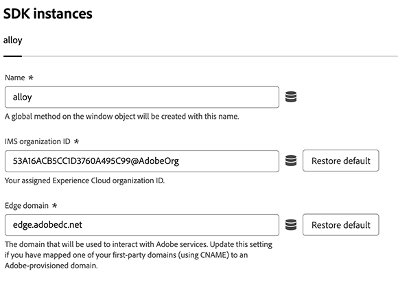

# 웹 SDK 태그 확장 구성

다음 [!DNL Web SDK] 태그 확장은 Experience Platform Edge Network를 통해 웹 속성에서 Adobe Experience Cloud으로 데이터를 전송합니다.

확장을 사용하면 데이터를 Platform으로 스트리밍하고 ID를 동기화하며 고객 동의 신호를 처리하고 컨텍스트 데이터를 자동으로 수집할 수 있습니다.

이 문서에서는 태그 UI에서 태그 확장을 구성하는 방법을 설명합니다.

## 웹 SDK 태그 확장 설치 {#install}

Web SDK 태그 확장 프로그램은에 설치할 속성이 필요합니다. 아직 이 작업을 수행하지 않았다면 의 설명서를 참조하십시오. [태그 속성 만들기](https://experienceleague.adobe.com/docs/platform-learn/implement-in-websites/configure-tags/create-a-property.html).

속성을 만든 후 속성을 열고 **[!UICONTROL 확장]** 왼쪽 막대의 탭입니다.

다음 항목 선택 **[!UICONTROL 카탈로그]** 탭. 사용 가능한 확장 목록에서 [!DNL Web SDK] 확장 및 선택 **[!UICONTROL 설치]**.

선택 후 **[!UICONTROL 설치]**, 웹 SDK 태그 확장을 구성하고 구성을 저장해야 합니다.

>[!NOTE]
>
>태그 확장은 구성을 저장한 후에만 설치됩니다. 태그 확장을 구성하는 방법을 알려면 다음 섹션을 참조하십시오.

## 인스턴스 설정 구성 {#general}

페이지 상단의 구성 옵션은 Adobe Experience Platform에 데이터를 라우팅할 위치와 서버에서 사용할 구성을 알려줍니다.

* **[!UICONTROL 이름]**: Adobe Experience Platform 웹 SDK 확장은 페이지에서 여러 인스턴스를 지원합니다. 이 이름은 태그 구성이 있는 여러 조직에 데이터를 전송하는 데 사용됩니다. 인스턴스 이름의 기본값은 입니다. `alloy`. 그러나 인스턴스 이름을 유효한 JavaScript 개체 이름으로 변경할 수 있습니다.
* **[!UICONTROL IMS 조직 ID]**: Adobe 시 데이터를 전송할 조직의 ID입니다. 대부분의 경우 자동으로 채워진 기본값을 사용합니다. 페이지에 인스턴스가 여러 개 있으면 이 필드를 데이터를 보낼 두 번째 조직의 값으로 채웁니다.
* **[!UICONTROL Edge 도메인]**: 확장에서 데이터를 보내고 받는 도메인입니다. Adobe은 이 확장에 자사 도메인(CNAME)을 사용하는 것을 권장합니다. 기본 타사 도메인은 개발 환경에서 작동하지만, 프로덕션 환경에는 적합하지 않습니다. 자사 CNAME을 설정하는 방법에 대한 지침은 [여기](https://experienceleague.adobe.com/docs/core-services/interface/ec-cookies/cookies-first-party.html?lang=ko-KR)에 나와 있습니다.

## 데이터 스트림 설정 구성 {#datastreams}

이 섹션에서는 사용 가능한 세 가지 환경(프로덕션, 스테이징 및 개발) 각각에 대해 사용해야 하는 데이터스트림을 선택할 수 있습니다.

Edge Network로 요청을 보낼 때 서버측 구성을 참조하는 데 데이터스트림 ID가 사용됩니다. 웹 사이트에서 코드를 변경하지 않고도 구성을 업데이트할 수 있습니다.

다음 안내서를 참조하십시오 [데이터스트림](../../../../datastreams/overview.md) 데이터 스트림을 구성하는 방법에 대해 알아봅니다.

사용 가능한 드롭다운 메뉴에서 데이터 스트림을 선택하거나 **[!UICONTROL 값 입력]** 각 환경에 대한 사용자 지정 데이터 스트림 ID를 입력합니다.

## 개인 정보 설정 구성 {#privacy}

이 섹션에서는 Web SDK가 웹 사이트의 사용자 동의 신호를 처리하는 방법을 구성할 수 있습니다. 특히, 다른 명시적 동의 환경 설정이 제공되지 않은 경우 사용자가 가정한 기본 동의 수준을 선택할 수 있습니다.

기본 동의 수준이 사용자 프로필에 저장되지 않습니다.

| [!UICONTROL 기본 동의 수준] | 설명 |
| --- | --- |
| [!UICONTROL 위치] | 사용자가 동의 환경 설정을 제공하기 전에 발생하는 이벤트를 수집합니다. |
| [!UICONTROL 출력] | 사용자가 동의 환경 설정을 제공하기 전에 발생하는 이벤트를 무시합니다. |
| [!UICONTROL 보류 중] | 사용자가 동의 환경 설정을 제공하기 전에 발생하는 큐 이벤트. 동의 환경 설정이 제공되면 제공된 환경 설정에 따라 이벤트가 수집되거나 삭제됩니다. |
| [!UICONTROL 데이터 요소에서 제공] | 기본 동의 수준은 사용자가 정의하는 별도의 데이터 요소에 의해 결정됩니다. 이 옵션을 사용하는 경우 제공된 드롭다운 메뉴를 사용하여 데이터 요소를 지정해야 합니다. |

>[!TIP]
>
>사용 **[!UICONTROL 출력]** 또는 **[!UICONTROL 보류 중]** 비즈니스 운영에 대해 명시적인 사용자 동의가 필요한 경우.

## ID 설정 구성 {#identity}

이 섹션에서는 사용자 ID를 처리할 때 웹 SDK의 동작을 정의할 수 있습니다.

* **[!UICONTROL VisitorAPI에서 ECID 마이그레이션]**: 이 옵션은 기본적으로 활성화되어 있습니다. 이 기능이 활성화되면 SDK는 `AMCV` 및 `s_ecid` 쿠키 및 설정 `AMCV` 사용한 쿠키 [!DNL Visitor.js]. 이 기능은 일부 페이지에서 를 사용하고 있을 수 있으므로 Web SDK로 마이그레이션할 때 중요합니다 [!DNL Visitor.js]. 이 옵션을 사용하면 SDK에서 동일한 옵션을 계속 사용할 수 있습니다 [!DNL ECID] 따라서 사용자가 두 명의 개별 사용자로 식별되지 않습니다.
* **[!UICONTROL 서드파티 쿠키 사용]**: 이 옵션이 활성화되면 Web SDK는 사용자 식별자를 서드파티 쿠키에 저장하려고 합니다. 성공하면 사용자는 각 도메인에서 별도의 사용자로 식별되지 않고 여러 도메인을 탐색할 때 단일 사용자로 식별됩니다. 이 옵션이 활성화된 경우 브라우저가 서드파티 쿠키를 지원하지 않거나 사용자가 서드파티 쿠키를 허용하지 않도록 구성한 경우 SDK에서 여전히 서드파티 쿠키에 사용자 식별자를 저장하지 못할 수 있습니다. 이 경우 SDK는 자사 도메인에만 식별자를 저장합니다.

  >[!IMPORTANT]
  >>서드파티 쿠키는 [자사 디바이스 ID](../../../../edge/identity/first-party-device-ids.md) Web SDK의 기능입니다.
자사 디바이스 ID를 사용하거나 서드파티 쿠키를 사용할 수 있지만 두 기능을 동시에 사용할 수는 없습니다.
  >
## 개인화 설정 구성 {#personalization}

이 섹션에서는 개인화된 콘텐츠가 로드되는 동안 페이지의 특정 부분을 숨기는 방법을 구성할 수 있습니다. 이렇게 하면 방문자에게만 개인화된 페이지가 표시됩니다.

* **[!UICONTROL Target을 at.js에서 Web SDK로 마이그레이션]**: 이 옵션을 사용하여 활성화합니다 [!DNL Web SDK] 기존 을 읽고 씁니다. `mbox` 및 `mboxEdgeCluster` at.js에서 사용하는 쿠키 `1.x` 또는 `2.x` 라이브러리. 이렇게 하면 Web SDK를 사용하는 페이지에서 at.js를 사용하는 페이지로 이동하는 동안 방문자 프로필을 유지하는 데 도움이 됩니다 `1.x` 또는 `2.x` 라이브러리 및 그 반대의 경우도 가능합니다.

### 스타일 미리 숨기기 {#prehiding-style}

스타일 편집기 사전 숨김을 사용하면 사용자 지정 CSS 규칙을 정의하여 페이지의 특정 섹션을 숨길 수 있습니다. 페이지가 로드되면 Web SDK는 이 스타일을 사용하여 개인화해야 하는 섹션을 숨기고 개인화를 검색한 다음 개인화된 페이지 섹션을 숨김을 해제합니다. 이렇게 하면 방문자는 개인화 검색 프로세스를 보지 않고도 이미 개인화된 페이지를 볼 수 있습니다.

### 코드 조각 사전 숨김 {#prehiding-snippet}

코드 조각 사전 숨김은 Web SDK 라이브러리가 비동기적으로 로드될 때 유용합니다. 이 경우 깜박임을 방지하려면 Web SDK 라이브러리가 로드되기 전에 콘텐츠를 숨기는 것이 좋습니다.

코드 조각 사전 숨김을 사용하려면 코드 조각을 복사하여 내부에 붙여 넣습니다. `<head>` 페이지의 요소입니다.

>[!IMPORTANT]
>
Adobe 코드 조각 사전 숨김을 사용하는 경우 동일한 항목을 사용하는 것이 좋습니다 [!DNL CSS] 에서 사용하는 규칙입니다. [스타일 미리 숨기기](#prehiding-style).

## 데이터 수집 설정 구성 {#data-collection}

* **[!UICONTROL 콜백 함수]**: 확장에 제공된 콜백 함수를 라고 합니다. [`onBeforeEventSend` 함수](https://experienceleague.adobe.com/docs/experience-platform/edge/fundamentals/configuring-the-sdk.html?lang=ko-KR) 라이브러리에 있습니다. 이 함수를 사용하면 Edge Network로 전송되기 전에 이벤트를 전체적으로 수정할 수 있습니다. 이 기능을 사용하는 방법에 대한 자세한 정보는 을 찾을 수 있다 [여기](../../../../edge/fundamentals/tracking-events.md#modifying-events-globally).
* **[!UICONTROL 클릭 데이터 수집 활성화]**: Web SDK는 자동으로 링크 클릭 정보를 수집할 수 있습니다. 기본적으로 이 기능은 활성화되어 있지만 이 옵션을 사용하여 비활성화할 수 있습니다. 또한 링크의 레이블은 다음에 나열된 다운로드 표현식 중 하나를 포함하는 경우 다운로드 링크로 표시됩니다. [!UICONTROL 다운로드 링크 한정자] 텍스트 상자. Adobe은 몇 가지 기본 다운로드 링크 한정자를 제공합니다. 필요에 따라 편집할 수 있습니다.
* **[!UICONTROL 자동으로 수집된 컨텍스트 데이터]**: 기본적으로 Web SDK는 장치, 웹, 환경 및 위치 컨텍스트와 관련된 특정 컨텍스트 데이터를 수집합니다. Adobe이 수집하는 정보 목록을 보고 싶다면 찾을 수 있다 [여기](../../../../edge/data-collection/automatic-information.md). 이 데이터를 수집하지 않거나 특정 범주의 데이터만 수집하려면 다음을 선택합니다. **[!UICONTROL 특정 컨텍스트 정보]** 수집할 데이터를 선택합니다.

## 데이터스트림 재정의 구성 {#datastream-overrides}

데이터스트림 재정의를 사용하면 Web SDK를 통해서 Edge Network에 전달되는 데이터스트림에 대한 추가 구성을 정의할 수 있습니다.

이렇게 하면 새 데이터스트림을 생성하거나 기존 설정을 수정하지 않고도 기본 비헤이비어와 다른 데이터스트림 비헤이비어를 트리거할 수 있습니다.

데이터스트림 구성 재정의는 2단계 프로세스입니다.

1. 먼저 [데이터스트림 구성 페이지](../../../../datastreams/configure.md)에서 데이터스트림 구성 재정의를 정의해야 합니다.
2. 그런 다음 Web SDK 명령을 통하거나 Web SDK 태그 확장을 사용하여 Edge 네트워크에 재정의를 전송해야 합니다.

데이터 스트림 보기 [구성 재정의 설명서](../../../../datastreams/overrides.md) 데이터스트림 구성을 재정의하는 방법에 대한 자세한 지침을 확인하십시오.

웹 SDK 명령을 통해 재정의를 전달하는 대신 아래 표시된 태그 확장 화면에서 재정의를 구성할 수 있습니다.

>[!IMPORTANT]
>
데이터 스트림 재정의는 환경별로 구성해야 합니다. 개발, 스테이징 및 프로덕션 환경에는 모두 별도의 재정의가 있습니다. 아래 화면에 표시된 전용 옵션을 사용하여 설정 간을 복사할 수 있습니다.

## 고급 설정 구성

사용 **[!UICONTROL 가장자리 기준 경로]** Edge 네트워크와 상호 작용하는 데 사용되는 기본 경로를 변경해야 하는 경우 필드입니다. 이 경우 업데이트가 필요하지 않지만 Beta 또는 알파에 참여하는 경우 Adobe에서 이 필드를 변경하도록 요청할 수 있습니다.

