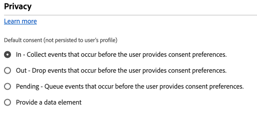
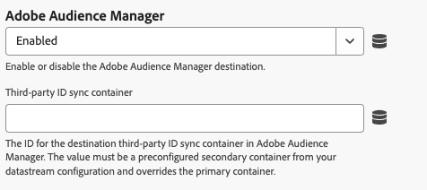

# 웹 SDK 태그 확장 구성

[!DNL Web SDK] 태그 확장은 Experience Platform Edge Network을 통해 웹 속성에서 Adobe Experience Cloud으로 데이터를 전송합니다.

확장을 사용하면 데이터를 Experience Platform에 스트리밍하고, ID를 동기화하고, 고객 동의 신호를 처리하고, 컨텍스트 데이터를 자동으로 수집할 수 있습니다.

이 문서에서는 태그 UI에서 태그 확장을 구성하는 방법을 설명합니다.

## 웹 SDK 태그 확장 설치 {#install}

웹 SDK 태그 확장 기능이에 속성을 설치해야 합니다. 아직 작성하지 않았다면 [태그 속성 만들기](https://experienceleague.adobe.com/docs/platform-learn/implement-in-websites/configure-tags/create-a-property.html)에 대한 설명서를 참조하십시오.

속성을 만든 후 속성을 열고 왼쪽 막대에서 **[!UICONTROL 확장]** 탭을 선택합니다.

**[!UICONTROL 카탈로그]** 탭을 선택합니다. 사용 가능한 확장 목록에서 [!DNL Web SDK] 확장을 찾아 **[!UICONTROL 설치]**&#x200B;를 선택합니다.

**[!UICONTROL 설치]**&#x200B;를 선택한 후 Web SDK 태그 확장을 구성하고 구성을 저장해야 합니다.

>[!NOTE]
>
>태그 확장은 구성을 저장한 후에만 설치됩니다. 태그 확장을 구성하는 방법을 알려면 다음 섹션을 참조하십시오.

## 사용자 지정 웹 SDK 빌드 만들기 {#custom-build}

웹 SDK 라이브러리에는 개인화, ID, 링크 추적 등과 같은 다양한 기능에 대한 여러 모듈이 포함되어 있습니다. 사용 사례에 따라 전체 라이브러리가 아닌 특정 기능만 필요할 수 있습니다. 사용자 지정 웹 SDK 빌드를 만들면 필요한 모듈만 선택할 수 있으므로 라이브러리 크기를 줄이고 성능을 향상시킬 수 있습니다.

사용자 지정 웹 SDK 빌드를 만들 때 이 빌드는 모든 웹 SDK 인스턴스에서 사용됩니다.

>[!IMPORTANT]
>
>웹 SDK 구성 요소를 비활성화하면 기존 구현이 중단될 수 있습니다. 구성 요소를 비활성화할 때마다 구현을 철저히 테스트하여 필요한 모든 기능이 예상대로 작동하는지 확인하십시오.
>구성 요소를 비활성화하면 해당 구성 요소의 설정을 더 이상 편집할 수 없습니다.

Web SDK 태그 확장을 사용하여 사용자 지정 웹 SDK 빌드를 만들려면 아래 단계를 수행합니다.

1. 태그 확장 구성 페이지에서 **[!UICONTROL 사용자 지정 빌드 구성 요소]** 섹션을 확장합니다.
1. 필요에 따라 구성 요소를 활성화 또는 비활성화합니다. 다음 구성 요소 중에서 선택할 수 있습니다.
   * **[!UICONTROL 활동 수집기]**: 이 구성 요소는 자동 링크 컬렉션 및 Activity Map 추적을 사용하도록 설정합니다.
   * **[!UICONTROL 대상]**: 이 구성 요소를 사용하면 URL 및 쿠키 기반 대상을 비롯한 Audience Manager 통합과 ID 동기화를 사용할 수 있습니다.
   * **[!UICONTROL 동의]**: 이 구성 요소는 동의 통합을 활성화합니다. 이 구성 요소를 비활성화하면 다음 요소가 비활성화됩니다.
      * [동의 설정](action-types.md#set-consent) 작업 유형
   * **[!UICONTROL Context]**: 이 구성 요소를 사용하면 컨텍스트 데이터를 자동으로 수집할 수 있습니다.
   * **[!UICONTROL 이벤트 병합]**: _사용되지 않음_. 이 구성 요소를 비활성화하면 다음 요소가 비활성화됩니다.
      * [이벤트 병합 ID](action-types.md#data) 데이터 요소
      * **[!UICONTROL 이벤트 병합 ID 재설정]** 작업 유형
   * **[!UICONTROL Media Analytics 브리지]**: 이 구성 요소는 Media Analytics 인터페이스를 사용하여 Edge Network 스트리밍 미디어를 사용하도록 설정합니다. 이 구성 요소를 비활성화하면 다음 요소가 비활성화됩니다.
      * [Media Analytics 추적기 가져오기](action-types.md#get-media-analytics-tracker) 작업 유형
   * **[!UICONTROL Personalization]**: 이 구성 요소를 사용하여 Adobe Target 및 Adobe Journey Optimizer 통합을 수행할 수 있습니다. 이 구성 요소를 비활성화하면 다음 요소가 비활성화됩니다.
      * [제안 작업 적용](action-types.md) 유형
   * **[!UICONTROL 규칙 엔진]**: 이 구성 요소를 통해 Adobe Journey Optimizer 온디바이스 의사 결정을 사용할 수 있습니다. 이 구성 요소를 비활성화하면 다음 요소가 비활성화됩니다.
      * [규칙 집합 평가](action-types.md#evaluate-rulesets) 작업 유형
      * [규칙 집합 항목 구독](event-types.md#subscribe-ruleset-items) 이벤트 유형
   * **[!UICONTROL 스트리밍 미디어]**: 이 구성 요소는 Edge Network 스트리밍 미디어를 사용하도록 설정합니다. 이 구성 요소를 비활성화하면 다음 요소가 비활성화됩니다.
      * [미디어 이벤트 보내기](action-types.md#send-media-event) 작업 유형

## 인스턴스 설정 구성 {#general}

페이지 상단의 구성 옵션은 Adobe Experience Platform에 데이터를 라우팅할 위치와 서버에서 사용할 구성을 알려줍니다.

* **[!UICONTROL 이름]**: Adobe Experience Platform Web SDK 확장은 페이지에서 여러 인스턴스를 지원합니다. 이 이름은 태그 구성이 있는 여러 조직에 데이터를 전송하는 데 사용됩니다. 인스턴스 이름은 기본적으로 `alloy`입니다. 그러나 인스턴스 이름을 유효한 JavaScript 개체 이름으로 변경할 수 있습니다.
* **[!UICONTROL IMS 조직 ID]**: Adobe에서 데이터를 전송할 조직의 ID입니다. 대부분의 경우 자동으로 채워진 기본값을 사용합니다. 페이지에 인스턴스가 여러 개 있으면 이 필드를 데이터를 보낼 두 번째 조직의 값으로 채웁니다.
* **[!UICONTROL Edge 도메인]**: 확장 프로그램에서 데이터를 보내고 받는 도메인입니다. Adobe에서는 이 확장에 자사 도메인(CNAME)을 사용하는 것이 좋습니다. 기본 타사 도메인은 개발 환경에서 작동하지만, 프로덕션 환경에는 적합하지 않습니다. 자사 CNAME을 설정하는 방법에 대한 지침은 [여기](https://experienceleague.adobe.com/docs/core-services/interface/ec-cookies/cookies-first-party.html?lang=ko-KR)에 나와 있습니다.

## 데이터 스트림 설정 구성 {#datastreams}

이 섹션에서는 사용 가능한 세 가지 환경(프로덕션, 스테이징 및 개발) 각각에 대해 사용해야 하는 데이터스트림을 선택할 수 있습니다.

Edge Network에 요청을 전송하면 데이터 스트림 ID가 서버측 구성을 참조하는 데 사용됩니다. 웹 사이트에서 코드를 변경하지 않고도 구성을 업데이트할 수 있습니다.

데이터 스트림을 구성하는 방법을 알아보려면 [데이터 스트림](../../../../datastreams/overview.md)의 안내서를 참조하십시오.

사용 가능한 드롭다운 메뉴에서 데이터 스트림을 선택하거나 **[!UICONTROL 값 입력]**&#x200B;을 선택하고 각 환경에 대한 사용자 지정 데이터 스트림 ID를 입력할 수 있습니다.

## 개인 정보 설정 구성 {#privacy}

이 섹션에서는 웹 SDK이 웹 사이트의 사용자 동의 신호를 처리하는 방법을 구성할 수 있습니다. 특히, 다른 명시적 동의 환경 설정이 제공되지 않은 경우 사용자가 가정한 기본 동의 수준을 선택할 수 있습니다.

기본 동의 수준이 사용자 프로필에 저장되지 않습니다.

| [!UICONTROL 기본 동의 수준] | 설명 |
| --- | --- |
| [!UICONTROL 위치] | 사용자가 동의 환경 설정을 제공하기 전에 발생하는 이벤트를 수집합니다. |
| [!UICONTROL 출력] | 사용자가 동의 환경 설정을 제공하기 전에 발생하는 이벤트를 무시합니다. |
| [!UICONTROL 보류 중] | 사용자가 동의 환경 설정을 제공하기 전에 발생하는 큐 이벤트. 동의 환경 설정이 제공되면 제공된 환경 설정에 따라 이벤트가 수집되거나 삭제됩니다. |
| [!UICONTROL 데이터 요소에서 제공] | 기본 동의 수준은 사용자가 정의하는 별도의 데이터 요소에 의해 결정됩니다. 이 옵션을 사용하는 경우 제공된 드롭다운 메뉴를 사용하여 데이터 요소를 지정해야 합니다. |

>[!TIP]
>
>비즈니스 작업에 대한 명시적 사용자 동의가 필요한 경우 **[!UICONTROL Out]** 또는 **[!UICONTROL 보류 중]**&#x200B;을(를) 사용합니다.

## ID 설정 구성 {#identity}

이 섹션에서는 사용자 ID를 처리할 때 웹 SDK의 동작을 정의할 수 있습니다.

* **[!UICONTROL VisitorAPI에서 ECID 마이그레이션]**: 이 옵션은 기본적으로 사용됩니다. 이 기능이 활성화되면 SDK은 `AMCV` 및 `s_ecid` 쿠키를 읽고 [!DNL Visitor.js]에서 사용하는 `AMCV` 쿠키를 설정할 수 있습니다. 일부 페이지에서 [!DNL Visitor.js]을(를) 사용하고 있을 수 있으므로 이 기능은 Web SDK으로 마이그레이션할 때 중요합니다. 이 옵션을 사용하면 SDK에서 동일한 [!DNL ECID]을(를) 계속 사용할 수 있으므로 사용자가 두 명의 개별 사용자로 식별되지 않습니다.
* **[!UICONTROL 타사 쿠키 사용]**: 이 옵션이 활성화되면 Web SDK은 사용자 식별자를 타사 쿠키에 저장하려고 합니다. 성공하면 사용자는 각 도메인에서 별도의 사용자로 식별되지 않고 여러 도메인을 탐색할 때 단일 사용자로 식별됩니다. 이 옵션이 활성화된 경우, 브라우저가 서드파티 쿠키를 지원하지 않거나 사용자가 서드파티 쿠키를 허용하지 않도록 구성한 경우 SDK은 여전히 사용자 식별자를 서드파티 쿠키에 저장하지 못할 수 있습니다. 이 경우 SDK은 식별자를 자사 도메인에만 저장합니다.

  >[!IMPORTANT]
  >>타사 쿠키는 Web SDK의 [자사 장치 ID](../../../../web-sdk/identity/first-party-device-ids.md) 기능과 호환되지 않습니다.
자사 디바이스 ID를 사용하거나 서드파티 쿠키를 사용할 수 있지만 두 기능을 동시에 사용할 수는 없습니다.
  >
## 개인화 설정 구성 {#personalization}

이 섹션에서는 개인화된 콘텐츠가 로드되는 동안 페이지의 특정 부분을 숨기는 방법을 구성할 수 있습니다. 이렇게 하면 방문자에게만 개인화된 페이지가 표시됩니다.

* **[!UICONTROL Target을 at.js에서 웹 SDK으로 마이그레이션]**: [!DNL Web SDK]이(가) at.js `1.x` 또는 `2.x` 라이브러리에서 사용하는 레거시 `mbox` 및 `mboxEdgeCluster` 쿠키를 읽고 쓸 수 있도록 하려면 이 옵션을 사용하십시오. 이렇게 하면 웹 SDK을 사용하는 페이지에서 at.js `1.x` 또는 `2.x` 라이브러리를 사용하는 페이지로 이동하거나 그 반대로 이동하는 동안 방문자 프로필을 유지하는 데 도움이 됩니다.

### 스타일 미리 숨기기 {#prehiding-style}

스타일 편집기 사전 숨김을 사용하면 사용자 지정 CSS 규칙을 정의하여 페이지의 특정 섹션을 숨길 수 있습니다. 페이지가 로드되면 Web SDK은 이 스타일을 사용하여 개인화해야 하는 섹션을 숨기고 개인화를 검색한 다음 개인화된 페이지 섹션을 숨김을 해제합니다. 이렇게 하면 방문자는 개인화 검색 프로세스를 보지 않고도 이미 개인화된 페이지를 볼 수 있습니다.

### 코드 조각 사전 숨김 {#prehiding-snippet}

코드 조각 사전 숨김은 웹 SDK 라이브러리가 비동기적으로 로드될 때 유용합니다. 이 경우 깜박임을 방지하려면 웹 SDK 라이브러리가 로드되기 전에 콘텐츠를 숨기는 것이 좋습니다.

코드 조각 사전 숨김을 사용하려면 해당 코드 조각을 복사하여 페이지의 `<head>` 요소 내부에 붙여넣습니다.

>[!IMPORTANT]
>
코드 조각 사전 숨김을 사용하는 경우 Adobe에서는 [사전 숨김 스타일](#prehiding-style)에서 사용하는 규칙과 동일한 [!DNL CSS] 규칙을 사용하는 것이 좋습니다.

## 데이터 수집 설정 구성 {#data-collection}

데이터 수집 구성 설정을 관리합니다. [`configure`](/help/web-sdk/commands/configure/overview.md) 명령을 사용하여 JavaScript 라이브러리에서 유사한 설정을 사용할 수 있습니다.

* **[!UICONTROL 이벤트 전송 전 콜백]**: Adobe으로 전송된 페이로드를 평가하고 수정하는 콜백 함수입니다. 콜백 함수 내의 `content` 변수를 사용하여 페이로드를 수정하십시오. 이 콜백은 JavaScript 라이브러리의 [`onBeforeEventSend`](/help/web-sdk/commands/configure/onbeforeeventsend.md)에 해당하는 태그입니다.
* **[!UICONTROL 내부 링크 클릭 수 수집]**: 사이트 또는 속성 내부에서 링크 추적 데이터를 수집할 수 있는 확인란입니다. 이 확인란을 활성화하면 이벤트 그룹화 옵션이 표시됩니다.
   * **[!UICONTROL 이벤트 그룹화 없음]**: 링크 추적 데이터가 별도의 이벤트로 Adobe에 전송됩니다. 별도의 이벤트에서 전송된 링크 클릭으로 Adobe Experience Platform에 전송된 데이터의 계약적 사용이 늘어날 수 있습니다.
   * **[!UICONTROL 세션 저장소를 사용하여 이벤트 그룹화]**: 다음 페이지 이벤트까지 세션 저장소에 링크 추적 데이터를 저장합니다. 다음 페이지에서는 저장된 링크 추적 데이터와 페이지 보기 데이터가 동시에 Adobe으로 전송됩니다. Adobe에서는 내부 링크를 추적할 때 이 설정을 활성화하는 것이 좋습니다.
   * **[!UICONTROL 로컬 개체를 사용한 이벤트 그룹화]**: 다음 페이지 이벤트까지 링크 추적 데이터를 로컬 개체에 저장합니다. 방문자가 새 페이지로 이동하면 링크 추적 데이터가 손실됩니다. 이 설정은 단일 페이지 애플리케이션 컨텍스트에서 가장 유용합니다.
* **[!UICONTROL 외부 링크 클릭 수 수집]**: 외부 링크 수집을 활성화하는 확인란입니다.
* **[!UICONTROL 다운로드 링크 클릭 수 수집]**: 다운로드 링크를 수집할 수 있는 확인란입니다.
* **[!UICONTROL 다운로드 링크 한정자]**: 링크 URL을 다운로드 링크로 규정하는 정규 표현식입니다.
* **[!UICONTROL 클릭 속성 필터링]**: 컬렉션 전에 클릭 관련 속성을 평가하고 수정하는 콜백 함수입니다. 이 함수는 [!UICONTROL 이벤트 보내기 전 ] 전에 실행됩니다.
* **컨텍스트 설정**: 특정 XDM 필드를 채우는 방문자 정보를 자동으로 수집합니다. **[!UICONTROL 모든 기본 컨텍스트 정보]** 또는 **[!UICONTROL 특정 컨텍스트 정보]**&#x200B;를 선택할 수 있습니다. JavaScript 라이브러리의 [`context`](/help/web-sdk/commands/configure/context.md)에 해당하는 태그입니다.
   * **[!UICONTROL Web]**: 현재 페이지에 대한 정보를 수집합니다.
   * **[!UICONTROL 장치]**: 사용자의 장치에 대한 정보를 수집합니다.
   * **[!UICONTROL 환경]**: 사용자의 브라우저에 대한 정보를 수집합니다.
   * **[!UICONTROL 위치 컨텍스트]**: 사용자 위치에 대한 정보를 수집합니다.
   * **[!UICONTROL 높은 엔트로피 사용자 에이전트 힌트]**: 사용자 장치에 대한 자세한 정보를 수집합니다.

>[!TIP]
>
**[!UICONTROL 링크 클릭 전 전송]** 필드는 이미 구성된 속성에만 표시되는 더 이상 사용되지 않는 콜백입니다. JavaScript 라이브러리의 [`onBeforeLinkClickSend`](/help/web-sdk/commands/configure/onbeforelinkclicksend.md)에 해당하는 태그입니다. **[!UICONTROL 필터 클릭 속성]** 콜백을 사용하여 클릭 데이터를 필터링하거나 조정하거나 **[!UICONTROL 이벤트 보내기 전 켜기 콜백]**&#x200B;을 사용하여 Adobe으로 전송되는 전체 페이로드를 필터링하거나 조정합니다. **[!UICONTROL 필터 클릭 속성]** 콜백과 **[!UICONTROL 링크 클릭 보내기 전]** 콜백이 모두 설정된 경우 **[!UICONTROL 필터 클릭 속성]** 콜백만 실행됩니다.

## 미디어 컬렉션 설정 구성 {#media-collection}

미디어 컬렉션 기능은 웹 사이트에서 미디어 세션과 관련된 데이터를 수집하는 데 도움이 됩니다.

수집된 데이터에는 미디어 재생, 일시 정지, 완료 및 기타 관련 이벤트에 대한 정보가 포함될 수 있습니다. 수집되면 이 데이터를 Adobe Experience Platform 및/또는 Adobe Analytics으로 전송하여 보고서를 생성할 수 있습니다. 이 기능은 웹 사이트에서의 미디어 소비 행동을 추적하고 이해하는 포괄적인 솔루션을 제공합니다.

* **[!UICONTROL 채널]**: 미디어 컬렉션이 발생하는 채널의 이름입니다. 예: `Video channel`.
* **[!UICONTROL 플레이어 이름]**: 미디어 플레이어의 이름입니다.
* **[!UICONTROL 응용 프로그램 버전]**: 미디어 플레이어 응용 프로그램의 버전입니다.
* **[!UICONTROL 기본 ping 간격]**: 기본 콘텐츠에 대한 ping 빈도(초)입니다. 기본값은 `10`입니다. 값의 범위는 `10`초에서 `50`초까지입니다.  값을 지정하지 않으면 [자동으로 추적된 세션](../../../../web-sdk/commands/createmediasession.md#automatic)을 사용할 때 기본값이 사용됩니다.
* **[!UICONTROL 광고 ping 간격]**: 광고 콘텐츠에 대한 ping 빈도(초)입니다. 기본값은 `10`입니다. 값의 범위는 `1`초에서 `10`초까지입니다. 값을 지정하지 않으면 [자동으로 추적된 세션](../../../../web-sdk/commands/createmediasession.md#automatic)을 사용할 때 기본값이 사용됩니다.

## 데이터스트림 재정의 구성 {#datastream-overrides}

데이터스트림 재정의를 사용하면 Web SDK를 통해서 Edge Network에 전달되는 데이터스트림에 대한 추가 구성을 정의할 수 있습니다.

이렇게 하면 새 데이터스트림을 생성하거나 기존 설정을 수정하지 않고도 기본 비헤이비어와 다른 데이터스트림 비헤이비어를 트리거할 수 있습니다.

데이터스트림 구성 재정의는 2단계 프로세스입니다.

1. 먼저 [데이터스트림 구성 페이지](/help/datastreams/configure.md)에서 데이터스트림 구성 재정의를 정의해야 합니다.
2. 그런 다음 Web SDK 명령을 통하거나 Web SDK 태그 확장을 사용하여 Edge Network에 재정의를 전송해야 합니다.

데이터스트림 구성을 재정의하는 방법에 대한 자세한 지침은 데이터스트림 [구성 재정의 설명서](/help/datastreams/overrides.md)를 참조하십시오.

웹 SDK 명령을 통해 재정의를 전달하는 대신 아래 표시된 태그 확장 화면에서 재정의를 구성할 수 있습니다.

>[!IMPORTANT]
>
데이터 스트림 재정의는 환경별로 구성해야 합니다. 개발, 스테이징 및 프로덕션 환경에는 모두 별도의 재정의가 있습니다. 아래 화면에 표시된 전용 옵션을 사용하여 설정 간을 복사할 수 있습니다.

기본적으로 데이터 스트림 구성 재정의는 비활성화되어 있습니다. 기본적으로 **[!UICONTROL 데이터 스트림 구성 일치]** 옵션이 선택되어 있습니다.

태그 확장에서 데이터 스트림 재정의를 활성화하려면 드롭다운 메뉴에서 **[!UICONTROL 활성화됨]**&#x200B;을(를) 선택합니다.

데이터스트림 구성 재정의를 활성화한 후에는 아래에 설명된 각 서비스에 대한 재정의를 구성할 수 있습니다.

아래의 데이터 스트림 재정의 설정은 선택한 환경에 대한 모든 서버측 데이터 스트림 구성 및 규칙을 재정의합니다.

### Adobe Analytics {#analytics}

이 섹션의 설정을 사용하여 Adobe Analytics 서비스로 데이터 라우팅을 무시합니다.

* **[!UICONTROL 활성화됨]** / **[!UICONTROL 비활성화됨]**: 이 드롭다운 메뉴를 사용하여 Adobe Analytics 서비스에 대한 데이터 라우팅을 활성화하거나 비활성화합니다.
* **[!UICONTROL 보고서 세트]**: Adobe Analytics에 있는 대상 보고서 세트의 ID입니다. 값은 데이터 스트림 구성에서 미리 구성된 재정의 보고서 세트(또는 쉼표로 구분된 보고서 세트 목록)여야 합니다. 이 설정은 기본 보고서 세트를 무시합니다.
* **[!UICONTROL 보고서 세트 추가]**: 보고서 세트를 더 추가하려면 이 옵션을 선택하십시오.

### Adobe Audience Manager {#audience-manager}

이 섹션의 설정을 사용하여 Adobe Audience Manager 서비스로 데이터 라우팅을 무시합니다.

* **[!UICONTROL 활성화됨]** / **[!UICONTROL 비활성화됨]**: 이 드롭다운 메뉴를 사용하여 Adobe Audience Manager 서비스에 대한 데이터 라우팅을 활성화하거나 비활성화합니다.
* **[!UICONTROL 타사 ID 동기화 컨테이너]**: Audience Manager의 대상 타사 ID 동기화 컨테이너에 대한 ID입니다. 값은 데이터 스트림 구성에서 미리 구성된 보조 컨테이너여야 하며 기본 컨테이너를 무시합니다.

### Adobe Experience Platform {#experience-platform}

이 섹션의 설정을 사용하여 Adobe Experience Platform 서비스로 데이터 라우팅을 무시합니다.

* **[!UICONTROL 활성화됨]** / **[!UICONTROL 비활성화됨]**: 이 드롭다운 메뉴를 사용하여 Adobe Experience Platform 서비스에 대한 데이터 라우팅을 활성화하거나 비활성화합니다.
* **[!UICONTROL 이벤트 데이터 세트]**: Adobe Experience Platform의 대상 이벤트 데이터 세트에 대한 ID입니다. 값은 데이터 스트림 구성에서 미리 구성된 보조 데이터 세트여야 합니다.
* **[!UICONTROL Offer Decisioning]**: 이 드롭다운 메뉴를 사용하여 [!DNL Offer Decisioning] 서비스에 대한 데이터 라우팅을 활성화하거나 비활성화합니다.
* **[!UICONTROL Edge 세분화]**: 이 드롭다운 메뉴를 사용하여 [!DNL Edge Segmentation] 서비스에 대한 데이터 라우팅을 활성화하거나 비활성화합니다.
* **[!UICONTROL Personalization 대상]**: 이 드롭다운 메뉴를 사용하여 개인화 대상으로 데이터 라우팅을 활성화하거나 비활성화합니다.
* **[!UICONTROL Adobe Journey Optimizer]**: 이 드롭다운 메뉴를 사용하여 [!DNL Adobe Journey Optimizer] 서비스에 대한 데이터 라우팅을 활성화하거나 비활성화합니다.

### Adobe 서버측 이벤트 전달 {#ssf}

Adobe 서버측 이벤트 전달 서비스에 대한 데이터 라우팅을 재정의하려면 이 섹션의 설정을 사용합니다.

* **[!UICONTROL 활성화됨]**/ **[!UICONTROL 비활성화됨]**: 이 드롭다운 메뉴를 사용하여 Adobe 서버측 이벤트 전달 서비스에 대한 데이터 라우팅을 활성화하거나 비활성화합니다.

### Adobe Target {#target}

이 섹션의 설정을 사용하여 Adobe Target 서비스로 데이터 라우팅을 무시합니다.

* **[!UICONTROL 활성화됨]** / **[!UICONTROL 비활성화됨]**: 이 드롭다운 메뉴를 사용하여 Adobe Target 서비스에 대한 데이터 라우팅을 활성화하거나 비활성화합니다.

## 고급 설정 구성

Edge Network과 상호 작용하는 데 사용되는 기본 경로를 변경해야 하는 경우 **[!UICONTROL Edge 기본 경로]** 필드를 사용하십시오. 이 경우 업데이트가 필요하지 않지만, Beta 또는 알파에 참여하는 경우 Adobe에서 이 필드를 변경하도록 요청할 수 있습니다.

