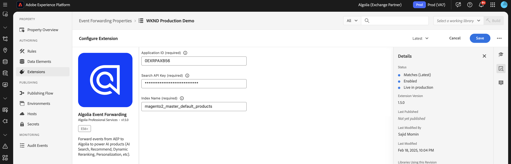

# [!DNL Algolia] 이벤트 전달 확장 개요 {#overview}

>[!NOTE]
>
>Adobe Experience Platform Launch은 이제 Adobe Experience Platform의 데이터 수집 기술의 일부입니다. 그 결과, 제품 설명서에 대한 용어가 업데이트되었습니다. 이러한 변경 사항에 대한 전체 목록은 [용어 업데이트 안내서](../../../../tags/term-updates.md)를 참조하세요.

[!DNL Algolia]을(를) 사용하여 빠르고 관련성이 있으며 개인화된 검색 경험을 제공합니다. AI 기반의 최적화를 통해 검색 결과 및 권장 사항을 강화하여 사용자가 필요한 제품, 콘텐츠 또는 정보를 신속하게 찾을 수 있습니다.

[!DNL Algolia] 이벤트 전달 확장을 사용하여 [!DNL Insights API]을(를) 통해 [!DNL Algolia]에 사용자 동작 이벤트를 보냅니다. 이 행동 데이터를 통해 AI 기반 권장 사항, 개인화된 경험 및 지능형 검색 기능을 사용할 수 있습니다.

## 전제 조건 {#prerequisites}

확장을 설치하기 전에 [!DNL Insights API]에 액세스할 수 있는 [!DNL Algolia] 계정이 있는지 확인하십시오. 계정이 없는 경우 [등록](https://dashboard.algolia.com/users/sign_up)하고 API에 대한 액세스를 활성화하세요.

또한 [!DNL Algolia] [!DNL Insights API]을(를) 사용하는 방법을 이해했는지 확인하십시오. 이벤트를 보내는 방법에 대한 개요는 [Insights API를 사용하여 이벤트 보내기](https://www.algolia.com/doc/guides/sending-events/getting-started/)를 참조하십시오.

[!DNL Algolia] 계정 대시보드에서 다음 값을 수집합니다.
- **[!UICONTROL 응용 프로그램 ID]**
- **[!UICONTROL API 키 검색]**
- **[!UICONTROL 인덱스 이름]**

## 확장 설치 {#install}

[!DNL Algolia] 확장을 설치하려면 다음 단계를 수행합니다.

[!DNL Adobe Experience Platform]의 **[!UICONTROL 데이터 수집]**(으)로 이동합니다. **[!UICONTROL 확장]** 탭을 선택합니다.

**[!UICONTROL 카탈로그]**&#x200B;를 열고 **[!UICONTROL Algolia Event Forwarding]** 확장을 찾은 다음 **[!UICONTROL 설치]**&#x200B;를 선택합니다.

### 확장 구성 {#configure-extension}

[!DNL Algolia] 이벤트 전달 확장을 구성하려면 **[!UICONTROL 확장]** 탭으로 이동하여 **[!UICONTROL Algolia]** 확장을 선택한 다음 **[!UICONTROL 구성]**&#x200B;을 선택합니다.

| 속성 | 설명 |
|----------|-------------|
| **[!UICONTROL 응용 프로그램 ID]** | [API 키](https://www.algolia.com/account/api-keys/all) 섹션 아래의 Algolia 대시보드에 있는 [!UICONTROL 응용 프로그램 ID]을(를) 입력하십시오. |
| **[!UICONTROL API 키 검색]** | [API 키](https://www.algolia.com/account/api-keys/all) 섹션 아래의 Algolia 대시보드에 있는 [!UICONTROL 검색 API 키]를 입력하십시오. |
| **[!UICONTROL 인덱스 이름]** | 제품이나 콘텐츠가 포함된 [!UICONTROL 인덱스 이름]을(를) 입력하십시오. 이 색인은 기본값으로 사용됩니다. |

{style="table-layout:auto"}

## [!DNL Algolia] 이벤트 전달 확장 작업 유형 {#action-types}

[!DNL Algolia] 이벤트 전달 확장은 규칙의 **[!UICONTROL Then]** 섹션에서 사용할 수 있는 단일 작업 유형을 제공합니다.

### 이벤트 보내기 {#send-event}

이벤트를 [!DNL Algolia]에 전달하도록 **[!UICONTROL 이벤트 보내기]** 작업을 구성하십시오.

**[!UICONTROL 규칙]** > **[!UICONTROL 규칙 추가]**&#x200B;를 선택하거나 기존 규칙을 선택합니다. 규칙의 **[!UICONTROL Then]** 부분에서 작업을 추가하고 **[!UICONTROL 확장]**: [!DNL Algolia] 이벤트 전달 > **[!UICONTROL 작업 유형]**: **[!UICONTROL 이벤트 보내기]**&#x200B;를 선택합니다.

## [!DNL Algolia] 이벤트 필드 그룹 구현 {#algolia-field-group}

[!DNL Algolia] 이벤트 전달 확장을 사용하기 전에 [!DNL Algolia] 이벤트 필드 그룹을 스키마에 추가해야 합니다. Experience Platform을 통해 제공되는 표준 필드 그룹 중 하나입니다.

### 스키마에 [!DNL Algolia] 이벤트 필드 그룹 추가 {#add-algolia-field-group}

[!DNL Algolia] 이벤트 필드 그룹을 추가하려면:

**[!UICONTROL 스키마]**(으)로 이동하여 **[!UICONTROL 찾아보기]**&#x200B;를 선택합니다.

웹 이벤트를 보내는 데 사용하는 새 스키마를 추가하거나 기존 스키마를 업데이트한 다음 **[!UICONTROL 추가]** 아이콘 위로 마우스를 가져갑니다. 검색 상자에 *[!DNL Algolia]*&#x200B;을(를) 입력하여 결과 범위를 좁힙니다.

**[!DNL Algolia]이벤트 세부 정보** 필드 그룹 > **[!UICONTROL 필드 그룹 추가]** 단추 > **[!UICONTROL 저장]**&#x200B;을 선택합니다.

Experience Platform의 

### [!UICONTROL 데이터 수집] 태그를 사용하여 데이터 매핑 및 보내기

[!DNL Algolia] 이벤트 전달 확장을 **[!DNL Adobe Experience Platform Web SDK]**&#x200B;과(와) 함께 사용하여 웹 사이트에서 [!DNL Algolia]&#x200B;(으)로 데이터를 보낼 수 있습니다. 이 작업은 태그 속성을 만들고, 데이터를 [!DNL XDM] 개체에 매핑하고, 이벤트를 보내는 규칙을 구성하여 수행됩니다.

#### 1단계: 웹 SDK으로 태그 속성 만들기

1. 태그 속성을 만듭니다.
2. [!DNL Adobe Experience Platform Web SDK] 확장을 설치합니다.
3. 이 확장을 사용하여 HTML의 데이터를 **[!DNL Algolia]이벤트** 필드 그룹에 매핑합니다.

#### 2단계: [!DNL XDM] 매핑에 대한 데이터 요소 만들기

1. **[!DNL Adobe Experience Platform Web SDK]**&#x200B;을(를) 사용하여 [!UICONTROL 데이터 요소]을(를) 만듭니다.
2. 데이터 요소 유형으로 **[!UICONTROL XDM 개체]**&#x200B;를 선택하십시오.
3. 데이터를 적절한 [!DNL XDM] 필드에 매핑하여 [!DNL Algolia]별 필드가 채워지도록 합니다.

#### 3단계: 이벤트를 보내는 규칙 만들기

1. 태그 속성에 새 규칙을 만듭니다.
2. 페이지 로드 또는 클릭 이벤트와 같은 필수 이벤트 트리거를 추가합니다.
3. **[!DNL Adobe Experience Platform Web SDK]**&#x200B;을(를) 사용하여 작업을 추가합니다.
4. 작업 유형으로 **[!UICONTROL 이벤트 보내기]**&#x200B;를 선택합니다.
5. [!DNL XDM] 데이터 요소를 사용하도록 작업을 구성하십시오.

#### 4단계: 게시 및 테스트

1. 규칙 및 확장 변경 사항을 대상 환경에 게시합니다.
2. [!DNL Adobe Experience Platform Debugger]을(를) 사용하여 데이터가 Adobe Experience Platform으로 전송되고 [!DNL Algolia]&#x200B;(으)로 전달되는지 확인하십시오.

### [!DNL Algolia]에서 이벤트 확인

[!DNL Algolia] 이벤트 전달 확장을 구성한 후 다음 단계를 수행하여 이벤트가 올바르게 전송되고 수신되는지 확인할 수 있습니다.

[!DNL Algolia] 대시보드로 이동하여 **[!UICONTROL 데이터 소스 > 이벤트 > 디버거]**&#x200B;로 이동합니다.

[!DNL Algolia]의 이벤트 전달 확장에서 보낸 이벤트와 일치하는 이벤트를 선택하고 예상 데이터가 이벤트에 있는지 확인합니다.

## 일반적인 구현 시나리오

[!DNL Algolia] 이벤트 전달 확장을 사용하여 다양한 사용 사례에 대한 사용자 상호 작용 데이터를 캡처하고 보내어 검색 관련성과 개인화를 향상시킵니다.

### 제품 또는 콘텐츠 보기 추적

확장을 사용하여 사용자가 제품 또는 콘텐츠 페이지를 볼 때 추적하여 [!DNL Algolia]이(가) 사용자의 관심 분야를 이해할 수 있도록 합니다.

### 전환 이벤트 추적

장바구니에 추가 이벤트, 구매 및 기타 전환 이벤트를 추적하여 [!DNL Algolia]의 AI 기반 권장 사항을 최적화합니다.

## 문제 해결

[!DNL Algolia] 이벤트 전달 확장을 구현하는 동안 문제가 발생하면 다음 문제 해결 단계를 고려하십시오.

### 이벤트가 [!DNL Algolia]에 표시되지 않음

이벤트가 [!DNL Algolia]에 나타나지 않으면 다음을 확인하십시오.

- **API 자격 증명 확인**: **[!UICONTROL 응용 프로그램 ID]** 및 **[!UICONTROL API 키]**&#x200B;가 [!DNL Algolia] 대시보드의 값과 일치하는지 확인하십시오.
- **이벤트 디버거 확인**: [!DNL Algolia] 이벤트 디버거를 사용하여 이벤트가 수신되는지 확인하십시오. 그렇지 않으면 이벤트 전달 규칙 구성을 확인하십시오.
- **XDM 매핑 검사**: [!DNL Algolia] 스키마의 모든 필수 필드가 [!DNL XDM] 개체에서 올바르게 매핑되었는지 확인하십시오.

### 잘못된 이벤트 데이터

- [!DNL XDM] 개체 데이터 요소가 모든 필수 필드와 함께 [!DNL Algolia] 스키마에 정확하게 매핑되었는지 확인하십시오.
- 이벤트 매개 변수가 [!DNL Algolia]의 Insights API 설명서에 설명된 예상 형식 및 구조와 일치하는지 확인하십시오.

## 다음 단계

이 안내서에서는 [!DNL Algolia Event Forwarding Extension]을(를) 사용하여 [!DNL Algolia]에 데이터를 보내는 방법을 다룹니다. [!DNL Adobe Experience Platform]의 이벤트 전달 기능에 대한 자세한 내용은 [이벤트 전달 개요](../../../ui/event-forwarding/overview.md)를 참조하십시오.

Experience Platform Debugger 및 이벤트 전달 모니터링 도구를 사용하여 구현을 디버깅하는 방법에 대한 자세한 내용은 [Adobe Experience Platform Debugger 개요](../../../../debugger/home.md) 및 [이벤트 전달에서 활동 모니터링](../../../ui/event-forwarding/monitoring.md)을 참조하십시오.

## 추가 리소스

- [[!DNL Algolia] Insights API 설명서](https://www.algolia.com/doc/rest-api/insights/)
- [[!DNL Algolia] 이벤트 설명서](https://www.algolia.com/doc/guides/sending-events/getting-started/)
- [[!DNL Adobe Experience Platform] 이벤트 전달 설명서](https://experienceleague.adobe.com/docs/experience-platform/tags/event-forwarding/overview.html?lang=ko)
- [[!DNL Algolia] AI 기능 개요](https://www.algolia.com/products/ai-search/)
