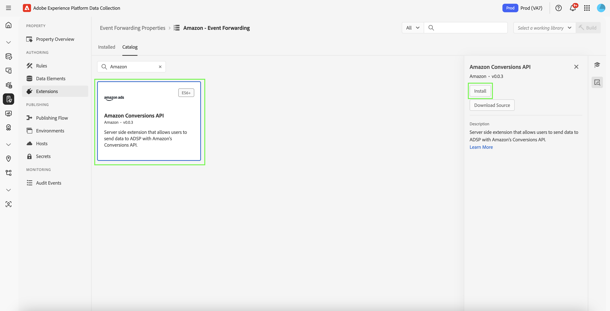
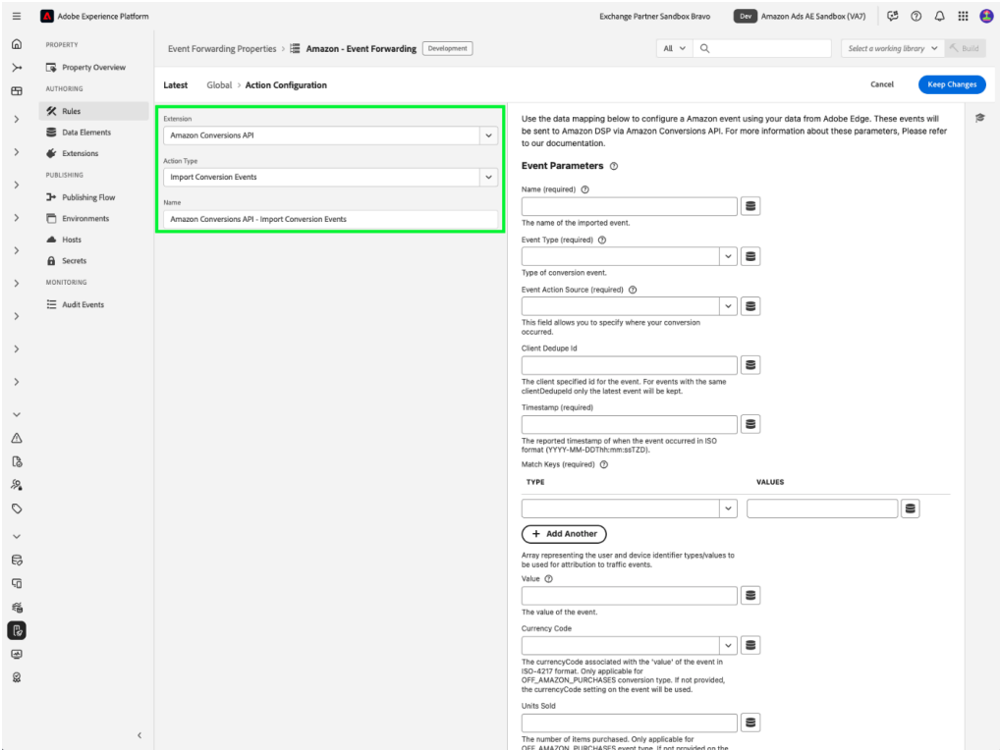

# [!DNL Amazon] 웹 이벤트 API 확장 개요

[!DNL Amazon] 전환 API 확장은 광고주 서버의 마케팅 데이터와 [!DNL Amazon] 간에 직접 연결을 만듭니다. 이를 통해 광고주는 전환 위치에 관계없이 캠페인 효과를 평가하고 그에 따라 캠페인을 최적화할 수 있습니다. 이 확장은 완전한 속성, 데이터 안정성 및 최적화된 전달을 제공합니다.

## [!DNL Amazon]개 필수 구성 요소 {#prerequisites}

[!DNL Amazon] 전환 API 확장을 설치하고 구성하기 전에 올바른 인증 및 데이터 액세스를 위해 다음 필수 조건 단계를 완료하십시오.

### 암호 및 데이터 요소 만들기 {#secret}

새 [!DNL Amazon] [이벤트 전달 암호](../../../ui/event-forwarding/secrets.md)를 만들고 인증 멤버를 나타내는 고유한 이름을 제공합니다. 값을 안전하게 유지하면서 계정에 대한 연결을 인증하는 데 사용됩니다.

그런 다음 [!UICONTROL Core] 확장 및 [!UICONTROL Secret] 데이터 요소 형식을 사용하여 [데이터 요소를 만듭니다](../../../ui/managing-resources/data-elements.md#create-a-data-element). 방금 만든 `Amazon` 암호를 참조합니다.

### 필요한 구성 세부 정보 수집 {#configuration-details}

Experience Platform을 [!DNL Amazon]에 연결하려면 다음 세부 정보를 입력하십시오.

| 키 유형 | 설명 |
| --- | --- |
| 계정 ID | [!DNL Amazon] 계정의 고유 계정 식별자입니다. |
| 엔티티 ID | 광고주 계정과 연계된 프로필 식별자. 이 URL은 Campaign Manager 포털 URL에서 찾을 수 있으며 접두사가 `entity`입니다. |
| 액세스 토큰 | OAuth를 통해 [!DNL Amazon] API 인증에 사용되는 앱의 만료되지 않는 액세스 토큰입니다. 자세한 내용은 [인증에 대한 Amazon API 설명서](https://developer.amazon.com/docs/app-porting/device-messaging-fit-obtain-api-key.html)를 참조하세요. |

## [!DNL Amazon] 확장 설치 및 구성 {#install-configure}

[!DNL Amazon] 전환 API 확장을 설치하고 구성하려면 다음 단계를 따르십시오.

1. 이벤트 전달 속성을 만들거나 편집합니다.
2. 왼쪽 탐색 패널에서 **확장**(으)로 이동한 다음 카탈로그 탭에서 [!DNL Amazon] 확장을 선택합니다.
3. **설치**&#x200B;를 선택합니다.

   

4. 다음 세부 정보를 사용하여 확장을 구성합니다.
   - **액세스 토큰**: OAuth 2 토큰이 포함된 데이터 요소 암호입니다.

     

   - **엔티티 ID**: 엔티티 ID(&quot;entity&quot; 접두사가 있는 Campaign Manager 포털 URL에서 발견됨)입니다.

     

5. 구성을 완료하려면 **저장**&#x200B;을 선택하세요.

## 이벤트 전달 규칙 구성 {#config-rule}

모든 데이터 요소가 설정되면 이벤트 전달 규칙을 만들어 이벤트가 [!DNL Amazon]&#x200B;(으)로 전송되는 시기와 방법을 결정합니다.

1. **규칙**(으)로 이동하여 새 이벤트 전달 규칙을 만듭니다.
2. **작업**&#x200B;에서 **Amazon 전환 API 확장**&#x200B;을(를) 선택합니다.
3. **작업 유형**&#x200B;을(를) **전환 이벤트 가져오기**(으)로 설정합니다.

   

### 전환 이벤트 데이터 구성 {#conversion-event-data}

전환 이벤트 데이터는 사용자 상호 작용을 추적하고 캠페인의 효과를 측정하는 데 중요합니다. 이 데이터를 [!DNL Amazon]에 전달하면 사용자 동작에 대한 통찰력을 얻고, 캠페인을 최적화하고, 전환에 대한 정확한 속성을 확인할 수 있습니다.

아래 표는 전환 이벤트 데이터를 구성하고 전달하는 데 필요한 주요 속성을 간략하게 설명합니다.

| 입력 | 설명 | 필수 여부 | 예 |
| --- | --- | --- | --- |
| `name` | 가져온 이벤트의 이름입니다. | 예 | `My Event Name` |
| `eventType` | 이벤트와 연결되고 보고에 사용되는 표준 Amazon 이벤트 유형입니다. | 예 | `Add to Shopping Cart` |
| `eventActionSource` | 이벤트를 가져온 플랫폼입니다. | 예 | `WEBSITE` |
| `clientDedupeId` | 전환 이벤트에 대해 광고주가 지정한 `id`입니다. `clientDedupeId`이(가) 동일한 이벤트의 경우 첫 번째 이벤트만 유지되고 모든 후속 이벤트는 삭제됩니다. | 선택 사항입니다 | `3234A398932` |
| `timestamp` | 이벤트가 발생한 시기에 대해 보고된 타임스탬프입니다. 타임스탬프는 이벤트를 보내기 최대 7일 전일 수 있습니다. 7일 넘는 데이터는 처리되지 않습니다. | 예 | `2023-05-08T14:04:28Z` |
| `matchKeys` | 트래픽 이벤트 기여도에 사용할 고객 및 디바이스 식별자 유형/값을 나타내는 배열입니다. | 예 | — |
| `matchKeys > type` | 속성에 사용되는 식별자 유형. | 예 | — |
| `matchKeys > value` | 속성에 사용되는 식별자 값. | 예 | 이벤트를 수행한 고객의 SHA-256 해시된 식별자 값 목록입니다. |
| `value` | 이벤트 값. | 선택 사항입니다 | `5` 또는 `0.99` |
| `currencyCode` | 이벤트의 `value`과(와) 연결된 통화 코드(ISO-4217 형식). Amazon 구매 할인 이벤트 유형에만 적용됩니다. 제공되지 않으면 전환 정의에 대한 통화 코드 설정이 사용됩니다. | 선택 사항입니다 | `USD`, `EUR`, `GBP` 등 |
| `unitsSold` | 구매한 항목 수입니다. Amazon 구매 할인 이벤트 유형에만 적용됩니다. 전환 이벤트에 제공되지 않으면 기본값 `1`이(가) 적용됩니다. | 선택 사항입니다 | — |
| `countryCode` | 이 값은 ISO 3166-1에 정의된 두 글자로 된 국가 코드인 ISO 3166-1 alpha-2를 기반으로 합니다. ISO(International Organization for Standardization)에서 발행하는 ISO 3166 표준의 일부로 국가, 속령 및 지리적 특수 관심 영역을 나타냅니다. | 예 | — |
| `dataProcessingOptions` | 광고 데이터 사용에 대한 사용자 동의를 나타냅니다. | 선택 사항입니다 | LIMITED_DATA_USE |

- **[!UICONTROL 변경 내용 유지]**&#x200B;를 선택하여 규칙을 저장합니다.

## 이벤트 중복 제거 {#deduplication}

[!DNL Amazon] AAT(Advertising Tag) 및 [!DNL Amazon] 전환 API 확장을 모두 사용하여 동일한 이벤트를 추적할 때 중복 제거는 정확한 보고를 보장하고 부풀려진 전환 수를 방지하는 데 필수적입니다.

### 중복 제거는 언제 필요합니까?

- **필수**: 클라이언트(AAT)와 서버(전환 API) 모두에서 동일한 이벤트를 보내는 경우.
- **필요하지 않음**: 클라이언트 및 서버에서 고유한 이벤트 유형을 겹치지 않고 보내는 경우.

### 중복 제거 활성화 방법

중복 제거를 사용하려면 모든 공유 이벤트에 `clientDedupeId` 필드를 포함하십시오. 이 고유 식별자를 사용하면 [!DNL Amazon]에서 클라이언트측 이벤트와 서버측 이벤트를 구분하고 중복 항목을 방지할 수 있습니다.

중복 제거를 적절히 구성하면 최적화 데이터가 정확하게 유지되고 보고에 부정적인 영향을 주지 않는지 확인할 수 있습니다.

자세한 내용은 [Amazon 이벤트 중복 제거 안내서](https://advertising.amazon.com/)를 참조하세요.

## 다음 단계 {#next-steps}

이 안내서에서는 [!DNL Amazon] 전환 API 확장을 사용하여 전환 이벤트를 구성하고 [!DNL Amazon]에 보내는 방법을 다룹니다. [!DNL Adobe Experience Platform]의 이벤트 전달 기능에 대한 자세한 내용은 [이벤트 전달 개요](../../../ui/event-forwarding/overview.md)를 참조하세요.

Experience Platform Debugger 및 이벤트 전달 모니터링 도구를 사용하여 구현을 디버깅하는 방법에 대한 자세한 내용은 이벤트 전달의 [Adobe Experience Platform Debugger 개요](/help/debugger/home.md) 및 [활동 모니터링](../../../ui/event-forwarding/monitoring.md)을 참조하십시오.
