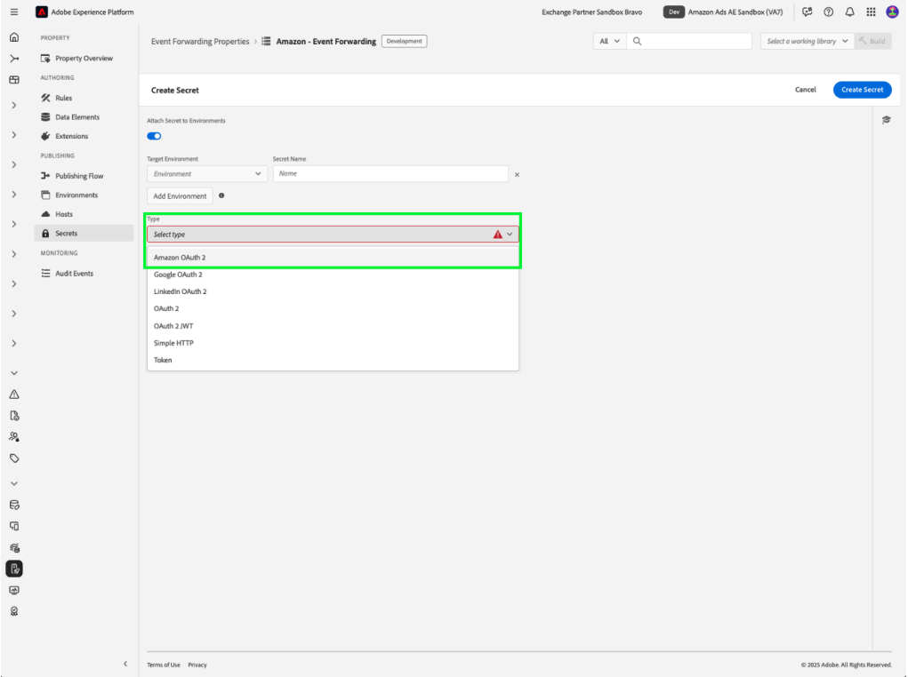

# [!DNL Amazon] 웹 이벤트 API 확장 개요

[!DNL Amazon] 전환 API 확장은 광고주 서버의 마케팅 데이터와 [!DNL Amazon] 간에 직접 연결을 만듭니다. 이를 통해 광고주는 전환 위치에 관계없이 캠페인 효과를 평가하고 그에 따라 캠페인을 최적화할 수 있습니다. 확장은 보다 완벽한 속성, 향상된 데이터 안정성 및 더 나은 최적화 전달을 제공합니다.

## [!DNL Amazon]개 필수 구성 요소 {#prerequisites}

[!DNL Amazon] 전환 API 확장을 설치하고 구성하기 전에 올바른 인증 및 데이터 액세스를 보장하기 위해 몇 가지 필수 조건 단계를 완료해야 합니다.

### 암호 및 데이터 요소 만들기 {#secret}

[!DNL Amazon]을(를) 사용한 인증에는 제대로 저장하고 참조해야 하는 보안 토큰이 필요합니다.

1. 인증을 위해 고유한 이름으로 새 [!DNL Amazon] 이벤트 전달 암호를 만드십시오.
2. [!DNL Amazon] 암호를 참조하려면 **Secret** 데이터 요소 유형과 함께 **Core** 확장을 사용하여 데이터 요소를 만드십시오.

이 프로세스를 수행하면 필요한 경우 확장에 계속 액세스할 수 있는 동안 인증 자격 증명이 안전하게 유지됩니다.

## [!DNL Amazon] 확장 설치 및 구성

확장을 설치하려면 Experience Platform의 이벤트 전달 속성에 액세스해야 합니다.

- 이벤트 전달 속성을 만들거나 편집합니다.
- 왼쪽 탐색에서 **확장**&#x200B;을 선택한 다음 [카탈로그] 탭에서 [!DNL Amazon] 확장을 선택합니다.
- **설치**&#x200B;를 선택합니다.

![[!DNL Amazon] 확장이 설치 단추와 함께 확장 카탈로그에서 선택되었습니다.](../../../images/extensions/server/amazon/amazon-extension.png)

- 다음을 사용하여 구성:

- **액세스 토큰**: OAuth 2 토큰이 포함된 데이터 요소 암호

- **엔터티 ID**: 엔터티 ID(&quot;entity&quot; 접두사가 있는 Campaign Manager 포털 URL에 있음)

- **저장**&#x200B;을 선택합니다.

이러한 구성 값은 플랫폼과 [!DNL Amazon] 계정 간의 연결을 설정합니다.

### [!DNL Amazon] OAuth 2 {#oauth}

[!DNL Amazon] OAuth 2 암호를 만들려면:

- **Type** 드롭다운에서 [!DNL Amazon] OAuth 2를 선택하고 **암호 만들기**&#x200B;를 선택합니다.

드롭다운 메뉴의 

- 팝오버에서 **Amazon으로 암호 만들기 및 승인**&#x200B;을 선택하여 암호를 수동으로 승인하고 계속합니다.

- 표시되는 대화 상자에 [!DNL Amazon] 자격 증명을 입력합니다. 화면의 지침에 따라 데이터에 이벤트 전달 액세스 권한을 부여합니다.

완료 후 **암호** 탭에서 암호의 상태와 만료 날짜가 표시됩니다.

## 이벤트 전달 규칙 구성 {#config-rule}

모든 데이터 요소가 설정되면 이벤트가 Amazon으로 전송되는 시기와 방법을 결정하는 이벤트 전달 규칙을 만들 수 있습니다.

- **규칙**(으)로 이동하여 새 이벤트 전달 규칙을 만듭니다.
- **작업**&#x200B;에서 **Amazon 전환 API 확장**&#x200B;을(를) 선택합니다.
- **작업 유형**&#x200B;을(를) **전환 이벤트 가져오기**(으)로 설정합니다.

- 아래에 설명된 대로 이벤트 속성을 구성합니다.

| 입력 | 설명 |
| --- | --- |
| **이벤트 이름** | 전환 이벤트의 이름입니다. |
| **이벤트 유형** | 추적된 이벤트 유형(예: 구매, 장바구니 추가)을 정의합니다. |
| **타임스탬프** | ISO 형식의 이벤트 시간. |
| **클라이언트 중복 제거 ID** | 중복 제거에 대한 고유 ID. |
| **일치 키** | 속성을 위한 사용자 및 장치 식별자. |
| **값** | 이벤트의 통화 가치입니다. |
| **통화 코드** | 통화(ISO-4217 형식) |
| **판매된 단위** | 구매한 항목의 수량입니다. |
| **국가 코드** | 이벤트가 발생한 국가입니다. |
| **데이터 처리 옵션** | 제한된 데이터 사용에 대한 플래그입니다. |
| **동의** | 광고 데이터 사용에 대한 사용자 동의를 나타냅니다. |

- **변경 내용 유지**&#x200B;를 선택하여 규칙을 저장합니다.

![작업 구성의 추가 이벤트 매개 변수가 [변경 내용 유지] 단추와 함께 강조 표시되었습니다.](../../../images/extensions/server/amazon/6.png)

## 이벤트 중복 제거 {#deduplication}

동일한 이벤트에 대해 [!DNL Amazon] AAT(Advertising Tag)와 [!DNL Amazon] 전환 API 확장을 모두 사용하는 경우 중복 제거 설정이 필요합니다. 모든 공유 이벤트에 `clientDedupeId`을(를) 포함하면 중복 제거가 제대로 수행됩니다.
클라이언트와 서버 이벤트가 겹치지 않으면 중복 제거가 필요하지 않습니다.

적절한 중복 제거는 부풀려진 전환 수를 방지하고 최적화 데이터가 정확하게 유지되도록 합니다.

자세한 내용은 [Amazon 이벤트 중복 제거 안내서](https://advertising.amazon.com/)를 참조하세요.

## 다음 단계

이 안내서에서는 [!DNL Amazon] 전환 API 확장을 사용하여 전환 이벤트를 구성하고 [!DNL Amazon]에 보내는 방법을 다룹니다. [!DNL Adobe Experience Platform]의 이벤트 전달 기능에 대한 자세한 내용은 [이벤트 전달 개요](../../../ui/event-forwarding/overview.md)를 참조하세요.

Experience Platform Debugger 및 이벤트 전달 모니터링 도구를 사용하여 구현을 디버깅하는 방법에 대한 자세한 내용은 이벤트 전달의 [Adobe Experience Platform Debugger 개요](https://experienceleague.adobe.com/en/docs/experience-platform/debugger/home) 및 [활동 모니터링](https://experienceleague.adobe.com/en/docs/experience-platform/tags/event-forwarding/monitoring)을 참조하십시오.