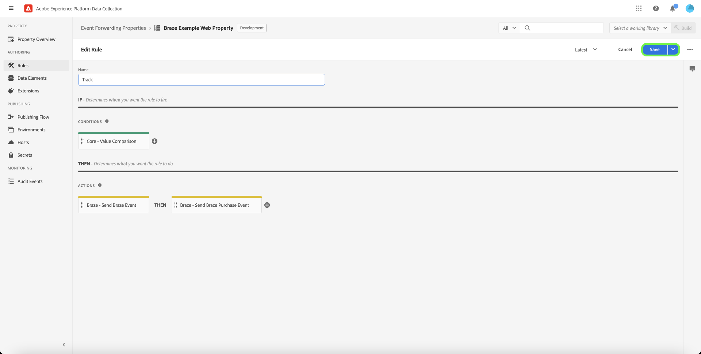

# [!DNL Braze Track Events API] 이벤트 전달 확장

[[!DNL Braze]](https://www.braze.com) 는 소비자와 브랜드 간의 고객 중심 상호 작용을 실시간으로 수행할 수 있는 고객 참여 플랫폼입니다. 사용 [!DNL Braze]로 지정하는 경우 다음을 수행할 수 있습니다.

* 언어 선호도, 위치 선호도 등을 기반으로 타겟팅된 사용자에게 데이터(예: 마케팅 메시지)를 전달하여 전환율을 높이고 주요 비즈니스 목표를 지원합니다.
* 이메일, 푸시 알림 및 인앱 메시지를 포함한 여러 채널에서 적시에 원하는 언어로 고객에게 보낼 수 있습니다.
* 마케팅 및 홍보 캠페인에 대해 특정 사용자를 Target 하여 반복 고객 수를 늘립니다.
* 사용자 지정 메시지로 특정 대상을 타깃팅하는 사용자 행동 및 패턴을 학습하여 매출을 높일 수 있습니다.

다음 [!DNL Braze Track Events API] [이벤트 전달](../../../ui/event-forwarding/overview.md) 확장을 사용하면 Adobe Experience Platform Edge Network에서 캡처한 데이터를 활용하여 로 보낼 수 있습니다 [!DNL Braze] 를 사용하여 서버측 이벤트 형태로 [[!DNL Braze User Identify]](https://www.braze.com/docs/api/endpoints/user_data/post_user_identify) 및 [[!DNL Braze User Track]](https://www.braze.com/docs/api/endpoints/user_data/post_user_track) API.

이 문서에서는 확장의 사용 사례, 이벤트 전달 라이브러리에 확장 프로그램을 설치하는 방법 및 이벤트 전달에서 해당 기능을 사용하는 방법에 대해 설명합니다 [규칙](../../../ui/managing-resources/rules.md).

## 사용 사례

이 확장은 Edge Network의 데이터를 [!DNL Braze] 의 고객 분석 및 타깃팅 기능을 활용할 수 있습니다.

예를 들어, 웹 사이트 및 모바일과 함께 웹 사이트 및 모바일 플랫폼에서 트랜잭션 또는 대화형 입력을 이벤트 데이터로 캡처하는 소매 조직을 생각해 보십시오. 다양한 사용 [태그](../../../home.md) 규칙, 이 데이터는 Edge Network로 실시간으로 전송됩니다. 여기에서 [!DNL Braze] 이벤트 전달 확장 은 관련 이벤트를 자동으로 전송합니다 [!DNL Braze] 를 반환합니다.

데이터가 전송되면 조직의 분석 팀이 활용할 수 있습니다 [!DNL Braze's] 데이터 세트를 처리하고 비즈니스 통찰력을 도출하여 그래프, 대시보드 또는 기타 시각화를 생성하여 비즈니스 이해 당사자에게 알려주는 기능. 자세한 내용은 [[!DNL Braze] 고객](https://www.braze.com/customers) 플랫폼의 다양한 사용 사례에 대한 자세한 내용을 보려면 페이지를 참조하십시오.

## [!DNL Braze] 사전 요구 사항 및 보호 기능 {#prerequisites}

다음을 수행해야 합니다. [!DNL Braze] 해당 기술을 사용하기 위해 사용합니다. 계정이 없는 경우 [시작 페이지](https://www.braze.com/get-started/) on [!DNL Braze] 에 연결 [!DNL Braze Sales] 계정 생성 프로세스를 시작합니다.

### API 보호 기능

확장은 다음 중 2를 사용합니다 [!DNL Braze]의 API 및 그 한계는 아래에 요약되어 있습니다.

| API | 비율 제한 |
| --- | --- |
| [!DNL User Track] | 분당 50,000개의 요청.  자세한 내용은 [[!DNL User Track] API 설명서](https://www.braze.com/docs/api/endpoints/user_data/post_user_track#rate-limit) 자세한 내용 |
| [!DNL User Identify] | 분당 20,000개의 요청.  자세한 내용은 [[!DNL User Identify] API 설명서](https://www.braze.com/docs/api/endpoints/user_data/post_user_identify#rate-limit) 자세한 내용 |

>[!NOTE]
>
>다음 안내서를 참조하십시오. [[!DNL Braze] API 제한](https://www.braze.com/docs/api/api_limits/) 그들이 부과하고 있는 제한에 관한 더 자세한 내용을 위해.

### 사용자 프로필 라이프사이클 이해

[!DNL Braze] 고유 식별자를 사용하여 익명 사용자 프로필을 만듭니다. `deviceId`, 설정 [!DNL Braze]. 사용자 ID를 제공하여 사용자를 식별하면 식별된 사용자 프로필이 만들어집니다.

를 지정하는 첫 번째 인스턴스에서 `external_id` 알 수 없는 사용자 프로필로 모든 기존 사용자 프로필 데이터와 익명의 이벤트가 새 사용자 프로필로 마이그레이션됩니다. 동일한 항목을 공유하는 익명 사용자 프로필 `deviceId` 식별된 사용자 프로필에도 별칭이 지정됩니다.

[!DNL Braze] 은(는) 별칭 전용 프로필과 연결된 모든 데이터를 병합하고 유지합니다. 그러나 이후 익명 사용자 데이터는 모두 고립됩니다. 자세한 내용은 [!DNL Braze] 설명서 페이지 [식별된 사용자 프로필](https://www.braze.com/docs/user_guide/data_and_analytics/user_data_collection/user_profile_lifecycle/#identified-user-profiles) 및 [데이터 수집 모범 사례](https://www.braze.com/docs/user_guide/data_and_analytics/user_data_collection/best_practices/#overview) 추가 정보.

### 청구 가능한 데이터 포인트

추가 사용자 지정 속성을에 보내기 [!DNL Braze] 더 많은 [!DNL Braze] 데이터 포인트 소비. 다음 문서를 참조하십시오. [!DNL Braze] 추가 사용자 지정 속성을 보내기 전 계정 관리자. 자세한 내용은 [!DNL Braze] 설명서 [청구 가능한 데이터 포인트](https://www.braze.com/docs/user_guide/onboarding_with_braze/data_points/#billable-data-points) 추가 정보.

### 필요한 구성 세부 정보 수집 {#configuration-details}

Edge Network를 [!DNL Braze]를 입력해야 합니다.

| 키 유형 | 설명 | 예 |
| --- | --- | --- |
| [!DNL Braze] 인스턴스 | 와 연결된 REST 엔드포인트 [!DNL Braze] 계정이 필요합니다. 자세한 내용은 [!DNL Braze] 설명서 [인스턴스](https://www.braze.com/docs/user_guide/administrative/access_braze/braze_instances) 참조하십시오. | `rest.iad-03.braze.com` |
| API 키 | 다음 [!DNL Braze] 와 연결된 API 키 [!DNL Braze] 계정이 필요합니다.  자세한 내용은 [!DNL Braze] 설명서에서 [REST API 키](https://www.braze.com/docs/api/basics/#rest-api-key) 참조하십시오. | `YOUR-BRAZE-REST-API-KEY` |

## Experience Cloud 사전 요구 사항

이 섹션에서는 모든 구현에 대한 Experience Cloud의 전제 조건 단계를 다룹니다. 개별 구현 요구 사항에 따라 확장을 구성하기 전에 다음 구문을 설정하는 것이 도움이 될 수 있습니다.

1. A [스키마](../../../../xdm/schema/composition.md) Experience Cloud에 수집하는 데이터의 구조를 설명하려면
1. A [데이터 스트림](https://experienceleague.adobe.com/docs/platform-learn/data-collection/event-forwarding/set-up-a-datastream.html) 수신되는 데이터를 적절한 Adobe Experience Cloud 애플리케이션으로 라우팅합니다.
1. A [데이터 세트](https://experienceleague.adobe.com/docs/platform-learn/tutorials/data-ingestion/create-datasets-and-ingest-data.html) 수집된 데이터를 저장

모든 구현의 경우 Experience Cloud 측에 다음이 필요합니다.

1. [암호 만들기](#create-a-secret)
1. [태그 속성 설정](#set-up-tag-properties)
1. [태그 속성 내에 데이터 요소 추가](#add-data-elements-within-tag-properties)
1. [태그 속성 내에 규칙 추가](#add-rules-within-tag-properties)

### 암호 만들기

새 만들기 [이벤트 전달 암호](../../../ui/event-forwarding/secrets.md) 값을 로 설정합니다. [[!DNL Braze] API 키](#configuration-details). 이 값은 값을 안전하게 유지하면서 계정에 대한 연결을 인증하는 데 사용됩니다.

### 태그 속성 설정

[태그 속성 만들기](https://experienceleague.adobe.com/docs/platform-learn/implement-in-websites/configure-tags/create-a-property.html?lang=en) 또는 편집할 기존 속성을 대신 선택합니다. 이 속성은 다음 작업에 필요한 데이터 구조를 수집하도록 구성됩니다 [!DNL Braze] 이벤트 전달을 사용하여 전송하기 전에 에지 네트워크로 가져옵니다.

### 태그 속성 내에 데이터 요소 추가

웹 사이트에서 [!DNL Braze] SDK를 실행하려면 [데이터 요소 만들기](../../../ui/managing-resources/data-elements.md) 를 **[!UICONTROL 쿠키]** 유형(에서 제공) [[!UICONTROL 코어] 태그 확장](../../client/core/overview.md)) [!DNL Braze] `deviceId` 쿠키에서 읽을 수 있습니다.

다음 **[!UICONTROL 쿠키 이름]** 값은 와 일치해야 합니다. [!DNL Braze] 웹 사이트의 쿠키 이름. 이름의 형식은 과 유사해야 합니다 `ab.storage.deviceId.{BRAZE_PROJECT_TOKEN_FOR_WEBSITE}`. 선택 **[!UICONTROL 저장]** 완료됨.

두 번째 데이터 요소의 경우 유형을 **[!UICONTROL XDM 개체]** ( [Adobe Experience Platform 웹 SDK 확장](../../client/sdk/overview.md))를 만든 후 이전에 만든 스키마에 매핑합니다. 데이터를 매핑할 때 `deviceId` 데이터 요소(다음을 포함) [!DNL Braze] `deviceId` 쿠키의 값)이 스키마 필드 중 하나 내의 값으로 참조됩니다.

>[!NOTE]
>
>웹 사이트에서 [!DNL Braze] SDK, ECID(Adobe Experience Cloud ID)가 폴백으로 사용됩니다 `deviceId` 에 전송된 이벤트를 사용하여 전달할 값 [!DNL Braze].

시나리오에 따라 스키마의 이벤트 이름에 매핑하는 데 사용할 수 있는 다른 데이터 요소를 만들어야 할 수 있습니다. 이 작업은 를 사용하여 수행할 수 있습니다. **[!UICONTROL 상수]** 에서 제공하는 유형 [!UICONTROL 코어] 확장.

### 태그 속성 내에 규칙 추가

를 설치하기 전의 마지막 단계 [!DNL Braze] 확장은 태그를 만드는 것입니다 [규칙](../../../ui/managing-resources/rules.md) (또는 여러 태그 규칙)으로 설정되며, 로그인, 등록, 등록 등과 같이 추적 중인 사용자 ID 이벤트에 대해 트리거됩니다.

구성 시 **[!UICONTROL 이벤트]** 규칙의 경우 규칙을 트리거할 적절한 이벤트 유형을 선택합니다. 사용자 클릭에서 로그인 규칙을 트리거하는 이벤트의 예는 다음과 같습니다.

마지막으로, **[!UICONTROL 작업]** 규칙에 대해 **[!UICONTROL 이벤트 보내기]** 웹 SDK 확장에서 제공하는 작업 유형입니다. 아래 **[!UICONTROL XDM 데이터]**&#x200B;에서 을(를) 선택합니다. [!UICONTROL XDM 개체] 만든 데이터 유형 [이전](#add-data-elements-within-tag-properties).

## 설치 및 구성 [!DNL Braze] 확장 {#install}

확장을 설치하려면 [이벤트 전달 속성 만들기](../../../ui/event-forwarding/overview.md#properties) 또는 편집할 기존 속성을 대신 선택합니다.

선택 **[!UICONTROL 확장]** 을 클릭합니다. 에서 **[!UICONTROL 카탈로그]** 탭, 선택 **[!UICONTROL 설치]** 카드 위에 [!DNL Braze] 확장.

![설치 [!DNL Braze] 확장.](../../../images/extensions/server/braze/install-extension.png)

다음 화면에서 다음을 입력합니다 [구성 값](#configuration-details) 이전에 [!DNL Braze]:

* **[!UICONTROL Rest 끝점 URL 이해]**: 값을 입력할 수 있습니다 [!DNL Braze] rest 끝점 URL이 제공된 입력에 일반 텍스트로 표시됩니다.
* **[!UICONTROL API 키]**: 을(를) 선택합니다 [암호 데이터 요소](#create-a-secret) 이전 버전에서 만든 [!DNL Braze] API 키.

선택 **[!UICONTROL 저장]** 완료됨.

![다음 [!DNL Braze] 확장 구성 페이지.](../../../images/extensions/server/braze/configure-extension.png)

## 이벤트 전달 데이터 요소 설정

확장을 설치하고 구성한 후 다음 단계는 로 전송할 필수 데이터 구문을 캡처하는 이벤트 전달 데이터 요소를 만드는 것입니다 [!DNL Braze].

### 만들기 `deviceId` 데이터 요소

사이트가 [!DNL Braze] SDK를 정의한 경우 [암호 데이터 요소](#add-data-elements-within-tag-properties) 여기에는 다음 항목이 포함됩니다 [!DNL Braze] `deviceId` 태그에 다음 코드 행을 추가하여 VisitorAPI를 포함합니다. 이제 XDM 형식으로 전송할 때 이 값을 가리키는 이벤트 전달 아래에 별도의 데이터 요소를 설정해야 합니다.

데이터 요소를 만들 때 **[!UICONTROL 코어]** 확장을 위해 를 선택한 다음 **[!UICONTROL 경로]** 를 반환합니다. 값에 대해 점 표기법 경로를 `deviceId` 스키마에 있는 것과 같은 필드. 선택 **[!UICONTROL 저장]** 완료됨.

### 만들기 `EventName` 데이터 요소

이벤트 전달 속성에서 다음을 사용하는 데이터 요소를 만듭니다 **[!UICONTROL 경로]** 다음에서 유형 **[!UICONTROL 코어]** 확장. 값에 대해 스키마에 있는 이벤트 이름에 점 표기법 경로를 입력합니다.

### 이벤트 및 구매에 대한 데이터 요소 만들기

다음 [[!DNL Braze User Track] API](https://www.braze.com/docs/api/endpoints/user_data/post_user_track) 에서는 두 가지 서로 다른 작업을 지원합니다. 사용자 지정 [events](https://www.braze.com/docs/api/objects_filters/event_object/#what-is-the-event-object) 및 [구매](https://www.braze.com/docs/api/objects_filters/purchase_object/#what-is-a-purchase-object). API는 [속성](https://www.braze.com/docs/api/objects_filters/user_attributes_object/) 다음 항목에 해당하는 [!DNL Braze] 데이터 포인트.

에 대한 데이터 요소 `deviceId` 및 `EventName` 은 사용자 지정 이벤트 및 구매 둘 다에 필요하지만, 이벤트 유형에 대해 포함할 수 있는 추가 데이터 요소가 있습니다. 이러한 항목은 아래에 나와 있습니다.

>[!NOTE]
>
>아래 나열된 모든 데이터 요소는 **[!UICONTROL 경로]** 에 요약된 대로 스키마의 특정 필드에 매핑할 수 있도록 를 입력합니다. **스키마 경로** 열.

#### 사용자 정의 이벤트

| [!DNL Braze] key | 스키마 경로 | 설명 | 필수입니다 |
| --- | --- | --- | --- |
| [!DNL Braze] 장치 ID | `arc.event.xdm._extconndev.brazeDeviceId` | `deviceId` 은 이벤트를 수행한 사용자를 식별합니다. `deviceId` 는 모든 이벤트에 필수이므로 반드시 지정해야 합니다 [!DNL Braze] 분석을 수행합니다. | 예 |
| 이벤트 유형 | `arc.event.xdm._extconndev.event_Type` | 이벤트의 이름입니다. | 예 |
| 사용자 식별자 | `arc.event.xdm._extconndev.userId` | 사용 가능한 경우 사용자의 이메일 또는 로그인 ID입니다. |  |
| 앱 ID | `arc.event.xdm._extconndev.appId` | 이벤트가 트리거된 위치를 나타내는 문자열입니다. |  |
| 이벤트 필드 | `arc.event.xdm._extconndev.event_Properties` | 이벤트에 대한 모든 속성을 나타내는 JSON 개체입니다. |  |

{style="table-layout:auto"}

#### 구매

| [!DNL Braze] key | 스키마 경로 | 설명 | 필수입니다 |
| --- | --- | --- | --- |
| [!DNL Braze] 장치 ID | `arc.event.xdm._extconndev.brazeDeviceId` | `deviceId` 은 이벤트를 수행한 사용자를 식별합니다. `deviceId` 는 모든 이벤트에 필수이므로 반드시 지정해야 합니다 [!DNL Braze] 분석을 수행합니다. | 예 |
| 이벤트 유형 | `arc.event.xdm._extconndev.event_Type` | 이벤트의 이름입니다. | 예 |
| 사용자 식별자 | `arc.event.xdm._extconndev.userId` | 사용 가능한 경우 사용자의 이메일 또는 로그인 ID입니다. |  |
| 앱 ID | `arc.event.xdm._extconndev.appId` | 이벤트가 트리거된 위치를 나타내는 문자열입니다. |  |
| 제품 ID | `arc.event.xdm._extconndev.product_Id` | UPC, ISBN, 제품 카테고리 또는 제품 이름과 같은 구매에 대한 식별자입니다. | 예 |
| 통화 | `arc.event.xdm._extconndev.currency` | 구매에 사용된 통화 [ISO 4217 코드 형식](https://www.iso.org/iso-4217-currency-codes.html). | 예 |
| 가격 | `arc.event.xdm._extconndev.price` | 숫자 구입 값입니다. | 예 |
| 수량 | `arc.event.xdm._extconndev.quantity` | 구매한 제품의 수량. | 예 |
| 추가 필드 | `arc.event.xdm._extconndev.event_Properties` | 이벤트에 대한 추가 속성을 나타내는 JSON 개체. 자세한 내용은 [[!DNL Braze] 설명서](https://www.braze.com/docs/user_guide/onboarding_with_braze/data_points/#billable-data-points) 청구되는 데이터 포인트에 대한 세부 사항입니다. |  |

{style="table-layout:auto"}

## 이벤트 전달 규칙 설정

모든 데이터 요소가 설정되면 사용자 지정 이벤트 및 구매를 보낼 시기 및 방법을 결정하는 이벤트 전달 규칙 만들기를 시작할 수 있습니다 [!DNL Braze].

다음 이후 [!DNL Braze User Track] API는 사용자 지정 이벤트 및 구매를 두 개의 별도 작업으로 지원하므로 적어도 두 개의 규칙을 만들어야 합니다 [!DNL Braze's] 각 분석 기능을 적절히 활용할 수 있습니다.

따라서, [!DNL Braze] 확장을 사용하면 다음 작업 유형을 규칙에 추가할 수 있습니다.

* **[!UICONTROL 브레이징 이벤트]**
* **[!UICONTROL 구매 이벤트 브레이징]**

>[!IMPORTANT]
>
>작업 유형이 인 규칙이 하나 이상 있어야 합니다. **[!UICONTROL 브레이징 이벤트]**. 이 규칙이 없으면 에지 네트워크에서 이벤트를 로 보내지 않습니다. [!DNL Braze].

### 만들기 [!DNL Track Event] 규칙 {#tracking-rule}

이벤트 전달 속성에서 새 규칙 만들기를 시작합니다. 아래 **[!UICONTROL 조건]**, 추가 **[!UICONTROL 값 비교]** 조건 유형(다음을 통해 제공) [!UICONTROL 코어] 확장)을 클릭하여 `EventName` is not `Purchase`. 이렇게 하면 이벤트에 올바른 개체 페이로드를 사용하여 이벤트가 전송됩니다. [!DNL Braze] API.

아래 **[!UICONTROL 작업]**&#x200B;를 클릭하고 새 작업을 추가하고 확장을 로 설정합니다. **[!UICONTROL 브레이즈]**. 다음으로 작업 유형을 **[!UICONTROL 브레이징 이벤트]** adobe Experience Edge Network 이벤트를에 보내려면 [!DNL Braze].

여기에서 **[!UICONTROL 이벤트 이름]** 받는 이벤트 이름 속성과 **[!UICONTROL 이벤트 시간]**. 기타 선택적 필드는 다음과 같습니다 [!UICONTROL 외부 사용자 ID], [!UICONTROL 사용자 ID 확장], [!UICONTROL 별칭 레이블], [!UICONTROL 별칭 이름], 및 [!UICONTROL 앱 식별자].

>[!NOTE]
>
>다음 **[!UICONTROL 브레이징 이벤트]** 작업은 만 필요합니다 **[!UICONTROL 이벤트 이름]** 및 **[!UICONTROL 이벤트 시간]** 지정할 수는 있지만, 나머지 필드에 가능한 많은 정보를 포함해야 합니다. 자세한 내용은 [!DNL Braze] 이벤트 객체의 경우 [공식 문서](https://www.braze.com/docs/api/objects_filters/event_object/).

한 번 [!UICONTROL 브레이징 이벤트] 작업이 규칙에 추가되고, 다음을 포함할 수도 있습니다. **[!UICONTROL 구매 확장]** 추적하려는 이벤트가 구매 이벤트인 경우 작업을 수행합니다. 구매 작업에 대한 예제 구성은 아래에 나와 있습니다.

>[!NOTE]
>
>자세한 내용은 [!DNL Braze] 구매 개체 [공식 문서](https://www.braze.com/docs/api/objects_filters/purchase_object/).

다음 [!DNL Track Event] 규칙이 완료되었으며 아래 이미지와 유사해야 합니다. 선택 **[!UICONTROL 저장]** 를 눌러 라이브러리에 규칙을 추가합니다.

>[!IMPORTANT]
>
>웹 사이트에서 [!DNL Braze] SDK에서는 다음 단계를 계속 수행할 수 있습니다 [내에서 데이터 유효성 검사 [!DNL Braze]](#validate). 를 사용하지 않는 경우 [!DNL Braze] SDK를 실행하려면 [별도의 id 추적 규칙 만들기](#create-an-identity-tracking-rule) 적절한 이벤트와 `deviceId` 값은에 전송됩니다. [!DNL Braze] 사용자 식별 이벤트가 발생하는 경우

### ID 추적 규칙 만들기

를 사용하지 않는 경우 [!DNL Braze SDK]를 지정하는 경우, 다음 단계는 **[!UICONTROL 브레이징 이벤트]** 및 **[!UICONTROL 별칭 확장]** 작업 유형. 이 규칙은 웹 사이트에서 사용자 ID 이벤트가 발생할 때마다(로그인, 등록, 등록 등) 적절한 이벤트와 `deviceId` 값은에 전송됩니다. [!DNL Braze].

ID 이벤트를 추적할 새 규칙 정의를 시작합니다. 이 예에서는 등록 이벤트에 대해 특별히 규칙이 정의됩니다.

와 비슷합니다 [!DNL Track Event] 규칙, 아래에 **[!UICONTROL 조건]**, 포함 **[!UICONTROL 값 비교]** 다음을 확인하는 조건 유형 `EventName` 다음과 같음 `Registration`. 이렇게 하면 이 이벤트가 등록 이벤트에만 실행됩니다.

![작업 구성 [!DNL Braze] 작업 유형 별칭 및 식별](../../../images/extensions/server/braze/ef-registration-condition.png)

확인 [!DNL Braze] 사용자 ID를 자동으로 병합할 수 있으며, 이 두 작업 유형을 모두 규칙에 추가해야 합니다. [!DNL Braze] 확장:

* **[!UICONTROL 브레이징 이벤트]**
* **[!UICONTROL 별칭 이벤트 확장]**

구성 **[!UICONTROL 브레이징 이벤트]** 와 동일한 방식으로 작업 [이벤트 추적 규칙](#tracking-rule)를 채울 수 있습니다.

![구성 [!DNL Braze] 이벤트 작업](../../../images/extensions/server/braze/registration-braze-event.png)

다음  **[!UICONTROL 별칭 이벤트 확장]** 작업을 수행하려면 [사용자 식별자](https://www.braze.com/docs/api/objects_filters/aliases_to_identify), 선택적으로 다음을 제공할 수 있습니다 [애플리케이션 식별자](https://www.braze.com/docs/api/identifier_types/) 해당되는 경우

![구성 [!DNL Braze] 별칭 작업](../../../images/extensions/server/braze/registration-braze-alias.png)

두 작업이 모두 규칙에 추가되면 **[!UICONTROL 저장]** 를 눌러 작업 라이브러리에 규칙을 추가합니다. 여기에서 라이브러리를 환경 중 하나에 빌드하여 라이브러리가 예상대로 작동하는지 확인할 수 있습니다.

![둘 다 [!DNL Braze] 작업이 규칙에 추가됩니다](../../../images/extensions/server/braze/registration-rule-complete.png)

## 내에서 데이터 유효성 검사 [!DNL Braze] {#validate}

이벤트 컬렉션 및 [!DNL Adobe Experience Platform] 통합이 성공하면 내에 이벤트가 표시됩니다 [!DNL Braze] 콘솔 시 [사용자 프로필 보기](https://www.braze.com/docs/user_guide/engagement_tools/segments/user_profiles/). 특히 [!DNL Braze] 는 [!DNL Purchases] 특정 사용자의 섹션 [개요 탭](https://www.braze.com/docs/user_guide/engagement_tools/segments/user_profiles/#overview-tab).

## 다음 단계

이 안내서에서는 전환 이벤트를 [!DNL Braze] 이벤트 전달 사용. 에 전송된 이벤트 데이터의 다운스트림 애플리케이션에 대한 자세한 내용 [!DNL Braze]를 참조하려면 [공식 문서](https://www.braze.com/docs).

Experience Platform의 이벤트 전달 기능에 대한 자세한 내용은 [이벤트 전달 개요](../../../ui/event-forwarding/overview.md).