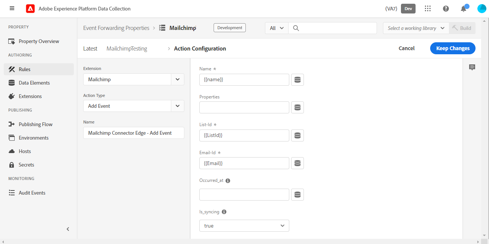

# Mailchimp 이벤트 전달 확장 개요

>[!NOTE]
>  
>Adobe Experience Platform Launch는 Adobe Experience Platform의 데이터 수집 기술로 새롭게 브랜딩되었습니다. 그 결과로 제품 설명서 전반에서 몇 가지 용어 변경이 있었습니다. 용어 변경에 대한 통합 참고 자료는 다음 [문서](https://experienceleague.adobe.com/docs/experience-platform/tags/term-updates.html?lang=ko)를 참조하십시오.

Mailchimp [이벤트 전달](../../../ui/event-forwarding/overview.md) 확장은 Mailchimp 마케팅 캠페인, 여정 또는 트랜잭션에 대한 이메일을 트리거할 수 있는 이벤트를 Mailchimp Marketing API에 보냅니다.

이 문서에서는 이벤트 추가 작업을 사용하여 확장을 설정하고 규칙을 구성하는 방법에 대해 설명합니다.

## 전제 조건

이 문서에서는 사용자가 확장에서 활용하는 관련 Mailchimp 제품을 잘 알고 있다고 가정합니다. 자세한 내용은 [캠페인](https://mailchimp.com/help/getting-started-with-campaigns/), [여정](https://mailchimp.com/help/about-customer-journeys/) 및 [트랜잭션](https://mailchimp.com/help/transactional/)에 대한 Mailchimp 도움말 설명서를 참조하십시오.

이 확장을 사용하려면 Mailchimp 계정이 필요합니다. 계정 [여기](https://login.mailchimp.com/signup/)에 등록할 수 있습니다. Mailchimp 계정 대시보드에서 이 안내서에 사용할 다음 값을 메모하십시오.

- Mailchimp 도메인 접두사
- API 키
- 대상자 ID
- 기본 &quot;보낸 사람&quot; 이메일 주소

Mailchimp 계정 플랜에 따라 Mailchimp 고객 여정 도구에 대한 액세스가 제한될 수 있습니다.

>[!TIP]
>  
>트랜잭션 이메일 또는 고객 여정과 같은 Mailchimp 자동화를 사용하는 경우 단계 및 화면이 여기에 나열된 것과 약간 다를 수 있습니다. 그러나 위에서 설명한 대로 이 확장을 사용하려면 동일한 정보가 필요합니다. 특정 계정 및 플랜에 대한 이러한 각 값에 대한 자세한 내용은 [Mailchimp 도움말 센터](https://mailchimp.com/help/)를 참조하십시오.

### 도메인 접두사

Mailchimp에 로그인하고 대시보드 보기에 도착한 후에는 브라우저의 주소 표시줄에 `https://us11.admin.mailchimp.com` 또는 `us11.admin.mailchimp.com`과(와) 같은 URL이 표시됩니다. 이 예제에서 접두사 `us11`은(는) 자리 표시자일 뿐이며 값은 달라집니다. 이후 단계를 위해 접두사로 URL을 기록합니다.

### API 키

계정의 API 키를 찾으려면 Mailchimp UI에서 프로필 아이콘을 선택한 다음 **프로필**&#x200B;을 선택하십시오. `https://us11.admin.mailchimp.com/account/profile/`과(와) 같은 URL이 표시되어야 하지만 `us11` 대신 **your** 접두사가 있습니다.

**추가 항목**&#x200B;을 선택한 다음 **API 키**&#x200B;을 선택합니다.

**API 키**&#x200B;에서 기존 키를 선택하거나 **키 만들기**&#x200B;를 선택하여 새 키를 만들 수 있습니다. 이 확장에서 특별히 사용할 새 키를 만들 수 있습니다. API 키를 복사하고 이후 단계를 위해 저장합니다. 자세한 내용은 Mailchimp 설명서에서 [API 키를 생성](https://mailchimp.com/developer/marketing/guides/quick-start/#generate-your-api-key)하는 방법을 참조하십시오.

### 대상 ID 및 보낸 사람 주소

왼쪽 탐색에서 **대상**&#x200B;을 선택한 다음 **대상 대시보드**&#x200B;를 선택합니다. 그런 다음 이 확장에 사용할 대상을 선택합니다. 자세한 내용은 [대상자 만들기](https://mailchimp.com/help/create-audience/)에서 Mailchimp 문서를 참조하십시오.

대상을 만들고 선택한 상태에서 **대상자 관리** 드롭다운을 선택하고 **설정**&#x200B;을 선택합니다. 이 화면에서는 대상에 대한 다양한 설정을 보여 줍니다.

설정 화면 맨 아래에 `Unique id for audience [audience name]`이(가) 표시됩니다. 여기서 `[audience name]`은(는) 실제 대상자의 이름입니다. 대상 ID를 복사하여 이후 단계를 위해 저장합니다.

**대상 이름 및 기본값**&#x200B;을 선택하고 **기본 시작 이메일 주소**&#x200B;에 캠페인에 대한 올바른 값이 있는지 확인하십시오. 대상 ID도 이 페이지의 맨 위에 나열되며 이 값은 마지막 단계에서 복사한 값과 동일합니다.

## Mailchimp 자동화

Mailchimp 플랜과 트랜잭션 이메일, 고객 여정 또는 기타 Mailchimp 자동화 사용 여부에 따라 특정 여정 설정이 다를 수 있습니다.

>[!IMPORTANT]
>  
>Mailchimp에서 자동화 또는 여정을 트리거하기 위해 선택한 이벤트 이름은 이 확장과 함께 보내야 하는 동일한 이벤트 이름입니다. Mailchimp 자동화에서 이벤트 이름을 기록하고 이후 단계를 위해 저장합니다.

## 설치 및 구성

이 섹션에서는 확장을 설치하고 구성하는 단계를 나열합니다. Mailchimp API 키를 안전하게 저장하려면 이벤트 전달 [암호](../../../ui/event-forwarding/secrets.md)를 사용해야 합니다.

### 암호 및 데이터 요소 만들기

이벤트 전달 속성에서 [`Mailchimp API Key`(이)라는 [!UICONTROL 토큰] 암호를 만듭니다](../../../ui/event-forwarding/secrets.md#token).

그런 다음 [!UICONTROL Core] 확장 및 [!UICONTROL Secret] 데이터 요소 형식을 사용하여 [데이터 요소를 만듭니다](../../../ui/managing-resources/data-elements.md#create-a-data-element). 방금 만든 `Mailchimp API Key` 암호를 참조합니다. `Mailchimp Token`을(를) 데이터 요소 이름으로 입력하십시오.

### 확장 설치 및 구성

동일한 이벤트 전달 속성에서 **[!UICONTROL 확장],**, **[!UICONTROL 카탈로그]**&#x200B;를 선택하여 설치할 수 있는 확장을 표시합니다. 여기에서 Mailchimp 확장을 검색하고 **[!UICONTROL 설치]**&#x200B;를 선택합니다.

구성 화면이 나타납니다. **[!UICONTROL Mailchimp 서버 접두사 도메인 이름]**&#x200B;에 고유한 도메인 접두사를 포함하여 Mailchimp 계정에서 이전에 복사한 도메인을 입력합니다.

>[!IMPORTANT]
>
>이 필드에 `http://` 또는 `https://`을(를) 포함하지 마십시오.

**[!UICONTROL Mailchimp 토큰]**&#x200B;에서 데이터 요소 아이콘을 선택하고 이전에 만든 `Mailchimp Token` 데이터 요소를 선택합니다. 변경 내용을 저장하려면 **[!UICONTROL 저장]**&#x200B;을 선택하십시오.

이제 확장이 설치되고 속성에서 사용하도록 구성되었습니다.

## 데이터 수집

[규칙](../../../ui/managing-resources/rules.md)에서 이 확장을 사용할 때 확장에서 각 이벤트와 함께 Mailchimp에 보내는 여러 데이터 값이 있습니다. 일반적인 구현의 경우 이벤트 전달 속성에서 확장을 사용할 수 있도록 해당 데이터를 [!DNL Experience Platform Edge Network]에 보내도록 [Adobe Experience Platform Web SDK 확장](../../client/web-sdk/overview.md)을 구성할 수 있습니다.

이 확장에 필요한 데이터는 Web SDK에서 XDM 데이터([`xdm`](/help/web-sdk/commands/sendevent/xdm.md) 개체 사용) 또는 비 XDM 데이터([`data`](/help/web-sdk/commands/sendevent/data.md) 개체 사용)로 보낼 수 있습니다.

예를 들어 고객이 사이트에서 이벤트를 구매하거나 등록하는 경우 이 확장 기능을 사용하여 Mailchimp를 통해 확인 이메일을 보낼 수 있습니다. 웹 SDK에서 Edge Network으로 필수 정보를 전송하면 확장 기능이 Mailchimp를 사용하여 이메일을 트리거합니다.

### 데이터 요소

이전 섹션의 스크린샷은 이 확장에서 Mailchimp로 각 이벤트와 함께 보낼 수 있는 데이터를 보여 줍니다. 이 데이터를 Edge Network으로 보내도록 Web SDK을 구성하면 확장 프로그램에서 해당 값에 액세스할 수 있도록 이벤트 전달 속성에 데이터 요소를 만들 수 있습니다.

아래 표는 가능한 각 값에 대한 자세한 내용을 제공합니다.

| 이름 | 예제 경로 | 유형 | 설명 | 필수 여부 | 제한 |
|:---|:---:|:---:|:---|:---:|:---|
| `email` | `arc.event.xdm._tenant.emailId`  또는  `arc.event.data._tenant.emailId` | 문자열 | 이메일을 받는 주소 | **예** | Mailchimp 대상에 있어야 합니다. |
| `listId` | `arc.event.xdm._tenant.listId`  또는  `arc.event.data._tenant.listid` | 문자열 | 대상자 ID | **예** | 기존 대상 ID와 일치해야 함 |
| `name` | `arc.event.xdm._tenant.name`  또는  `arc.event.data._tenant.name` | 문자열 | 이벤트 이름 | **예** | 2-30자 길이 |
| `properties` | `arc.event.xdm._tenant.properties`  또는  `arc.event.data._tenant.properties` | 오브젝트 | 이벤트에 대한 세부 정보가 포함된 JSON 형식의 선택적 속성 목록 | 아니요 |  |
| `isSyncing` | `arc.event.xdm._tenant.isSyncing`  또는  `arc.event.data._tenant.isSyncing` | 부울 | `is_syncing`을(를) `true` **(으)로 설정하여 만들어진 이벤트는 자동화를 트리거하지 않습니다** | 아니요 |  |
| `occurredAt` | `arc.event.xdm._tenant.occuredAt`  또는 `arc.event.data._tenant.occuredAt` | 문자열 | 이벤트가 발생한 시간의 ISO 8601 타임스탬프 | 아니요 |  |

{style="table-layout:auto"}

>[!IMPORTANT]
>  
>위의 **예제 경로** 값은 예제입니다. 위의 단계에서 웹 SDK의 이름을 지정하고 구성한 방식에 따라 해당 데이터 요소에서 참조하는 필드 이름과 [경로](../../../ui/event-forwarding/overview.md#data-element-path)가 속성에서 다를 수 있습니다.

이벤트 전달 속성에서 위에 설명된 각 필드에 대한 데이터 요소를 만들 수 있습니다. 만든 후에는 이 확장의 [!UICONTROL 이벤트 추가] 작업에서 데이터 요소를 참조할 수 있습니다.

이제 이 확장 및 이벤트 추가 작업을 사용하여 대상에 대한 Mailchimp 이메일을 트리거할 수 있습니다.

## 데이터 유효성 검사

이벤트 전달 확장을 사용할 때 [Adobe Experience Platform Debugger](https://chrome.google.com/webstore/detail/adobe-experience-platform/bfnnokhpnncpkdmbokanobigaccjkpob)은(는) 매우 유용합니다. 로그 섹션의 Edge 로그에서 이벤트 전달 규칙이 트리거된 후 수행한 요청을 볼 수 있습니다. 다음 스크린샷은 확장에 의해 Mailchimp API에 수행된 요청을 보여줍니다.

Mailchimp 대시보드의 활동 피드 보기에서 대상 또는 대상 구성원의 이벤트 목록이 제공됩니다. 이렇게 하려면 확장에서 전송한 이벤트와 일치해야 하며 수신한 이메일 또는 캠페인과 함께 전송된 모든 선택적 데이터를 표시해야 합니다. 자세한 내용은 [Mailchimp Automation 도움말 가이드](https://mailchimp.com/help/automation/)를 참조하십시오.
