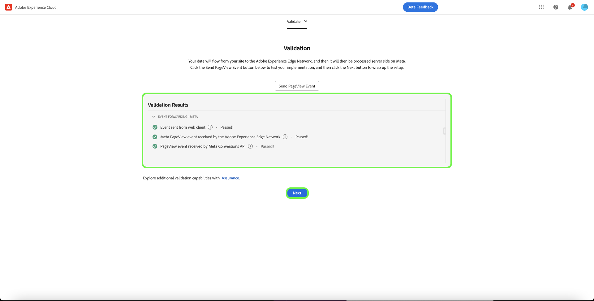

# [!DNL Meta Conversions API] 확장 개요

다음 [[!DNL Meta Conversions API]](https://developers.facebook.com/docs/marketing-api/conversions-api/) 을(를) 통해 서버측 마케팅 데이터를 [!DNL Meta] 광고 타겟팅을 최적화하고, 작업당 비용을 줄이고, 결과를 측정하는 기술을 제공합니다. 이벤트가 다음에 연결됨 [[!DNL Meta Pixel]](https://developers.facebook.com/docs/meta-pixel/) ID 및 는 클라이언트측 이벤트와 유사한 방식으로 처리됩니다.

사용 [!DNL Meta Conversions API] 확장에서는 의 API 기능을 활용할 수 있습니다. [이벤트 전달](../../../ui/event-forwarding/overview.md) 데이터를 보낼 규칙 [!DNL Meta] Adobe Experience Platform Edge Network에서 이 문서에서는 확장을 설치하고 이벤트 전달에서 해당 기능을 사용하는 방법을 다룹니다 [규칙](../../../ui/managing-resources/rules.md).

## 사전 요구 사항

다음을 사용하는 것이 좋습니다. [!DNL Meta Pixel] 및 [!DNL Conversions API] 클라이언트 측과 서버 측에서 각각 동일한 이벤트를 공유하고 전송하십시오. 이렇게 하면 에서 선택하지 않은 이벤트를 복구하는 데 도움이 될 수 있습니다. [!DNL Meta Pixel]. 설치 전 [!DNL Conversions API] 확장자는 의 안내서를 참조하십시오. [[!DNL Meta Pixel] 확장](../../client/meta/overview.md) 를 클라이언트측 태그 구현에 통합하는 방법에 대한 단계입니다.

>[!NOTE]
>
>의 섹션 [이벤트 중복 제거](#deduplication) 이 문서의 뒷부분에서는 브라우저와 서버 모두에서 동일한 이벤트를 받을 수 있으므로 동일한 이벤트가 두 번 사용되지 않도록 하는 단계를 다룹니다.

를 사용하려면 [!DNL Conversions API] 확장 프로그램, 이벤트 전달에 대한 액세스 권한이 있어야 하며 유효한 권한이 있어야 합니다. [!DNL Meta] 다음에 대한 액세스 권한이 있는 계정: [!DNL Ad Manager] 및 [!DNL Event Manager]. 특히 기존 의 ID를 복사해야 합니다 [[!DNL Meta Pixel]](https://www.facebook.com/business/help/952192354843755?id=1205376682832142) (또는 [새로 만들기 [!DNL Pixel]](https://www.facebook.com/business/help/952192354843755) 를 사용하는 대신) 계정에 확장을 구성할 수 있습니다.

>[!INFO]
>
>모바일 앱 데이터로 이 확장을 사용할 계획이거나 의 오프라인 이벤트 데이터로도 작업하는 경우 [!DNL Meta] 캠페인에서는 기존 앱을 통해 데이터 세트를 만들고 다음을 선택해야 합니다. **픽셀 ID로 만들기** 메시지가 표시되면 문서 보기 [비즈니스에 적합한 데이터 세트 만들기 옵션 결정](https://www.facebook.com/business/help/5270377362999582?id=490360542427371) 을 참조하십시오. 다음을 참조하십시오. [앱 이벤트에 대한 전환 API](https://developers.facebook.com/docs/marketing-api/conversions-api/app-events) 모든 필수 및 선택적 앱 추적 매개 변수에 대해 문서화합니다.

## 확장 설치

을(를) 설치하려면 [!DNL Meta Conversions API] 확장에서 데이터 수집 UI 또는 Experience Platform UI로 이동한 다음 를 선택합니다. **[!UICONTROL 이벤트 전달]** 왼쪽 탐색에서. 여기에서 확장을 추가할 속성을 선택하거나 새 속성을 대신 만듭니다.

원하는 속성을 선택하거나 만들었으면 를 선택합니다. **[!UICONTROL 확장]** 왼쪽 탐색에서 **[!UICONTROL 카탈로그]** 탭. 검색 [!UICONTROL 메타 전환 API] 카드를 선택한 다음 **[!UICONTROL 설치]**.

![다음 [!UICONTROL 설치] 다음에 대해 선택 중인 버튼 [!UICONTROL 메타 전환 API] 데이터 수집 UI의 확장.](../../../images/extensions/server/meta/install.png)

표시되는 구성 보기에서 다음을 제공해야 합니다. [!DNL Pixel] 확장을 계정에 연결하기 위해 이전에 복사한 ID입니다. ID를 입력에 직접 붙여넣거나 데이터 요소를 대신 사용할 수 있습니다.

또한 다음을 사용하려면 액세스 토큰을 제공해야 합니다. [!DNL Conversions API] 특히 다음을 참조하십시오. [!DNL Conversions API] 설명서 [액세스 토큰 생성](https://developers.facebook.com/docs/marketing-api/conversions-api/get-started#access-token) 을 참조하십시오.

완료되면 다음을 선택합니다. **[!UICONTROL 저장]**

![다음 [!DNL Pixel] 확장 구성 보기에서 데이터 요소로 제공된 ID.](../../../images/extensions/server/meta/configure.png)

확장이 설치되었으며 이제 이벤트 전달 규칙에 해당 기능을 사용할 수 있습니다.

## 이벤트 전달 규칙 구성 {#rule}

이 섹션에서는 사용 방법을 다룹니다 [!DNL Conversions API] 일반 이벤트 전달 규칙의 확장입니다. 실제로, 수락된 모든 항목을 보내려면 여러 규칙을 구성해야 합니다 [표준 이벤트](https://developers.facebook.com/docs/meta-pixel/reference) 경유 [!DNL Meta Pixel] 및 [!DNL Conversions API]. 모바일 앱 데이터의 경우 필수 필드, 앱 데이터 필드, 고객 정보 매개 변수 및 사용자 지정 데이터 세부 정보를 참조하십시오 [여기](https://developers.facebook.com/docs/marketing-api/conversions-api/app-events).

>[!NOTE]
>
>이벤트는 [실시간으로 전송됨](https://www.facebook.com/business/help/379226453470947?id=818859032317965) 또는 더 나은 광고 캠페인 최적화를 위해 가능한 한 실시간에 가깝게.

새 이벤트 전달 규칙 만들기를 시작하고 원하는 대로 해당 조건을 구성합니다. 규칙에 대한 작업을 선택할 때 다음을 선택합니다 **[!UICONTROL 메타 전환 API 확장]** 확장에 대해 을(를) 선택한 다음 **[!UICONTROL 전환 API 이벤트 보내기]** 작업 유형.

![다음 [!UICONTROL 페이지 보기 보내기] 데이터 수집 UI에서 규칙에 대해 선택 중인 작업 유형.](../../../images/extensions/server/meta/select-action.png)

전송할 이벤트 데이터를 구성할 수 있는 컨트롤이 나타납니다. [!DNL Meta] 를 통해 [!DNL Conversions API]. 이러한 옵션은 제공된 입력에 직접 입력할 수도 있고, 대신 값을 나타낼 기존 데이터 요소를 선택할 수도 있습니다. 구성 옵션은 아래 설명된 대로 4개의 기본 섹션으로 나뉩니다.

| 구성 섹션 | 설명 |
| --- | --- |
| [!UICONTROL 서버 이벤트 매개 변수] | 발생한 시간 및 이벤트를 트리거한 소스 작업을 포함한 이벤트에 대한 일반 정보입니다. 다음을 참조하십시오. [!DNL Meta] 개발자 설명서 를 참조하십시오. [표준 이벤트 매개 변수](https://developers.facebook.com/docs/marketing-api/conversions-api/parameters/server-event) 이(가) 수락함 [!DNL Conversions API].  두 가지를 모두 사용하는 경우 [!DNL Meta Pixel] 및 [!DNL Conversions API] 이벤트를 보내려면 다음을 모두 포함해야 합니다. **[!UICONTROL 이벤트 이름]** (`event_name`) 및 **[!UICONTROL 이벤트 ID]** (`event_id`) 모든 이벤트를 포함하는 경우 이 값은 [이벤트 중복 제거](#deduplication).  또한 다음 옵션을 사용할 수 있습니다. **[!UICONTROL 제한된 데이터 사용 활성화]** 고객 옵트아웃 준수 다음을 참조하십시오. [!DNL Conversions API] 설명서 [데이터 처리 옵션](https://developers.facebook.com/docs/marketing-apis/data-processing-options/) 이 기능에 대한 자세한 내용은 을 참조하십시오. |
| [!UICONTROL 고객 정보 매개 변수] | 이벤트를 고객에게 연결하는 데 사용되는 사용자 ID 데이터입니다. 이러한 값 중 일부는 API로 전송되기 전에 해시해야 합니다.  양호한 공통 API 연결과 높은 이벤트 일치 품질(EMQ)을 보장하려면 모든 을 전송하는 것이 좋습니다 [허용된 고객 정보 매개 변수](https://developers.facebook.com/docs/marketing-api/conversions-api/parameters/customer-information-parameters) 서버 이벤트 옆에 있습니다. 이러한 매개 변수는 다음과 같아야 합니다. [중요도와 EMQ에 미치는 영향에 따라 우선 순위 지정](https://www.facebook.com/business/help/765081237991954?id=818859032317965). |
| [!UICONTROL 사용자 정의 데이터] | 광고 게재 최적화에 사용할 추가 데이터로서, JSON 오브젝트 형태로 제공됩니다. 다음을 참조하십시오. [[!DNL Conversions API] 설명서](https://developers.facebook.com/docs/marketing-api/conversions-api/parameters/custom-data) 이 개체에 대해 허용되는 속성에 대한 자세한 정보입니다.  구매 이벤트를 보내는 경우 이 섹션을 사용하여 필요한 속성을 제공해야 합니다 `currency` 및 `value`. |
| [!UICONTROL 테스트 이벤트] | 이 옵션은 구성에서 서버 이벤트를 수신하는지 여부를 확인하는 데 사용됩니다. [!DNL Meta] 예상대로 이 기능을 사용하려면 **[!UICONTROL 테스트 이벤트로 보내기]** 확인란을 선택한 다음 아래 입력에 원하는 테스트 이벤트 코드를 입력합니다. 이벤트 전달 규칙이 배포되고 나면 확장 및 작업을 올바르게 구성한 경우 **[!DNL Test Events]** 다음에서 보기 [!DNL Meta Events Manager]. |

{style="table-layout:auto"}

완료되면 다음을 선택합니다. **[!UICONTROL 변경 내용 유지]** 작업을 규칙 구성에 추가합니다.

![[!UICONTROL 변경 내용 유지] 작업 구성에 대해 선택 중입니다.](../../../images/extensions/server/meta/keep-changes.png)

규칙에 만족하면 다음을 선택합니다. **[!UICONTROL 라이브러리에 저장]**. 마지막으로 새 이벤트 전달을 게시합니다. [빌드](../../../ui/publishing/builds.md) 라이브러리에 대한 변경 사항을 활성화합니다.

## 이벤트 중복 제거 {#deduplication}

에 언급된 대로 [사전 요구 사항 섹션](#prerequisites), 다음 두 가지를 모두 사용하는 것이 좋습니다. [!DNL Meta Pixel] 태그 확장 및 [!DNL Conversions API] 중복 설정에서 클라이언트와 서버에서 동일한 이벤트를 전송하는 이벤트 전달 확장. 이렇게 하면 한 확장이나 다른 확장에서 선택하지 않은 이벤트를 복구하는 데 도움이 될 수 있습니다.

클라이언트와 서버 간에 중복되지 않은 상태로 서로 다른 이벤트 유형을 보내는 경우 중복 제거가 필요하지 않습니다. 단, 단일 이벤트가 두 이벤트 모두에서 공유되는 경우 [!DNL Meta Pixel] 및 [!DNL Conversions API], 이러한 중복 이벤트가 중복 제거되어 보고에 부정적인 영향을 주지 않는지 확인해야 합니다.

공유 이벤트를 보낼 때 클라이언트와 서버 모두에서 보내는 모든 이벤트와 함께 이벤트 ID와 이름을 포함해야 합니다. ID와 이름이 같은 여러 이벤트가 수신되면 [!DNL Meta] 은 몇 가지 전략을 자동으로 사용하여 중복 제거하고 가장 관련성이 높은 데이터를 유지합니다. 다음을 참조하십시오. [!DNL Meta] 설명서 [중복 제거 대상 [!DNL Meta Pixel] 및 [!DNL Conversions API] events](https://www.facebook.com/business/help/823677331451951?id=1205376682832142) 자세한 내용은 을 참조하십시오.

## 빠른 시작 워크플로우: 메타 전환 API 확장(베타) {#quick-start}

>[!IMPORTANT]
>
>* 빠른 시작 기능은 Real-Time CDP Prime 및 Ultimate 패키지를 구입한 고객이 사용할 수 있습니다. 자세한 내용은 Adobe 담당자에게 문의하십시오.
>* 이 기능은 새로운 구현을 위한 것이며 현재 기존 태그 및 이벤트 전달 속성에 확장 및 구성을 자동으로 설치하는 것을 지원하지 않습니다.

빠른 시작 기능을 사용하면 메타 전환 API 및 메타 픽셀 확장을 사용하여 쉽고 효율적으로 설정할 수 있습니다. 이 도구는 Adobe 태그 및 이벤트 전달에서 수행되는 여러 단계를 자동화하여 설정 시간을 크게 줄입니다.

이 기능은 필요한 규칙 및 데이터 요소와 함께 새로 자동 생성된 태그 및 이벤트 전달 속성에 메타 전환 API 및 메타 픽셀 확장 기능을 자동으로 설치하고 구성합니다. 또한 Experience Platform Web SDK 및 데이터 스트림을 자동으로 설치 및 구성합니다. 마지막으로, 빠른 시작 기능은 이벤트 전달 및 Experience Edge를 통해 클라이언트측 데이터 수집 및 서버측 이벤트 전달을 실시간으로 사용할 수 있도록 개발 환경의 지정된 URL에 라이브러리를 자동으로 게시합니다.

다음 비디오에서는 빠른 시작 기능에 대해 소개합니다.

>[!VIDEO](https://video.tv.adobe.com/v/3416939?quality=12&learn=on)

### 빠른 시작 기능 설치

>[!NOTE]
>
>이 기능은 이벤트 전달 구현을 시작하는 데 도움이 되도록 설계되었습니다. 모든 사용 사례를 수용하는 완전한 기능의 엔드 투 엔드 구현을 제공하지 않습니다.

이 설치 프로그램은 메타 전환 API 및 메타 픽셀 확장을 모두 자동으로 설치합니다. 이 하이브리드 구현은 이벤트 전환 서버측을 수집 및 전달하기 위해 메타에서 권장합니다.
빠른 설정 기능은 고객이 이벤트 전달 구현을 시작할 수 있도록 고안된 것으로, 모든 사용 사례를 수용하는 완전한 기능의 엔드 투 엔드 구현을 제공하기 위한 것이 아닙니다.

기능을 설치하려면 다음을 선택합니다 **[!UICONTROL 시작]** 대상 **[!DNL Send Conversions Data to Meta]** Adobe Experience Platform 데이터 수집 **[!UICONTROL 홈]** 페이지를 가리키도록 업데이트하는 중입니다.

다음을 입력하십시오. **[!UICONTROL 도메인]**&#x200B;을 선택한 다음 을 선택합니다. **[!UICONTROL 다음]**. 이 도메인은 자동 생성된 태그 및 이벤트 전달 속성, 규칙, 데이터 요소, 데이터스트림 등에 대한 명명 규칙으로 사용됩니다.

다음에서 **[!UICONTROL 초기 설정]** 대화 상자에 다음을 입력하십시오. **[!UICONTROL 메타 픽셀 ID]**, **[!UICONTROL 메타 전환 API 액세스 토큰]**, 및 **[!UICONTROL 데이터 레이어 경로]**&#x200B;을 선택한 다음 을 선택합니다. **[!UICONTROL 다음]**.

몇 분 후에 초기 설정 프로세스를 완료하고 을(를) 선택합니다. **[!UICONTROL 다음]**.

다음에서 **[!UICONTROL 사이트에 코드 추가]** 대화 상자 사본을 사용하여 제공된 코드 복사  함수를 지정하고 이 함수를 `<head>` 소스 웹 사이트 구현되면 다음을 선택합니다 **[!UICONTROL 유효성 검사 시작]**

다음 [!UICONTROL 유효성 검사 결과] 대화 상자에 메타 확장 구현 결과가 표시됩니다. **[!UICONTROL 다음]**&#x200B;을 선택합니다. 다음을 선택하여 추가 유효성 검사 결과를 볼 수도 있습니다. **[!UICONTROL 보증]** 링크를 클릭합니다.

다음 **[!UICONTROL 다음 단계]** 화면 표시로 설정 완료를 확인합니다. 다음 섹션에 표시된 새 이벤트를 추가하여 구현을 최적화할 수 있는 옵션이 있습니다.

이벤트를 더 추가하지 않으려면 을 선택합니다. **[!UICONTROL 닫기]**.

#### 추가 이벤트 추가

새 이벤트를 추가하려면 **[!UICONTROL 태그 웹 속성 편집]**.

편집할 메타 이벤트에 해당하는 규칙을 선택합니다. 예를 들어, **MetaConversion_AddToCart**.

>[!NOTE]
>
>이벤트가 없는 경우 이 규칙은 실행되지 않습니다. 모든 규칙에 해당되며 **MetaConversion_PageView** 규칙이 예외입니다.

이벤트를 추가하려면 을 선택합니다. **[!UICONTROL 추가]** 다음 아래에 [!UICONTROL 이벤트] 제목.

다음 항목 선택 [!UICONTROL 이벤트 유형]. 이 예제에서는 다음을 선택하겠습니다. [!UICONTROL 클릭] 이벤트를 만들고, 이벤트가 **.add-to-cart 버튼** 이(가) 선택되어 있습니다. **[!UICONTROL 변경사항 유지]**&#x200B;를 선택합니다.

새 이벤트가 저장되었습니다. 선택 **[!UICONTROL 작업 라이브러리 선택]** 빌드할 라이브러리를 선택합니다.

그런 다음 옆에 있는 드롭다운을 선택합니다. **[!UICONTROL 라이브러리에 저장]** 및 선택 **[!UICONTROL 라이브러리 및 빌드에 저장]**. 이렇게 하면 변경 사항이 라이브러리에 게시됩니다.

구성할 다른 메타 전환 이벤트에 대해 이 단계를 반복합니다.

#### 데이터 레이어 구성 {#configuration}

>[!IMPORTANT]
>
>이 글로벌 데이터 레이어를 업데이트하는 방법은 웹 사이트 아키텍처에 따라 다릅니다. 단일 페이지 애플리케이션은 서버측 렌더링 앱과 다릅니다. 또한 Tags 제품 내에서 이 데이터를 만들고 업데이트하는 일을 전적으로 귀하가 담당하게 될 가능성도 있습니다. 모든 인스턴스에서 각 를 실행하는 사이에 데이터 레이어를 업데이트해야 합니다. `MetaConversion_* rules`. 규칙 간 데이터를 업데이트하지 않으면 마지막 항목에서 오래된 데이터를 보내는 경우도 발생할 수 있습니다 `MetaConversion_* rule` 현재 `MetaConversion_* rule`.

구성 중에 데이터 계층이 있는 위치를 묻는 메시지가 표시됩니다. 기본적으로 다음과 같습니다 `window.dataLayer.meta`및 내부 `meta` 개체. 아래 표시된 대로 데이터가 예상됩니다.

이는 다음과 같이 이해하는 데 중요합니다 `MetaConversion_*` 규칙은 이 데이터 구조를 사용하여 관련 데이터를 [!DNL Meta Pixel] 확장 및에 [!DNL Meta Conversions API]. 의 설명서를 참조하십시오. [표준 이벤트](https://developers.facebook.com/docs/meta-pixel/reference#standard-events) 다른 메타 이벤트에 필요한 데이터에 대한 자세한 내용은 를 참조하십시오.

예를 들어 `MetaConversion_Subscribe` 규칙을 업데이트해야 합니다. `window.dataLayer.meta.currency`, `window.dataLayer.meta.predicted_ltv`, 및 `window.dataLayer.meta.value` 설명서에 설명된 개체 속성에 따라 [표준 이벤트](https://developers.facebook.com/docs/meta-pixel/reference#standard-events).

다음은 규칙을 실행하기 전에 데이터 레이어를 업데이트하기 위해 웹 사이트에서 실행해야 하는 예입니다.

기본적으로 `<datalayerpath>.conversionData.eventId` 다음 작업 중 하나에 대해 &quot;새 이벤트 ID 생성&quot; 작업에 의해 임의로 생성됩니다. `MetaConversion_* rules`.

데이터 레이어의 모습에 대한 로컬 참조를 위해 `MetaConversion_DataLayer` 속성에 대한 데이터 요소입니다.

## 다음 단계

이 안내서에서는 서버측 이벤트 데이터를에 보내는 방법을 다룹니다. [!DNL Meta] 사용 [!DNL Meta Conversions API] 확장명. 여기에서 자세히 연결하여 통합을 확장하는 것이 좋습니다 [!DNL Pixels] 해당되는 경우 더 많은 이벤트 공유 다음 중 하나를 수행하면 광고 성능을 더욱 향상시킬 수 있습니다.

* 다른 항목 연결 [!DNL Pixels] 에 아직 연결되어 있지 않음 [!DNL Conversions API] 통합.
* 을 통해 특정 이벤트만 전송하는 경우 [!DNL Meta Pixel] 클라이언트측에서 이러한 동일한 이벤트를 [!DNL Conversions API] 서버측에서도 사용됩니다.

다음을 참조하십시오. [!DNL Meta] 설명서 [에 대한 우수 사례 [!DNL Conversions API]](https://www.facebook.com/business/help/308855623839366?id=818859032317965) 를 참조하십시오. Adobe Experience Cloud의 태그 및 이벤트 전달에 대한 자세한 내용은 [태그 개요](../../../home.md).
