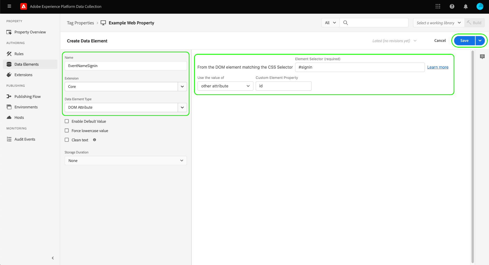

# [!DNL Mixpanel Track Events] API 이벤트 전달 확장

[[!DNL Mixpanel]](https://www.mixpanel.com) 는 사용자가 디지털 제품과 상호 작용하는 방법에 대한 데이터를 캡처할 수 있는 제품 분석 도구입니다. 몇 번의 클릭만으로 데이터를 쿼리하고 시각화할 수 있는 간단한 대화형 보고서로 제품 데이터를 분석할 수 있습니다. [!DNL Mixpanel] 트렌드를 식별하고, 사용자 행동을 이해하며, 제품에 대한 결정을 내리는 데 모든 사람이 실시간으로 사용자 데이터를 분석할 수 있도록 하여 팀을 더욱 효율적으로 만들 수 있도록 설계되었습니다.

[!DNL Mixpanel] 각 상호 작용을 단일 사용자에 연결하는 이벤트 기반 사용자 중심 모델을 사용합니다. 다음 [!DNL Mixpanel] 데이터 모델은 사용자, 이벤트 및 속성의 개념을 기반으로 구축됩니다.

>[!NOTE]
>
>자세한 내용은 [!DNL Mixpanel] 설명서 [id 관리](https://help.mixpanel.com/hc/en-us/articles/360041039771-Getting-Started-with-Identity-Management) 방법을 이해하다 [!DNL Mixpanel] 이벤트를 병합하여 id 클러스터를 만듭니다. 또한 문서를 검토하는 것이 좋습니다 [고유 ID](https://help.mixpanel.com/hc/en-us/articles/115004509426-Distinct-ID-Creation-JavaScript-iOS-Android-) 를 사용하여 이벤트 데이터에서 사용자를 식별하는 방법을 이해합니다.

다음 [!DNL Mixpanel Track Events] API 확장을 사용하면 두 가지 모두를 활용할 수 있습니다 [이벤트 전달](../../../ui/event-forwarding/overview.md) 및 [태그](../../../home.md) Adobe Experience Platform Edge Network에서 이벤트 정보를 캡처하여 및에 전송하려면 [!DNL Mixpanel] 사용 [[!DNL Track Events] API](https://developer.mixpanel.com/reference/track-event). 이 문서에서는 확장의 사용 사례, 설치 방법 및 확장을 이벤트 전달에 통합하는 방법에 대해 설명합니다 [규칙](../../../ui/managing-resources/rules.md).

## 사용 사례

이 확장은 Edge Network의 데이터를 [!DNL Mixpanel] 를 사용하십시오.

예를 들어, 다중 채널 유무(웹 사이트 및 모바일)가 있는 소매 조직을 생각해 보십시오. 조직은 플랫폼에서 이벤트 데이터로 트랜잭션 또는 대화형 입력을 캡처하고에 로드합니다. [!DNL Mixpanel] 이벤트 전달 확장 사용.

그러면 분석 팀이 활용할 수 있습니다 [!DNL Mixpanel's] 데이터 세트를 처리하고 비즈니스 통찰력을 도출하는 기능. 이 기능은 그래프, 대시보드 또는 기타 시각화를 생성하여 비즈니스 이해 당사자에게 알려주는 데 사용할 수 있습니다.

에 고유한 사용 사례에 대한 자세한 정보 [!DNL Mixpanel]에서 다음 설명서를 참조하십시오.

* [신규 대상 [!DNL Mixpanel]](https://help.mixpanel.com/hc/en-us/sections/360008533532-New-to-Mixpanel)
* [ [!DNL Mixpanel]란?](https://developer.mixpanel.com/docs)
* [12 반드시 시도해야 함 [!DNL Mixpanel] 기능](https://mixpanel.com/blog/12-things-you-probably-didnt-know-you-could-do-with-mixpanel/)

## [!DNL Mixpanel] 전제 조건 {#prerequisites-mixpanel}

유효한 권한이 있어야 합니다. [!DNL Mixpanel] 이 확장을 사용하려면 계정을 사용하십시오. 로 이동합니다. [[!DNL Mixpanel] 등록 페이지](https://mixpanel.com/register/) 을 입력하여 아직 계정이 없는 경우 계정을 등록하고 만듭니다.

다음을 확인합니다. [[!DNL Identity Merge]](https://help.mixpanel.com/hc/en-us/articles/9648680824852-ID-Merge-Implementation-Best-Practices) 이 활성화되어 있습니다. 다음으로 이동 **[!DNL Settings]** > **[!DNL Project Setting]** > **[!DNL Identity Merge]** 설정을 전환합니다.

<!-- (If these don't apply, do we need to include here at all?)
### API guardrails {#guardrails}

Refer to the [[!DNL Mixpanel] documentation](https://developer.mixpanel.com/reference/import-events#rate-limits) for limits and response codes. As [!DNL Mixpanel] only sends live events these limits should not apply.
-->

### 필요한 구성 세부 정보 수집 {#configuration-details}

Experience Platform을 연결하려면 [!DNL Mixpanel] 다음 입력이 있어야 합니다.

| 키 유형 | 설명 | 예 |
| --- | --- | --- |
| 프로젝트 토큰 | 와 연결된 프로젝트 토큰 [!DNL Mixpanel] 계정이 필요합니다. 자세한 내용은 [!DNL Mixpanel] 설명서 [프로젝트 토큰 찾기](https://help.mixpanel.com/hc/en-us/articles/115004502806-Find-Project-Token-) 참조하십시오. | `25470xxxxxxxxxxxxxxxxxxx1289` |

## Experience Cloud 사전 요구 사항

이 섹션에서는 모든 구현에 대한 Experience Cloud의 전제 조건 단계를 다룹니다. 개별 구현 요구 사항에 따라 확장을 구성하기 전에 다음 구문을 설정하는 것이 도움이 될 수 있습니다.

1. A [스키마](../../../../xdm/schema/composition.md) Experience Cloud에 수집하는 데이터의 구조를 설명하려면
1. A [데이터 스트림](https://experienceleague.adobe.com/docs/platform-learn/data-collection/event-forwarding/set-up-a-datastream.html) 수신되는 데이터를 적절한 Adobe Experience Cloud 애플리케이션으로 라우팅합니다.
1. A [데이터 세트](https://experienceleague.adobe.com/docs/platform-learn/tutorials/data-ingestion/create-datasets-and-ingest-data.html) 수집된 데이터를 저장

모든 구현의 경우 Experience Cloud 측에 다음이 필요합니다.

1. [암호 만들기](#create-a-secret)
1. [태그 속성 설정](#set-up-tag-properties)
1. [태그 속성 내에 데이터 요소 추가](#add-data-elements-within-tag-properties)
1. [태그 속성 내에 규칙 추가](#add-rules-within-tag-properties)

### 암호 만들기

새 만들기 [이벤트 전달 암호](../../../ui/event-forwarding/secrets.md) 값을 로 설정합니다. [[!DNL Mixpanel] 프로젝트 토큰](#configuration-details). 이 값은 값을 안전하게 유지하면서 계정에 대한 연결을 인증하는 데 사용됩니다.

### 태그 속성 설정

[태그 속성 만들기](https://experienceleague.adobe.com/docs/platform-learn/implement-in-websites/configure-tags/create-a-property.html?lang=en) 또는 편집할 기존 속성을 대신 선택합니다. 이 속성은 다음 작업에 필요한 데이터 구조를 수집하도록 구성됩니다 [!DNL Mixpanel] 이벤트 전달을 사용하여 전송하기 전에 에지 네트워크로 가져옵니다.

### 태그 속성 내에 데이터 요소 추가

웹 사이트에서 [[!DNL Mixpanel] SDK](https://developer.mixpanel.com/docs/nodejs): [데이터 요소 만들기](../../../ui/managing-resources/data-elements.md) 를 **[!UICONTROL 쿠키]** 유형(에서 제공) [[!UICONTROL 코어] 태그 확장](../../client/core/overview.md)) [!DNL Mixpanel] `distinct_id` 쿠키에서 읽을 수 있습니다.

다음 **[!UICONTROL 쿠키 이름]** 값은 와 일치해야 합니다. [!DNL Mixpanel] 웹 사이트의 쿠키 이름. 이름의 형식은 과 유사해야 합니다 `mp_{MIXPANEL_PROJECT_TOKEN_FOR_WEBSITE}_mixpanel`. 선택 **[!UICONTROL 저장]** 완료됨.

>[!IMPORTANT]
>
>위의 데이터 요소의 이름(`distinctId` 이 예에서 ) 는 스키마의 동일한 필드에 사용되는 이름과 일치해야 합니다. 이는 나중에 만들 이벤트 전달 데이터 요소에도 적용됩니다.

두 번째 데이터 요소의 경우 유형을 **[!UICONTROL XDM 개체]** ( [Adobe Experience Platform 웹 SDK 확장](../../client/sdk/overview.md))를 만든 후 이전에 만든 스키마에 매핑합니다. 데이터를 매핑할 때 `distinct_id` 데이터 요소(다음을 포함) [!DNL Mixpanel] `distinct_id` 쿠키의 값)이 스키마 필드 중 하나 내의 값으로 참조됩니다.

>[!NOTE]
>
>웹 사이트에서 [!DNL Mixpanel] SDK, ECID(Adobe Experience Cloud ID)가 폴백으로 사용됩니다 `distinct_id` 에 전송된 이벤트를 사용하여 전달할 값 [!DNL Mixpanel].

시나리오에 따라 스키마의 이벤트 이름에 매핑하는 데 사용할 수 있는 다른 데이터 요소를 만들어야 할 수 있습니다. 이 작업은 를 사용하여 수행할 수 있습니다. **[!UICONTROL DOM 속성]** 에서 제공하는 유형 [!UICONTROL 코어] 확장.

### 태그 속성 내에 규칙 추가

데이터 요소가 설정되면 데이터가 전송되는 이벤트를 결정하는 규칙 만들기를 시작할 수 있습니다 [!DNL Mixpanel].

먼저 사용자 식별 이벤트에 대해 트리거되는 규칙을 만듭니다. 이 값은 로그인, 등록, 등록 또는 사용자 식별에 사용할 기타 모든 이벤트를 나타낼 수 있습니다.

아래 **[!UICONTROL 이벤트]**&#x200B;를 채울 이벤트를 트리거하는 조건(웹 사이트에만 해당)을 추가합니다. 사용자 클릭에 대한 로그인 규칙을 트리거하는 예는 다음과 같습니다.

선택 **[!UICONTROL 변경 내용 유지]** 를 눌러 규칙에 이벤트를 추가합니다.

다음, 아래 **[!UICONTROL 작업]**&#x200B;를 채울 때 규칙이 실행될 때 수행할 결과 작업을 추가합니다. 이러한 작업 중에는 **[!UICONTROL 이벤트 보내기]** 은 Edge Network에 이벤트를 전송하는 Platform Web SDK 확장에서 제공하며, 이 확장은 과 같은 이벤트 전달 확장에서 선택할 수 있습니다 [!DNL Mixpanel].

작업을 구성할 때 아래의 **[!UICONTROL XDM 데이터]** 선택 [이전에 만든 데이터 요소](#add-data-elements-within-tag-properties) 여기에는 다음 항목이 포함됩니다 `distinct_id` 값.

선택 **[!UICONTROL 변경 내용 유지]** 이벤트를 규칙에 추가하려면 **[!UICONTROL 저장]** 를 눌러 태그 라이브러리에 규칙을 추가합니다. 여기에서 다음을 수행할 수 있습니다 [새 빌드를 만들어 웹 사이트에 배포](../../../ui/publishing/overview.md).

## 설치 및 구성 [!DNL Mixpanel] 확장 {#install}

확장을 설치하려면 [이벤트 전달 속성 만들기](../../../ui/event-forwarding/overview.md#properties) 또는 편집할 기존 속성을 대신 선택합니다.

선택 **[!UICONTROL 확장]** 을 클릭합니다. 에서 **[!UICONTROL 카탈로그]** 탭, 선택 **[!UICONTROL 설치]** 카드 위에 [!DNL Mixpanel] 확장.

![설치 [!DNL Mixpanel] 확장.](../../../images/extensions/server/mixpanel/install-extension.png)

## 이벤트 전달 데이터 요소 설정

확장을 설치한 후 다음 단계는 로 전송할 필수 데이터 구문을 캡처하는 이벤트 전달 데이터 요소를 만드는 것입니다 [!DNL Mixpanel].

### 만들기 `distinctId` 데이터 요소

이벤트 전달 아래에 데이터 요소를 추가합니다. 사이트가 [[!DNL Mixpanel] SDK](https://developer.mixpanel.com/docs/nodejs) a [태그 속성 데이터 요소](#setup-tag-properties-data-element) 이 정의된 횟수. 이제 이벤트 전달 데이터 요소의 경우 **[!UICONTROL 경로]** 을 가리키도록 업데이트하는 것이 좋습니다.

### 만들기 `event_type` 데이터 요소

다음은 이벤트 유형에 대해 정의된 데이터 요소의 예입니다.

### 추가 데이터 요소 매핑 만들기

다음 `distinctId` 및 `event_type` 데이터를 로 전송하는 데 데이터 요소가 모두 필요합니다 [!DNL Mixpanel]하지만 알려진 사용자 ID와 각 이벤트와 함께 사용자 지정 데이터 개체를 포함하는 것이 좋습니다. 의 안내서를 참조하십시오. [[!DNL Mixpanel Track Events] REST API](https://developer.mixpanel.com/reference/track-event) 추가 지침

권장 데이터 요소 매핑은 아래에 요약되어 있습니다.

>[!IMPORTANT]
>
>아래 나열된 모든 데이터 요소는 **[!UICONTROL 경로]** 에 요약된 대로 스키마의 특정 필드에 매핑할 수 있도록 를 입력합니다. **스키마 경로** 열.
>
>스키마 경로의 경우 `{TENANT_ID}` 고유한 자리 표시자 [임차인 ID](../../../../xdm/api/getting-started.md#know-your-tenant_id): 조직에서 정의한 사용자 정의 필드의 네임스페이스 역할을 합니다.

| [!DNL Mixpanel] key | 스키마 경로 | 설명 | 필수입니다 |
| --- | --- | --- | --- |
| [!DNL Mixpanel Distinct ID] | `arc.event.xdm._{TENANT_ID}.distinct_id` | `distinct_id` 은 이벤트를 수행한 사용자를 식별합니다. `distinct_id` 는 모든 이벤트에 필수이므로 반드시 지정해야 합니다 [!DNL Mixpanel] 고유한 사용자, 단계, 유지, 집단 등을 포함하여 행동 분석을 정확하고 효율적으로 수행할 수 있습니다. | 예 |
| [!DNL Event Type] | `arc.event.xdm._{TENANT_ID}.event_type` | 이벤트 이름입니다. [!DNL Mixpanel] 에서는 고유한 이벤트 이름의 수를 비교적 작게 유지하고 이벤트에 첨부된 변수 컨텍스트에 대한 속성을 사용할 것을 권장합니다.  예를 들어 &quot;유료 등록&quot; 및 &quot;무료 등록&quot;과 같은 이름을 사용하는 이벤트를 추적하는 대신 &quot;등록&quot;이라는 이벤트를 추적하고 &quot;계정 유형&quot;이라는 속성을 &quot;유료&quot; 및 &quot;free&quot;라는 잠재적 값으로 사용하는 것이 좋습니다. | 예 |
| [!DNL Known User ID] | `arc.event.xdm._{TENANT_ID}.LoginID` | 사용 가능한 경우 사용자의 이메일 또는 로그인 ID입니다. | 아니요 |
| [!DNL Data] | `arc.event.xdm._{TENANT_ID}.properties` | 이벤트에 대한 모든 속성을 나타내는 JSON 개체. 데이터가 255자로 잘립니다. | 아니요 |

{style="table-layout:auto"}

## 이벤트 전달 규칙 설정

모든 데이터 요소가 설정되면 이벤트를 보낼 시기 및 방법을 결정하는 이벤트 전달 규칙 만들기를 시작할 수 있습니다 [!DNL Mixpanel]. 그러나 규칙을 구성하기 전에 ID 클러스터가 작동하는 방식을 이해하는 것이 중요합니다 [!DNL Mixpanel] 전송하는 이벤트가 개별 사용자에게 올바로 귀속되도록 합니다.

### 의 ID 클러스터 이해 [!DNL Mixpanel]

in [!DNL Mixpanel]인 경우 id 클러스터에는 `distinct_id` 개별 사용자에게 연결되는 값. [!DNL Mixpanel] 각 사용자에 대한 ID 클러스터링을 처리하여 단일 대표(canonical) `distinct_id` 보고에 사용할 각 클러스터에서 입니다. 자체 식별자(로컬이라고 함)를 포함할 수도 있습니다 `distinct_id`)를 사용하십시오.

[!DNL Mixpanel] 다음 두 가지 방법으로 id 클러스터를 확인합니다.

* **식별** : [!DNL Mixpanel] 선택한 식별자를 익명 `distinct_id`. 만약 [!DNL Mixpanel] SDK가 웹 사이트에 구성되면 플랫폼에서는 `distinct_id` 현재 로그인한 사용자에게 할당됩니다.
* **별칭**: [!DNL Mixpanel] 두 명의 익명 없이 병합함 `distinct_id`다른 병합 기준이 전달된 경우 함께 사용됩니다.

>[!NOTE]
>
>자세한 내용은 [!DNL Mixpanel] 문서 [id 관리](https://help.mixpanel.com/hc/en-us/articles/360041039771-Getting-Started-with-Identity-Management#user-identification) 자세한 내용은 이러한 메서드를 참조하십시오.
>
>를 활성화했는지 확인합니다. [[!DNL Mixpanel] id 병합 기능](#prerequisites-mixpanel) ID 클러스터가 제대로 해결되었는지 확인합니다.

따라서, [!DNL Mixpanel] 이벤트 전달 확장 은 **[!UICONTROL 이벤트 추적]** 규칙 구성에 대한 작업 유형입니다.

>[!IMPORTANT]
>
>각 규칙에 대해 사용된 ID 클러스터 확인 방법과 관계없이 작업 중 하나가 **[!UICONTROL 이벤트 추적]** 유형. 이 작업 유형이 없으면 규칙은 Adobe Experience Edge Network 이벤트를 [!DNL Mixpanel].

### 이벤트 추적 규칙 만들기

이벤트 전달 속성에서 새 규칙 만들기를 시작합니다. 아래 **[!UICONTROL 작업]**&#x200B;를 클릭하고 새 작업을 추가하고 확장을 로 설정합니다. **[!UICONTROL Mixpanel]**. 다음으로 작업 유형을 **[!UICONTROL 이벤트 추적]** adobe Experience Edge Network 이벤트를에 보내려면 [!DNL Mixpanel].

| 입력 | 설명 |
| --- | --- |
| [!UICONTROL 프로젝트 토큰] | 이 필드는 와 연결된 프로젝트 토큰에 매핑되어야 합니다 [!DNL Mixpanel] 계정이 필요합니다. |
| [!UICONTROL 이벤트 유형] | 이벤트 이름. |
| [!UICONTROL 이벤트 시간] | 이벤트 시간입니다. |
| [!UICONTROL Mixpanel 고유 ID] | 이 필드는 `distinctId` 이전에 만든 데이터 요소입니다. |
| [!UICONTROL ID 삽입] | 이 필드는 `insertId` 데이터 요소를 생성하지 않습니다. |
| [!UICONTROL 이벤트 속성] | 원시 JSON을 제공하거나 간소화된 키 값 입력 세트를 사용하여 을 선택합니다. |

>[!NOTE]
>
>의 표준 필드에 대한 자세한 내용은 [!DNL Mixpanel] 이벤트를 참조하려면 [공식 문서](https://developer.mixpanel.com/reference/import-events#event).

한 번 [!UICONTROL 이벤트 추적] 작업이 규칙에 추가되거나, 특정 이벤트에만 실행되도록 규칙 조건을 구성할 수 있고, 모든 이벤트에 대해 규칙이 실행되도록 조건 섹션을 비워 둘 수 있습니다.

>[!IMPORTANT]
>
>웹 사이트에서 [!DNL Mixpanel] SDK에서는 다음 단계를 계속 수행할 수 있습니다 [내에서 데이터 유효성 검사 [!DNL Mixpanel]](#validate). 를 사용하지 않는 경우 [!DNL Mixpanel] SDK를 실행하려면 [별도의 id 추적 규칙 만들기](#create-an-identity-tracking-rule) 적절한 이벤트와 `distinct_id` 값은에 전송됩니다. [!DNL Mixpanel] 사용자 식별 이벤트가 발생하는 경우

### ID 추적 규칙 만들기

를 사용하지 않는 경우 [!DNL Mixpanel SDK]를 지정하는 경우, 다음 단계는 다른 규칙을 만드는 것입니다. 이 규칙은 웹 사이트에서 사용자 ID 이벤트가 발생할 때마다(로그인, 등록, 등록 등) 적절한 이벤트와 `distinct_id` 값은에 전송됩니다. [!DNL Mixpanel].

새 규칙을 만드는 프로세스를 시작합니다. 대상 [!UICONTROL 조건] 섹션에서 이벤트가 사용자 식별 이벤트인지 확인하는 조건을 추가합니다. 아래 예에서는 조건이 [!UICONTROL 값 비교] ( [!UICONTROL 코어] 확장)을 사용하여 들어오는 이벤트에 다음과 같은 이벤트 이름이 있는지 확인합니다 `signin`, 사용자 로그인 이벤트를 나타냅니다.

![에 대한 작업 구성 쇼케이스 [!DNL Mixpanel] 작업 유형 별칭 및 식별](../../../images/extensions/server/mixpanel/ef-rule-condition.png)

규칙에 적절한 조건을 추가한 후에는 [!UICONTROL 이벤트 보내기] adobe Experience Edge Network 이벤트를에 보내려면 [!DNL Mixpanel].

>[!NOTE]
>
>의 ID에 대한 자세한 정보 [!DNL Mixpanel]를 참조하려면 [공식 문서](https://developer.mixpanel.com/reference/create-identity).

작업이 규칙에 추가되면 을 선택합니다 **[!UICONTROL 저장]** 를 추가하여 이벤트 전달 라이브러리에 규칙을 추가합니다. 여기에서 다음을 수행할 수 있습니다 [새 빌드 만들기 및 변경 사항 활성화](../../../ui/publishing/overview.md).

![에 대한 이벤트 전달 규칙 추가 [!DNL Mixpanel] 작업 유형 별칭 및 식별](../../../images/extensions/server/mixpanel/ef-rule-complete.png)

## 내에서 데이터 유효성 검사 [!DNL Mixpanel] {#validate}

구현이 성공하고 이벤트가 수집되면 [[!DNL Mixpanel] 콘솔](https://help.mixpanel.com/hc/en-us/articles/4402837164948).

확인 [!DNL Mixpanel] 을(를) 사용하여 만든 게시물 로그인 이벤트 및 이메일 값으로 채워졌습니다. **[!UICONTROL 이벤트 보내기]**. 올바르게 구현된 경우 [!DNL Mixpanel] 이 두 ID를 단일 [사용자 프로필](https://help.mixpanel.com/hc/en-us/articles/115004501966).

## 다음 단계

이 안내서에서는 전환 이벤트를 [!DNL Mixpanel] 이벤트 전달 사용. 이 이벤트 전달 확장은 [!DNL Mixpanel] SDK 및 JavaScript API. 이러한 기본 기술에 대한 자세한 내용은 공식 설명서를 참조하십시오.

* [[!DNL Mixpanel] SDK](https://developer.mixpanel.com/docs/nodejs)
* [[!DNL Mixpanel] JavaScript API](https://developer.mixpanel.com/docs/javascript-full-api-reference#mixpanelidentify)

Experience Platform의 이벤트 전달 기능에 대한 자세한 내용은 [이벤트 전달 개요](../../../ui/event-forwarding/overview.md).
