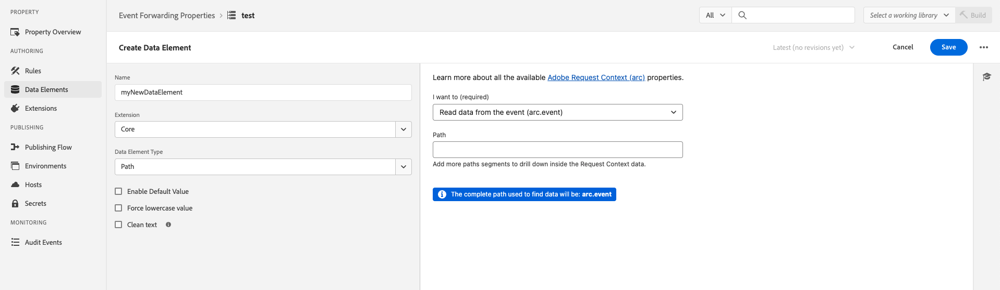

# [!DNL Snapchat] 전환 API 확장 개요

[!DNL Snap] 전환 API 확장은 웹 사이트에서 사용자 작업에 대한 정보를 [!DNL Snapchat]과(와) 직접 공유할 수 있는 보안 [Edge Network API](https://developer.adobe.com/data-collection-apis/docs/) 인터페이스입니다. 이벤트 전달 규칙을 활용하여 **[!DNL Snap]** 전환 API 확장을 사용하여 **[!DNL Adobe Experience Platform Edge Network]**&#x200B;에서 **[!DNL Snapchat]**(으)로 데이터를 보낼 수 있습니다.

## [!DNL Snapchat]개 필수 구성 요소 {#prerequisites}

[!DNL Snapchat] 전환 API를 사용하려면:

* Adobe Experience Platform에 [이벤트 전달 속성](/help/tags/ui/event-forwarding/getting-started.md)이 설정되어 있어야 합니다.
* 속성을 편집하려면 [필요한 권한](/help/collection/permissions.md)도 있어야 합니다.

[데이터 스트림](/help/tags/ui/event-forwarding/getting-started.md)을(를) 만들고 [이벤트 전달 서비스](/help/tags/ui/event-forwarding/getting-started.md#enable-event-forwarding)를 추가합니다.

전환 API를 사용하려면 **[!DNL Snapchat]** [비즈니스 관리자](https://business.snapchat.com/) 계정이 필요합니다. Business Manager는 광고주가 비즈니스 및 외부 파트너와 **[!DNL Snapchat]**&#x200B;의 마케팅 활동을 통합할 수 있도록 지원합니다. Business Manager 계정이 없는 경우 계정 만들기에 대한 **[!DNL Snapchat]** [도움말 센터 문서](https://businesshelp.snapchat.com/s/article/get-started?language=en_US)를 참조하십시오.

Snapchat Ads 관리자에서 [!DNL [Snap Pixel]](https://businesshelp.snapchat.com/s/article/pixel-website-install?language=en_US)을(를) 설정해야 하며 `Pixel ID`을(를) 볼 수 있는 액세스 권한이 있어야 합니다. `Pixel ID`은(는) [!UICONTROL [이벤트 관리자]](https://businesshelp.snapchat.com/s/article/events-manager?language=en_US) 섹션에서 찾을 수 있습니다.

오래 지속되는 정적 API 토큰이 필요합니다. 이 토큰을 얻으려면 [[!DNL Snapchat] 전환 API 설명서](https://developers.snap.com/api/marketing-api/Conversions-API/GetStarted#access-token)를 참조하십시오.

## [!DNL Snapchat] 웹 이벤트 API 확장 설치 및 구성 {#install}

확장을 설치하려면 **[!UICONTROL 데이터 수집]**>**[!UICONTROL 이벤트 전달]**&#x200B;로 이동하십시오. 확장을 설치할 속성을 선택합니다.

원하는 속성을 선택하고 다음 단계를 수행합니다.

1. 왼쪽 탐색 패널에서 **[!UICONTROL 확장]**&#x200B;을 선택합니다.
2. **[!UICONTROL 스냅 변환 API 확장]**&#x200B;을(를) 검색하고 **[!UICONTROL 설치]**&#x200B;를 선택합니다.

   

3. 구성 화면에서 다음 값을 입력합니다.

* **[!UICONTROL 픽셀 ID]**
* **[!UICONTROL API 토큰]**

완료되면 **[!UICONTROL 저장]**&#x200B;을 선택합니다.


<!-- 
![[!DNL Snap] configuration screen for the [!DNL Snap] conversion API extension.](../../../images/extensions/server/snap/configure.png) -->

## 데이터 요소 만들기 {#create-data-elements}

데이터를 [!DNL Snapchat] 전환 API 확장으로 보내려면 각 데이터 매개 변수에 대해 [데이터 요소](https://experienceleague.adobe.com/en/docs/platform-learn/implement-web-sdk/event-forwarding/setup-event-forwarding#create-an-event-forwarding-data-element)를 만드십시오. 다음 단계를 수행하십시오.

1. 속성의 **[!UICONTROL 속성 정보]** 화면에서 **[!UICONTROL 작성]**>**[!UICONTROL 데이터 요소]**(으)로 이동한 다음 **[!UICONTROL 데이터 요소 추가]**&#x200B;를 선택합니다.

   

2. 데이터 요소의 이름을 입력합니다.

3. 확장으로 **[!UICONTROL Core]**&#x200B;을(를) 선택하고 데이터 요소 유형으로 **[!UICONTROL Path]**&#x200B;을(를) 선택합니다.

4. 드롭다운 메뉴에서 적절한 항목을 선택하고 오른쪽 패널의 [!UICONTROL 경로] 필드에 내용을 입력하여 스키마에서 원하는 데이터를 참조합니다.

   

예를 들어 아래에 표시된 스키마에서 `snapClickId`을(를) 참조하는 데이터 요소를 만드는 경우:

을(를) 표시하는 이미지

`snapClickId`이(가) XDM 스키마의 `_snap.inc.exchange` 아래에 있으므로 데이터 요소를 구성해야 합니다.


데이터 요소 만들기에 대한 자세한 내용은 [이벤트 전달 속성 설명서](/help/tags/ui/event-forwarding/overview.md#data-elements)를 참조하세요.

## 변환 이벤트를 스냅으로 보내는 규칙 만들기 {#create-snap-rules}

[규칙](https://experienceleague.adobe.com/en/docs/platform-learn/implement-web-sdk/event-forwarding/setup-event-forwarding#create-an-event-forwarding-rule)은(는) Experience Platform에서 확장을 트리거하는 데 사용됩니다. 이 섹션에서는 이벤트 전달 속성 내에 규칙을 만들어 전환 API 확장을 사용하여 스냅에 전환 이벤트를 보내는 방법에 대해 설명합니다.

### 새 규칙 만들기

1. 이벤트 전달 속성으로 이동하고 작성 메뉴에서 **[!UICONTROL 규칙]**&#x200B;을(를) 선택합니다. 그런 다음 **[!UICONTROL 새 규칙 만들기]**&#x200B;를 클릭합니다.

   

2. 규칙 이름을 지정하고 스냅 이벤트를 트리거하는 조건을 구성합니다. 예를 들어 이벤트에 주문 번호가 포함될 때마다 `PURCHASE` 이벤트를 보내려면 사용자 인터랙션에 올바른 구매 주문 번호가 포함되어 있는지 확인하는 조건을 설정하십시오.

   

3. 조건을 저장한 후 스냅 변환 API를 트리거하는 작업을 추가합니다. 왼쪽 패널에서 다음을 수행합니다.

   * [!UICONTROL 확장] 드롭다운 메뉴를 [!UICONTROL 스냅 전환 API 확장]&#x200B;(으)로 설정합니다.

   * [!UICONTROL 작업 유형] 드롭다운 메뉴를 [!UICONTROL 보고서 웹 전환]&#x200B;(으)로 설정합니다.

   * 규칙 이름을 적절하게 지정합니다.

   

4. 오른쪽 패널의 **[!UICONTROL 데이터 바인딩]** 섹션에서 이벤트에 대해 전송할 [CAPI 매개 변수 값](https://developers.snap.com/api/marketing-api/Conversions-API/Parameters)을(를) 구성하십시오. 확장의 필드는 아래 표시된 대로 CAPI 매개 변수에 매핑됩니다. 각 매개 변수에 대한 자세한 내용은 [Snapchat 전환 API 설명서](https://developers.snap.com/api/marketing-api/Conversions-API/Parameters)를 참조하십시오.

| 데이터 바인딩 필드 | 스냅 CAPI 매개 변수 |
| --- | --- |
| 이벤트 유형(필수) | `event_name` |
| 이메일 | `em` |
| 전화번호 | `ph` |
| 사용자 에이전트 | `client_user_agent` |
| IP 주소 | `client_ip_address` |
| 클릭 ID | `sc_click_id` |
| 쿠키1 | `so_cookie1` |
| 이름 | `fn` |
| 성 | `ln` |
| 성별 | `ge` |
| 구/군/시 | `ph` |
| 주/도 | `st` |
| Zip | `zp` |
| 국가 | `country` |
| 외부 ID | `external_id` |
| 파트너 ID | `partner_id` |
| 구독 ID | `subscription_id` |
| 잠재 고객 ID | `lead_id` |
| 품목 또는 범주 | `content_category` |
| 컨텐츠 이름 | `content_ids` |
| 콘텐츠 유형 | `content_name` |
| 내용 | `contents` |
| 설명 | `description` |
| 이벤트 태그 | `event_tag` |
| 항목 수 | `num_items` |
| 가격 | `value` |
| 통화 | `currency` |
| 거래 ID | `order_id`(`client dedup idD` 대신 `event_id`에 대해 전송됨) |
| 예측된 LTV | `predicted_ltv` |
| 검색 문자열 | `search_string` |
| 등록 방법 | `sign_up_method` |
| 클라이언트 중복 제거 ID | `event_id` |
| 제한된 데이터 사용 | `data_processing_options` |
| 페이지 Url | `event_source_url` |

{style="table-layout:auto"}

### 필수 및 선택적 필드

각 이벤트에는 항상 `WEB.`(으)로 설정된 `event_source`이(가) 필요합니다. 일치시키려면 다음 필드 또는 조합 중 하나 이상도 필요합니다.

* 이메일
* 전화번호
* IP 주소 및 사용자 에이전트

**추가 참고 사항:**

* `Purchase` 이벤트의 경우 `Currency` 및 `Price` 필드가 필요합니다.

* **[!UICONTROL 테스트 모드]** 확인란을 활성화하면 표준 보고 대신 테스트 이벤트 도구에 표시되는 테스트 이벤트로 이벤트가 전송됩니다. 자세한 내용은 이 [비즈니스 도움말 센터 문서](https://businesshelp.snapchat.com/s/article/capi-event-testing?language=en_US#:~:text=Snap&#39;s%20Conversions%20API%20(CAPI)%20Test,being%20processed%20as%20production%20results입니다.)를 참조하십시오.

* `contents` 매개 변수는 다음 필드 중 하나 이상을 포함하는 JSON 문자열이어야 합니다.

   * `id`
   * `item_category`
   * `brand`
   * `delivery_category`
   * `item_price`
   * `quantity`

예:

```json
{
  "id": "id1",
  "brand": "brand1",
  "delivery_category": "c1",
  "item_price": 2.00,
  "quantity": 2
}
```

[사용자 지정 전환 값 및 ROAS 보고](https://businesshelp.snapchat.com/s/article/custom-conversions-value-roas?language=en_US)를 사용하려면 `contents` 필드에 관련 매개 변수를 포함하십시오. 구매 이벤트에 대한 예제 구성은 다음과 같습니다. `brand`, `item_price`, `id`.

`Purchase` 이벤트에 대한 구성 예:


옵션 필드는 다음과 같이 설정할 수 있습니다.


위에서 설명한 대로 규칙의 이름, 조건 및 작업을 설정한 후에는 규칙을 저장하고 이 규칙이 활성화되어 있는지 확인합니다.


이제 이러한 변경 사항을 속성에 게시할 수 있습니다. 자세한 내용은 [게시 흐름](/help/tags/ui/publishing/overview.md)에 대한 설명서를 참조하십시오.

## 문제 해결 {#troubleshoot}

설정 문제를 해결하고 최적화하려면 [이벤트 품질 점수 권장 사항](https://businesshelp.snapchat.com/s/article/event-quality-score)을 검토하여 이벤트가 가장 높은 일치율과 성능 결과를 얻는지 확인하십시오.

**이벤트 품질 점수**&#x200B;에 문제가 있는 경우 이를 개선하기 위한 권장 사항에 대해 자세히 알아보세요. [여기](https://businesshelp.snapchat.com/s/article/esq-issues-recommendations?language=en_US).

## 다음 단계 {#next-steps}

이 안내서에서는 **[!DNL Snap Conversions API]** 확장을 사용하여 서버측 이벤트 데이터를 **[!DNL Snap]**&#x200B;에 보내는 방법을 다룹니다. Experience Platform의 이벤트 전달 기능에 대한 자세한 내용은 [이벤트 전달 개요](../../../ui/event-forwarding/overview.md)를 참조하세요.
