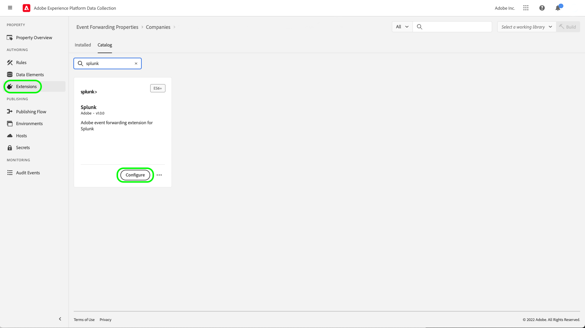

# Splunk 확장 개요

[스플렁크](https://www.splunk.com) 는 데이터에 대한 실행 가능한 통찰력을 위한 검색, 분석 및 시각화를 제공하는 가시성 플랫폼입니다. 더 스플렁크 [이벤트 전달](../../../ui/event-forwarding/overview.md) 확장은 [Splunk HTTP 이벤트 수집기 REST API](https://docs.splunk.com/Documentation/Splunk/8.2.5/Data/HECRESTendpoints) Adobe Experience Platform Edge Network의 이벤트를 [Splunk HTTP 이벤트 수집기](https://docs.splunk.com/Documentation/Splunk/8.2.5/Data/UsetheHTTPEventCollector).

Splunk는 전달자 토큰을 인증 메커니즘으로 사용하여 Splunk 이벤트 수집기 API와 통신합니다.

## 사용 사례 {#use-cases}

마케팅 팀은 다음 사용 사례에 대해 확장을 사용할 수 있습니다.

| 사용 사례 | 설명 |
| --- | --- |
| 고객 행동 분석 | 조직은 웹 사이트에서 고객 상호 작용 이벤트 데이터를 캡처하고 관련 이벤트를 Splunk에 전달할 수 있습니다. 그런 다음 마케팅 및 분석 팀은 Splunk 플랫폼 내에서 후속 분석을 수행하여 주요 사용자 상호 작용 및 행동을 이해할 수 있습니다. Splunk 플랫폼은 그래프, 대시보드 또는 비즈니스 이해 당사자에게 알릴 수 있는 기타 시각화를 생성하는 데 사용할 수 있습니다. |
| 대규모 데이터 세트에서 확장 가능한 검색 | 조직은 웹 사이트에서 트랜잭션 또는 대화 입력을 이벤트 데이터로 캡처하고 이벤트를 Splunk에 전달할 수 있습니다. 그런 다음 Analytics 팀은 Splunk의 확장 가능한 인덱싱 기능을 활용하여 대규모 데이터 세트를 필터링 및 처리하여 비즈니스 통찰력을 도출하고 정보에 입각한 결정을 내릴 수 있습니다. |

{style="table-layout:auto"}

## 전제 조건 {#prerequisites}

이 확장을 사용하려면 Splunk 계정이 있어야 합니다. 에서 Splunk 계정에 등록할 수 있습니다. [Splunk 홈 페이지](https://www.splunk.com/page/sign_up).

>[!NOTE]
>
> Splunk 확장은 Splunk Cloud 및 Splunk 엔터프라이즈 인스턴스를 모두 지원합니다. 이 안내서에서는 다음을 사용하여 구현에 대해 설명합니다. [스플렁크 클라우드](https://www.splunk.com/en_us/products/splunk-cloud-platform.html) 를 참조로 사용하십시오. 에 대한 구성 프로세스 [스플렁크 엔터프라이즈](https://www.splunk.com/en_us/products/splunk-enterprise.html) 는 유사하지만 Splunk Enterprise 관리자의 특정 지침이 필요합니다.

확장을 구성하려면 다음 기술 값도 있어야 합니다.

* An [이벤트 수집기 토큰](https://docs.splunk.com/Documentation/Splunk/8.2.5/Data/UsetheHTTPEventCollector#Create_an_Event_Collector_token_on_Splunk_Cloud_Platform). 토큰은 일반적으로 다음과 같은 UUIDv4 형식입니다. `12345678-1234-1234-1234-1234567890AB`.
* 조직의 Splunk 플랫폼 인스턴스 주소 및 포트입니다. 플랫폼 인스턴스 주소 및 포트는 일반적으로 다음 형식을 갖습니다. `mysplunkserver.example.com:443`.
   >[!IMPORTANT]
   >
   > 이벤트 전달 내에서 참조된 Splunk 끝점은 포트만 사용해야 합니다. `443`. 비표준 포트는 현재 이벤트 전달 구현에서 지원되지 않습니다.

## Splunk 확장 설치 {#install}

UI에 Splunk 이벤트 수집기 확장을 설치하려면 **이벤트 전달** 확장을 추가할 속성을 선택하거나 새 속성을 대신 만듭니다.

원하는 속성을 선택하거나 만들었으면 다음 위치로 이동합니다. **확장** > **카탈로그**. 검색 대상[!DNL Splunk]&quot;, 다음을 선택합니다. **[!DNL Install]** Splunk Extension에서

## Splunk 확장 구성 {#configure_extension}

>[!IMPORTANT]
>
>구현 요구 사항에 따라 확장을 구성하기 전에 스키마, 데이터 요소 및 데이터 세트를 만들어야 할 수 있습니다. 사용 사례에 대해 설정해야 하는 엔터티를 결정하려면 시작하기 전에 모든 구성 단계를 검토하십시오.

선택 **확장** 왼쪽 탐색. 아래 **설치됨**, 선택 **구성** Splunk 확장.

대상 **[!UICONTROL HTTP 이벤트 수집기 URL]**&#x200B;를 클릭하고 Splunk 플랫폼 인스턴스 주소와 포트를 입력합니다. 아래 **[!UICONTROL 액세스 토큰]**, 다음을 입력합니다. [!DNL Event Collector Token] 값. 완료되면 다음을 선택합니다. **[!UICONTROL 저장]**.

## 이벤트 전달 규칙 구성 {#config_rule}

새 이벤트 전달 규칙 만들기 시작 [규칙](../../../ui/managing-resources/rules.md) 원하는 대로 조건을 구성합니다. 규칙에 대한 작업을 선택할 때 [!UICONTROL 스플렁크] 확장을 선택한 다음 [!UICONTROL 이벤트 만들기] 작업 유형. Splunk 이벤트를 추가로 구성하는 추가 컨트롤이 나타납니다.

다음 단계는 Splunk 이벤트 속성을 이전에 만든 데이터 요소에 매핑하는 것입니다. 설정할 수 있는 입력 이벤트 데이터를 기반으로 지원되는 선택적 매핑은 아래에 나와 있습니다. 다음을 참조하십시오. [Splunk 설명서](https://docs.splunk.com/Documentation/Splunk/8.2.5/Data/FormateventsforHTTPEventCollector#Event_metadata) 을 참조하십시오.

| 필드 이름 | 설명 |
| --- | --- |
| [!UICONTROL 이벤트&#x200B;]  **(필수)** | 이벤트 데이터를 제공할 방법을 지정합니다. 이벤트 데이터를에 할당할 수 있습니다. `event` http 요청의 JSON 개체 내에 있는 키이거나 원시 텍스트일 수 있습니다. 다음 `event` 키는 JSON 이벤트 패킷 내에서 메타데이터 키와 동일한 수준에 있습니다. 다음 범위 내 `event` 키-값 중괄호로 묶인 데이터는 문자열, 숫자, 다른 JSON 개체 등 필요한 모든 형식이 될 수 있습니다. |
| [!UICONTROL Host] | 데이터를 보내는 클라이언트의 호스트 이름입니다. |
| [!UICONTROL 소스 유형] | 이벤트 데이터에 할당할 소스 유형입니다. |
| [!UICONTROL 소스] | 이벤트 데이터에 지정할 소스 값입니다. 예를 들어 개발 중인 앱에서 데이터를 전송하는 경우 이 키를 앱 이름으로 설정합니다. |
| [!UICONTROL 색인] | 이벤트 데이터 인덱스의 이름입니다. 토큰에 index 매개 변수가 설정된 경우 여기서 지정하는 인덱스는 허용된 인덱스 목록 내에 있어야 합니다. |
| [!UICONTROL 시간] | 이벤트 시간. 기본 시간 형식은 UNIX 시간(형식)입니다 `<sec>.<ms>`) 및 은 로컬 시간대에 따라 다릅니다. 예를 들어, `1433188255.500` epoch 후 1433188255초 및 500밀리초 또는 2015년 6월 1일 월요일 7시를 나타냅니다.:50:55 오후 GMT. |
| [!UICONTROL 필드] | 인덱스 시간에 정의할 명시적 사용자 지정 필드가 포함된 원시 JSON 개체 또는 키-값 쌍 집합을 지정합니다.  다음 `fields` 키는 원시 데이터에 적용할 수 없습니다.  다음을 포함하는 요청 `fields` 속성을 (으)로 전송해야 합니다. `/collector/event` 끝점을 지정하지 않으면 인덱싱되지 않습니다. 자세한 내용은 의 Splunk 설명서 를 참조하십시오. [색인화된 필드 추출](https://docs.splunk.com/Documentation/Splunk/8.2.5/Data/IFXandHEC). |

### Splunk 내의 데이터 유효성 검사 {#validate}

이벤트 전달 규칙을 만들고 실행한 후 Splunk API로 전송된 이벤트가 Splunk UI에 예상대로 표시되는지 확인합니다. 이벤트 컬렉션 및 Experience Platform 통합이 성공하면 다음과 같이 Splunk 콘솔 내에 이벤트가 표시됩니다.

## 다음 단계

이 문서에서는 UI에서 Splunk 이벤트 전달 확장 기능을 설치하고 구성하는 방법에 대해 다룹니다. Splunk에서 이벤트 데이터를 수집하는 방법에 대한 자세한 내용은 공식 설명서를 참조하십시오.

* [Splunk 웹에서 HTTP 이벤트 수집기 설정 및 사용 ](https://docs.splunk.com/Documentation/Splunk/8.2.5/Data/UsetheHTTPEventCollector)
* [토큰을 사용하여 인증 설정](https://docs.splunk.com/Documentation/Splunk/8.2.5/Security/Setupauthenticationwithtokens#Prerequisites_for_activating_tokens)
* [HTTP 이벤트 수집기 문제 해결](https://docs.splunk.com/Documentation/Splunk/8.2.5/Data/TroubleshootHTTPEventCollector) (또한 다음을 나열합니다. [가능한 오류 코드](https://docs.splunk.com/Documentation/Splunk/8.2.5/Data/TroubleshootHTTPEventCollector#Possible_error_codes))
