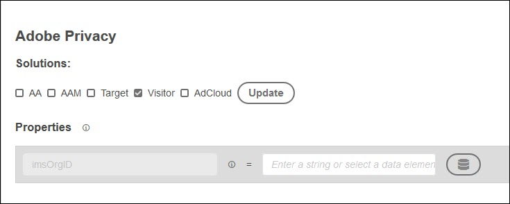

# Adobe 개인 정보 보호 확장 개요

>[!NOTE]
>
>Adobe Experience Platform Launch은 Experience Platform에서 데이터 수집 기술 세트로 브랜드 재지정되었습니다. 그 결과 제품 설명서에서 몇 가지 용어 변경 사항이 롤아웃되었습니다. 용어 변경 내용을 통합 참조하려면 다음 [document](../../../term-updates.md)을 참조하십시오.

Adobe 개인 정보 보호 확장은 Adobe 솔루션별로 최종 사용자에게 할당된 사용자 ID를 수집 및/또는 제거하는 기능을 제공합니다.

## 설치 중 솔루션 구성

확장 카탈로그에서 Adobe 개인 정보 보호 확장을 설치하면 업데이트할 솔루션을 선택하라는 메시지가 표시됩니다. 현재 다음 솔루션을 업데이트할 수 있습니다.

* Analytics(AA)
* Audience Manager(AAM)
* Target
* 방문자 서비스
* AdCloud
* 하나 이상의 솔루션을 선택하고 Update를 선택합니다.
* 솔루션을 선택하고 구성한 경우 Save를 선택합니다. Adobe 개인 정보 보호 확장이 설치된 확장 목록에 추가됩니다.

   각 솔루션에 대한 옵션은 아래에 설명되어 있습니다.

### Analytics


기본적으로 문자열을 입력하거나 데이터 요소를 선택하여 보고서 세트를 제공해야 합니다.

다른 항목을 구성하려면 **[!UICONTROL 항목 선택]**, 구성할 항목을 선택한 다음 **[!UICONTROL 추가]**&#x200B;를 선택하고 요청한 매개 변수 또는 데이터 요소를 입력합니다.

### Audience Manager


**[!UICONTROL 항목 선택]**, 구성할 항목을 선택한 다음 **[!UICONTROL 추가]**&#x200B;를 선택하고 요청한 매개 변수 또는 데이터 요소를 입력합니다. 현재는 `aamUUIDCookieName`만 구성할 수 있습니다.

### Target


Target 클라이언트 코드를 입력합니다.

### 방문자 서비스



IMS 조직 ID를 입력합니다.

### AdCloud


AdCloud에 대해 구성할 특정 매개 변수가 없습니다.

## Adobe 개인 정보 보호 확장 구성

확장을 설치한 후에 확장을 비활성화하거나 삭제할 수 있습니다. 설치된 확장의 Adobe 개인 정보 카드에서 **[!UICONTROL 구성]**&#x200B;을 선택한 다음 **[!UICONTROL 비활성화]** 또는 **[!UICONTROL 제거]**&#x200B;를 선택합니다.

## 작업

다음 작업은 Adobe 개인 정보 보호 확장을 사용하여 규칙을 구성할 때 사용할 수 있습니다.

### ID 검색

이벤트와 조건이 충족되면 방문자에 대해 저장된 ID 정보를 검색합니다.

데이터를 전달하려는 JavaScript 함수의 이름을 입력합니다. 이 함수 또는 메서드는 검색된 ID를 처리합니다. 이러한 ID를 저장하든, 표시하든 아니면 Adobe GDPR API로 전송하든 간에 사용자가 제어합니다.

### ID 제거

이벤트와 조건이 충족되면 방문자에 대해 저장된 ID 정보를 제거합니다.

데이터를 전달하려는 JavaScript 함수의 이름을 입력합니다. 이 함수 또는 메서드는 검색된 ID를 처리합니다. 이러한 ID를 저장하든, 표시하든 아니면 Adobe GDPR API로 전송하든 간에 사용자가 제어합니다.

### ID 검색 후 제거

이벤트와 조건이 충족되면 방문자에 대해 저장된 ID 정보를 검색한 다음 제거합니다.

## 학습서: 개인 정보 보호 확장 구성

다음은 데이터 요소를 설정하고 개인 정보 보호 확장과 함께 사용하는 방법에 대한 간단한 예를 보여줍니다.

1. 이름이 `privacyFunc`인 데이터 요소를 만듭니다.

   ```JavaScript
   window.privacyFunc = function(a,b){
       console.log(a,b);
   }
   return window.privacyFunc
   ```

1. Adobe 개인 정보 보호 확장의 동작을 사용하여 라이브러리 로드(페이지 상단)에서 실행할 규칙을 만듭니다.  `privacyFunc`을 데이터 요소로 선택합니다.

   * **확장:** Adobe 개인 정보 보호
   * **작업 유형:** ID 검색
이 작업 유형은 생성, 제거 또는 제거되지 않은 ID를 표시합니다.
   * **이름:** ID 검색

1. 개발 라이브러리를 업데이트한 다음 게시 및 테스트합니다.
