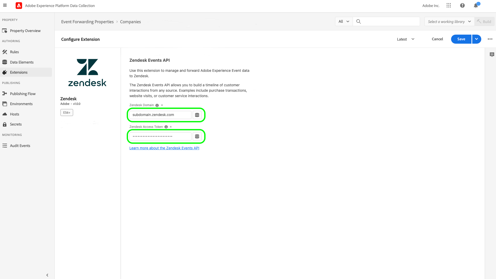

# [!DNL Zendesk] 이벤트 API 확장 개요

[Zendesk](https://www.zendesk.com) 는 고객 서비스 솔루션 및 영업 툴입니다. 젠데스크 [이벤트 전달](../../../ui/event-forwarding/overview.md) 확장은 다음을 활용합니다 [[!DNL Zendesk Events API]](https://developer.zendesk.com/api-reference/custom-data/events-api/events-api/) 추가 처리를 위해 Adobe Experience Platform Edge Network에서 Zendesk로 이벤트를 전송하려면 다음을 수행하십시오. 확장을 사용하여 다운스트림 분석 및 작업에서 사용할 고객 프로필 상호 작용을 수집할 수 있습니다.

이 문서에서는 UI에서 확장을 설치하고 구성하는 방법을 설명합니다.

## 전제 조건

이 확장을 사용하려면 Zendesk 계정이 있어야 합니다. Zendesk 계정에 등록하실 수 있습니다 [Zendesk 웹 사이트](https://www.zendesk.com/register/).

Zendesk 구성에 대한 다음 세부 정보도 수집해야 합니다.

| 키 유형 | 설명 | 예 |
| --- | --- | --- |
| 하위 도메인 | 등록 프로세스 중에 고유한 **하위 도메인** 은 계정별로 만들어집니다. 자세한 내용은 [Zendesk 설명서](https://developer.zendesk.com/documentation/ticketing/working-with-oauth/creating-and-using-oauth-tokens-with-the-api/) 추가 정보. | `xxxxx.zendesk.com` (다음과 같은 경우) `xxxxx` 은 계정을 만드는 동안 제공된 값입니다. |
| API 토큰 | Zendesk는 bearer 토큰을 인증 메커니즘으로 사용하여 Zendesk API와 통신합니다. Zendesk 포털에 로그인한 후 API 토큰을 생성합니다. 자세한 내용은 [Zendesk 설명서](https://support.zendesk.com/hc/en-us/articles/4408889192858-Generating-a-new-API-token) 추가 정보. | `cwWyOtHAv12w4dhpiulfe9BdZFTz3OKaTSzn2QvV` |

{style=&quot;table-layout:auto&quot;}

마지막으로 API 토큰에 대한 이벤트 전달 암호를 만들어야 합니다. 암호 유형을 로 설정합니다. **[!UICONTROL 토큰]**&#x200B;및 를 사용하도록 값을 Zendesk 구성에서 수집한 API 토큰으로 설정합니다. 다음 문서를 참조하십시오. [이벤트 전달의 비밀](../../../ui/event-forwarding/secrets.md) 암호 구성에 대한 자세한 내용을 참조하십시오.

## 확장 설치 {#install}

UI에 Zendesk 확장을 설치하려면 다음 위치로 이동합니다. **이벤트 전달** 및 속성을 선택하여 확장을 추가하거나 대신 새 속성을 만듭니다.

원하는 속성을 선택하거나 만든 후, **확장** > **카탈로그**. &quot; 검색[!DNL Zendesk]&quot;&quot;을(를) 선택한 다음 **[!DNL Install]** Zendesk Extension에서 사용할 수 있습니다.

## 확장 프로그램 구성 {#configure}

>[!IMPORTANT]
>
>구현 요구 사항에 따라 확장을 구성하기 전에 스키마, 데이터 요소 및 데이터 세트를 만들어야 할 수 있습니다. 사용 사례에 대해 설정해야 하는 엔티티를 결정하려면 시작하기 전에 모든 구성 단계를 검토하십시오.

선택 **확장** 을 클릭합니다. 아래 **설치됨**, 선택 **구성** Zendesk 확장.

아래 **[!UICONTROL Zendesk 도메인]**&#x200B;를 입력하여 Zendesk 하위 도메인 값을 입력합니다. 아래 **[!UICONTROL Zendesk 토큰]**&#x200B;에서 API 토큰이 포함된 앞에서 만든 암호를 선택합니다.

## 이벤트 전달 규칙 구성

새 이벤트 전달 규칙 만들기 시작 [규칙](../../../ui/managing-resources/rules.md) 원하는 대로 조건을 구성합니다. 규칙에 대한 작업을 선택할 때 [!UICONTROL Zendesk] 확장을 선택한 다음 [!UICONTROL 이벤트 만들기] 작업 유형.

작업 구성을 설정할 때 Zendesk에 전송할 다양한 속성에 데이터 요소를 할당하라는 메시지가 표시됩니다.

이러한 데이터 요소는 아래에서 참조된 대로 매핑해야 합니다.

### `event` 키

`event` 는 사용자가 트리거한 이벤트를 나타내는 JSON 개체입니다. 의 Zendesk 문서를 참조하십시오. [사건의 구조](https://developer.zendesk.com/documentation/custom-data/events/anatomy-of-an-event/) 에 의해 캡처된 속성에 대한 자세한 내용 `event` 개체.

다음 키는 `event` 데이터 요소에 매핑할 때 개체:

| `event` key | 유형 | 플랫폼 경로 | 설명 | 필수입니다 | 제한 |
| --- | --- | --- | --- | --- | --- |
| `source` | 문자열 | `arc.event.xdm._extconndev.event_source` | 이벤트를 보낸 애플리케이션입니다. | 예 | 사용 안 함 `Zendesk` 값은 Zendesk 표준 이벤트의 보호된 소스 이름일 때 사용할 수 있습니다. 이 코드를 사용하면 오류가 발생합니다. 값 길이는 40자를 초과할 수 없습니다. |
| `type` | 문자열 | `arc.event.xdm._extconndev.event_type` | 이벤트 유형의 이름입니다. 이 필드를 사용하여 주어진 소스에 대해 다른 종류의 이벤트를 표시할 수 있습니다. 예를 들어 사용자 로그인에 대한 이벤트 세트와 장바구니에 대한 이벤트 세트를 만들 수 있습니다. | 예 | 값 길이는 40자를 초과할 수 없습니다. |
| `description` | 문자열 | `arc.event.xdm._extconndev.description` | 이벤트에 대한 설명입니다. | 아니요 | (해당 없음) |
| `created_at` | 문자열 | `arc.event.xdm.timestamp` | 이벤트를 만든 시간을 반영하는 ISO-8601 타임스탬프입니다. | 아니요 | (해당 없음) |
| `properties` | 오브젝트 | `arc.event.xdm._extconndev.EventProperties` | 이벤트에 대한 세부 사항이 포함된 사용자 지정 JSON 개체. | 예 | (해당 없음) |

{style=&quot;table-layout:auto&quot;}

>[!NOTE]
>
>자세한 내용은 [[!DNL Zendesk Events API] 설명서](https://developer.zendesk.com/api-reference/custom-data/events-api/events-api/) 를 참조하십시오.

### `profile` 키

`profile` 는 이벤트를 트리거한 사용자를 나타내는 JSON 개체입니다. 의 Zendesk 문서를 참조하십시오. [프로파일 구조](https://developer.zendesk.com/documentation/custom-data/profiles/anatomy-of-a-profile/) 에 의해 캡처된 속성에 대한 자세한 내용 `profile` 개체.

다음 키는 `profile` 데이터 요소에 매핑할 때 개체:

| `profile` key | 유형 | 플랫폼 경로 | 설명 | 필수입니다 | 제한 |
| --- | --- | --- | --- | --- | --- |
| `source` | 문자열 | `arc.event.xdm._extconndev.profile_source` | 프로필과 연결된 제품 또는 서비스(예: ) `Support`, `CompanyName`, 또는 `Chat`. | 예 | (해당 없음) |
| `type` | 문자열 | `arc.event.xdm._extconndev.profile_type` | 프로필 유형의 이름입니다. 이 필드를 사용하여 주어진 소스에 대해 다양한 종류의 프로필을 만들 수 있습니다. 예를 들어 고객을 위한 회사 프로필 세트와 직원을 위한 회사 프로필 세트를 만들 수 있습니다. | 예 | 프로필 유형 길이는 40자를 초과할 수 없습니다. |
| `name` | 문자열 | `arc.event.xdm._extconndev.name` | 프로필의 개인 이름입니다 | 아니요 | (해당 없음) |
| `user_id` | 문자열 | `arc.event.xdm._extconndev.user_id` | Zendesk의 개인 사용자 ID입니다. | 아니요 | (해당 없음) |
| `identifiers` | 어레이 | `arc.event.xdm._extconndev.identifiers` | 하나 이상의 식별자를 포함하는 배열입니다. 각 식별자는 유형과 값으로 구성됩니다. | 예 | 자세한 내용은 [Zendesk 설명서](https://developer.zendesk.com/api-reference/custom-data/profiles_api/profiles_api/#identifiers-array) 자세한 내용은 `identifiers` 배열입니다. 모든 필드와 값은 고유해야 합니다. |
| `attributes` | 오브젝트 | `arc.event.xdm._extconndev.attrbutes` | 사람에 대한 사용자 정의 속성을 포함하는 객체입니다. | 아니요 | 자세한 내용은 [Zendesk 설명서](https://developer.zendesk.com/documentation/custom-data/profiles/anatomy-of-a-profile/#attributes) 를 참조하십시오. |

{style=&quot;table-layout:auto&quot;}

## Zendesk 내에서 데이터 유효성 검사 {#validate}

이벤트 수집과 Adobe Experience Platform 통합이 성공적으로 수행되면 Zendesk 콘솔 내의 이벤트가 아래 표시된 것처럼 표시됩니다. 성공적인 통합을 나타냅니다.

프로필:

이벤트:

## 요청 제한 {#limits}

계정 유형에 따라 Zendesk [!DNL Events API] 은 분당 다음 수의 요청을 처리할 수 있습니다.

| [!DNL Account Type] | 분당 요청 수 |
| --- | --- |
| [!DNL Team] | 250년 |
| [!DNL Growth] | 250년 |
| [!DNL Professional] | 500 |
| [!DNL Enterprise] | 750년 |
| [!DNL Enterprise Plus] | 1000년 |

{style=&quot;table-layout:auto&quot;}

자세한 내용은 [Zendesk 설명서](https://developer.zendesk.com/api-reference/ticketing/account-configuration/usage_limits/#:~:text=API%20requests%20made%20by%20Zendesk%20apps%20are%20subject,sources%20for%20the%20account%2C%20including%20internal%20product%20requests.) 를 참조하십시오.

## 오류 및 문제 해결 {#errors-and-troubleshooting}

확장을 사용하거나 구성하는 동안 Zendesk 이벤트 API에서 아래 오류를 반환할 수 있습니다.

| 오류 코드 | 설명 | 해상도 | 예 |
|---|---|---|---|
| 400 | **잘못된 프로필 길이:** 프로필 속성 길이가 40자를 초과하는 경우 이 오류가 발생합니다. | 프로필 속성 데이터의 길이를 최대 40자로 제한합니다. | `{"error": [{"code":"InvalidProfileTypeLength","title": "Profile type length > 40 chars"}]}` |
| 401년 | **경로를 찾을 수 없음:** 이 오류는 잘못된 도메인을 제공한 경우 발생합니다. | 올바른 도메인이 다음 형식으로 제공되는지 확인하십시오. `{subdomain}.zendesk.com` | `{"error": [{"description": "No route found for host {subdomain}.zendesk.com","title": "RouteNotFound"}]}` |
| 401년 | **유효하지 않거나 누락된 인증:** 이 오류는 토큰에 액세스할 수 없거나 누락되었거나 만료된 경우 발생합니다. | 액세스 토큰이 유효하고 만료되지 않았는지 확인합니다. | `{"error": [{"code":"MissingOrInvalidAuthentication","title": "Invalid or Missing Authentication"}]}` |
| 403년 | **사용 권한 부족:** 이 오류는 리소스에 액세스할 수 있는 충분한 권한이 제공되지 않을 때 발생합니다. | 필요한 권한이 제공되었는지 확인합니다. | `{"error": [{"code":"PermissionDenied","title": "Insufficient permisssions to perform operation"}]}` |
| 429년 | **너무 많은 요청:** 이 오류는 끝점 개체 레코드 제한을 초과할 때 발생합니다. | 위의 섹션을 참조하십시오. [요청 제한](#limits) 제한당 임계값에 대한 자세한 정보. | `{"error": [{"code":"TooManyRequests","title": "Too Many Requests"}]}` |

{style=&quot;table-layout:auto&quot;}

## 다음 단계

이 문서에서는 UI에서 Zendesk 이벤트 전달 확장을 설치 및 구성하는 방법에 대해 설명합니다. Zendesk에서 이벤트 데이터를 수집하는 방법에 대한 자세한 내용은 공식 설명서를 참조하십시오.

* [이벤트 시작하기](https://developer.zendesk.com/documentation/custom-data/events/getting-started-with-events/)
* [Zendesk 이벤트 API](https://developer.zendesk.com/api-reference/custom-data/events-api/events-api/)
* [이벤트 API 정보](https://developer.zendesk.com/documentation/custom-data/events/about-the-events-api/)
* [이벤트의 해부](https://developer.zendesk.com/documentation/custom-data/events/anatomy-of-an-event/)
* [Zendesk 프로필 API](https://developer.zendesk.com/api-reference/custom-data/events-api/events-api/#profile-object)
* [프로필 API 정보](https://developer.zendesk.com/documentation/custom-data/profiles/about-the-profiles-api/)
* [프로필의 해부](https://developer.zendesk.com/documentation/custom-data/profiles/anatomy-of-a-profile/)
