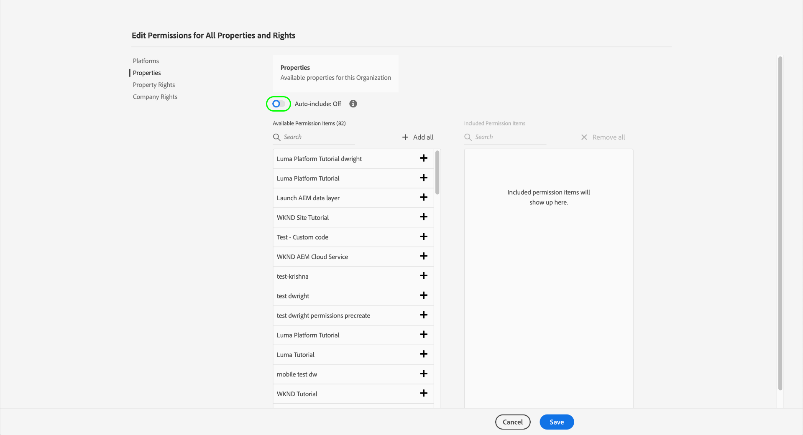

# 태그의 권한 관리

>[!NOTE]
>
>Adobe Experience Platform Launch은 Adobe Experience Platform에서 데이터 수집 기술 세트로 브랜딩되었습니다. 그 결과 제품 설명서에서 몇 가지 용어 변경 사항이 롤아웃되었습니다. 용어 변경 내용을 통합 참조하려면 다음 [document](../../term-updates.md)을 참조하십시오.

Adobe Experience Platform에서 태그를 사용하려면 Adobe Admin Console을 통해 하나 이상의 Adobe Experience Cloud 제품에 대한 액세스 권한이 부여되어야 합니다. 또한 데이터 수집 UI에 로그인할 때 특정 작업을 수행하려면 제품 프로필 수준에서 태그에 대한 권한을 부여받아야 합니다.

이 안내서에서는 Admin Console을 사용하는 사용자에게 이러한 권한을 부여하는 방법을 설명합니다.

>[!NOTE]
>
>이 안내서에서 언급된 다양한 유형의 사용 가능한 태그 권한에 대한 자세한 내용은 [사용자 권한 개요](./user-permissions.md)를 참조하십시오.

## 태그 제품 프로필에 대한 관리 권한 얻기

태그의 사용자 권한을 관리하려면 Adobe Admin Console에 있는 태그의 제품 프로필 관리자 이상이어야 합니다. 시스템 관리자 및 제품 관리자는 태그 제품 프로필에 대한 권한을 관리할 수도 있습니다.

다른 관리자 수준 및 조직 내에서 이러한 역할을 관리하는 방법에 대한 자세한 내용은 [관리 역할](https://helpx.adobe.com/enterprise/admin-guide.html/enterprise/using/admin-roles.ug.html)의 Admin Console 문서를 참조하십시오.

## 사용 권한을 관리할 제품 프로필 선택

관리자 권한이 있으면 Admin Console에 로그인하고 위쪽 탐색에서 **[!UICONTROL Products]**&#x200B;를 선택합니다. 표시된 제품 목록에서 **[!UICONTROL Adobe Experience Platform Launch]**&#x200B;을 선택합니다.

제품 프로필 목록이 표시됩니다. 제품 프로필은 권한 그룹을 사용자 그룹에 연결하는 구문입니다. 여기에서 구성할 새 프로필을 만들거나 편집할 목록에서 기존 제품 프로필을 선택할 수 있습니다(해당 프로필에 대한 관리자 권한이 있다고 가정).

### 제품 프로필 만들기

>[!NOTE]
>
>편집할 기존 프로필을 선택한 경우 [다음 섹션](#permissions)으로 계속 진행합니다.

새 제품 프로필을 만들려면 **[!UICONTROL 새 프로필]**&#x200B;을 선택합니다.

프로필에 이름 및 선택적 설명을 제공할 수 있는 대화 상자가 나타납니다. 이 프로필에서 사용자를 추가하거나 제거할 때 사용자가 이메일을 수신하는지 여부를 전환할 수도 있습니다. 완료되면 **[!UICONTROL 저장]**&#x200B;을 선택합니다.

## 제품 프로필에 대한 권한 구성 {#permissions}

제품 프로필에 대한 세부 사항 페이지가 나타납니다. 제공된 탭을 사용하여 프로필에 할당된 사용자를 관리하고, 프로필에서 해당 사용자에게 부여할 특정 속성 및 권한을 구성할 수 있습니다.

사용자를 추가하는 방법에 대한 단계는 이 안내서](#users)의 후반부에 제공됩니다. [ 지금은 **[!UICONTROL 권한]**&#x200B;을 선택합니다.

다음 화면에서는 현재 프로필에 할당된 플랫폼, 속성 및 권한의 수에 대한 개요를 보여줍니다. 행 중 하나의 옆에 있는 **[!UICONTROL 편집]**&#x200B;을 선택하여 프로필 권한 구성을 시작합니다.

제품 프로필에서 권한을 추가 및 제거할 수 있는 [!UICONTROL 권한 편집] 화면이 나타납니다. **[!UICONTROL 플랫폼]** 섹션에서 기본적으로 모든 플랫폼이 프로필에 추가되었음을 확인할 수 있습니다.

### 속성 할당

이 프로필에 속성을 할당하려면 왼쪽 탐색에서 **[!UICONTROL 속성]**&#x200B;을 선택합니다.

기본적으로 조직에서 사용할 수 있는 모든 속성에 대한 액세스 권한이 새 제품 프로필에 자동으로 제공됩니다. 여기에는 현재 사용할 수 있는 속성과 나중에 만들어지는 속성이 포함됩니다.

사용 가능한 속성을 제한하려면 **[!UICONTROL 자동 포함]** 전환을 선택합니다. 필요에 따라 속성에 대한 속성을 수동으로 추가 및 제거할 수 있습니다.

자동 포함이 비활성화되어 있으면 현재 사용 가능한 모든 속성이 왼쪽에 나열됩니다. 왼쪽 열에서 해당 속성 옆에 있는 더하기(**+**) 아이콘을 선택하여 프로필에 속성을 추가할 수 있습니다. 속성을 제거하려면 오른쪽 열의 해당 속성 옆에 **X** 아이콘을 선택합니다.

>[!IMPORTANT]
>
>자동 포함 기능을 비활성화하는 것은 나중에 만든 모든 속성을 제품 프로필에 수동으로 추가하여 액세스할 수 있어야 함을 의미합니다.

### 권한 할당

기본적으로 제품 프로필에 대해 모든 권한이 비활성화되며 활성화되도록 수동으로 추가해야 합니다. 속성을 자동으로 포함하지만 권한이 없는 제품 프로필에 속해 있는 경우 모든 속성에 대해 읽기 전용 권한이 제공됩니다.

>[!NOTE]
>
>사용자는 Admin Console에서 여러 제품 프로필에 속할 수 있지만, 이러한 프로필의 권한은 마스터 권한 세트에 결합되지 않습니다. 이러한 사용자는 각 그룹에서 명시적으로 부여한 권한만 갖습니다.
>
>예를 들어 그룹 1이 개발 권한이 있는 속성 A에 액세스할 수 있고, 그룹 2가 게시 권한이 있는 속성 B에 액세스할 수 있으면 속성 A와 속성 B에 대해 개발 및 게시 권한이 결합되지 않습니다. 속성 A에 대해 개발하고 속성 B에 대해 게시할 수만 있습니다.

왼쪽 탐색에서 **[!UICONTROL 속성 권한]**&#x200B;을 선택합니다. 속성과 마찬가지로 속성 권한 옆에 있는 더하기(**+**) 아이콘을 선택하여 프로필에 추가할 수 있습니다. 프로필에 모든 속성 권한을 추가하려면 **[!UICONTROL 모두 추가]**&#x200B;를 선택할 수도 있습니다.

그런 다음 왼쪽 탐색에서 **[!UICONTROL 회사 권한]**&#x200B;을 선택합니다. 필요한 권한을 추가하거나 제거하고 나면 **[!UICONTROL 저장]**&#x200B;을 선택합니다.

## 프로필에 사용자 할당 {#users}

제품 프로필에 사용자를 할당하려면 [!UICONTROL 사용자] 탭을 선택한 다음 [!UICONTROL 사용자 추가]를 선택합니다.

대화 상자가 표시되면 프로필에 추가할 사용자의 이름, 사용자 그룹 또는 이메일 주소를 입력합니다. 사용자가 조직의 일부인 경우 해당 정보가 자동 완료 드롭다운에 표시되며, 이 드롭다운에서 세부 사항을 채우도록 선택할 수 있습니다. 조직의 일부가 아닌 경우 해당 정보를 수동으로 입력할 수 있습니다.

완료되면 **[!UICONTROL 저장]** 을 선택하여 지정된 사용자를 제품 프로필에 추가합니다.

사용자가 프로필에 추가되면 해당 사용자는 이제 데이터 수집 UI에 대한 권한이 있음을 알리는 이메일을 받게 됩니다.

## 다음 단계

이 문서에서는 Adobe Admin Console을 사용하여 데이터 수집 UI에 대한 속성 및 권한을 관리하는 방법을 다룹니다. 사용 가능한 권한 및 액세스 권한을 부여하는 기능에 대한 자세한 내용은 [사용자 권한](./user-permissions.md)에 대한 개요를 참조하십시오.
