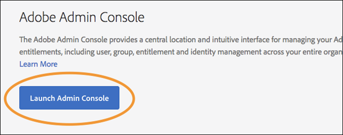

# 사용자 권한

>[!NOTE]
>
>Adobe Experience Platform Launch은 Adobe Experience Platform에서 데이터 수집 기술 세트로 브랜딩되었습니다. 그 결과 제품 설명서에서 몇 가지 용어 변경 사항이 롤아웃되었습니다. 용어 변경 내용을 통합 참조하려면 다음 [document](../../term-updates.md)을 참조하십시오.

## 권한 유형

Adobe Experience Platform에서 태그에 사용할 수 있도록 이해하는 두 가지 사용자 권한이 있습니다.

* **Experience Cloud 권한:** 회사 수준의 관리 콘솔에 있는 [!DNL Experience Cloud] 권한은 모든 [!DNL Experience Cloud] 제품에 대한 그룹 권한 및 그룹 구성원을 제어할 수 있는 사람을 관리합니다.
* **태그 권한:**  태그의 권한은 제품 Admin Console 수준의 태그에 있습니다. 이러한 권한은 데이터 수집 UI에 로그인할 때 실제로 특정 작업을 수행할 수 있는 사용자를 관리합니다.

이 문서에서는 이러한 다양한 권한 유형을 자세히 살펴봅니다.

### Experience Cloud 권한

이 섹션에서는 플랫폼 사용 시 알고 있어야 하는 중요한 요소를 설명합니다. [!DNL Experience Cloud] 권한에 대한 포괄적인 보기에 대해서는 [Enterprise 사용 안내서에서 관리 역할](https://helpx.adobe.com/kr/enterprise/using/admin-roles.html)을 참조하십시오.

#### 조직 관리자

조직 관리자를 Org Admin이라고도 합니다. 조직 관리자의 주요 기능은 다른 사용자에게 권한을 할당하는 것입니다. 이렇게 하려면 특정 제품 내에 특정 권한 세트를 포함하는 제품 프로필(또는 그룹)을 만든 다음 해당 제품 프로필에 기존 사용자 또는 새로운 사용자를 할당합니다.

Enterprise 조직 관리자는 Platform의 태그에 대한 권한을 상속하지 않습니다. 이러한 사용자는 데이터 수집 UI에서 작업을 수행하려는 경우 적절한 권한이 있는 제품 프로필에 자신을 추가해야 합니다.

#### 제품 관리자

제품 관리자(또는 Product Admin)는 조직 관리자와 비슷하지만, 범위가 좁습니다. 제품 관리자는 회사에서 액세스할 수 있는 모든 [!DNL Adobe] 제품이 아니라 특정 [!DNL Adobe] 제품에 대한 제품 프로필을 수정할 수 있는 권한만 갖습니다.

### 태그에 대한 권한

[!DNL Experience Cloud] 내에서 개별 사용자에게 권한 또는 권한이 할당되지 않습니다. 이러한 권한은 제품 프로필에 할당됩니다(위의 &quot;Experience Cloud 권한&quot; 참조). 그런 다음 개별 사용자가 하나 이상의 제품 프로필에 할당됩니다.

제품 프로필 내에서 태그의 권한은 4차원으로 나누어집니다.

1. 플랫폼
1. 속성
1. 속성 권한
1. 회사 권한

#### 플랫폼

각 속성에는 플랫폼이 있습니다. 현재 태그에 사용할 수 있는 플랫폼은 두 개입니다. *웹* 및 *모바일*. 이 권한 유형을 사용하여 특정 유형의 속성에 대한 액세스를 제한하거나 부여할 수 있습니다. 이 기능은 모바일 앱을 관리하는 팀이 웹 사이트를 관리하는 팀과 다른 경우에 유용합니다.

#### 속성

회사 내에 있는 모든 속성 목록입니다. 이 권한 유형을 사용하여 특정 기존 속성(이름별)에 대한 액세스를 제한하거나 부여할 수 있습니다.

#### 속성 권한

데이터 수집 UI에서 만드는 모든 속성은 권한을 할당할 수 있는 Admin Console에서 사용할 수 있습니다. 제공된 제품 프로필에 A1 속성에 대한 액세스 권한이 없는 경우 해당 프로필에 속한 사용자가 A1 속성 내의 설정을 보거나 수정할 수 없습니다.

사용자가 속성 A1에 액세스할 수 있는 프로필에 속해 있다고 가정할 경우 속성 A1 내에서 수행할 수 있는 작업은 이 권한 그룹에서 부여된 권한에 의해 결정됩니다. 속성 A1에 대한 권한이 있지만 할당된 권한이 없는 사용자에게는 읽기 전용 권한이 있습니다.

이 그룹에서 사용할 수 있는 권한은 다음과 같습니다.

* **개발:** 규칙 및 데이터 요소를 만들 수 있습니다. 라이브러리를 만들고 기존 개발 환경에 빌드할 수도 있습니다. 승인을 받을 준비가 되면 라이브러리를 제출할 수 있습니다. 데이터 수집 UI에서 수행하는 대부분의 일상적인 작업은 이 권한이 필요합니다.
* **승인:**  제출된 라이브러리를 가져와 스테이징 환경에 빌드할 수 있습니다. 테스트가 완료되면 게시할 라이브러리를 승인할 수도 있습니다.
* **게시:**  승인된 라이브러리를 프로덕션 환경에 게시할 수 있습니다.
* **확장 관리:**  속성에 새 확장을 설치하고, 이미 설치된 확장에 대한 확장 구성을 수정하고, 확장을 삭제하는 권한을 부여합니다. 확장](../managing-resources/extensions/overview.md)에 대한 자세한 내용은 [용 확장 개요 설명서를 참조하십시오. 이 역할은 조직에 따라 일반적으로 IT 또는 마케팅에 속합니다.
* **환경 관리:**  환경을 만들고 수정할 수 있습니다. 자세한 내용은 [환경 설명서](../publishing/environments.md)를 참조하십시오. 이 역할은 일반적으로 IT 그룹에 속합니다.

#### 회사 권한

회사 권한은 여러 속성에 걸쳐 있는 권한에 적용됩니다. 현재 세 가지가 있습니다.

* **속성 관리:**  데이터 수집 UI에서 새 속성을 만들고 속성 수준에서 메타데이터 및 설정을 수정할 수 있습니다. 속성을 삭제할 수도 있습니다. 자세한 내용은 [속성 설명서](companies-and-properties.md)를 참조하십시오. 관리자는 일반적으로 이 역할을 수행합니다.
* 새 속성을 만들고 속성 수준에서 메타데이터 및 설정을 수정하는 권한을 부여합니다. 속성을 삭제할 수도 있습니다. [여기](companies-and-properties.md)서 속성에 대해 자세히 알아보십시오. 관리자는 일반적으로 이 역할을 수행합니다.
* **확장 개발:** 비공개 릴리스 및 공개 릴리스 요청을 포함하여 회사가 소유한 확장 패키지를 만들고 수정하는 권한을 부여합니다.
* **앱 구성 관리:**  이 기능은 Adobe Journey Optimizer에 라이선스가 있는 고객 또는 모바일 인앱 및 푸시 메시지에 액세스할 수 있는 기타 솔루션에서만 사용할 수 있습니다.  이를 통해 Firebase 클라우드 메시징 서비스 및 Apple 푸시 알림 서비스와 통신하는 데 필요한 푸시 자격 증명과 함께 Experience Cloud이 알고 있는 앱을 관리할 수 있습니다.

### 총 사용자 권한

개별 사용자의 총 권한은 다른 제품 프로필의 총 구성원에 의해 결정됩니다. 사용자가 여러 제품 프로필에 속해 있는 경우, 각 프로필의 권한은 곱해지지 않고 함께 추가됩니다.

예: 제품 프로필 A는 Henry에게 속성 1에 대한 개발 권한을 부여합니다. 제품 프로필 B는 Henry에게 속성 2에 대한 게시 권한을 부여합니다. Henry는 속성 1에서 개발하고 속성 2에 게시할 수 있지만, 속성 1에서 게시하거나 속성 2에서 개발할 수는 없습니다. 그렇게 할 수 있는 명시적 권한이 부여되지 않았기 때문입니다.

## 권한 시나리오

새 제품 프로필을 만들 때 회사마다 요구 사항이 다릅니다. 이러한 요구 사항은 회사 규모, 조직 구조, 사이트 수, 태그 관리에 관여하는 사람 수 등에 따라 다릅니다.

다음은 제품 프로필을 만들고 사용자를 제품 프로필에 추가하는 방법과 관련하여 몇 가지 일반적인 시나리오와 권장 시작점입니다.

### 1인 표시

한 사람이 모든 것을 담당하는 작은 회사를 운영하고 있는 경우 이 사용자 권한을 모든 속성에 부여하고 위에 나열된 모든 권한을 이 사용자에게 할당합니다.

### 직무 분리

많은 사람들이 태그 지정에 포함되어 있습니다. 규칙과 데이터 요소를 만드는 한 그룹의 사람들(외부 컨설턴트)이 있지만 프로덕션 환경에 대한 액세스 권한을 이들에게 부여하지 않으려고 합니다. IT 팀을 제외한 어느 누구도 프로덕션에 배포하지 못하는지 확인하려고 합니다.

1. 컨설턴트를 위한 계정을 만들고 이들에게만 개발 권한을 부여합니다.
1. 컨설턴트는 사용자가 설정한 제한 내에서 빌드하고 테스트합니다.
1. 컨설턴트가 새로운 확장을 원하거나 라이브로 전환할 준비가 된 경우 적절한 권한을 보유한 조직의 담당자가 그러한 작업을 수행합니다.

### Enterprise

기업은 지리적으로 여러 사이트가 나뉘어 있어 지역마다 담당하는 팀이 다를 수 있습니다. 그러한 팀 내에서 개발하고 게시하는 사람이 다릅니다.

이는 위의 &quot;직무 분리&quot;와 비슷하지만, 지리적 위치에 따라 구성됩니다.

* 북미
   * 개발 그룹
   * 게시 그룹
* 유럽
   * 개발 그룹
   * 게시 그룹
* ...
   * 개발 그룹
   * 게시 그룹

## 예

조직에 보유하고 있는 역할 유형과 이러한 역할에 할당해야 하는 권한에 대한 몇 가지 예는 이 개념을 명확하게 하는 데 도움이 될 수 있습니다.

다음은 조직에서 적용할 수 있는 여러 역할에 대한 설명과 작업 수행에 필요한 권한을 보여주는 표입니다.

* 관리자: 진행 상황을 확인하고 싶지만 변경할 수 없습니다.
* 마케터: 확장을 설치하고 기존 속성에 대한 새 태그를 설정할 수 있지만, 스테이징 또는 프로덕션 환경에 게시할 수 없습니다.
* 모바일 앱 개발자: 기본 모바일 앱 내에서 Adobe 및 타사 솔루션을 구현합니다.
* IT 팀: 실제로 태그를 수정하지 않지만, 스테이징 및 프로덕션 환경과 그러한 환경에 포함된 것에 대한 모든 권한을 갖습니다.
* 모든 작업을 수행하는 사람: 모든 작업 수행합니다.

| 역할 | 속성 | 회사 권한 | 속성 권한 |
|--- |--- |--- |--- |
| 관리자 | 자동 포함 |  |  |
| 마케터 | 자동 포함 | 속성 관리 | 개발 확장 관리 |
| 모바일 앱 개발자 | 자동 포함 | 속성 관리 앱 구성 관리 | 개발 확장 관리 |
| IT 팀 | 자동 포함 | 승인 게시 환경 관리 |
| 모든 작업을 수행하는 사람 | 자동 포함 | 속성 관리 | 개발 승인 게시 확장 관리 환경 관리 |
| 확장 개발자 | 자동 포함 | 속성 관리 확장 개발 | 개발 |

## 사용자 권한 할당

아래 단계는 권한을 할당하는 프로세스를 안내합니다. [비디오에서](https://www.youtube.com/watch?v=ba28BHX8cwU) 이 프로세스를 볼 수도 있습니다.

아래 1~3단계는 [Adobe Admin Console](https://adminconsole.adobe.com/enterprise/products)로 직접 이동하여 생략할 수 있습니다. 둘 이상의 조직에 속해 있는 경우 오른쪽에 있는 위쪽 탐색에서 올바른 조직을 선택합니다.

### 1. Experience Cloud에 로그인

Adobe ID을 사용하여 [https://experiencecloud.adobe.com/](https://experiencecloud.adobe.com/)에 로그인한 다음, [!UICONTROL 탐색] 메뉴에서 데이터 수집 UI 내에서 사용할 조직을 선택합니다.

[!UICONTROL 탐색] 메뉴에서 9개 점이 있는 아이콘을 선택하여 솔루션 선택기를 연 다음 **[!UICONTROL 관리]**&#x200B;를 선택합니다.

이 링크가 표시되지 않는 경우 다음 두 가지 조건이 모두 해당됩니다.

* 조직 관리자가 아닙니다.
* [!DNL Experience Cloud] 제품에 대한 제품 관리자가 아닙니다.

어느 경우든지 조직 관리자에게 이러한 단계를 수행하도록 요청하거나, 이 작업을 직접 수행할 수 있도록 태그에 대한 제품 관리자 권한을 요청합니다.

>[!NOTE]
>
>조직 관리자가 누구인지 모르는 경우 Client Care에 문의하십시오.

### 2. Admin Console 열기

**Admin Console**&#x200B;을 선택합니다.

**[!DNL Experience Platform Launch]-`Company Name`** 카드를 선택합니다.

<!-- Scott, update above image. Rebranding. -->

위쪽 탐색에서 **[!UICONTROL Products]**&#x200B;을 선택한 다음 왼쪽 탐색에서 **[!DNL Experience Platform Launch]-`Company Name`**&#x200B;을 선택할 수도 있습니다.

[!DNL Experience Platform Launch] 카드가 표시되지 않거나 [!DNL Experience Platform Launch]가 이 목록에 없는 경우 본인은 조직 관리자가 아닌 다른 Experience Cloud 제품의 제품 관리자입니다. 본인이 Experience Platform Launch의 관리자가 아니므로 이러한 단계를 대신 수행하거나 본인에게 [!DNL Platform Launch]에 대한 제품 관리자 권한을 부여할 수 있는 조직 관리자를 찾아야 합니다.

Platform Launch를 선택하면 제품 프로필 목록이 표시됩니다. 이러한 프로필은 권한 그룹으로 생각하면 됩니다. 한 개의 프로필이 만들어지고 이름이 &quot;[!DNL Platform Launch] - `Company Name`&quot;으로 지정됩니다.

### 3. 제품 프로필 만들기

기존 제품 프로필을 편집하는 경우 이 단계를 건너뜁니다.

이 제품 프로필을 편집하거나 새 프로필을 만들도록 선택합니다.

새 제품 프로필을 만들려면 **[!UICONTROL 새 프로필]**&#x200B;을 선택합니다.

새 프로필에 이름 및 설명을 지정하고, 이 프로필에서 사용자를 추가하거나 제거할 때 사용자가 이메일을 수신하는지 여부를 구성한 다음 **[!UICONTROL 완료]**&#x200B;를 선택합니다.

### 4. 제품 프로필 편집

목록에서 제품 프로필을 선택한 다음 **[!UICONTROL 권한]** 탭을 엽니다. 속성과 권한 차원에 권한을 할당할 수 있습니다. .

이 그룹 정의에 속성을 할당하려면 **[!UICONTROL 속성]** 섹션을 엽니다.

목록에 태그 속성이 표시됩니다.

기본적으로 새 제품 구성에 속성이 자동으로 포함됩니다. 즉, 모든 속성(현재 및 미래)은 이 그룹 정의에 포함됩니다.

자동 포함이 비활성화되어 있으면 현재 사용 가능한 모든 속성이 왼쪽에 나열됩니다. **[!UICONTROL 추가]**&#x200B;를 선택하여 속성을 이 그룹 정의로 이동할 수 있습니다.

완료되면 **[!UICONTROL 저장]**&#x200B;을 선택합니다.

### 5. 권한 할당

그룹 정의에 포함시킬 권한을 할당합니다. **[!UICONTROL Rights]** 섹션을 엽니다.

권한은 자동으로 포함되지 않습니다. 프로필에 각 권한을 할당해야 합니다. [!UICONTROL + 모두 추가] 단추를 사용하여 이 프로필에 모든 권한을 신속하게 추가하거나, 개별 + (추가) 단추를 사용하여 개별 권한을 할당할 수 있습니다. 각 권한과 관련된 권한에 대한 자세한 내용은 [권한 시나리오](#rights-scenarios)를 참조하십시오. 완료되면 **[!UICONTROL 저장]**&#x200B;을 선택합니다. [!UICONTROL Save]를 사용할 수 없는 경우 변경 내용이 없으므로 새 권한이 할당되지 않습니다.

먼저, 속성 권한을 할당합니다.

그런 다음 회사 권한을 할당합니다.

권한 지정에 대해 염두에 두어야 할 몇 가지 중요한 참고 사항:

* 권한 부족은 읽기 전용 권한을 의미합니다. 자동 포함 속성 및 권한이 없는 제품 구성에 속해 있는 경우 모든 태그 속성에 대해 읽기 전용 권한이 제공됩니다.
* 속성 관리 를 올바르게 할당하지 않으면 로그인할 때 속성을 추가할 수 없습니다.
* 사용자가 여러 그룹에 속할 수 있지만 해당 그룹의 권한이 마스터 권한 세트에 결합되지 않습니다. 이러한 사용자는 각 그룹에서 명시적으로 부여한 권한만 갖습니다.

   예를 들어 그룹 1이 개발 권한이 있는 속성 A에 액세스할 수 있고, 그룹 2가 게시 권한이 있는 속성 B에 액세스할 수 있으면 속성 A와 속성 B에 대해 개발 및 게시 권한이 결합되지 않습니다. 속성 A에 대해 개발하고 속성 B에 대해 게시할 수만 있습니다.

### 6. 그룹에 사용자 할당

그룹에 속한 사용자를 할당하려면 [!UICONTROL 사용자] 탭을 연 다음 [!UICONTROL 사용자 추가]를 선택합니다.

대량 사용자 작업과 같은 추가 옵션을 보려면 줄임표(...)를 선택합니다.

>[!NOTE]
>
>조직 관리자 또는 제품 관리자가 되면 태그 제품 내에 권한을 부여하지 않습니다. 적어도 하나 이상의 제품 프로필에 속해야 합니다.

그룹에 추가할 사용자를 검색합니다. 이름이나 이메일 주소로 검색할 수 있습니다. 이는 조직의 기존 사용자에서 자동으로 채워집니다. 원하는 사용자를 찾으면 해당 사용자의 이름을 선택합니다.

사용자를 추가하면 해당 사용자는 이제 권한이 있음을 알리는 이메일을 받게 됩니다. 로그인하려면 [데이터 수집 UI](https://launch.adobe.com) 링크를 따르십시오.

>[!NOTE]
>
>사용자가 없는 경우 전체 이메일 주소를 입력한 다음 이름과 성을 입력하면 됩니다. 새 사용자가 이메일을 받고, 해당 이메일 초대를 통해 [!DNL Adobe] ID를 만들면 해당 사용자에 대해 만든 사용자 계정과 함께 연결됩니다. 직접 권한을 할당하는 경우 이 문제가 발생하지 않습니다.

## 일반 문제

### 계정 로드 오류

Data CoLection UI에 로그인하면 &quot;Error Loading Account&quot; 메시지가 표시됩니다.

해결 방법: 사용자가 태그 제품 프로필에 속해 있지 않습니다. 프로필을 만들고 이 프로필에 권한을 지정하고 사용자를 프로필에 할당하려면 위의 단계를 참조하십시오.

### 회색으로 표시된 속성 버튼

로그인하면 속성을 추가할 수 없습니다.

해결 방법: 사용자 계정이 속성 관리 권한이 있는 제품 구성에 속해 있지 않습니다. 위의 5단계로 돌아갑니다.
